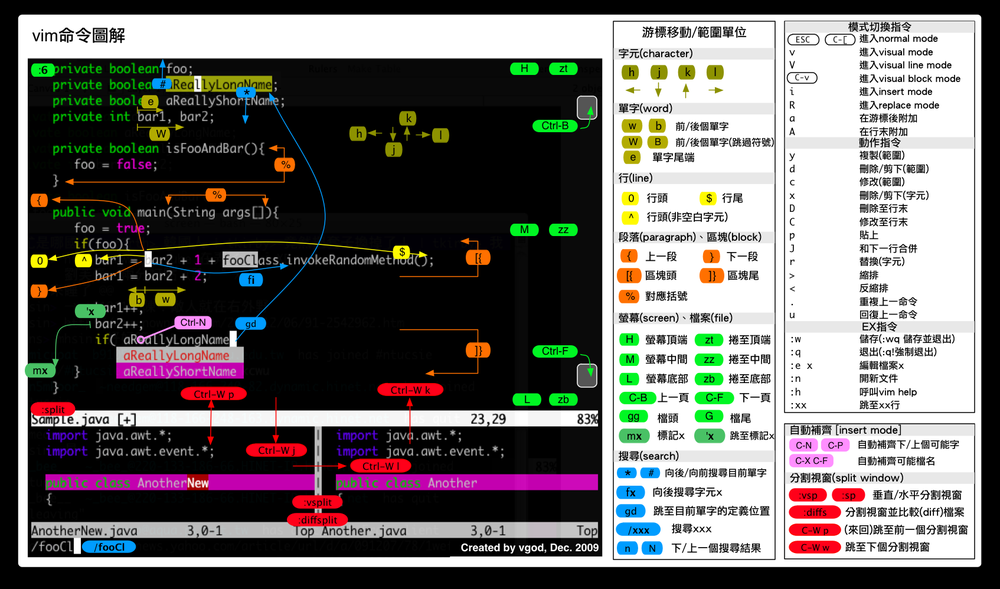
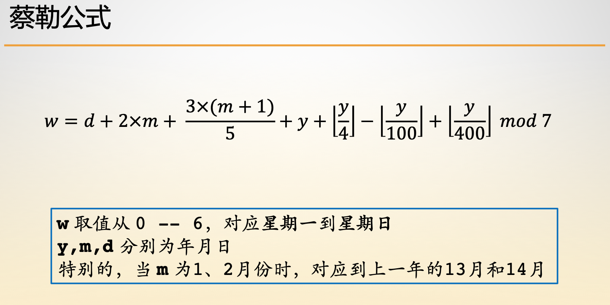
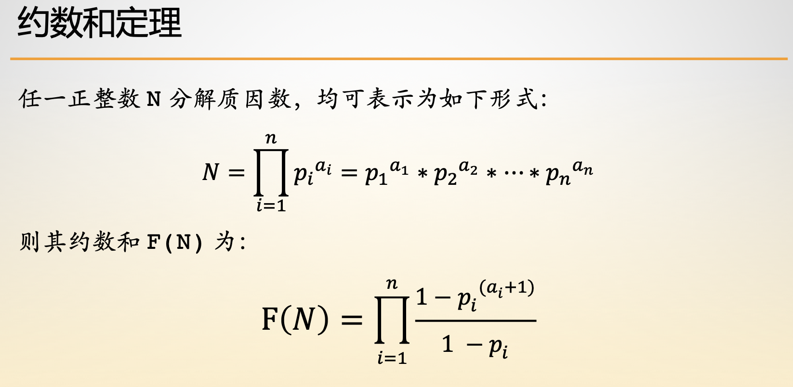
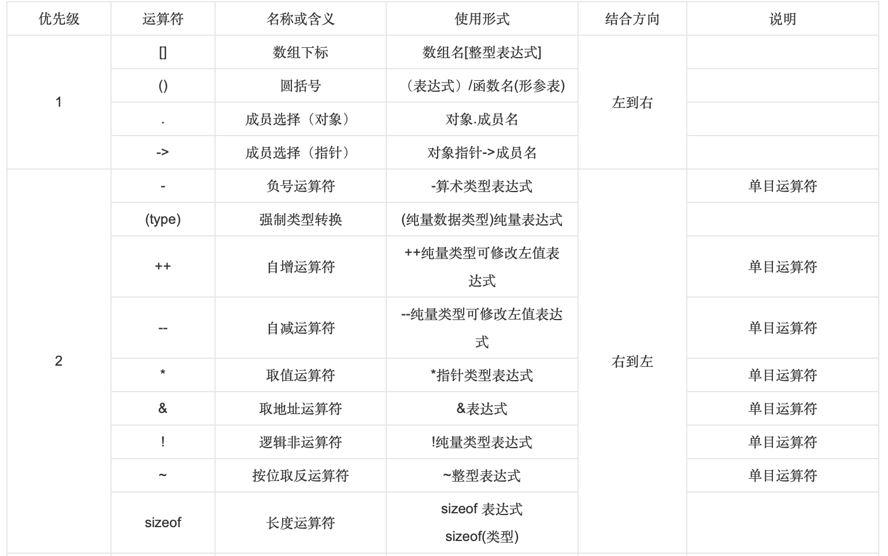
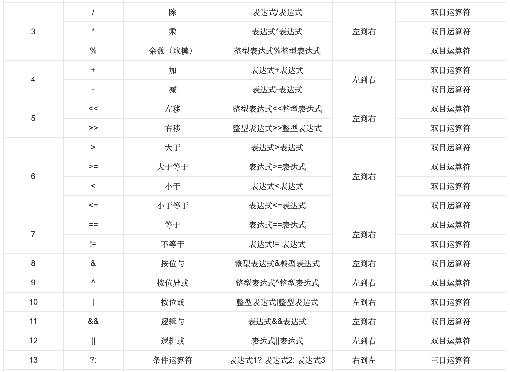
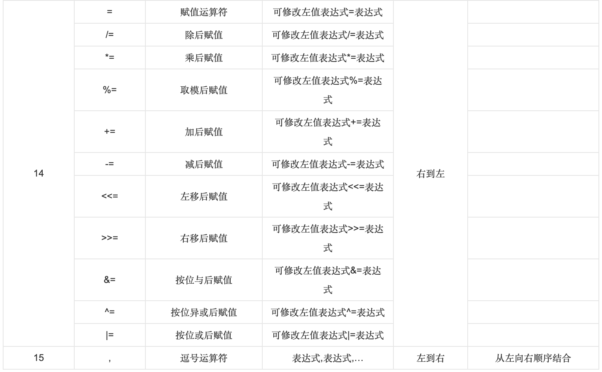
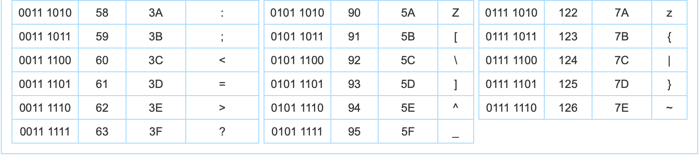

- [iterm2常用快捷键](#iterm2常用快捷键)

- [github](#github)

- [vim常用命令图解](#vim常用命令图解)

- [常用库](#常用库)

- [常用命令符](#常用命令符)

- [常用函数](#常用函数)

- [常用格式](#常用格式)

- [平方的和](#平方的和)

- [判断闰年](#判断闰年)

- [蔡勒公式](#蔡勒公式)

- [输出一定范围内的质数](#输出一定范围内的质数)

- [牛顿法求方程近似解](#牛顿法求方程近似解)

- [二分法求方程近似解](#二分法求方程近似解)

- [实现折半查找](#实现折半查找)

- [斐波那契数列](#斐波那契数列)

- [宏定义函数](#宏定义函数)

- [循环输入](#循环输入)

- [排序名单](#排序名单)

- [输出最长的名字](#输出最长的名字)

- [权限的修改](#权限的修改)

- [新哈希函数](#辛哈希函数)

- [约瑟夫环问题](#约瑟夫环问题)

- [素数筛](#素数筛)

- [线性筛](#线性筛)

- [异或交换](#异或交换)

- [求偶数](#求偶数)

- [求模公式](#求模公式)


# iterm2常用快捷键

> ```c
> 标签
> 
> 新建标签：command + t
> 关闭标签：command + w
> 切换标签：command + 数字 command + 左右方向键
> 切换全屏：command + enter
> 查找：command + f
> 
> 
> 分屏
> 
> 垂直分屏：command + d
> 水平分屏：command + shift + d
> 切换屏幕：command + option + 方向键 command + [ 或 command + ]
> 查看历史命令：command + ;
> 查看剪贴板历史：command + shift + h
> 
> 
> 其他
> 
> 清除当前行：ctrl + u
> 到行首：ctrl + a
> 到行尾：ctrl + e
> 前进后退：ctrl + f/b (相当于左右方向键)
> 上一条命令：ctrl + p
> 搜索命令历史：ctrl + r
> 删除当前光标的字符：ctrl + d
> 删除光标之前的字符：ctrl + h
> 删除光标之前的单词：ctrl + w
> 删除到文本末尾：ctrl + k
> 交换光标处文本：ctrl + t
> 清屏1：command + r
> 清屏2：ctrl + l
> 
> 
> 自带有哪些很实用的功能/快捷键
> 
> ⌘ + 数字在各 tab 标签直接来回切换
> 选择即复制 + 鼠标中键粘贴，这个很实用
> ⌘ + f 所查找的内容会被自动复制
> ⌘ + d 横着分屏 / ⌘ + shift + d 竖着分屏
> ⌘ + r = clear，而且只是换到新一屏，不会想 clear 一样创建一个空屏
> ctrl + u 清空当前行，无论光标在什么位置
> 输入开头命令后 按 ⌘ + ; 会自动列出输入过的命令
> ⌘ + shift + h 会列出剪切板历史
> 可以在 Preferences > keys 设置全局快捷键调出 iterm，这个也可以用过 Alfred 实现
> 
> 
> 我常用的一些快捷键
> 
> ⌘ + 1 / 2 左右 tab 之间来回切换，这个在 前面 已经介绍过了
> ⌘← / ⌘→ 到一行命令最左边/最右边 ，这个功能同 C+a / C+e
> ⌥← / ⌥→ 按单词前移/后移，相当与 C+f / C+b，其实这个功能在Iterm中已经预定义好了，⌥f / ⌥b，看个人习惯了
> 
> 
> 设置方法如下
> 当然除了这些可以自定义的也不能忘了 linux 下那些好用的组合
> 
> C+a / C+e 这个几乎在哪都可以使用
> C+p / !! 上一条命令
> C+k 从光标处删至命令行尾 (本来 C+u 是删至命令行首，但iterm中是删掉整行)
> C+w A+d 从光标处删至字首/尾
> C+h C+d 删掉光标前后的自负
> C+y 粘贴至光标后
> C+r 搜索命令历史，这个较常用
> 
> 
> 选择喜欢的配色方案。
> 
> 在Preferences->Profiles->Colors的load presets可以选择某个配色方案。也可以自己下载。在网站http://iterm2colorschemes.com/，几乎可以找到所有可用的配色方案。
> 
> 
> 选中即复制
> iterm2有2种好用的选中即复制模式。
> 
> 一种是用鼠标，在iterm2中，选中某个路径或者某个词汇，那么，iterm2就自动复制了。
> 另一种是无鼠标模式，command+f,弹出iterm2的查找模式，输入要查找并复制的内容的前几个字母，确认找到的是自己的内容之后，输入tab，查找窗口将自动变化内容，并将其复制。如果输入的是shift+tab，则自动将查找内容的左边选中并复制。
> 
> 
> 屏幕切割
> command+d：垂直分割；
> command+shift+d：水平分割
> 
> 自动完成
> 输入打头几个字母，然后输入command+; iterm2将自动列出之前输入过的类似命令。
> 
> 剪切历史
> 输入command+shift+h，iterm2将自动列出剪切板的历史记录。如果需要将剪切板的历史记录保存到磁盘，在Preferences > General > Save copy/paste history to disk.中设置。
> 
> 全屏切换
> 
> command+enter进入与返回全屏模式
> 
> 
> Exposé所有Tab
> 
> command+option+e,并且可以搜索
> 
> 
> 
> ```
>

# github

> ```c
> git init   		// 初始化本地git仓库
> git add<file>  	// 添加文件
> git rm --cached<file> // 删除文件
> git commit -a "del file" 
> git add *.<后缀> // 添加某一类文件
> git add .		// 添加全部文件
> git status		// 查看状态
> git commit 		// 提交
> git commit -m '备注' // 提交并备注
> git push		// 推送到仓库
> git pull 		// 从远程仓库拉取数据
> git clone		// 从远程仓库拷贝数据
> .gitignore		// 忽略文件  忽略文件夹 /<file>
> git branch <file> // 创建分支
> git checkout <file> // 切换分支
> git merge <file> 	// 合并文件
> rm -rf .git 		// 删除本地仓库
> git remote add origin git@github.com:zdq-zdq/Euler.git
> git push -u origin master
> ```
>


# vim常用命令图解

> 
>

# 常用库

> ```c
> #include <stdio.h>
> #include <string.h>  // 定义了相应字符串功能的函数
> #incldue <malloc.h>  // 定义了申请管理堆区上内存的函数
> #include <stdlib.h>  // 定义了申请管理堆区上内存的函数
> #include <math.h>  // 数学函数库
> #include <stdlib.h> // 链表库
> #include <stdarg.h> // 函数va 一族
> ```
>

# 常用命令符

> ```c
> root // 根目录
> pwd // 看系统的当前位置
> ls // 查看特定位置的文件和目录
> ls -l // 查看当前位置有哪些目录
> man 命令名 // 进一步查询
> cd // 在cd 之后加上空格，在之后输入路径，进入路径
> touch // 新建文件夹
> mv a b // 将 b 移动到 a
> rm // 删除文件
> rm -d // 直接把欲删除的目录的硬连接数据删成0，删除该目录。 
> rm -f // 强制删除文件或目录。 
> rm -i // 删除既有文件或目录之前先询问用户。 
> rm -r // 递归处理，将指定目录下的所有文件及子目录一并处理。 
> rm -v // 显示指令执行过程。 
> q // 退出
> gcc -c // 生成对象文件
> cp a b // 把a复制到b
> -f // 表示强制
> -g // 增加调试信息
> -wall // 打开大部分警告信息
> .PHONY // 用于生成一些伪目标
> ```
>


# 常用函数

> ```c
> pow(a,2)； // a的2次方
> swap(a[i], a[i + 1]);  // 交换函数
> abs()  // 取绝对值 在<stdlib.h>中
> acos(-1) = 3.1415926 // pi
> log(a) / log(b) // 换底公式  以b为底啊的对数
> sprintf(information, "%s is a %s.", name, gender);  // 将格式化的数据写入到一个字符串
> strlen(表示string length)  // 用于获取字符串的长度
> strcpy(表示 string copy)  // 用于复制字符串
> strcmp(表示 string compare)  // 用于比较字符串
> strcat(表示 string concatenation)  // 用于连接字符串
> sizeof(表示一个整型变量所需的内存空间的大小)  // 表明大小
> malloc(n个内存空间)  // 向堆区申请长度空间
> calloc(个数， 单个内存空间) // 与malloc不同 他接受两个函数， 分别是申请的空间单位的总数呢和每一个空间单位要占堆区空间的大小
> free(释放内存空间) // 释放申请的堆区空间
> ```
> 

# 常用格式

> ```c
> %d // 以带符号的十进制形式输出整数
> %o // 以无符号的八进制形式输出整数
> %x // 以无符号的十六进制形式输出整数
> %u // 以无符号的十进制形式输出整数
> %b // 以无符号的二进制形式输出整数
> %c // 以字符形式输出单个字符
> %s // 输出字符串
> %f // 以小数点形式输出单、双精度实数
> %e // 以标准指数形式输出单、双精度实数
> %g // 选用输出宽度较小的格式输出实数
> \t // 制表符
> \n // 换行
> \0 // 空格
> \r // 回车
> #a // 将#后面的按字符串输出
> ## // 链接符
> ans // 表示累乘
> NULL // 表示空
> !!(表示值 或者逻辑) // 归一化，即 ‘0’变‘1’、‘1’变‘0’
> int **q; // 取指针变量的地址
> (int *) // 强制类型转换 ()类型转换运算符
> ～ // 按位取反运算
> &  // 按位与运算
> |  // 按位或运算
> <<,>> // 移位运算  左移补0 X2 ，右移补符号位 /2
> ^  // 异或运算  自反性  相同为0 不同为1
> EOF // 空行
> struct point {
>         
> };  //定义结构体格式 给结构体赋值时需要用到 &
> typedef struct point {
>     	float x;
>     	float y;
> } Point; // 重定义
> union {
>     	struct {
>         
>     	}
> } _xx // 共用体
> enum week {
>     
> }; //枚举
> ```
> 

# 平方的和

> ```c
> int calc(int n) {
>     	return (2 * n * n * n + 3 * (n + 1) * n - 2 * n) / 6;
> }
> ```
>

# 判断闰年

> ```c
> #include <stdio.h>
>    int main() {
> 	int year;
> 	// 从用户处获得一个不大于 3000 的年份
> 	scanf("%d", &year);
>  
>  	// 在下面完成你的逻辑
>  	if ((year  % 100 != 0 && year % 4 == 0) || year % 400 == 0) {
>    		printf("YES");
> 	} else {
>       	printf("NO");
>     	}
>  	return 0;
>    }
>    ```
>  

#  蔡勒公式

> 
>

# 输出一定范围内的质数

> ```c
> #include <stdio.h>
> int main() {
>     	int N;
>     	scanf("%d", &N);
>     	if (N >= 2) {
>         	printf("%d\n", 2);
>     	}
>     	int digit;
>     	int divisor;
>     	for (digit = 3; digit <= N; digit += 2) {
>         	for (divisor = 3; divisor < digit; divisor += 2) {
>             	if (digit % divisor == 0) {
>                	break; 
>             	}   
>         	}
>         	if (divisor == digit) {
>                 printf ("%d\n", digit);
>            }
>     	}
>     	return 0;
> }
> ```
>

# 牛顿法求方程近似解

> ```c
> #include <stdio.h>
> #include <math.h>
> #define EPSILON 1e-6
> 
> double f(double x) {
>     	return 2 * pow(x, 3) - 4 * pow(x, 2) + 3 * x - 6;
> }
> 
> double f_prime(double x) {
>     	return 6 * pow(x, 2) - 8 * x + 3;
> }
> 
> double h(double x) {
>     	return pow(x, 3) - 4 * pow(x, 2) + 3 * x - 6;
> }
> 
> double h_prime(double x) {
>     	return 3 * pow(x, 2) - 8 * x + 3;
> }
> 
> double newton(double (*fp)(double), double (*fp_prime)(double)) {
>     	double x = 1.5;
>     	while (fabs(fp(x)) > EPSILON) {
>         	x = x - fp(x) / fp_prime(x);
>     	}
>     	return x;
> }
> 
> int main() {
>     	printf("%g\n", newton(f, f_prime));
>     	printf("%g\n", newton(h, h_prime));
>     	return 0;
> }
> ```
>

# 二分法求方程近似解

> ```c
> #include <stdio.h>
> #include <math.h>
> #define EPSILON 1e-7
> 
> double bisection(int p, int q, double (*func)(int, int, double));
> double f(int p, int q, double x);
> int main() {
>     	int p;
>     	int q;
>     	scanf("%d%d", &p, &q);
>     	printf("%.4f\n", bisection(p, q, f));
>     	return 0;
> }
> 
> double bisection(int p, int q, double (*func)(int, int, double)) {
> 	double head = -20.00, tail = 20.00, mid;
>     	while (head < tail) {
>        	mid = (head + tail) / 2;
>         	if (fabs(func(p, q, mid)) < EPSILON) return mid;
>         	if ((func(p, q, head) * func(p, q, mid)) < 0) {
>            	tail = mid;
>         	} else if ((func(p, q, tail) * func(p, q, mid)) < 0) {
>             	head = mid;
>         	}
>     	}
>     	return 0;
> }
> 
> double f(int p, int q, double x) {
>     	return p * x + q;
> }
> ```
>

# 实现折半查找

> ```c
> #include <stdio.h>
> 
> int main() {
>     	int n;
>     	int k;
>     	int numbers[1000001];
>     	int m;
>     	int i;
> 	
>     	// 反复读入数字和查找数字的数量
>     	while (scanf("%d %d", &n, &k) != EOF) { 
>            // 读入给定的数字
>            for (i = 1; i <= n; i++) {
>                scanf("%d", &numbers[i]);
>            }
>            for (int j = 1; j <= k; j++) {
>                // 读入待查找的数字，
>                scanf("%d", &m);
>                // 请在下面完成查找读入数字的功能
>                int left = 1, right = n, mid;
>                while (left <= right) {
>                    mid = (left + right) / 2;
>                    // printf("j =%d, mid = %d right =%d\n", m, mid, right);
>                    if (numbers[mid] == m) {
>                        if (j < k ) {
>                            printf("%d ", mid);
>                     		break; 
>                        } else {
>                            printf("%d", mid);
>                     	 	break; 
>                        }
>                    } else if (numbers[mid] > m) {
>                 		right = mid - 1;
>                        // printf("right = %d\n", right);
>             		} else if (numbers[mid] < m) {
>                 		left = mid + 1;
>                        // printf("left = %d\n", left);
>             		} 
>                }
>                if (left > right) {
>                    if (j < k) {
>                        printf("0 ");
>                    } else {
>                        printf("0");
>                    }
>                }
>            }
>        }
>        return 0;
>    }
> 
> ```
>

# 斐波那契数列

> ```c
> #include <stdio.h>
> 
> int main() {
>  	int N;
>     	int step[55] = {0, 0};
>     	scanf("%d", &N);
>     	step[2] = 1;
>     	step[3] = 1;
>     	for (int i = 4; i <= N; i++) {
>      	   	step[i] = step[i - 2] + step[i - 3]; 
>     	}
>     	if (N == 2 || N == 3) {
>         	printf("%d", step[N]);
>     	} else {
>         	printf("%d", step[N]);
>     	}
>     	return 0;
> }
> ```
>

外部定义函数 需定义变量地址

# 宏定义函数

> ```c
> // 宏交换
> #define swap(a, b) ({ \
> 	__typeof(a) __temp = (a);\
> 	(a) = (b);\
> 	(b) = __temp;\
> })
> #define swap(a, b) { \
>    	a ^= b; b ^= a; a ^= b; \
> }
> // 宏交换字符串
> #define swap(a, b) ({
> 	char tempBuf[10];\
> 	memcpy(tempBuf, &a, sizeof(a));\
> 	memcpy(&a, &b, sizeof(b));\
> 	memcpy(&b, tempBuf, sizeof(b));\
> })
> // 宏最大值
> #define MAX(A, B) ({ \
> 	__typeof__(A) __a = (A);\
> 	__typeof__(B) __b = (B);\
> 	__a > __b ? __a : __b;\
> }) 
> //
> #define Plog(frm, arg...) ({ \
> 	printf("[ %s : %d ] " frm "\n", __func__, __LINE__, ##arg);\
> 	fflush(stdout); \
> }) 
> ```
>

# 循环输入

> ```c
> while (scanf(/* 这部分省略 */) ！= EOF) {
>         
>    } // 循环输入
> ```
>


# 排序名单

> ```c
> #include <stdio.h>
> #include <string.h>
> 
> int main() {
>    char name[10][20],temp[20];
>       int i, j, k;
>       for (i = 0; i < 10; i++)
>       	  scanf("%s", &name[i]);
>       for (i = 1; i <= 9; i++) {
>          for (j = 0; j <= 9 - i; j++) {
>              k = 0;
>              while (name[j][k] != '\0')
>              if (name[j][k] > name[j+1][k]) {
>                  strcpy(temp, name[j]);
>                  strcpy(name[j], name[j+1]);
>                  strcpy(name[j+1], temp);
>                  break;
>              } else if (name[j][k] == name[j+1][k]) 
>                  k++;
>                else if(name[j][k] < name[j+1][k])
>                  break;
>          }
>      }
>      for (i = 0; i< 10; i++) {
>          printf("%s\n",name[i]);
>      }
>      return 0;
>  }
> ```
>

# 输出最长的名字

> ```c
> #include <stdio.h>
> #include <string.h>
>  
> int main() {
>    	int i, n, len, j;
>    	scanf("%d\n", &n);
>     	char str[101], longest_name[101];
>     	len = 0;
>     	for (i = 0; i < n; ++i) {
>        	j = 0;
>         	while (scanf("%c", &str[j])) {
>            	if (str[j++] == '\n') {
>                	str[j] = '\0';
>                 	break;
>             	}
>         	}
>         	if (strlen(str) > len) {
>            	strcpy(longest_name, str);
>            	len = strlen(str);
>         	}
>     	}
>     	printf("%s\n", longest_name);
>     	return 0;
> }
> ```
>

# 权限的修改

> ```c
> #include <stdio.h>
>  
> int get_value(char c) {
>     	switch (c) {
>        	case 'r':
>            	return 4;
>         	case 'w':
>             	return 2;
>         	case 'x':
>             	return 1;
>         	default:
>             	printf("ERROR\n");
>     	}
>     	return 0;
> }
>  
> int main() {
>     	int i, len, value;
>     	char str[10];
>     	scanf("%s", str);
>     	value = 0;
>     	len = strlen(str);
>     	for (i = 0; i < len; ++i) {
>         	value |= get_value(str[i]);
>     	}
>     	while (scanf("%s", str) != EOF) {
>         	switch (str[0]) {
>             	case '+':
>                	value |= get_value(str[1]);
>                 	break;
>             	case '-':
>                	value &= ~get_value(str[1]);
>                 	break;
>             	default:
>                	printf("ERROR\n");
>         	}
>     	}
>     	printf("%d\n", value);
>     	return 0;
> }
> ```
>

# 新哈希函数

> ```c
> void f(char str[]) {
>  	int len, i;
>  	int arr[32] = {0}, bits[32] = {0};
>  	len = strlen(str);
>  	for (i = 1; i <= len; ++i) {
>      	arr[i % 32] += str[i - 1];
>  	}
>  	for (i = 0; i < 32; ++i) {
>      	bits[i] = arr[31 - i] ^ (arr[i] << 1);
>      	printf("%c", bits[i] % 85 + 34);
>  	}
>  	printf("\n");
> }
> 
> int main() {
>  	char str[501];
>  	scanf("%s", str);
>  	f(str);
>  	return 0;
> }
> ```
>

# 约瑟夫环问题

> ```c
> #include <stdio.h>
> #include <stdlib.h>
> typedef struct node {
>     	int data;
>     	struct node *next;
> } Node;
>  
> Node *circle_create(int n);
> void count_off(Node *head, int n, int k, int m);
>  
> int main() {
>     	int n, k, m;
>     	scanf("%d%d%d", &n, &k, &m);
>     	Node *head = circle_create(n);
>     	count_off(head, n, k, m);
>     	return 0;
> }
>  
> Node *circle_create(int n) {
>     	Node *temp, *new_node, *head;
>     	int i;
>     
>     	// 创建第一个链表节点并加数据
>     	temp = (Node *) malloc(sizeof(Node));
>     	head = temp;
>     	head->data = 1;
>     
>     	// 创建第 2 到第 n 个链表节点并加数据
>     	for (i = 2; i <= n; i++) {
>        	new_node = (Node *) malloc(sizeof(Node));
>        	new_node->data = i;
>        	temp->next = new_node;
>        	temp = new_node;
>     	}
>     
>     	// 最后一个节点指向头部构成循环链表
>     	temp->next = head;
>     	return head;
>    }
> 
>  void count_off(Node *head, int n, int k, int m) {
>  	Node *p1;
>     	Node *p2;
>     	p2 = head;
>     	p1 = p2->next;
>     	while (p1->next != p2) p1 = p1->next;
>     	while (p2->data != k) {
>         	p1 = p1->next;
>         	p2 = p2->next;
>     	}
>     	while (p1 != p2) {
>         	int i;
>         	for (i = 1; i < m; ++i) {
>            	p1 = p1->next;
>            	p2 = p2->next;
>         	}
>         	printf("%d ", p2->data);
>         	p1->next = p2->next;
>         	free(p2);
>         	p2 = p1->next;
>     	}
>     	printf("%d\n", p2->data);
>     	return;
>    }
> ```
> 

#  素数筛

> ```c
> int prime(int x) {
>    	if (x <= 1) return 1;
>    	for (int i = 2; i * i <= x; i++) {
>        	if (x % i) continue;
>        	return 1;
>    	}
>     	return 0;
> }
> ```

# 线性筛

> ```c
> #include <stdio.h>
> #define MAX_N 10000
> 
> int prime[MAX_N + 5] = {0};
> 
> int main() {
>     	for (int i = 2; i <= MAX_N; i++) {
>        	if (!prime[i]) {
>            	prime[++prime[0]] = i;
>        	}
>        	for (int j = 1; j <= prime[0] && prime[j] * i <= MAX_N; j++) {
>            	prime[i * prime[j]] = 1;
>            	if (i % prime[j] == 0) break;
>        	}
>    	}
>     	for (int i = 1; i <= prime[0]; i++) {
>        	printf("%d ", prime[i]);
>     	}
>     	printf("\n");
>     	return 0;
> }
>  ```
> 

# 异或交换

> ```c
> a ^= b;
> b ^= a;
> a ^= b;
> //交换位置
> ```
>

# 求偶数

> ```c
> if ((b & 1) == 0) //判断是否时偶数
> ```
>

# 求模公式

> ```
> c = a / b;
> r = a - c * b;
> ```
>

# 循环上界

> ```c
> 平方上界 = 9 ^ 5 * 6
> ```
>

# 按位取出

> ```c
> while (n) {
>        sum += a[n % 10];
>        n /= 10;
>    }
> ```
> 

# 翻转过程

> ```c
> while (num != 0) {
> 	rnum = rnum * 10 + num % 10; // 位置前移
> 	num /= 10;
> }
> while (rnum != 0) {
> 	putchar(48 + rnum % 10);
> 	num /= 10;
> }
> ```
>

# 阶乘公式

> ```c
> void rec_func(int *num) {
>     	num[0] = 1;
>     	for (int i = 1; i < 10; i++) {
>        	num[i] = num[i - 1] * i;
>    	}
>     	return ;
> }
> 
> // 优化版-->递归调用
> int rec_func(int x) {
>     	if (x == 1) return 1;
>     	return x * rec_func(x - 1);
> }
> ```
> 

# 最小公倍数

> ```c
> int gcd(int n, int m) { // 最大公约数
>     	if (m <= n) {
>        	int r;
>        	while (n % m != 0) {
>             	r = n % m;
>             	n = m;
>             	m = r;
>         	}  
>         	return m;
>     	} else {
>         	return gcd(m, n);
>     	}
> }
> int gcd(int a, int b) { // 最大公约数，优化版
>     	if (!b) return a;
>     	return gcd(b, a % b);
> }
>  
> int lcm(int n, int m) { // 最小公倍数
>  	return n * m / gcd(n, m);
> }
> ```
>

# 约合数定理

> 
>

# 运算符优先级

> 
>

> 
>

> 
>

# ASCII对照表

> 
>

> 
>

# 简单递归调用

> ```c
> #include <stdio.h>
> 
> int rec_func(int x) {
>     	if (x == 1) return 1;
>     	return x * rec_func(x - 1);
> }
> 
> int main() {
>    	int n;
>    	while (~scanf("%d", &n)) {
>        	printf("%d != %d\n", n, rec_func(n));
>    	}
>    	return 0;
> }
> ```
>

# 头文件编写规范

> ```c
> #ifndef xxx
> #define xxx
> typedef enum Status { Success, Fail };
> typedef struct {
>     	char *name;
>     	int age;
> } People;
> Status go_to_Jisuanke(People);
> #endif
> ```
>

# 输入输出一族

> ```c
> scanf( const char *restrict format, ...);
> // 从标准输入流stdin中读取数据
> fscanf( FILE *restrict fp, const char *restrict format, ...);
> // 从fp所引用的输入流中引入数据
> sscanf( const char *restrict src, const char *restrict format, ...);
> // 从SIC指向的char数组中读取数据
> printf(const char *restrict format, ...);
> // 写入标准输出流，stdout
> fprintf( FILE *restrict fp, connst char *restrict format, ...);
> // 写入fp指定的输出流，printf()函数可以视为fprintf()的特殊版本
> sprintf( char *restrict buf, const char *restrict format, ...);
> // 将格式化数据写入buf所指向的char数组，并在后面加上一个标志结尾的空字符
> snprintf( char *restrict buf, sixe_t n, const char *restrict format, ...);
> // 与sprintf()一样，但是不会写入超过n个字节到输出流中
> ```
>

# 快速幂算法

> ```c
> int32_t quickPow(int32_t a , int32_t b) {
>     	int32_t ans = 1 , temp = a;
>     	while (b) {
>        	if (b & 1) ans = ans * temp;
>         	temp = temp * temp;
>         	b >>= 1;
>     	}
>     	return ans;
> }
> ```
>

# 大小写转换

> ```c
> int res(char *arr) {
>     	int len = strlen(arr);
>     	for (int i = 0; i < len; i++) {
>        	if (arr[i] >= 'A' && arr[i] <= 'Z') {
>            	arr[i] += 32;
>         	}
>     	}
>     	return 0;
> }
> ```

# 字符分割

> ```c
> int strtok_func(char *buff, char *option, char *flag) {
>     	char *p = strtok(buff, flag);
>     	p = strtok(NULL, flag);
>     	while (p) {
>        	if (strcmp(p, option) == 0) {
>            	return 1;
>        	}
>        	p = strtok(NULL, flag);
>     	}
>     	return 0;
> }
> ```

# 动态分配二维数组

> ```c
> arr = (int **)malloc(sizeof(int *) * n); // 先分配n行
> for (int i = 0; i < n; i++) {
>     	arr[i] = (int *)malloc(sizeof(int) * m); // 再分配m列
> }
> ```

# 泽勒一致性

泽勒一致性是由克里斯汀·泽勒开发的用于计算某天是星期几的算法。这个公式是：

  h=(q+26(m+1)/10+k+k/4+j/4+5j) mod 7

 其中：

 一、h 是一个星期中的某一天（0 为星期六，1 为星期天，2 为星期一……6 为星期五)

 二、q 是某月的第几天

 三、m 是月份（3 为三月，4 为 四月……）。一月和二月分别记为上一年的 13 和 14 月

 四、j 是世纪数

 五、k 是该世纪的第几年（即 year%100）

 注意，公式中的除法是整除。编写程序，输入年月日，输出它是一周中的星期几。

 一月和二月在公式里是用 13 和 14 表示的，所以需要将用户输入的月份 1 转换为 13，2 转换为 14，同时将年份改为前一年。

```c
int WhichDay(int y, int m, int q) {
    if (m == 1 || m == 2) {
        --y; m+= 12;
    }
    int h, k, j;
    k = y % 100;
    j = y / 100;
    h = (q + 26 * ( m + 1 ) / 10 + k + k / 4 + j / 4 + 5 * j) % 7;
    return h;
}
```

# 用位运算进行加法运算

```c
int Add(int a, int b) {
  	if (b == 0) return a;
  	int sum, carry;
  	sum = a ^ b;
  	carry = (a & b) << 1;
  	return Add(sum, carry);
}

int add(int a, int b) {
  	while (b) {
    	int x = a;
      	int y = b;
      	a = x & y;
      	b = (x ^ y) << 1;
  	}
  	return a;
}
```

# 大小端测试

> 大端：大对大，小对小
>
> 小端：大对小， 小对大

```c
int judge() {
  	int32_t a = 1;
  	char c = (*(char*)&a);
  	if (c) printf("xiao\n");
  	else printf("da\n");
}

int main() {
  	judge();
  	return 0; 
}
```

# 判断最大值

```c
int max(a, b) {
	int l1 = (a > b);
  	int l2 = (a < b);
  	return l1 * a + l2 * b;
}
```

```c
int cal_score(int *score, int *judge_type, int n) {
    int ret = 0, M = 0, N = 0; // M专家， 大众
    double sumM = 0, sumN = 0;
    if (n && score && judge_type) {
        for (int i = 0; i < n; ++i) {
            switch(judge_type[i]) {
                case 1: sumM += score[i]; ++M; break;
                case 2: sumN += score[i]; ++N; break;
                default:;
            }
        }
        if (M) sumM = (int) (sumM / M);
        if (N) sumN = (int) (sumN / N);
        ret = sumN * 0.6 + sumN * 0.4;
    }
    return ret;
}
```

# C语言取整方法

```c
int x //默认舍去小数部分
floor(x) //默认返回整数部分
ceil(x)  //返回的是不大于x的最小整数
round(x) //返回x的四舍五入整数值
```

