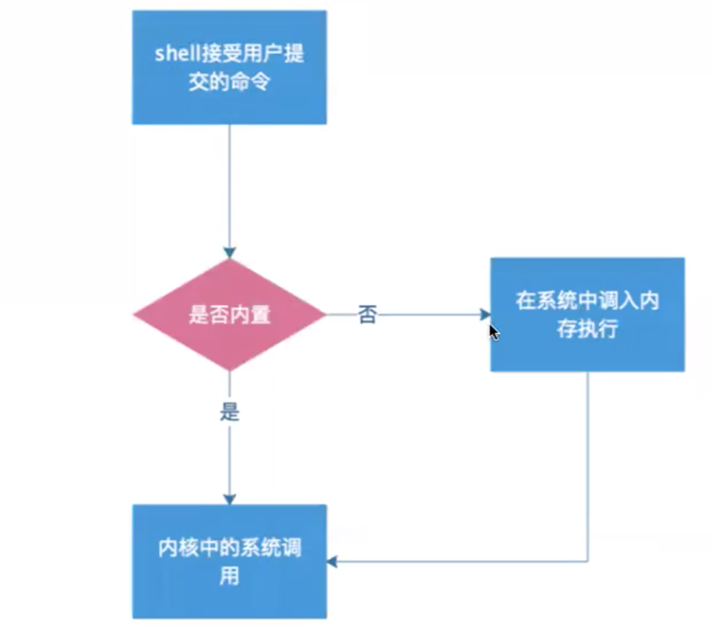
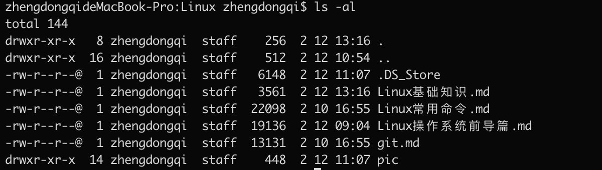

- [1.基础知识](#1.基础知识)
  - [shell](#shell)
  - [命令](#命令)
  - [程序与进程](#程序与进程)
  - [路径](#路径)
  - [软件](#软件)
  - [配置方式](#配置方式)
  - [隐藏文件](#隐藏文件)
  - [文件类型](#文件类型)
  - [文件权限](#文件权限)
  - [用户](#用户)
- [2.命令系统](#2.命令系统)
  - [shell,terminal和console](#shell,terminal和console)
  - [Linux帮助系统](#Linux帮助系统)
  - [bash](#bash)
  - [任务管理](#任务管理)
  - [管道、重定向](#管道、重定向)
  - [转义符](#转义符)
  - [shell元字符](#shell元字符)

# 1.基础知识

## shell

> shell是一种人机交互的接口，shell有壳的意思，是指“提供使用者使用界面”的软件，是一种命令编辑器。
>
> windows的cmd就是一种shell，所以shell并不只是指命令语言，其本身也是一种shell。
>
> Linux最常见的有bash，zsh

下图为一条命令执行的简单流程，用户在bash中国呢提交命令，shell负责接收用户的命令，并扮演命令解析器的角色。

> 
>

## 命令

> 命令是人和计算机交互的基本单位，人使用命令将要做什么事传达给计算机，计算机作出解析，并作出响应。

**命令也有自己的语法结构：**

和别人说话一样，命令的主要结构也可以看出作为主谓宾的简单句和复杂句，在命令中，省略主语

> 举个例子
>
> ```bash
> cp(谓语动词) fileA(宾语) flieB(宾语)
> //拷贝 fileA -> fileB
> ```
>
> ```bash
> cp(谓语动词) -ar(方式状语) fileA(宾语) fileB(宾语)
> ```
>
> 一般情况下 - 后面加选项的撰写， —后面加选项的全称

## 程序与进程

>  我们执行命令的时候，每一个命令，其实对应的就是系统中的一个程序。

> 那么什么是程序呢？
>
> 计算机程序是指一组只是计算机执动作作出判断的指令，通常用某种程序设计语言编写，运行与某种目标体系结构上。

> 什么又是进程呢？
>
> 进程是程序在内存中的镜像。

## 路径

### 绝对路径

绝对路径的起始点为根目录/， 例如/usr/bin/cp就是一个绝对路径。

### 相对路径

相对路径的起始点为当前路径..  假如用户当前目录为/home/zhengdongqi/，那么同样的文件cp，其实对路径为 ../../usr/bin/cp。

> 相对路径和绝对路径在使用上各有差异，在使用时需要考虑实际的情况选择。

### 远程路径

> 在很多时候，我们会需要访问本机之外的资源，这个时候远程路径就有了用武之地了。

远程路径的一般表示方法为：协议://用户名:密码@位置/路径:端口

比如：

http://haizei.com

远程路径根据应用的不同，具体表示方法和所需要的参数都不太一致，从以上两个远程就可以看出。

### 路径相关的命令

> cd #change directory
>
> ls #list
>
> pwd #print working  directory

## 软件

在Linux中， 软件并没有像注册表这样的概念

> 注册表：是window中的一个重要的数据库，用于存储系统应用程序的设置信息。
>
> 安装软件，理论上只需要拷贝相关文件，并执行其主程序就可以

通常，一个软件包含的内容会分别被拷贝到同级别的bin  lib  share 和/etc目录下

> bin 存放程序的可执行文件，在系统环境变量中将改路径添加进去，就可以直接执行程序
>
> lib 库文件集中存放，方便共享
>
> share 存放程序需要的其它资源
>
> /etc 配置文件存放路径，大部分的程序配置文件都可以在这个路径下找到。

## 配置方式

> - 在Linux中，所有的配置操作都可以使用纯文本的配置文件来配置，为了方便使用，有很多程序都会提供命令接口供用户更加便捷来个性化的配置自己的系统。
>

> ```
> /etc 基本上都是配置文件 
> ```
>

> - 当然也可以直接用ifconfig命令来直接修改网络配置
>

> ```bash
> ifconfig etch 172.17.211.123
> ```
>

> - 这条命令把设备eth0 的地址更新
>

## 隐藏文件

> ```bash
> ..  表示家目录
> .   表示此目录
> ```
>

## 文件类型

> - 使用ll命令可以查看当前路径下所有文件的详细信息
>

> 
>

> 该命令主要输出了七列内容，分别为：权限，文件数，所属用户，所属群组，文件大小，常见日期，文件名。
>

> 第一列权限，主要可以分为以下四个部分：文件类型，所属用户权限，所属组权限，其它用户权限。
>

> 以刚才执行的结果为例
>
> | 文件类型 | 所属用户权限 | 所属群组权限 | 其它用户权限 |
> | -------- | ------------ | ------------ | ------------ |
> | d        | rwx          | r-x          | r-x          |
>
> - 第一部分文件类型 d，代表这个文件是一个目录（directory），目录是一种特殊文件；
> - 第二部分所属用户权限为 rwx, 代表该文件拥有者拥有可读（read), 可写(write)，可执行(execute)的权限；
> - 第三部分所属组权限为r-x,代表该文件拥有者在一个群组的用户具有可读，可执行的权限，在这里-顶替了w的位置，代表没有写权限；
> - 第四部分其它用户权限同样为可读，可执行。

>  Linux中的文件类型出来目录d之外，总共有7种文件类型，在这里我们做一个简要的了解；
>

> - regular file 普通文件
> - d directory 目录
> - l link 链接
> - b block 块设备 存储数据以供系统存取的接口设备，也就是硬盘
> - c character 字符设备 串口设备， 键盘， 鼠标等
> - s socket 套接字
> - p pipe  管道

对于普通文件又可以分为以下三种：

- 纯文本文件

> 纯文本文件使用ASCII编码，这是Linux系统中最常见的一种文件类型，之所以成为纯文本文件，是因为这种类型的文件是我们可以直接读取的的内容，在Linux，几乎所有的配置文件都属于这种类型的。

- 二进制文件

> 二进制文件是系统中的可执行文件(不包括脚本)，计算机只能认识并执行二进制文件，二进制文件不能使用 cat 等命令直接读出。

- 数据格式的文件

> 在一些程序运行过程中，需要读取待定格式的文件，这种文件被称为数据文件(data.file)，这种文件通常也不能使用cat命令读出。
>
> 但是可以使用last读取其中命令。

## 文件权限

> 在上节中我们已经提到了文件的权限包含3组(u 用户，g 群组， o 其它用户)，每一组又包含三组具体的权限(r 读，w 写， x执行)。

对于文件权限，我们也可以用以下的方式来表示：

|   r    |   w    |   x    |   r    |   w    |   x    |   r    |   w    |   x    |
| :----: | :----: | :----: | :----: | :----: | :----: | :----: | :----: | :----: |
| (2^2)4 | (2^1)2 | (2^0)1 | (2^2)4 | (2^1)2 | (2^0)1 | (2^2)4 | (2^1)2 | (2^0)1 |

 也就是权限的每一组都由3个十进制的数字表示，该组的权限就可以简单的用着3个十进制的数字相加得到。

> 一个权限为 rwxr-xr-x 的文件下，则它的权限可以使用755来表示。

### 与文件权限有关的命令

> ```bash
> chmod #更改文件权限
> chown #更改文件所属用户
> chgrp #更改文件所属组
> ```
>

- chmod 的用法

> ```bash
> chmod a+x file #给file文件都赋予执行的权限
> chmod o-x file #将file文件o减去执行权限
> chmod 755 file #设置file文件的权限为 rwxr-xr-x
> chmod u=rwx, go=rx file #设置file文件的权限为 rwxr-xr-x
> ```
>

- chown 的用法

> ```bash
> chown zhengdongqi:haizei file #修改file的所属用户是zhengdongqi，所属组为haizei
> chown -R zhengdongqi:haizei directory #修改目录directory及目录下的所有文件的所属用户是zhengdongqi，所属组为haizei
> chown zhengdongqi file #修改file的所属用户为zhengdongqi
> ```
>

- chgrp 的用法

> ```bash
> chgrp root file #修改file所属的组为root
> ```
>

## 用户

> Linux有两种用户，分别是 root 和普通用户

- 超级管理员：root

root 拥有系统的完全控制权，所以在使用Linux系统的时候，需要慎重使用root用户，更多的自由与权限同样也意味着更大的风险

> 实际上，有很多Linux系统在默认的情况下是不开放root用户的，这是出于安全方面的考虑。

- 普通用户

普通用户拥有的权限就没有 root 用户那么大了，他只能做系统允许做的事，普通用户可以执行大部分的命令，但是root专有的命令却执行不了。

# 2.命令系统

## shell， terminal 和 console

之前我们已经学习到了什么事shell， shell是一种命令解析器，它给用户提供了一个输入命令并接受及其返回结构的界面。

那么什么是terminal 和 console 呢？

> console 大型机控制台
>
> terminal 命令器

## Linux帮助系统

> 在学习使用Linux的时候， 我们会遇到很多以前没有用过的命令和功能，这个时候最好的解决办法就是求助于man。

man 的使用方法很简单，例如查看 ls 的帮助手册，可以直接使用命令 man ls 即可产看 ls 的命令帮助。

| 代号 | 代表的含义                                  | 举例             |
| :--: | :------------------------------------------ | :--------------- |
|  1   | 用户在shell环境下可以操作的命令或可执行文件 | man 1 ls         |
|  2   | 系统内核可调用的函数和工具                  | man 2 reboot     |
|  3   | 一些常用函数与函数库，大部分C的函数库       | man 3 readdir    |
|  4   | 设备文件的说明，通常是在 /dec 下的设备      | man 4 null       |
|  5   | 配置文件或者某些文件的格式                  | man 5 interfaces |
|  6   | 游戏                                        | man 6 lol        |
|  7   | 惯例与协议等，例如Linux文件系统，网络协议等 | man 7 tcp        |
|  8   | 系统管理员可用的命令                        | man 8 reboot     |
|  9   | 跟kernel有关的文件                          |                  |
|  o   | 旧文档                                      |                  |
|  n   | 新文档                                      |                  |
|  I   | 本地文档                                    |                  |

 在man手册中，我们可以用到的快捷键如下：

| 快捷键           | 功能       | 快捷键        | 功能       |
| ---------------- | ---------- | ------------- | ---------- |
| Ctrl+f (forward) | 向下翻一页 | Ctrl+d (down) | 向下翻半页 |
| Ctrl+b(backward) | 向上翻一页 | Ctrl+u (up)   | 向上翻半页 |
| /                | 查找       | q (quit)      | 退出       |

## bash

通配符

- ？

  代表单个任意字符

- *

  代表任意几个任意字符

除了*和？这两个通配符之外，Linux中还有下面几种通配符

| 通配符                | 含义                                   | 举例                                                         |
| --------------------- | -------------------------------------- | ------------------------------------------------------------ |
| [list]                | 匹配list中任意单一字符                 | a[xyz]b         a与b之间有且只有一个字符，且只能是x或y或z，如：axb，ayb，azb。 |
| [!list]               | 匹配除list中的任意单一字符             | a[!0-9]b a与b之间有且只有一个字符，但不能是数字，如axb，aab，a-b等 |
| [c1-c2]               | 匹配c1-c2中的任意单一字符              | a[0-9]b a与b之间有且只有一个字符，该字符是0-9之间的数字， 如a0b, a1b, ..., a9b。 |
| {string1,string2,...} | 匹配string1或string2(或更多)其一字符串 | a {abc,xyz,123}b a与b之间只能是abc或xyz或123这三个字符串之一。 |

##  任务管理

1. &

   在命令的后面加上 & 表示后台执行的意思

   ```bash
   command &
   ```

2. ;

   在命令之间以 ；连接，表示顺序执行的意思

   ```bash
   command1；command2
   ```

3. &&

   命令之间以 && 相连时，只有第一个命令成功执行，第二个命令才会执行。

   ```bash
   command1 && command2
   ```

4. ||

   命令之间以 || 相连时， 如果前一个命令执行失败，则执行第二个命令

   ```bash
   command1 || command2
   ```

5. ``

   命令中如果包含另一个命令，则用符号``将它包括起来，在执行的时候系统将优先执行``中的子命令，然后将其结果代入父命令继续执行。

   ```bash
   command1 `command2`
   ```

6. ctrl + z

   在shell中执行命令时，同时按下ctrl + z可以将其暂时挂起

7. bg

   执行bg命令，可以将挂起的命令后台运行

8. fg

   执行命令fg可以将后台执行的命令转为前台执行

9. jobs

   在Linux系统中，执行jobs命令可以查看所有在后台执行和挂起的任务以及任务编号

10. pkill +命令名字

    杀掉进程

## 管道、重定向

> 
>

## 转义符

- 在Linux中转义符''的应用十分广泛，除此之外，转义符还包括""和\

> | 字符 | 说明                                                         |
> | ---- | ------------------------------------------------------------ |
> | ''   | 硬转义，硬引用，其内部所有的shell元字符，通配符都会被关掉。注意，硬转义中不允许出现‘(单引号)。 |
> | ""   | 软转义，软引用，其内部只允许出现特定的shell元字符($,',\) $ 用与变量值替换，'用于命令替换，\用于转义单个字符 |
> | \    | 反斜杠，转义，去掉其后紧跟的元字符或通配符的特殊意义         |
>

- 下表时对应转义字符对应表


> | 转义字符 | 意义                                     | ASCII码值（十进制） |
> | -------- | ---------------------------------------- | ------------------- |
> | \a       | 响铃（BEL）                              | 007                 |
> | \b       | 退格（BS），将当前位置移到前一列         | 008                 |
> | \f       | 换页（FF），将当前位置移到下一行开头     | 012                 |
> | \n       | 换行（LF），将当前位置移到下一行开头     | 010                 |
> | \r       | 回车（CR），就爱过你当前位置移到本行开头 | 013                 |
> | \t       | 水平制表（HT），（跳到下一个TAB位置）    | 009                 |
> | \v       | 垂直制表（VT）                           | 011                 |
> | \\       | 代表一个反斜线字符                       | 092                 |
> | \'       | 代表一个单引号字符                       | 039                 |
> | \"       | 代表一个双引号字符                       | 034                 |
> | \?       | 代表一个问号                             | 063                 |
> | \0       | 空字符（NULL）                           | 000                 |
> | \nnn     | 1到3位八进制数多代表的任意字符           | 三位八进制          |
> | \xnnn    | 1到3位十六进制多代表的任意字符           | 三位十六进制        |
>

## shell元字符

> | 字符 | 说明                                                         |
> | ---- | ------------------------------------------------------------ |
> | =    | 变量名=值，为变量赋值。注意=左右紧跟变量名和值，中间不能有空格。 |
> | ''   | 取命令的执行结果，与下文的$有相似之处                        |
> | $    | 变量名替换，$变量名替换为shell变量的值；为避免在文本连接时混淆，请使用 $(变量名)；$0...$9代表shell文件的参数。$()同'';${}限定变量名的范围；$[]整数计算 |
> | >    | prog > file 将标准输出重定向到文件                           |
> | >>   | prog >> file 将标准输出追加到文件                            |
> | <    | prog < file 从文件file中获取标准输入                         |
> | <<   |                                                              |
> | \|   | 管道命令，例：p1 \| p2 将p1的标准输出作为p2的标准输入        |
> | &    | 后台运行命令，最大好处是无需等待命令执行结束，就可以在同一命令下继续输入命令 |
> | ()   | 在子shell中执行命令，在子进程中执行                          |
> | {}   | 在当前shell中执行命令，活用在变量替换的界定范围（例如上面的$(变量名)用法）。 |
> | []   | 字符通配，匹配括号内之一                                     |
> | ；   | 命令结束符，例如p1;p2表示先执行p1,再执行p2                   |
> | &&   | 前一个命令执行完之后，才继续执行下一个命令。例：p1&&p2;若p1执行成功后，才执行p2反之，不执行p2; |
> | \|\| | 前一个命令执行失败后，才继续执行下一个命令。例：p1\|\|p2;若p1执行成功后，不执行p2,反之， 才执行p2。 |
> | ！   | 执行历史记录中的命令!731；匹配最近的一次命令!echo；取非 ls /dev/sda[!1]; 结果取反!echo ok; echo $? |
> | %    | %1  相当于 fg 1                                              |
> | ^    | 取非，和!雷同；^string1^string2^将上一命令string1替换为string2 |
> | ~    | home目录                                                     |
> | #    | 注释                                                         |
> | *    | 通配符，任意字符                                             |
> | ?    | 通配符，任一字符                                             |
> | .    | 当前目录；source                                             |
> | -    | 减号；上次工作目录                                           |
> | ：   | 真值；空命令                                                 |
> | \    | 转义                                                         |
> |      |                                                              |
>

