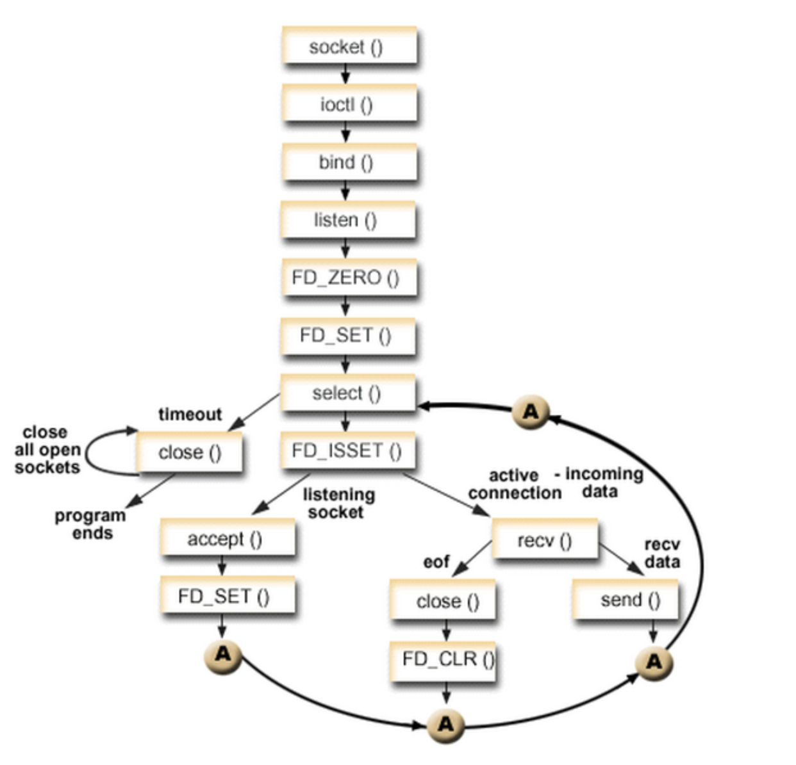
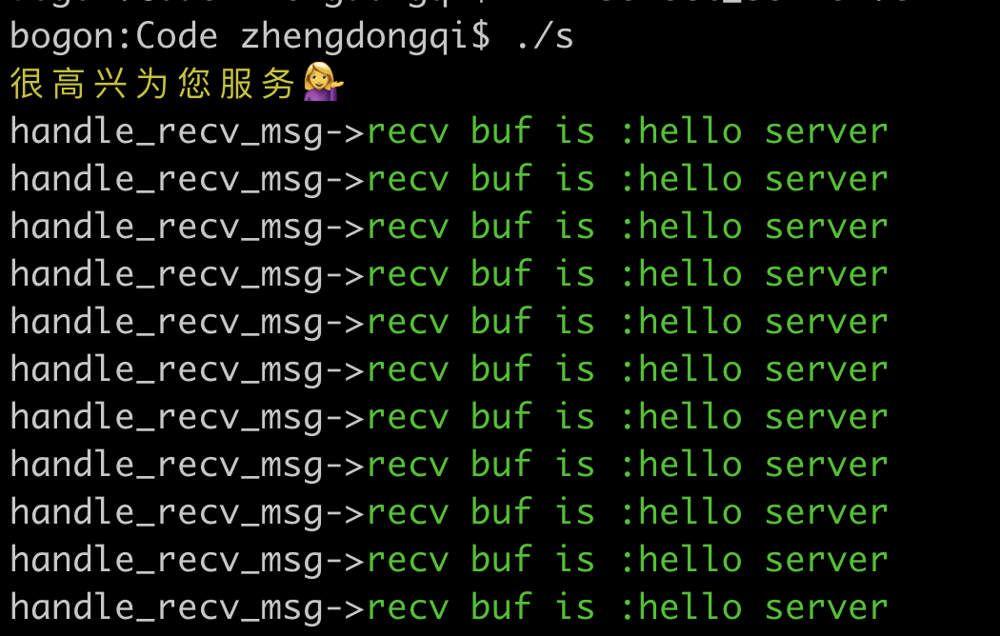
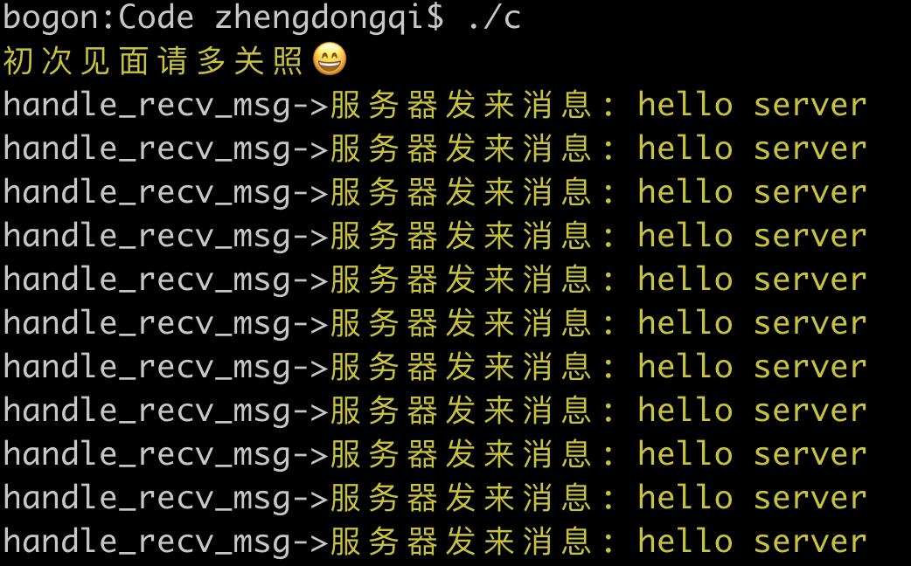
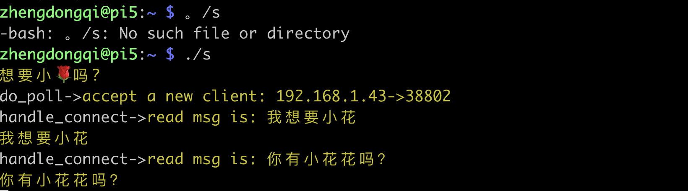
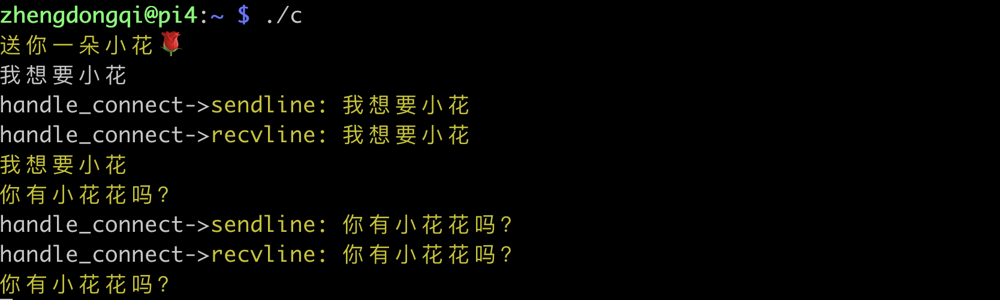
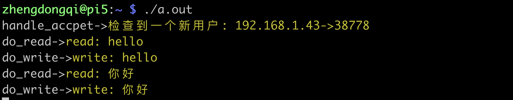
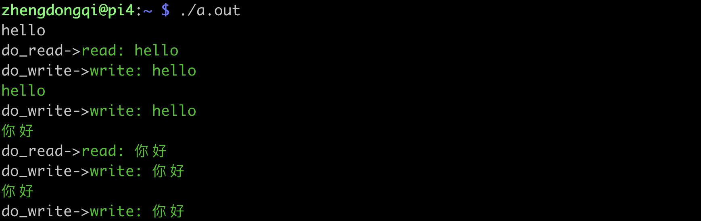

- [1、基本概念](#基本概念)
- [2、常见的5种IO模型](#常见的5种IO模型)
- [3、IO多路复用select](#IO多路复用select)
  - [select原理](#select原理)
  - [select函数](#select函数)
  - [select测试](#select测试)
  - [select运行](#select运行)
  - [select总结](#select总结)
- [4、IO多路复用poll](#IO多路复用poll)
  - [poll原理](#poll原理)
  - [poll函数](#poll函数)
  - [poll测试](#poll测试)
  - [poll运行](#poll运行)
  - [poll总结](#poll总结)
- [5、IO多路复用epoll](#IO多路复用epoll)
  - [epoll原理](#epoll原理)
  - [epoll函数](#epoll函数)
  - [epoll模式](#epoll模式)
  - [epoll测试](#epoll测试)
  - [epoll运行](#epoll运行)
  - [epoll总结](#epoll总结)
- [6、select、poll、epoll区别](#select、poll、epoll区别)
  - [1、最大连接数](#最大连接数)
  - [2、IO效率问题](#IO效率问题)
  - [3、消息传递方式](#消息传递方式)

# 1、基本概念

IO多路复用是指内核一旦发现进程指定的一个或者多个IO条件准备读取，它就通知该进程。IO多路复用适用如下场合：

> （1）当客户处理多个描述字时（一般是交互式输入和网络套接口），必须使用I/O复用。
>
> （2）当一个客户同时处理多个套接口时，而这种情况是可能的，但很少出现。
>
> （3）如果一个TCP服务器既要处理监听套接口，又要处理已连接套接口，一般也要用到I/O复用。
>
> （4）如果一个服务器即要处理TCP，又要处理UDP，一般要使用I/O复用。
>
> （5）如果一个服务器要处理多个服务或多个协议，一般要使用I/O复用。

与多进程和多线程技术相比，I/O多路复用技术的最大优势是系统开销小，系统不必创建进程/线程，也不必维护这些进程/线程，从而大大减小了系统的开销。

总而言之，IO多路复用就是：**一个线程，通过记录I/O流的状态来同时管理多个I/O，可以提高服务器的吞吐能力**。

# 2、常见的5种IO模型

```c
1.阻塞I/O模型
隔壁老王去火车站买票，排队三天买到一张退票。
耗费：在车站吃喝拉撒睡 3 天，其它事一件没干。
```

```c
2.非阻塞I/O模型
隔壁老王去火车站买票，隔 12 小时去火车站问有没有退票，三天后买到一张票。
耗费：往返车站 6 次，路上 6 小时，其它时间做了好多事。
```

```c
3.I/O复用模型
① select/poll
隔壁老王去火车站买票，委托黄牛，然后每隔 6 小时电话黄牛询问，黄牛三天内买到票，然后隔壁老王去火车站交钱领票。
耗费：往返车站 2 次，路上 2 小时，黄牛手续费 100 元，打电话 17 次。
② epoll
隔壁老王去火车站买票，委托黄牛，黄牛买到后即通知隔壁老王去领，然后隔壁老王去火车站交钱领票。
耗费：往返车站 2 次，路上 2 小时，黄牛手续费 100 元，无需打电话
```

```c
4.信号驱动I/O模型
隔壁老王去火车站买票，给售票员留下电话，有票后，售票员电话通知隔壁老王，然后隔壁老王去火车站交钱领票。
耗费：往返车站 2 次，路上 2 小时，免黄牛费 100 元，无需打电话
```

```c
5.异步I/O模型
隔壁老王去火车站买票，给售票员留下电话，有票后，售票员电话通知隔壁老王并快递送票上门。
耗费：往返车站 1 次，路上 1 小时，免黄牛费 100 元，无需打电话
```

# 3、IO多路复用select

## select原理

该函数准许进程指示内核等待多个事件中的任何一个发送，并只在有一个或多个事件发生或经历一段指定的时间后才唤醒。

## select函数

```c
#include <sys/select.h>
#include <sys/time.h>

int select(int maxfdp1, fd_set *readset, fd_set *writeset, fd_set *exceptset, const struct timeval *timeout)
```

> 函数参数介绍如下：
>
> （1）第一个参数maxfdp1指定待测试的描述字个数，它的值是待测试的最大描述字加1（因此把该参数命名为maxfdp1），描述字0、1、2...maxfdp1-1均将被测试。因为文件描述符是从0开始的。
>
> （2）中间的三个参数readset、writeset 和 exceptset 指定我们要让内核测试读、写和异常条件的描述字。如果对某一个的条件不感兴趣，就可以把它设为空指针。struct fd_set可以理解为一个集合，这个集合中存放的是文件描述符，可通过以下四个宏进行设置：
>
> ```c
> void FD_ZERO(fd_set *fdset);           //清空集合
> 
> void FD_SET(int fd, fd_set *fdset);    //将一个给定的文件描述符加入集合之中
> 
> void FD_CLR(int fd, fd_set *fdset);    //将一个给定的文件描述符从集合中删除
> 
> int FD_ISSET(int fd, fd_set *fdset);   // 检查集合中指定的文件描述符是否可以读写 
> ```
>
> （3）timeout告知内核等待所指定描述字中的任何一个就绪可花多少时间。其timeval结构用于指定这段时间的秒数和微秒数。
>
> ```c
>  struct timeval {
> 
> 	long tv_sec;   //seconds
> 
> 	long tv_usec;  //microseconds
> 
> };
> ```
>
> 这个参数有三种可能：
>
> （1）永远等待下去：仅在有一个描述字准备好I/O时才返回。为此，把该参数设置为空指针NULL。
>
> （2）等待一段固定时间：在有一个描述字准备好I/O时返回，但是不超过由该参数所指向的timeval结构中指定的秒数和微秒数。
>
> （3）根本不等待：检查描述字后立即返回，这称为轮询。为此，该参数必须指向一个timeval结构，而且其中的定时器值必须为0。

> 

## select测试

服务器端

```c
/*************************************************************************
	> File Name: select_server.c
	> Author: zhengdongqi
	> Mail: 
	> Created Time: 一  4/ 8 16:04:11 2019
 ************************************************************************/

#include <stdio.h>
#include <stdlib.h>
#include <string.h>
#include <errno.h>
#include <unistd.h>
#include <assert.h>
#include <sys/select.h>
#include <sys/socket.h>
#include <sys/types.h>
#include <arpa/inet.h>

#ifdef _DEBUG
#define DBG(fmt, args...) printf(fmt, ##args)
#else
#define DBG(fmt, args...)
#endif

#define IPADDR "192.168.2.165"
#define PORT 8888
#define MAXSIZE 1024
#define LISTENQ 5
#define SIZE 10

/*定义一个结构体存放数据信息*/
typedef struct date_t {
    int cli_cnt; /*客户数量*/
    int cli_fds[SIZE]; /*客户套接字*/
    fd_set allfds; /*句柄集合*/
    int maxfd; /*句柄最大值*/
} date_t;
date_t *cli_d = NULL;

/*函数声明*/
/*创建一个socket 类型TCP*/
int socket_create_tcp(int port);
/*创建一个接收函数*/
int socket_accept_tcp(int sockfd);
/*处理收到的消息*/
int handle_recv_msg(int fd, char *buf);s
 /*接收消息*/
void socket_recv_msg(fd_set *rset);
/*select处理函数*/
void handle_select_proc(int sockfd);
/*创建一个socket 类型TCP*/
/*销毁数据*/
void date_destroy();
/*初始化*/
int socket_init();

int main() {
    DBG("\033[33m很高兴为您服务💁\033[0m\n");
    fflush(stdout);
    int fd;
    /*初始化服务端*/
    if (socket_init() < 0) {
        return -1;
    }
    /*创建服务,开始监听客户端请求*/
    fd = socket_create_tcp(PORT);
    if (fd < 0) {
        DBG("\033[31m套接字创建失败\033[0m\n");
        return -1;
    }
    /*开始接收并处理客户端请求*/
    handle_select_proc(fd);
    date_destroy();
    return 0;
}
/*创建一个socket 类型TCP*/
int socket_create_tcp(int port) {
    int socket_fd;
    struct sockaddr_in socket_addr;
    //创建套接字
    socket_fd = socket(AF_INET, SOCK_STREAM, 0);
    if (socket_fd < 0) {
        DBG("socket_create_tcp->\033[31m创建套接字失败: %s\033[0m\n", strerror(errno));
        close(socket_fd);
        return -1;
    }
    //设置服务器
    memset(&socket_addr, 0, sizeof(socket_addr));//数据初始化清零
    socket_addr.sin_family = AF_INET;//设置协议族
    socket_addr.sin_port = htons(port);//端口
    socket_addr.sin_addr.s_addr = htonl(INADDR_ANY);//IP地址
    //端口重用
    int reuse = 1;
    if (setsockopt(socket_fd, SOL_SOCKET, SO_REUSEADDR, &reuse, sizeof(reuse)) == -1) {
        DBG("socket_create_tcp->\033[31m设置端口重用失败: %s\033[0m\n", strerror(errno));
        close(socket_fd);
        return -1;
    }
    //绑定连接
    if (bind(socket_fd, (struct sockaddr*)&socket_addr, sizeof(struct sockaddr)) < 0) {
        DBG("socket_create_tcp->\033[31m绑定失败: %s\033[0m\n", strerror(errno));
        close(socket_fd);
        return -1;
    }
    //设置监听
    if (listen(socket_fd, 20) < 0) {
        DBG("socket_create_tcp->\033[31m监听失败: %s\033[0m\n", strerror(errno));
        close(socket_fd);
        return -1;
    }
    return socket_fd;
}
/*创建一个接收函数*/
int socket_accept_tcp(int sockfd) {
    int afd = -1;
    struct sockaddr_in accept_addr;
    int len = sizeof(accept_addr);

    afd = accept(sockfd, (struct sockaddr *)&accept_addr, (socklen_t *)&len);

    if (afd == -1) {
        DBG ("socket_accept_tcp->\033[31m接收失败: %s\033[0m\n", strerror(errno));
        return -1;
    }

    //将新的连接描述符添加到数组中
    int i = 0;
    for (i = 0; i < SIZE; i++) {
        if (cli_d->cli_fds[i] < 0) {
            cli_d->cli_fds[i] = afd;
            cli_d->cli_cnt++;
            break;
        }
    }

    if (i == SIZE) {
        DBG("socket_accept_tcp->\033[31m太多客户了 好累啊😢\033[0m\n");
        fflush(stdout);
        return -1;
    }
    return 0;
}
/*处理收到的消息*/
int handle_recv_msg(int fd, char *buf) {
    assert(buf);
    printf("handle_recv_msg->\033[32mrecv buf is :%s\033[0m\n", buf);
    write(fd, buf, strlen(buf) +1);
    return 0;
}
/*接收消息*/
void socket_recv_msg(fd_set *rset) {
    int i = 0, n = 0;
    int fd;
    char buf[MAXSIZE] = {0};
    for (i = 0; i <= cli_d->cli_cnt; i++) {
        fd = cli_d->cli_fds[i];
        if (fd < 0) {
            continue;
        }
        /*判断客户端套接字是否有数据*/
        if (FD_ISSET(fd, rset)) {
            //接收客户端发送的信息
            n = read(fd, buf, MAXSIZE);
            if (n <= 0) {
                /*n==0表示读取完成，客户都关闭套接字*/
                FD_CLR(fd, &cli_d->allfds);
                close(fd);
                cli_d->cli_fds[i] = -1;
                continue;
            }
            handle_recv_msg(fd, buf);
        }
    }
}
/*select处理函数*/
void handle_select_proc(int sockfd) {
    int fd = -1;
    int nfd = 0;
    fd_set *rset = &cli_d->allfds;
    struct timeval tv;
    int i = 0;

    while (1) {
        /*每次调用select前都要重新设置文件描述符和时间，因为事件发生后，文件描述符和时间都被内核修改啦*/
        FD_ZERO(rset);
        /*添加监听套接字*/
        FD_SET(sockfd, rset);
        cli_d->maxfd = sockfd;

        tv.tv_sec = 30;
        tv.tv_usec = 0;

        /*添加客户端套接字*/
        for (i = 0; i < cli_d->cli_cnt; i++) {
            fd = cli_d->cli_fds[i];
            /*去除无效的客户端句柄*/
            if (fd != -1) {
                FD_SET(fd, rset);
            }
            cli_d->maxfd = (fd > cli_d->maxfd ? fd : cli_d->maxfd);
        }

        /*开始轮询接收处理服务端和客户端套接字*/
        nfd = select(cli_d->maxfd + 1, rset, NULL, NULL, &tv);
        if (nfd == -1) {
            DBG("handle_socket_select->\033[31mselect失败: %s\033[0m\n", strerror(errno));
            return ;
        }
        if (nfd == 0) {
            DBG("handle_socket_select->\033[31mselect超时: %s\033[0m\n", strerror(errno));
            continue;
        }
        if (FD_ISSET(sockfd, rset)) {
            /*监听客户端请求*/
            socket_accept_tcp(sockfd);
        } else {
            /*接受处理客户端消息*/
            socket_recv_msg(rset);
        }
    }
	return ;
}
/*销毁数据*/
void date_destroy() {
    if (cli_d) {
        free(cli_d);
        cli_d = NULL;
    }
    return ;
}
/*初始化*/
int socket_init() {
    cli_d = (date_t *)malloc(sizeof(date_t));
    if (cli_d == NULL) {
        return -1;
    }

    memset(cli_d, 0, sizeof(date_t));

    int i = 0;
    for (; i < SIZE; i++) {
        cli_d->cli_fds[i] = -1;
    }
    return 0;
}
```

客户端

```c
/*************************************************************************
	> File Name: select_client.c
	> Author: zhengdongqi
	> Mail: 
	> Created Time: 一  4/ 8 17:36:23 2019
 ************************************************************************/

#include <stdio.h>
#include <string.h>
#include <stdlib.h>
#include <sys/select.h>
#include <sys/socket.h>
#include <sys/types.h>
#include <arpa/inet.h>
#include <time.h>
#include <unistd.h>
#include <errno.h>

#ifdef _DEBUG
#define DBG(fmt, args...) printf(fmt, ##args)
#else
#define DBG(fmt, args...)
#endif

#define MAXLINE 1024
#define IPADDR "192.168.2.165"
#define PORT 8888
/*处理接收信息*/
void handle_recv_msg(int sockfd, char *buf)  {
    DBG("handle_recv_msg->\033[33m服务器发来消息: %s\033[0m\n", buf);
    sleep(5);
    write(sockfd, buf, strlen(buf) +1);
}

 
/*处理套接字连接*/
void handle_socket_connect(int fd) {
    char sendline[MAXLINE],recvline[MAXLINE];
    int maxfd = 0;
    fd_set rset;
    int n;
    struct timeval tv;
    int nfd = 0;

    while (1) {

        FD_ZERO(&rset);
        FD_SET(fd, &rset);
        maxfd = fd;

        tv.tv_sec = 5;
        tv.tv_usec = 0;

        nfd = select(maxfd + 1, &rset, NULL, NULL, &tv);

        if (nfd == -1) {
            return ;
        }

        if (nfd == 0) {
            DBG("handle_socket_connect->\033[31mselect超时\033[0m\n");
            continue;
        }

        if (FD_ISSET(fd, &rset)) {
            n = read(fd, recvline, MAXLINE);
            if (n <= 0) {
                DBG("handle_socket_connect->\033[31m服务器已关闭\033[0m\n");
                close(fd);
                FD_CLR(fd, &rset);
            return;
            }
        handle_recv_msg(fd, recvline);
        }
    }
}

int main() {
    int socket_fd;
    struct sockaddr_in socket_addr;

    socket_fd = socket(AF_INET, SOCK_STREAM, 0);

    memset(&socket_addr, 0, sizeof(socket_addr));
    socket_addr.sin_family = AF_INET;
    socket_addr.sin_port = htons(PORT);
    socket_addr.sin_addr.s_addr = inet_addr(IPADDR);

    int nfd = 0;
    nfd = connect(socket_fd,(struct sockaddr*)&socket_addr, sizeof(socket_addr));
    if (nfd < 0) {
        DBG("\033[31m连接失败: %s\033[0m\n", strerror(errno));
        return -1;
    }

    DBG("\033[33m初次见面请多关照😄\033[0m\n");
    fflush(stdout);
    write(socket_fd, "hello server", 32);

    handle_socket_connect(socket_fd);

    return 0;
}
```

## select运行





## select总结

select目前几乎在所有的平台上支持，`其良好跨平台支持也是它的一个优点`。`select的一个缺点在于单个进程能够监视的文件描述符的数量存在最大限制`，在Linux上一般为1024，`可以通过修改宏定义甚至重新编译内核的方式提升这一限制`，但是这样也会造成效率的降低。

`select本质上是通过设置或者检查存放fd标志位的数据结构来进行下一步处理`。这样所带来的缺点是：

1、select最大的缺陷就是单个进程所打开的FD是有一定限制的，它由FD_SETSIZE设置，默认值是1024。

　　一般来说这个数目和系统内存关系很大，`具体数目可以cat /proc/sys/fs/file-max察看`。32位机默认是1024个。64位机默认是2048.

2、对socket进行扫描时是线性扫描，即采用轮询的方法，效率较低。

　　当套接字比较多的时候，每次select()都要通过遍历FD_SETSIZE个Socket来完成调度，不管哪个Socket是活跃的，都遍历一遍。这会浪费很多CPU时间。`如果能给套接字注册某个回调函数，当他们活跃时，自动完成相关操作，那就避免了轮询`，这正是epoll与kqueue做的。

3、需要维护一个用来存放大量fd的数据结构，这样会使得用户空间和内核空间在传递该结构时复制开销大。

# 4、IO多路复用poll

## poll原理

poll的机制与select类似，与select在本质上没有多大差别，管理多个描述符也是进行轮询，根据描述符的状态进行处理，但是poll没有最大文件描述符数量的限制。poll和select同样存在一个缺点就是，包含大量文件描述符的数组被整体复制于用户态和内核的地址空间之间，而不论这些文件描述符是否就绪，它的开销随着文件描述符数量的增加而线性增大。

## poll函数

函数格式如下所示：

```c
#include <poll.h>
int poll(struct pollfd *fds, unsigned int nfds, int timeout);
```

pollfd结构体定义如下：

```c
struct pollfd {
	int fd;         	/* 文件描述符 */
	short events;       /* 等待的事件 */
	short revents;      /* 实际发生了的事件 */
}; 
```

每一个pollfd结构体指定了一个被监视的文件描述符，可以传递多个结构体，指示poll()监视多个文件描述符。每个结构体的events域是监视该文件描述符的事件掩码，由用户来设置这个域。revents域是文件描述符的操作结果事件掩码，内核在调用返回时设置这个域。events域中请求的任何事件都可能在revents域中返回。合法的事件如下：

```c
POLLIN 　　　　　　　　//有数据可读。
POLLRDNORM 　　　　   //有普通数据可读。
POLLRDBAND　　　　　  //有优先数据可读。
POLLPRI　　　　　　　　//有紧迫数据可读。
POLLOUT　　　　　　   //写数据不会导致阻塞。
POLLWRNORM　　　　　  //写普通数据不会导致阻塞。
POLLWRBAND　　　　　  //写优先数据不会导致阻塞。
POLLMSGSIGPOLL 　　　//消息可用。

/*此外，revents域中还可能返回下列事件：*/
POLLER　　   				//指定的文件描述符发生错误。
POLLHUP　　 				//指定的文件描述符挂起事件。
POLLNVAL　　				//指定的文件描述符非法。
/*这些事件在events域中无意义，因为它们在合适的时候总是会从revents中返回*/
```

使用poll()和select()不一样，你不需要显式地请求异常情况报告。
　　POLLIN  |  POLLPRI等价于select( )的读事件，POLLOUT  | POLLWRBAND 等价于select( )的写事件。POLLIN 等价于POLLRDNORM  |  POLLRDBAND，而 POLLOUT 则等价于 POLLWRNORM。例如，要同时监视一个文件描述符是否可读和可写，我们可以设置 events 为POLLIN | POLLOUT。在 poll 返回时，我们可以检查 revents 中的标志，对应于文件描述符请求的 events 结构体。如果 POLLIN 事件被设置，则文件描述符可以被读取而不阻塞。如果 POLLOUT 被设置，则文件描述符可以写入而不导致阻塞。这些标志并不是互斥的：它们可能被同时设置，表示这个文件描述符的读取和写入操作都会正常返回而不阻塞。

　　timeout 参数指定等待的毫秒数，无论I/O是否准备好，poll 都会返回。timeout 指定为负数值表示无限超时，使 poll( )一直挂起直到一个指定事件发生；timeout 为 0 指示 poll 调用立即返回并列出准备好 I/O 的文件描述符，但并不等待其它的事件。这种情况下，poll( ) 就像它的名字那样，一旦选举出来，立即返回。 

返回值和错误代码
　　成功时，poll( ) 返回结构体中 revents 域不为 0 的文件描述符个数；如果在超时前没有任何事件发生，poll( )返回 0；失败时，poll( )返回-1，并设置 errno 为下列值之一：

```c
EBADF　　     //一个或多个结构体中指定的文件描述符无效。
EFAULTfds　　 //指针指向的地址超出进程的地址空间。
EINTR　　　　  //请求的事件之前产生一个信号，调用可以重新发起。
EINVALnfds　　//参数超出PLIMIT_NOFILE值。
ENOMEM　　    //可用内存不足，无法完成请求。
```

## poll测试

服务器端

```c
/*************************************************************************
	> File Name: poll_server.c
	> Author: zhengdongqi
	> Mail: 
	> Created Time: Tue 09 Apr 2019 14:15:43 CST
 ************************************************************************/

#include <stdio.h>
#include <stdlib.h>
#include <string.h>
#include <errno.h>

#include <netinet/in.h>
#include <arpa/inet.h>
#include <sys/socket.h>
#include <poll.h>
#include <unistd.h>
#include <sys/types.h>

#ifdef _DEBUG
#define DBG(fmt, args...) printf(fmt, ##args)
#else
#define DBG(fmt, args...)
#endif

#define IPADDR      "192.168.1.44"
#define PORT        8731
#define MAXSIZE     1024
#define LISTENQ     5
#define OPEN_MAX    1000
#define INFTIM      -1

/*函数声明*/
/*创建套接字并进行绑定*/
int socket_bind(int port);
/*IO多路复用poll*/
void do_poll(int listenfd);
/*处理多个连接*/
void handle_connect(struct pollfd *pfds, int num);

int main() {
    DBG("\033[33m想要小🌹吗?\033[0m\n");
    fflush(stdout);
    int  listenfd;
    struct sockaddr_in socket_addr;
    listenfd = socket_bind(PORT);
    listen(listenfd, LISTENQ);
    do_poll(listenfd);
    return 0;
}

/*创建套接字并进行绑定*/
int socket_bind(int port) {
    int  listenfd;
    struct sockaddr_in socket_addr;
    listenfd = socket(AF_INET, SOCK_STREAM, 0);
    if (listenfd == -1) {
        DBG("socket_bind->\033[31m套接字创建失败: %s\033[0m\n", strerror(errno));
        return -1;
    }
    memset(&socket_addr, 0, sizeof(socket_addr));
    socket_addr.sin_family = AF_INET;
    socket_addr.sin_port = htons(port);
  	socket_addr.sin_addr.s_addr = htonl(INADDR_ANY);
 	//端口重用
    int reuse = 1;
    if (setsockopt(listenfd, SOL_SOCKET, SO_REUSEADDR, &reuse, sizeof(reuse)) == -1) {
        DBG("socket_bind->\033[31m设置端口重用失败: %s\033[0m\n", strerror(errno));
        close(listenfd);
        return -1;
    }
    if (bind(listenfd, (struct sockaddr*)&socket_addr, sizeof(socket_addr)) == -1) {
        DBG("socket_bind->\033[31m绑定失败: %s\033[0m\n", strerror(errno));
        return -1;
    }
    return listenfd;
}
/*IO多路复用破poll*/
void do_poll(int listenfd) {
    int poll_fd;
    struct sockaddr_in poll_addr;
    struct pollfd pfds[OPEN_MAX];
    int maxfd;
    int i;
    int nready;
    //添加监听描述符
    pfds[0].fd = listenfd;
    pfds[0].events = POLLIN;
    //初始化客户连接描述符
    for (i = 1; i < OPEN_MAX; i++) {
        pfds[i].fd = -1;
    }
    maxfd = 0;
    //循环处理
    for ( ; ; ) {
        //获取可用描述符的个数
        nready = poll(pfds, maxfd+1, INFTIM);
        if (nready == -1) {
            DBG("do_poll->\033[31mpoll error\033[0m\n");
            return ;
        }
        //测试监听描述符是否准备好
        if (pfds[0].revents & POLLIN) {
            socklen_t len = sizeof(poll_addr);
            //接受新的连接
            if ((poll_fd = accept(listenfd, (struct sockaddr*)&poll_addr, &len)) == -1) {
                if (errno == EINTR)
                    continue;
                else {
                   DBG("do_poll->\033[31maccept error\033[0m\n");
                   return ;
                }
            }
            DBG("do_poll->\033[33maccept a new client: %s->%d\033[0m\n", inet_ntoa(poll_addr.sin_addr), ntohs(poll_addr.sin_port));
            //将新的连接描述符添加到数组中
            for (i = 1; i < OPEN_MAX; i++) {
                if (pfds[i].fd < 0) {
                    pfds[i].fd = poll_fd;
                    break;
                }
            }
            if (i == OPEN_MAX) {
                DBG("\033[34m累死了😢\033[0m\n");
                return ;
            }
            //将新的描述符添加到读描述符集合中
            pfds[i].events = POLLIN;
            //记录客户连接套接字的个数
            maxfd = (i > maxfd ? i : maxfd);
            if (--nready <= 0)
                continue;
        }
        //处理客户连接
        handle_connect(pfds,maxfd);
    }
}

void handle_connect(struct pollfd *pfds, int num) {
    int i, n;
    char buf[MAXSIZE];
    memset(buf, 0, MAXSIZE);
    for (i = 1; i <= num; i++) {
        if (pfds[i].fd < 0)
            continue;
        //测试客户描述符是否准备好
        if (pfds[i].revents & POLLIN) {
            //接收客户端发送的信息
            n = read(pfds[i].fd, buf, MAXSIZE);
            if (n == 0) {
                close(pfds[i].fd);
                pfds[i].fd = -1;
                continue;
            }
            DBG("handle_connect->\033[33mread msg is: %s\033[0m", buf);
            write(STDOUT_FILENO, buf, n);
            //向客户端发送buf
            write(pfds[i].fd, buf, n);
        }
    }
}
```

客户端

```c
/*************************************************************************
	> File Name: poll_client.c
	> Author: zhengdongqi
	> Mail: 1821260963@qq.com
	> Created Time: Tue 09 Apr 2019 14:19:14 CST
 ************************************************************************/

#include <netinet/in.h>
#include <arpa/inet.h>
#include <sys/socket.h>
#include <stdio.h>
#include <string.h>
#include <stdlib.h>
#include <poll.h>
#include <time.h>
#include <unistd.h>
#include <sys/types.h>

#ifdef _DEBUG
#define DBG(fmt, args...) printf(fmt, ##args)
#else
#define DBG(fmt, args...)
#endif

#define MAXSIZE     1024
#define IPADDR      "192.168.1.44"
#define PORT        8731
/*处理连接*/
void handle_connect(int sockfd);

int main() {
    DBG("\033[33m送你一朵小花🌹\033[0m\n");
    fflush(stdout);
    int socket_fd;
    struct sockaddr_in  socket_addr;
    socket_fd = socket(AF_INET, SOCK_STREAM, 0);
    memset(&socket_addr, 0, sizeof(socket_addr));
    socket_addr.sin_family = AF_INET;
    socket_addr.sin_port = htons(PORT);
    socket_addr.sin_addr.s_addr = inet_addr(IPADDR);
    connect(socket_fd, (struct sockaddr*)&socket_addr,sizeof(socket_addr));
    //处理连接描述符
    handle_connect(socket_fd);
    return 0;
}
/*处理连接*/
void handle_connect(int socket_fd) {
    char sendline[MAXSIZE], recvline[MAXSIZE];
    struct pollfd pfds[2];
    int n;
    //添加连接描述符
    pfds[0].fd = socket_fd;
    pfds[0].events = POLLIN;
    //添加标准输入描述符
    pfds[1].fd = STDIN_FILENO;
    pfds[1].events = POLLIN;
    for (; ;) {
        poll(pfds, 2, -1);
        if (pfds[0].revents & POLLIN) {
            n = read(socket_fd, recvline, MAXSIZE);
            if (n == 0) {
                DBG("handle_connect->\033[31m服务器已关闭\033[0m\n");
                close(socket_fd);
            }
            DBG("handle_connect->\033[33mrecvline: %s\033[0m", recvline);
            write(STDOUT_FILENO, recvline, n);
        }
        //测试标准输入是否准备好
        if (pfds[1].revents & POLLIN) {
            n = read(STDIN_FILENO, sendline, MAXSIZE);
            if (n == 0) {
                shutdown(socket_fd, SHUT_WR);
                continue;
            }
            DBG("handle_connect->\033[33msendline: %s\033[0m", sendline);
            write(socket_fd, sendline, n);
        }
    }
}
```

## poll运行





## poll总结

`poll本质上和select没有区别，它将用户传入的数组拷贝到内核空间`，然后查询每个fd对应的设备状态，如果设备就绪则在设备等待队列中加入一项并继续遍历，如果遍历完所有fd后没有发现就绪设备，则挂起当前进程，直到设备就绪或者主动超时，被唤醒后它又要再次遍历fd。这个过程经历了多次无谓的遍历。 

它没有最大连接数的限制，`原因是它是基于链表来存储的`，但是同样有一个缺点：

`1）大量的fd的数组被整体复制于用户态和内核地址空间之间`，而不管这样的复制是不是有意义。

`2）poll还有一个特点是“水平触发”`，如果报告了fd后，没有被处理，那么下次poll时会再次报告该fd。 

注意：从上面看，select和poll都需要在返回后，`通过遍历文件描述符来获取已经就绪的socket`。事实上，`同时连接的大量客户端在一时刻可能只有很少的处于就绪状态`，因此随着监视的描述符数量的增长，其效率也会线性下降。

# 5、IO多路复用epoll

## epoll原理

epoll是在2.6内核中提出的，是之前的select和poll的增强版本。相对于select和poll来说，epoll更加灵活，没有描述符限制。epoll使用一个文件描述符管理多个描述符，将用户关系的文件描述符的事件存放到内核的一个事件表中，这样在用户空间和内核空间的copy只需一次。

## epoll函数

epoll操作过程需要三个接口，分别如下：

```c
#include <sys/epoll.h>
int epoll_create(int size);
int epoll_ctl(int epfd, int op, int fd, struct epoll_event *event);
int epoll_wait(int epfd, struct epoll_event * events, int maxevents, int timeout);
```

**（1） int epoll_create(int size);**
　　创建一个epoll的句柄，size用来告诉内核这个监听的数目一共有多大。这个参数不同于select()中的第一个参数，给出最大监听的fd+1的值。需要注意的是，当创建好epoll句柄后，它就是会占用一个fd值，在linux下如果查看/proc/进程id/fd/，是能够看到这个fd的，所以在使用完epoll后，必须调用close()关闭，否则可能导致fd被耗尽。

**（2）int epoll_ctl(int epfd,  int op,  int fd,  struct epoll_event  *event);**
　　epoll的事件注册函数，它不同与select()是在监听事件时告诉内核要监听什么类型的事件epoll的事件注册函数，它不同与select()是在监听事件时告诉内核要监听什么类型的事件，而是在这里先注册要监听的事件类型。第一个参数是epoll_create()的返回值，第二个参数表示动作，用三个宏来表示：

```c
EPOLL_CTL_ADD：//注册新的fd到epfd中；
EPOLL_CTL_MOD：//已经注册的fd的监听事件；
EPOLL_CTL_DEL：//pfd中删除一个fd；
```

第三个参数是需要监听的fd，第四个参数是告诉内核需要监听什么事，struct epoll_event结构如下：

```c
struct epoll_event {
  __uint32_t events;  /* Epoll events */
  epoll_data_t data;  /* User data variable */
};
```

events可以是以下几个宏的集合：

```c
EPOLLIN ：//表示对应的文件描述符可以读（包括对端SOCKET正常关闭）；
EPOLLOUT：//表示对应的文件描述符可以写；
EPOLLPRI：//表示对应的文件描述符有紧急的数据可读（这里应该表示有带外数据到来）；
EPOLLERR：//表示对应的文件描述符发生错误；
EPOLLHUP：//表示对应的文件描述符被挂断；
EPOLLET： //将EPOLL设为边缘触发(Edge Triggered)模式，这是相对于水平触发(Level Triggered)来说的。
EPOLLONESHOT：//只监听一次事件，当监听完这次事件之后，如果还需要继续监听这个socket的话，需要再次把这个socket加入到EPOLL队列里
```

**（3） int epoll_wait(int epfd, struct epoll_event \* events, int maxevents, int timeout);**
　　等待事件的产生，类似于select()调用。参数events用来从内核得到事件的集合，maxevents告之内核这个events有多大，这个maxevents的值不能大于创建epoll_create()时的size，参数timeout是超时时间（毫秒，0会立即返回，-1将不确定，也有说法说是永久阻塞）。该函数返回需要处理的事件数目，如返回0表示已超时。

## epoll模式

​	epoll对文件描述符的操作有两种模式：LT（level trigger）和ET（edge trigger）。LT模式是默认模式，LT模式与ET模式的区别如下：

　　LT模式：**当epoll_wait检测到描述符事件发生并将此事件通知应用程序，应用程序可以不立即处理该事件。下次调用epoll_wait时，会再次响应应用程序并通知此事件。**

　　ET模式：**当epoll_wait检测到描述符事件发生并将此事件通知应用程序，应用程序必须立即处理该事件。如果不处理，下次调用epoll_wait时，不会再次响应应用程序并通知此事件。**

　　**ET模式在很大程度上减少了epoll事件被重复触发的次数，因此效率要比LT模式高。epoll工作在ET模式的时候，必须使用非阻塞套接口，以避免由于一个文件句柄的阻塞读/阻塞写操作把处理多个文件描述符的任务饿死。**

## epoll测试

编写一个服务器回射程序echo，练习epoll过程。

```c
/*************************************************************************
	> File Name: epoll_server.c
	> Author: zhengdongqi
	> Mail: 
	> Created Time: Mon 08 Apr 2019 19:10:21 CST
 ************************************************************************/

#include <stdio.h>
#include <stdlib.h>
#include <string.h>
#include <errno.h>

#include <netinet/in.h>
#include <sys/socket.h>
#include <arpa/inet.h>
#include <sys/epoll.h>
#include <unistd.h>
#include <sys/types.h>

#ifdef _DEBUG
#define DBG(fmt, args...) printf(fmt, ##args)
#else
#define DBG(fmt, args...)
#endif

#define IPADDR      "192.168.1.44"
#define PORT        8731
#define MAXSIZE     1024
#define LISTENQ     5
#define FDSIZE      1000
#define EPOLLEVENTS 100

/*函数声明*/
/*创建套接字并进行绑定*/
int socket_bind(int port);
/*IO多路复用epoll*/
void do_epoll(int listenfd);
/*事件处理函数*/
void handle_events(int epollfd, struct epoll_event *events, int num, int listenfd, char *buf);
/*处理接收到的连接*/
void handle_accpet(int epollfd, int listenfd);
/*读处理*/
void do_read(int epollfd, int fd, char *buf);
/*写处理*/
void do_write(int epollfd, int fd, char *buf);
/*添加事件*/
void add_event(int epollfd, int fd, int state);
/*修改事件*/
void modify_event(int epollfd, int fd, int state);
/*删除事件*/
void delete_event(int epollfd, int fd, int state);

int main() {
    int  listenfd;
    listenfd = socket_bind(PORT);
    listen(listenfd, LISTENQ);
    do_epoll(listenfd);
    return 0;
}
/*创建套接字并进行绑定*/
int socket_bind(int port) {
    int  listenfd;
    struct sockaddr_in socket_addr;
    listenfd = socket(AF_INET, SOCK_STREAM, 0);
    if (listenfd == -1) {
        DBG("socket_bind->\033[31m套接字创建失败: %s\033[0m\n", strerror(errno));
        return -1;
    }
    memset(&socket_addr, 0, sizeof(socket_addr));
    socket_addr.sin_family = AF_INET;
    socket_addr.sin_port = htons(port);
  	socket_addr.sin_addr.s_addr = htonl(INADDR_ANY);
 	//端口重用
    int reuse = 1;
    if (setsockopt(listenfd, SOL_SOCKET, SO_REUSEADDR, &reuse, sizeof(reuse)) == -1) {
        DBG("socket_bind->\033[31m设置端口重用失败: %s\033[0m\n", strerror(errno));
        close(listenfd);
        return -1;
    }
    if (bind(listenfd, (struct sockaddr*)&socket_addr, sizeof(socket_addr)) == -1) {
        DBG("socket_bind->\033[31m绑定失败: %s\033[0m\n", strerror(errno));
        return -1;
    }
    return listenfd;
}
/*IO多路复用epoll*/
void do_epoll(int listenfd) {
    int epollfd;
    struct epoll_event events[EPOLLEVENTS];
    int ret;
    char buf[MAXSIZE];
    memset(buf, 0, MAXSIZE);
    //创建一个描述符
    epollfd = epoll_create(FDSIZE);
    //添加监听描述符事件
    add_event(epollfd, listenfd, EPOLLIN);
    for ( ; ; ) {
        //获取已经准备好的描述符事件
        ret = epoll_wait(epollfd, events, EPOLLEVENTS, -1);
        handle_events(epollfd, events, ret, listenfd, buf);
    }
    close(epollfd);
}
/*事件处理函数*/
void handle_events(int epollfd, struct epoll_event *events, int num, int listenfd, char *buf) {
    int i;
    int fd;
    //进行选好遍历
    for (i = 0; i < num; i++) {
        fd = events[i].data.fd;
        //根据描述符的类型和事件类型进行处理
        if ((fd == listenfd) && (events[i].events & EPOLLIN))
            handle_accpet(epollfd, listenfd);
        else if (events[i].events & EPOLLIN)
            do_read(epollfd, fd, buf);
        else if (events[i].events & EPOLLOUT)
            do_write(epollfd, fd, buf);
    }
}
/*处理接收到的连接*/
void handle_accpet(int epollfd, int listenfd) {
  	struct sockaddr_in socket_addr;
    int len = sizeof(struct sockaddr_in), fd;
    fd = accept(listenfd, (struct sockaddr*)&socket_addr, (socklen_t *)&len);
    if (fd == -1) {
        DBG("handle_accpet->\033[31m接受套接字失败: %s\033[0m", strerror(errno));
    } else {
        DBG("handle_accpet->\033[33m检查到一个新用户: %s->%d\033[0m\n", inet_ntoa(socket_addr.sin_addr), ntohs(socket_addr.sin_port));

        //添加一个客户描述符和事件
        add_event(epollfd, fd, EPOLLIN);
    }
}
/*读处理*/
void do_read(int epollfd, int fd, char *buf) {
    int nread;
    nread = read(fd, buf, MAXSIZE);
    if (nread == -1) {
        DBG("do_read->\033[31m读❌\033[0m\n");
      	fflush(stdout);
        close(fd);
        delete_event(epollfd, fd, EPOLLIN);
    } else if (nread == 0) {
        DBG("\033[33m用户已下线\033[0m\n");
        close(fd);
        delete_event(epollfd, fd, EPOLLIN);
    } else {
        DBG("do_read->\033[33mread: %s\033[0m", buf);
        //修改描述符对应的事件，由读改为写
        modify_event(epollfd, fd, EPOLLOUT);
    }
}
/*写处理*/
void do_write(int epollfd, int fd, char *buf) {
    int nwrite;
    nwrite = write(fd, buf, strlen(buf));
    if (nwrite == -1) {
        DBG("do_write->\033[31m❌\033[0m\n");
      	fflush(stdout);
        close(fd);
        delete_event(epollfd, fd, EPOLLOUT);
    } else
        DBG("do_write->\033[33mwrite: %s\033[0m", buf);
        modify_event(epollfd, fd, EPOLLIN);
    memset(buf,0,MAXSIZE);
}
/*添加事件*/
void add_event(int epollfd, int fd, int state) {
    struct epoll_event ev;
    ev.events = state;
    ev.data.fd = fd;
    epoll_ctl(epollfd, EPOLL_CTL_ADD, fd,&ev);
}
/*删除事件*/
void delete_event(int epollfd, int fd, int state) {
    struct epoll_event ev;
    ev.events = state;
    ev.data.fd = fd;
    epoll_ctl(epollfd, EPOLL_CTL_DEL, fd,&ev);
}
/*修改事件*/
void modify_event(int epollfd, int fd, int state) {
    struct epoll_event ev;
    ev.events = state;
    ev.data.fd = fd;
    epoll_ctl(epollfd, EPOLL_CTL_MOD, fd,&ev);
}
```

客户端

```c
/*************************************************************************
	> File Name: epoll_client.c
	> Author: zhengdongqi
	> Mail: 
	> Created Time: Mon 08 Apr 2019 19:15:59 CST
 ************************************************************************/
#include <netinet/in.h>
#include <sys/socket.h>
#include <stdio.h>
#include <string.h>
#include <stdlib.h>
#include <sys/epoll.h>
#include <time.h>
#include <unistd.h>
#include <sys/types.h>
#include <arpa/inet.h>

#ifdef _DEBUG
#define DBG(fmt, args...) printf(fmt, ##args)
#else
#define DBG(fmt, args...)
#endif

#define MAXSIZE     1024
#define IPADDR   	"192.168.1.44"
#define PORT   		8731
#define FDSIZE      1024
#define EPOLLEVENTS 20

/*处理连接*/
void handle_connection(int sockfd);
/*处理事件*/
void handle_events(int epollfd, struct epoll_event *events, int num, int sockfd, char *buf);
/*读处理*/
void do_read(int epollfd, int fd, int sockfd, char *buf);
/*写处理*/
void do_write(int epollfd, int fd, int sockfd, char *buf);
/*添加事件*/
void add_event(int epollfd, int fd, int state);
/*删除事件*/
void delete_event(int epollfd, int fd, int state);
/*修改事件*/
void modify_event(int epollfd, int fd, int state);

int main() {
    int socket_fd;
    struct sockaddr_in  socket_addr;
    socket_fd = socket(AF_INET, SOCK_STREAM, 0);
    memset(&socket_addr, 0, sizeof(socket_addr));
    socket_addr.sin_family = AF_INET;
    socket_addr.sin_port = htons(PORT);
  	socket_addr.sin_addr.s_addr = inet_addr(IPADDR);
    connect(socket_fd, (struct sockaddr*)&socket_addr, sizeof(socket_addr));
    //处理连接
    handle_connection(socket_fd);
    close(socket_fd);
    return 0;
}
/*处理连接*/
void handle_connection(int sockfd) {
    int epollfd;
    struct epoll_event events[EPOLLEVENTS];
    char buf[MAXSIZE];
    int ret;
    epollfd = epoll_create(FDSIZE);
    add_event(epollfd, STDIN_FILENO, EPOLLIN);
    for ( ; ; ) {
        ret = epoll_wait(epollfd, events, EPOLLEVENTS, -1);
        handle_events(epollfd, events, ret, sockfd, buf);
    }
    close(epollfd);
}
/*处理事件*/
void handle_events(int epollfd, struct epoll_event *events, int num, int sockfd, char *buf) {
    int fd;
    int i;
    for (i = 0;i < num;i++) {
        fd = events[i].data.fd;
        if (events[i].events & EPOLLIN)
            do_read(epollfd, fd, sockfd, buf);
        else if (events[i].events & EPOLLOUT)
            do_write(epollfd, fd, sockfd, buf);
    }
}
/*读处理*/
void do_read(int epollfd, int fd, int sockfd, char *buf) {
    int nread;
    nread = read(fd,buf,MAXSIZE);
    if (nread == -1) {
        DBG("do_read->\033[31m❌\033[0m\n");
		fflush(stdout);
        close(fd);
    } else if (nread == 0) {
        DBG("do_read->\033[31m服务器关闭\033[0m\n");
        close(fd);
    } else {
        if (fd == STDIN_FILENO) {
            DBG("do_read->\033[32mread: %s\033[0m", buf);
            add_event(epollfd, sockfd, EPOLLOUT);
        } else {
            delete_event(epollfd, sockfd, EPOLLIN);
            add_event(epollfd, STDOUT_FILENO, EPOLLOUT);
        }
    }
}
/*写处理*/
void do_write(int epollfd, int fd, int sockfd, char *buf) {
    int nwrite;
    nwrite = write(fd, buf, strlen(buf));
    if (nwrite == -1) {
        DBG("do_write->\033[31m❌\033[0m\n");
 		fflush(stdout);
        close(fd);
    } else {
        if (fd == STDOUT_FILENO) {
            DBG("do_write->\033[32mwrite: %s\033[0m", buf);
            delete_event(epollfd, fd, EPOLLOUT);
        } else {
            DBG("do_write->\033[32mwrite: %s\033[0m", buf);
            modify_event(epollfd, fd, EPOLLIN);
        }
    }
    memset(buf, 0, MAXSIZE);
}
/*添加事件*/
void add_event(int epollfd, int fd, int state) {
    struct epoll_event ev;
    ev.events = state;
    ev.data.fd = fd;
    epoll_ctl(epollfd, EPOLL_CTL_ADD, fd, &ev);
}
/*删除事件*/
void delete_event(int epollfd, int fd, int state) {
    struct epoll_event ev;
    ev.events = state;
    ev.data.fd = fd;
    epoll_ctl(epollfd, EPOLL_CTL_DEL, fd,&ev);
}
/*修改事件*/
void modify_event(int epollfd, int fd, int state) {
    struct epoll_event ev;
    ev.events = state;
    ev.data.fd = fd;
    epoll_ctl(epollfd, EPOLL_CTL_MOD, fd, &ev);
}
```

## epoll运行





## epoll总结

epoll的优点：

`1、没有最大并发连接的限制`，能打开的FD的上限远大于1024（1G的内存上能监听约10万个端口）。

`2、效率提升，不是轮询的方式，不会随着FD数目的增加效率下降`。

　　只有活跃可用的FD才会调用callback函数；`即Epoll最大的优点就在于它只管你“活跃”的连接，而跟连接总数无关`，因此在实际的网络环境中，Epoll的效率就会远远高于select和poll。

`3、内存拷贝`，利用mmap()文件映射内存加速与内核空间的消息传递；`即epoll使用mmap减少复制开销`。

注意：如果没有大量的idle-connection或者dead-connection，epoll的效率并不会比select/poll高很多，但是当遇到大量的idle-connection，就会发现epoll的效率大大高于select/poll。

# 6、select、poll、epoll区别

## 1、最大连接数

| select | 单个进程所能打开的最大连接数由FD_SETSIZE宏定义，其大小是32个整数的大小（在32位的机器上，大小就是32x32，同理64位机器上FD_SETSIZE为32x64），当然我们可以对其进行修改，然后重新编译内核，但是性能可能会受到影响，这需要进一步测试。 |
| ------ | ------------------------------------------------------------ |
| poll   | poll本质上和select没有区别，但是它没有最大连接数的限制，原因是它是基于链表来储存的。 |
| epoll  | 虽然连接有上线，但是很大，1G内存的机器上可以打开10万左右的连接，2G内存的机器可以打开20万左右的连接。 |

## 2、IO效率问题

| select | 因为每次调用都会对连接进行线性遍历，所以随着FD的增加会造成遍历速度慢的"线性下降性能问题"。 |
| ------ | ------------------------------------------------------------ |
| Poll   | 同上                                                         |
| Epoll  | 因为epoll内核中实现事根据每个fd上的callback函数来实现的，只有活跃的socket才会主动调用callback，所以在活跃socket较少的情况下，使用epoll没有前面两者的线形下降的性能问题，但是所有socket都很活跃的情况下，可能会有线性问题。 |

## 3、消息传递方式

| select | 内核需要将消息传递到用户空间，都需要内核拷贝动作 |
| ------ | ------------------------------------------------ |
| poll   | 同上                                             |
| epoll  | epoll通过内核和用户共享一块内存来实现的          |

综上，在选择select，poll，epoll时要根据具体的使用场合以及这三种方式的自身特点：

1、表面上看epoll的性能最好，`但是在连接数少并且连接都十分活跃的情况下，select和poll的性能可能比epoll好`，毕竟epoll的通知机制需要很多函数回调。

`2、select低效是因为每次它都需要轮询`。但低效也是相对的，视情况而定，也可通过良好的设计改善。

