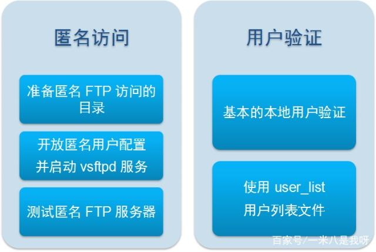

- [Linux如何搭建FTP服务器](#Linux如何搭建FTP服务器)
  - [一、vsftp服务基础](#一vsftp服务基础)
    - [1.FTP服务器概述](#1FTP服务器概述)
    - [2.FTP用户类型](#2FTP用户类型)
    - [3.FTP服务器软件的种类](#3FTP服务器软件的种类)
    - [4.FTP客户端工具的种类](#4FTP客户端工具的种类)
  - [二、vsftpd的配置文件](#二vsftpd的配置文件)
    - [1.常用的全局配置项](#1常用的全局配置项)
    - [2.常用的匿名FTP配置项](#2常用的匿名FTP配置项)
    - [3.常用的本地用户FTP配置项](#3常用的本地用户FTP配置项)
  - [三、基于系统用户的FTP服务](#三基于系统用户的FTP服务)
    - [1.匿名访问的ftp服务](#1匿名访问的ftp服务)
    - [2.用户验证的FTP服务](#2用户验证的FTP服务)
    - [3.vsftpd服务的其他常用配置](#3vsftpd服务的其他常用配置)

# Linux如何搭建FTP服务器

## 一、vsftp服务基础

构建FTP服务器之前，首先应对FTP的工作原理、服务器端软件有一个基本的认识。

### 1.FTP服务器概述

FTP服务器默认使用TCP协议的20、21端口与客户端进行通信。20端口用于建立数据连接，并传输文件数据；21端口用于建立控制连接，并传输FTP控制命令。根据FTP服务器在建立数据连接过程中的主、被动关系，FTP数据连接分为主动模式和被动模式，两者的含义及主要区别如下：

**主动模式**：服务器主动发起数据连接。首先由客户端向服务端的21端口建立FTP控制连接，当需要传输数据时，客户端以PORT命令告知服务器“我打开了某端口，你过来连接我”，于是服务器从20端口向客户端的该端口发送请求并建立数据连接。被动模式：服务器被动等待数据连接。如果客户机所在网络的防火墙禁止主动模式连接，通常会使用被动模式。首先由客户端向服务端21端口建立FTP控制连接，当需要传输数据时，服务器以PASV命令告知客户端“我打开了某个端口，你过来连接我”，于是客户端向服务器的该端口（非20）发送请求并建立数据连接。其实很好理解，说白了就像两个人谈恋爱还不敢让家里人知道一样，主动模式就是：好比男生和女生都在外地念书的时候，男生要约女生出去玩，男生肯定主动嘛，就说我们一起出去玩吧（就像控制连接，发出了一个指令），这时候女生可能就会看心情要不要答应他，如果女生答应了，告诉男生“我在老地方等你，你来老地方接我”（就像传输数据，也给出一个指令来表达是否拒绝），于是男生就接上女生一起出去玩了。

**被动模式**：男生女生放假了，回到了老家，都到了父母眼皮底下，这时候女生家教可能比较严或者传统，女孩家长不让女孩过早的谈恋爱，这时候女生就会跟男生说“放假期间别打电话或者发消息约我，等有机会我给你发消息，听我的指令行事，只有我给你发消息时你才能给我发消息，不然不要给我发消息”，这就像被动模式一样，男生就只能被动的等待女生的消息，不能擅自给女生发消息。

言归正传，当客户端与服务器建立好数据连接以后，就可以根据从控制连接中发送的FTP命令上传或下载文件了。在传输文件时，根据是否进行字符转换，分为文本模式和二进制模式。

**文本模式**：又称为ASCII（American Standard Code for Information Interchange，美国信息交换标准码）模式，这种模式在传输文件时使用ASCII标准字符序列，一般只用于纯文本文件的传输。二进制模式：又称为Binary模式，这种模式不会转换文件中的字符序列，更适合传输程序、图片等非纯文本字符的文件。使用二进制模式比文本模式更有效率，大多数FTP客户端工具可以根据文件类型自动选择文件传输模式，而无需用户手工指定。

### 2.FTP用户类型

**匿名用户**：anonymous 或 ftp，提供任意密码（包括空密码）都可以通过服务器的验证，一般用于提供公共文件的下载。本地用户：直接使用本机的系统用户，账号名称、密码等信息保存在 passwd、shadow 文件中。虚拟用户： 使用独立的账号/密码数据文件，将FTP账户与系统账户的关联性降至最低，可以为系统提供更好的安全性。

### **3.FTP服务器软件的种类**

在Windows系统中，常见的FTP服务器软件包括**FileZilla Sener、Serv-U、IIS**等；而在Linux系统中，**vsftpd**是目前在Linux/UNIX领域应用十分广泛的一款FTP服务软件。

Vsftpd服务的名称来源于“Very Secure FTP Daemon”，该软件针对安全性方面做了大量的设计。除了安全性以外，vsftpd在速度和稳定性方面的表现也相当突出，大约可以支持15000个用户并发连接。

### **4.FTP客户端工具的种类**

ftp命令程序：是最简单的FTP客户端工具，Windows和Linux都拥有ftp命令程序，可以连接到FTP服务器进行交互式的上传、下载通信。图形化FTP客户端工具：Windows中较常用的包括CuteFTP、FlashFXP、LeapFTP、Filezilla等，在图形化的客户端程序中，用户通过鼠标和菜单即可访问、管理FTP资源，而不需要掌握FTP交互命令，更易于使用。下载工具：FlashGet、Wget等，包括大多数网页浏览器程序，都支持通过FTP协议下载文件，但因不具备FTP上传管理功能，通常不称为FTP客户端工具。

## **二、vsftpd的配置文件**

以下我们将以系统中RPM方式安装vsftpd为例来学习FTP服务器的构建过程，例如：“rpm -ivh vsftpd-3.0.2-21.el7.x86_64.rpm（挂载光盘，在系统盘中的Packages目录下安装）”。

通过RPM方式安装的vsftpd软件包，将会自动添加名为vsftpd的系统服务，因此启动、停止vsftpd服务非常方便。以下为相关配置文件：

**服务名**：vsftpd

**主配置文件**：/etc/vsftpd.conf

用户控制列表文件

/etc/vsftpd.ftpusers：此文件中列出的用户将禁止登录vsftpd服务器，不管该用户是否在user_list文件中出现，相当于黑名单一样。默认已包括root、bin、daemon等用于系统运行的特殊用户。（应为这些用户太特殊，所以不让登录到vsftpd服务器，防止被人黑）

/etc/vsftpd.user_list：此文件中包含的用户可能被禁止登录，也可能被允许登录，具体取决于主配置文件vsftpd.conf中的设置。当存在“userlist_enable=YES”的配置项时，user_list列表文件方可生效；若指定“userlist_deny=YES”，则仅禁止此列表中的用户登录；若指定“userlist_deny=NO”，则仅允许列表中的用户登录。

**下面我们一起来了解一下主配置文件中常用到的配置项：**

### **1.常用的全局配置项**

```c
listen=YES：	// 是否以独立运行的方式监听服务
listen_address=192.168.4.1：	// 设置监听的 IP 地址
listen_port=21：	// 设置监听 FTP 服务的端口号
write_enable=YES：	// 是否启用写入权限
download_enable＝YES：// 是否允许下载文件
userlist_enable=YES：// 是否启用user_list 列表文件
userlist_deny=YES：// 是否禁用 user_list 中的用户
max_clients=0：// 限制并发客户端连接数
max_per_ip=0：	// 限制同一 IP 地址的并发连接数
```

### **2.常用的匿名FTP配置项**

```c
anonymous_enable=YES：	// 启用匿名访问
anon_umask=022：	// 匿名用户所上传文件的权限掩码
anon_root=/var/ftp：	// 匿名用户的 FTP 根目录
anon_upload_enable=YES：	// 允许上传文件
anon_mkdir_write_enable=YES：// 允许创建目录
anon_other_write_enable=YES：// 开放其他写入权
anon_max_rate=0：// 限制最大传输速率（字节/秒）
```

### **3.常用的本地用户FTP配置项**

```c
local_enable=YES：	// 是否启用本地系统用户local_umask=022：本地用户所上传文件的权限掩码
local_root=/var/ftp：// 设置本地用户的 FTP 根目录
chroot_local_user=YES：//是否将用户禁锢在主目录
local_max_rate=0：	//限制最大传输速率（字节/秒）以上列出的都是搭建vsftpd服务器时最常用到的配置项，理解并掌握这些配置项的含义，将更有利于快速部署和优化vsftpd服务器。
```

## **三、基于系统用户的FTP服务**

vsftpd服务可以使用Linux主机中的系统用户账号作为登录ftp的账号，包括匿名访问和用户验证两种形式。

图示：



### **1.匿名访问的ftp服务**

1) 安装vsftpd

```bash
sudo apt-get install vsftpd
service vsftpd start
```

2) 准备匿名 FTP 访问的目录

使匿名用户 FTP 对该目录有写入权限

```bash
sudo mkdir /var/ftp/pub
sudo chown ftp /var/ftp/pub/
```

3) 开放匿名用户配置，并启动 vsftpd 服务

```bash
sudo vim /etc/vsftpd.conf
anonymous_enable=YES	#允许匿名访问
local_enable=NO	#不启用本地用户
write_enable=YES #开放服务区的写权限，是全局性的选项，不管是匿名、本地还是虚拟用户
anon_umask=022 #上传数据的权限掩码
anon_upload_enable=YES #允许匿名上传
anon_mkdir_write_enable=YES	#允许匿名用户创建目录
dirmessage_enable=YES
```

```bash
#重启服务
service vsftpd restart
netstat -anpt | grep "vsftpd"
```

4) 测试匿名 FTP 服务器

```bash
ifconfig #在Linux中查看自己ip 
```

```bash
zhengdongqi@ubuntu:~$ ftp 192.168.2.164
Connected to 192.168.2.164.
220 (vsFTPd 3.0.3)
Name (192.168.2.164:zhengdongqi): ftp #用户名为ftp或anonymous
331 Please specify the password.
Password: #输入密码， 可以是空格，或者设置一个
230 Login successful.
Remote system type is UNIX.
Using binary mode to transfer files.
```

成功登录FTP服务器以后，在此操作界面中，可以执行实现各种FTP操作的交互指令，例如：cd：切换目录，dir/ls：查看目录，get：下载，put：上传等，执行？或help命令可以查看指令帮助。

### **2.用户验证的FTP服务**

vsftpd可以直接使用Linux主机的系统用户作为FTP账号，提供基于用户名/密码的登录验证。用户使用系统用户账号登录FTP服务器之后，将默认位于自己的宿主目录中，且在宿主目录中拥有读写权限。

1) 安装vsftpd

```bash
sudo apt-get install vsftpd
service vsftpd start
```

2) 配置用户验证的/etc/vsftpd.conf

```bash
sudo mkdir /home/uftp		#新建目录/home/uftp作为用户主目录
sudo useradd -d /home/uftp -s /bin/bash uftp #新建用户uftp，制定用户主目录和所用shell
sudo passwd uftp #设置密码
sudo chown uftp:uftp /home/uftp #将目录/home/uftp的所属者和所属组都改为uftp
sudo vim /etc/vsftpd.user_list #新建文件/etc/vsftpd.user_list，用于存放允许访问ftp的用户
sudo vim /etc/vsftpd.conf #编辑VSFTPD配置文件
```

```bash
local_enable=NO	#启用本地用户
write_enable=YES 	#开放服务区的写权限，是全局性的选项，不管是匿名、本地还是虚拟用户
userlist_file=/etc/vsftpd.user_list #添加用户信息
userlist_enable=YES #添加用户信息
userlist_deny=NO 	#添加用户信息
```

```bash
#重启服务
service vsftpd restart
```

```bash
#测试服务
zhengdongqi@ubuntu:~$ ftp 192.168.2.164
Connected to 192.168.2.164.
220 (vsFTPd 3.0.3)
Name (192.168.2.164:zhengdongqi): uftp #输入用户名
331 Please specify the password.
Password:		#输入密码
230 Login successful.
Remote system type is UNIX.
Using binary mode to transfer files.
```

3) 结合user_list文件灵活控制用户访问

先在user_list文件中添加希望登录的用户，然后再在配置文件中启用user_list用户列表，最后重启服务即可。

```bash
sudo vim /etc/vsftpd_list
dog #用户dog
pig #用户pig
pet #用户pet
```

**修改了配置后一定要重启服务**

### **3.vsftpd服务的其他常用配置**

1）修改 vsftpd 服务的监听地址、端口

```bash
sudo vim /etc/vsftpd.conf
......
listen=YES	#允许独立监听服务
listen_address=192.168.2.164 #只在一个接口监听服务
listen_port=2121 #监听端口改为2121
systemctl reload vsftpd	#重载服务
```

2）允许使用 FTP 服务器的被动模式

```bash
sudo vim /etc/vsftpd.conf
......
pasv_enable=YES	#允许被动模式连接
pasv_min_port=24500	#指定被动模式的下限端口
pasv_max_port=24600	#指定被动模式的上限端口

#重载服务
systemctl reload vsftpd
```

3）限制 FTP 连接的并发数、传输速率

```bash
sudo vim /etc/vsftpd.conf
max_clients=20 #限制并发客户连接最多20个
max_per_ip=2 #限制每个IP地址的连接数最多两个
anon_max_rate=50000	#限制匿名用户传输速率为50KB/S
local_max_rate=200000	#限制本地用户传输速录为200KB/S

#重载服务
systemctl reload vsftpd					
```