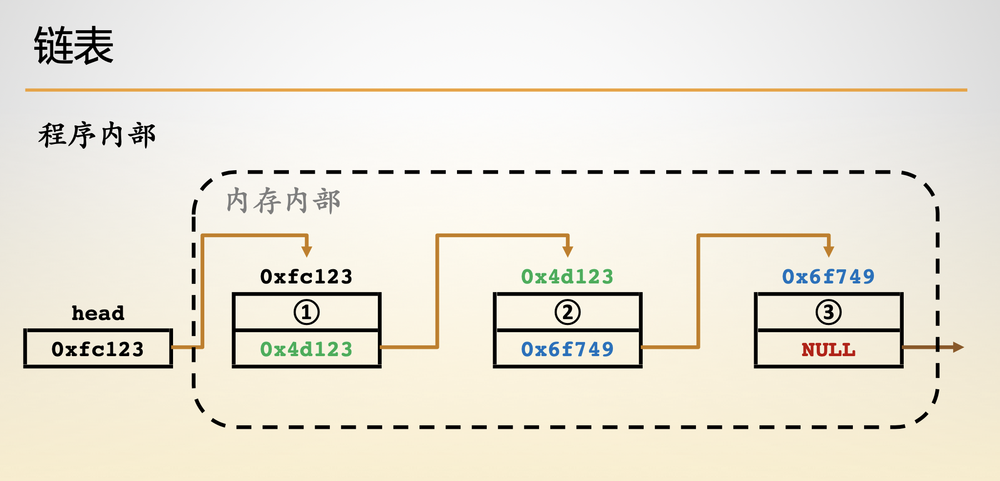
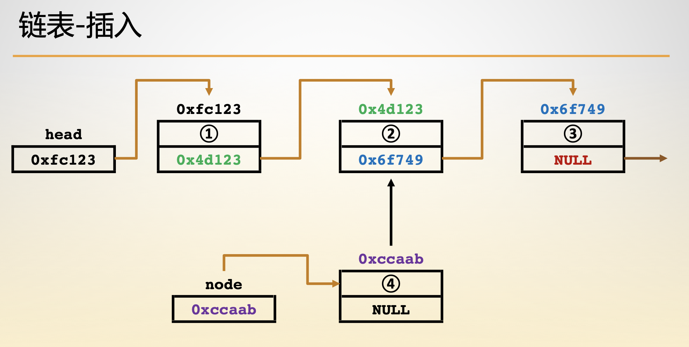
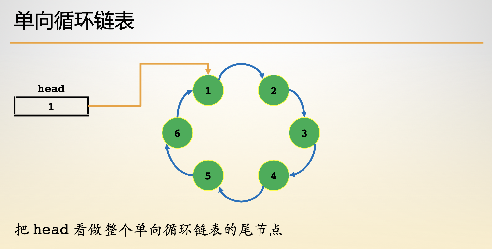

- [链表结构](#链表结构)
- [链表构建](#链表构建)
- [链表插入](#链表插入)
- [链表遍历](#链表遍历)
- [链表删除](#链表删除)
- [链表反转](#链表反转)


## 链表结构

- 申请零散的内存片段，来存放数据。不能随机访问，必须要有一个领头人。时间复杂度 O(n)

    - 构造、插入、查找、删除、遍历、反转
    - leetcode19、24、83、141、160、202、203、206、234、237

- 双向链表

    - 每个链表包含两个指针，分别指出节点的直接前驱和直接后继。

- 循环链表

    - 把Head看成是整个循环链表的尾节点

- 静态链表

    - 借助数组来描述储存链表的线性结构

```c
typedef struct LinkListNode {
    int data;
    struct LinkListNode *next;
} LinkListNode;

typedef struct LinkList {
    LinkListNode head;
    int length;
} LinkList;
```


## 链表构建



```c
LinkListNode *getNewNode(int val) {
    LinkListNode *p = (LinkListNode *)malloc(sizeof(LinkListNode));
    p->data = val;
    p->next = NULL;
    return p;
}

LinkList *getNewList() {
    LinkList *l = (LinkList *)malloc(sizeof(LinkList));
    l->head.next = NULL;
    l->length = 0;
    return l;
}
```


## 链表插入

1. 定义一个用于遍历的变量，初始指向头结点。
2. 输出遍历变量所在结点的值，并更新遍历变量为当前结点的下一个结点。
3. 重复操作 2，直到遍历完所有结点。



```c
int insert(LinkList *l, int ind, int val) {
    if (ind < 0 || ind > l->length) return 0;
    LinkListNode *p = &(l->head), *new_node = getNewNode(val);
    while (ind--) p = p->next;
    new_node->next = p->next;
    p->next = new_node;
    l->length += 1;
    return 1;
}
```


## 链表遍历

1. 定义一个用于遍历的变量，初始指向头结点。
2. 输出遍历变量所在结点的值，并更新遍历变量为当前结点的下一个结点。
3. 重复操作 2，直到遍历完所有结点。



```c
void output(LinkList *l) {
    printf("\033[31mhead\033[0m -> ");
    LinkListNode *p = l->head.next;
    while (p) {
        printf("\033[33m%d\033[0m -> ", p->data);
        p = p->next;
    }
    printf("\033[31mNULL\033[0m\n");
    return ;
}
```


## 链表删除

1. 从表头遍历找到要删除的位置。
2. 令删除位置前一个结点的next指针指向待删除位置后一个结点。
3. 删除结点。

```c
int delete(LinkList *l, int ind) {
    if (ind < 0 || ind > l->length) return 0;
    LinkListNode *p = &(l->head), *delete_node;
    while (ind--) p = p->next;
    delete_node = p->next;
    p->next = delete_node->next;
    free(delete_node);
    l->length -= 1;
    return 1;
}
```


## 链表反转

1. 定义一个用于遍历的指针，初始指向头结点后一个结点。
2. 让头结点的 next 指针置空。
3. 从当前遍历指针所指的结点开始遍历链表，将遍历到的结点 next 指针指向头结点。遍历过程中借助另外一个指针保存下一个遍历到的结点。
4. 重复步骤 3 直至表尾，此时新的链表就是原链表反转后的链表。

```c
LinkList *reverse(LinkList *l) {
    LinkListNode *new = l->head.next, *p, *q;
    p = new;
    new = NULL;
    while (p) {
        q = p->next;
        p->next = new;
        new = p;
        p = q;
    }
    l->head.next = new;
    return l;
}
```


## 链表排序

```c
LinkList *sort(LinkList *l) {
    LinkListNode *p, *end = NULL;
    while (end != p) {
        p = l->head.next;
        while (p->next != end) {
            if (p->data > p->next->data) {
                p->data ^= p->next->data;
                p->next->data ^= p->data;
                p->data ^= p->next->data;
            }
            p = p->next;
        }
        end = p;
    }
    l->head.next = p;
    return l;
}
```


## 链表去重

```c
LinkList *unique(LinkList *l) {
    LinkListNode *p, *q;
    p = l->head.next;
    while (p) {
        if (p->next == NULL) break;
        if (p->data == p->next->data) {
            q = p->next->next;
            free(p->next);
            p->next = q;
        } else {
            p = p->next;
        }
    }
    l->head.next = p;
    return l;
}
```


## 链表判环

```c
/**
* 已经定义的 ListNode 结点
* typedef struct Node {
*     int val;
*     struct Node *next;
* } ListNode;
* #define bool int
* #define true 1
* #define false 0
*/
bool isLinkedListCycle(ListNode *head) {
    ListNode *p, *q;
    p = q = head;
    while (q && q->next) {
        p = p->next;
        q = q->next;
        q = q->next;
        if (p == q) {
            return true;
        }
    }
    return false;
}
```


## 链表环长

```c
/**
* 已经定义的 ListNode 结点
* typedef struct Node {
*     int val;
*     struct Node *next;
* } ListNode;
*/
int linkedListCycleLength(ListNode *head) {
    ListNode *p, *q;
    p = q = head;
    while (q && q->next) {
        p = p->next;
        q = q->next->next;
        if (p == q) {
            break;
        }
    }
    if (p != q) return 0;
    int n = 0;
    do {
        q = q->next;
        n++;
    } while (p != q);
    return n;
}
```


## 链表环点

```c
/**
 * 已经定义的 ListNode 结点
 * typedef struct Node {
 *     int val;
 *     struct Node *next;
 * } ListNode;
 */
ListNode* linkedListCycleLinkedNode(ListNode *head) {
    ListNode *p, *q;
    if (head == NULL) return NULL;
    p = q = head;
    do {
        p = p->next;
        q = q->next;
        if (q == NULL) break;
        q = q->next;
        if (q == NULL) break;
    } while (p != q);
    if (q == NULL) return NULL;
    int cnt = 0;
    do {
        p = p->next;
        q = q->next->next;
        ++cnt;
    } while (p != q);
    p = q = head;
    while (cnt--) {
        q = q->next;
    }
    while (p != q) {
        p = p->next;
        q = q->next;
    }
    return p;
}
```


## 双向链表反转

```c
/**
 * 已经定义的 ListNode 结点
 * typedef struct Node {
 *     int val;
 *     struct Node *pre;
 *     struct Node *next;
 * } ListNode;
 */
ListNode* reverseLinkedList(ListNode *head) {
    ListNode *p, *temp;
    p = head;
    while (1) {
        temp = p->next;
        p->next = p->pre;
        p->pre = temp;
        if (p->pre == NULL) break;
        p = p->pre;
    }
    return p;
}
```


## 双向链表去重

```c
/**
 * 已经定义的 ListNode 结点
 * typedef struct Node {
 *     int val;
 *     struct Node *pre;
 *     struct Node *next;
 * } ListNode;
 */
 
ListNode *deleteValNode(ListNode *head, int val) {
    if (head == NULL) return NULL;
    ListNode *virtualHead = (ListNode *)malloc(sizeof(ListNode));
    ListNode *p, *q;
    virtualHead->next = head;
    virtualHead->pre = NULL;
    head->pre = virtualHead;
    p = head;
    while (p) {
        if (p->val == val) {
            if (p->next != NULL) {
                p->next->pre = p->pre;
            }
            p->pre->next = p->next;
            q = p;
            p = p->next;
            free(q);
        } else {
            p = p->next;
        }
    }
    head = virtualHead->next;
    if (head != NULL) {
        head->pre = NULL;
    }
    free(virtualHead);
    return head;
}
 
ListNode* twoWayLinkListUnique(ListNode *head) {
    if (head == NULL) return NULL;
    ListNode *p, *q;
    p = head;
    while (p) {
        q = deleteValNode(p->next, p->val);
        if (q != NULL) {
            q->pre = p;
        }
        p->next = q;
        p = p->next;
    }
    return head;
}
```


## 合并两个有序链表

```c
/**
 * 已经定义的 ListNode 结点
 * typedef struct Node {
 *     int val;
 *     struct Node *next;
 * } ListNode;
 */
ListNode* mergeTwoSortedLinkList(ListNode *head1, ListNode *head2) {
    ListNode *p[2], *q, *ret;
    ret = (ListNode *)malloc(sizeof(ListNode));
    p[0] = head1;
    p[1] = head2;
    q = ret;
    int ind;
    while (p[0] != NULL || p[1] != NULL) {
        if (p[1] == NULL) {
            ind = 0;
        } else if (p[0] == NULL) {
            ind = 1;
        } else {
            ind = (p[0]->val < p[1]->val ? 0 : 1);
        }
        q->next = p[ind];
        p[ind] = p[ind]->next;
        q = q->next;
        q->next = NULL;
    }
    q = ret->next;
    free(ret);
    return q;
}
```


## 找出两个链表的交点

```c
/**
 * 已经定义的 ListNode 结点
 * typedef struct Node {
 *     int val;
 *     struct Node *next;
 * } ListNode;
 */
int getLastNode(ListNode *head, ListNode **p) {
    *p = NULL;
    if (head == NULL) {
        return 0;
    }
    int cnt = 1;
    *p = head;
    while ((*p)->next != NULL) {
        ++cnt;
        (*p) = (*p)->next;
    }
    return cnt;
}
 
ListNode* findIntersectionListNode(ListNode *head1, ListNode *head2) {
    ListNode *p[2];
    int cnt[2], sub;
    cnt[0] = getLastNode(head1, &p[0]);
    cnt[1] = getLastNode(head2, &p[1]);
    if (p[0] != p[1]) return NULL;
    p[0] = cnt[0] <= cnt[1] ? head1 : head2;
    p[1] = cnt[0] > cnt[1] ? head1 : head2;
    sub = abs(cnt[0] - cnt[1]);
    while (sub--) {
        p[1] = p[1]->next;
    }
    while (p[0] != p[1]) {
        p[0] = p[0]->next;
        p[1] = p[1]->next;
    }
    return p[0];
}
```

