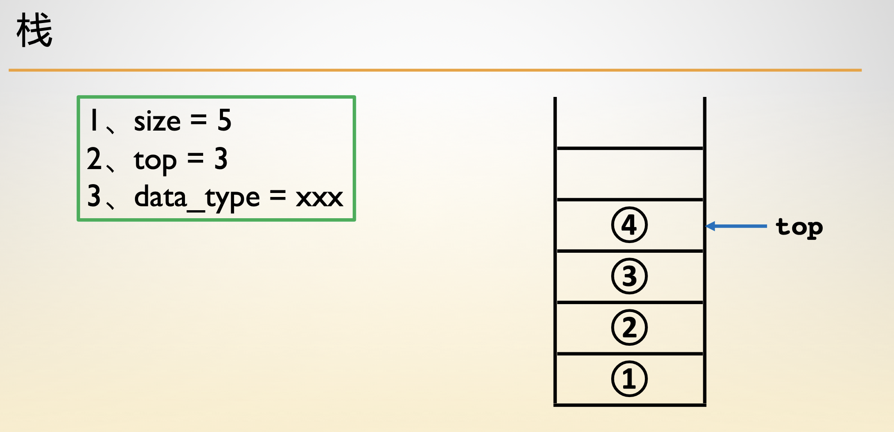
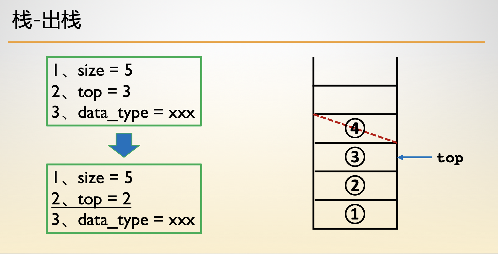
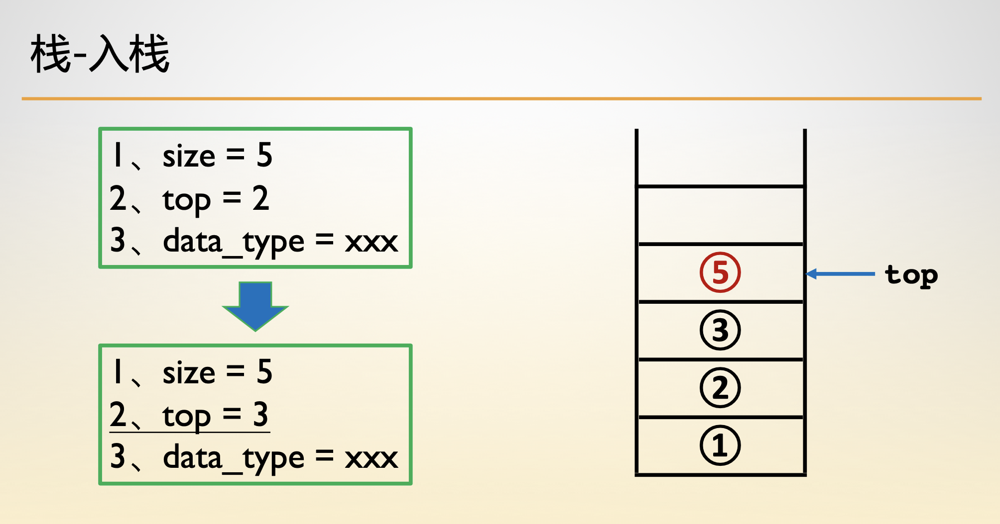
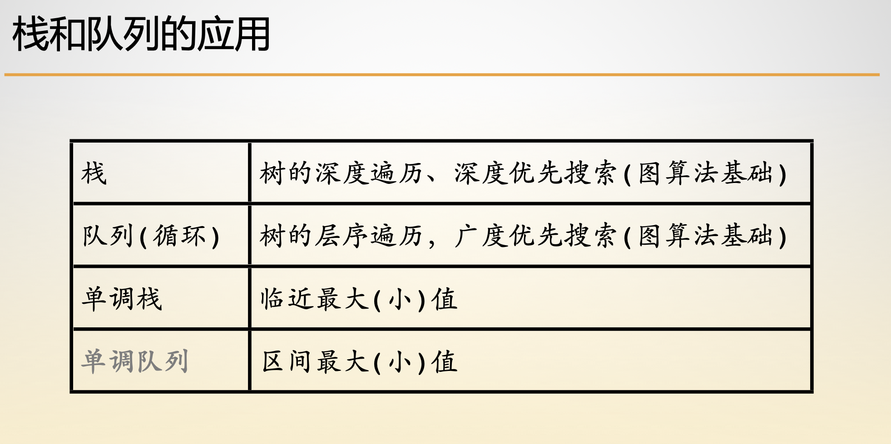

- [栈的结构](#栈的结构)
- [栈的构建](#栈的构建)
- [出栈操作](#出栈操作)
- [入栈操作](#入栈操作)
- [队列和栈的应用](#队列和栈的应用)


## 栈的结构

- 死胡同， FILO(first in last out)。时间复杂度 O(n)

    - 初始化、判空、入栈、遍历、出栈、栈头
    - leetcode20、42、84、225、232

- 单调栈：如果栈中没有答案， 栈外也没有答案。维护最近最值

    - 最近最大 ： 升序排列
    - 最近最小 ： 降序排列

```c
typedef struct Stack {
    int *data;
    int top, length;
} Stack;
```


## 栈的构建



```c
Stack *init(int n) {
    Stack *s = (Stack *)malloc(sizeof(Stack));
    s->data = (int *)malloc(sizeof(int) * n);
    s->top = -1;
    s->length = n;
    return s;
}
```


## 出栈操作



```c
void pop(Stack *s) {
    if (empty(s)) return;
    s->top -= 1;
    return ;
}
```


## 入栈操作



```c
void push(Stack *s, int val) {
    if (s->top == s->length - 1) return ;
    s->top += 1;
    s->data[s->top] = val;
    return ;
}
```


## 队列和栈的应用




## 括号匹配

```c
/** Pair 的定义如下
 * typedef struct {
 *     int first, second;
 * } Pair;
 */
typedef struct {
    int *arr;
    int top, max_len;
} Stack;
 
int initStack(Stack *, int);
int pushStack(Stack *, int);
int seekStack(Stack *);
int popStack(Stack *);
int emptyStack(Stack *);
int destroyStack(Stack *);
 
Pair* bracketsPairs(char *str) {
    int len = strlen(str);
    if (len % 2) return NULL;
    Pair *ret = (Pair *)malloc(len / 2 * sizeof(Pair));
    Stack s;
    int ind = 1, retind = 0;
    int flag = 1;
    initStack(&s, len / 2);
    while (str[ind - 1] && flag) {
        switch (str[ind - 1]) {
            case '(':
                pushStack(&s, ind);
                break;
            case ')':
                if (emptyStack(&s)) {
                    flag = 0;
                    break;
                }
                ret[retind].first = popStack(&s);
                ret[retind].second = ind;
                ++retind;
                break;
            default :
                printf("ERROR\n");
                break;
        }
        ++ind;
    }
    destroyStack(&s);
    if (flag == 0) {
        free(ret);
        return NULL;
    }
    return ret;
}
 
int initStack(Stack *s, int size) {
    s->arr = (int *)malloc(size * sizeof(int));
    if (s->arr == NULL) return 0;
    s->max_len = size;
    s->top = size;
    return 1;
}
 
int pushStack(Stack *s, int a) {
    if (s->top <= 0) return 0;
    --(s->top);
    s->arr[s->top] = a;
    return 1;
}
 
int seekStack(Stack *s) {
    if (!emptyStack(s)) {
        return s->arr[s->top];
    }
    return -1;
}
 
int popStack(Stack *s) {
    if (!emptyStack(s)) {
        ++(s->top);
        return s->arr[s->top - 1];
    }
    return -1;
}
 
int emptyStack(Stack *s) {
    return (s->top == s->max_len);
}
 
int destroyStack(Stack *s) {
    s->top = s->max_len = 0;
    free(s->arr);
    s->arr = NULL;
    return 1;
}
```


## 网页跳转

```c
#include <stdlib.h>
 
typedef struct {
    char **arr;
    int top, max_len;
} Stack;
 
int initStack(Stack *);
int pushStack(Stack *, char *);
char *popStack(Stack *);
int emptyStack(Stack *);
int destroyStack(Stack *);
 
Stack back_stack;
Stack forward_stack;
char nowUrl[1000];
char ignore[7] = "Ignore";
 
void initData() {
    fflush(stdout);
    static int flag = 1;
    if (flag) {
        initStack(&back_stack);
        initStack(&forward_stack);
        nowUrl[0] = '\0';
        flag = 0;
    }
}
 
char* visitPage(char *url) {
    initData();
    while (!emptyStack(&forward_stack)) {
        free(popStack(&forward_stack));
    }
    if (nowUrl[0] != '\0') {
        pushStack(&back_stack, nowUrl);
    }
    strcpy(nowUrl, url);
    return url;
}
 
char* back() {
    initData();
    char *temp = popStack(&back_stack);
    if (temp != NULL) {
        pushStack(&forward_stack, nowUrl);
        strcpy(nowUrl, temp);
    } else {
        temp = ignore;
    }
    return temp;
}
 
char* forward() {
    initData();
    char *temp = popStack(&forward_stack);
    if (temp != NULL) {
        pushStack(&back_stack, nowUrl);
        strcpy(nowUrl, temp);
    } else {
        temp = ignore;
    }
    return temp;
}
 
int initStack(Stack *s) {
    s->arr = (char **)malloc(1 * sizeof(char *));
    s->max_len = 1;
    s->top = 0;
    return 1;
}
 
int pushStack(Stack *s, char *a) {
    if (s->arr == NULL) return 0;
    if (s->top == s->max_len) {
        s->arr = (char **)realloc(s->arr, s->max_len * 2 * sizeof(char *));
        if (s->arr == NULL) return 0;
        s->max_len *= 2;
    }
    char *temp = (char *)malloc(strlen(a) + 1);
    strcpy(temp, a);
    s->arr[s->top++] = temp;
    return 1;
}
 
char *popStack(Stack *s) {
    if (!emptyStack(s)) {
        --(s->top);
        return s->arr[s->top];
    }
    return NULL;
}
 
int emptyStack(Stack *s) {
    return !(s->top);
}
```


## 单调栈维护最小值

```c
typedef struct {
    int *arr;
    int top, max_len;
} Stack;
 
int initStack(Stack *);
int pushStack(Stack *, int);
int popStack(Stack *);
int seekStack(Stack *);
int emptyStack(Stack *);
 
int* stackMinimumValues(char **operation, int *value, int length) {
    int *ans = malloc(sizeof(int) * length);
    Stack main_stack;
    Stack min_stack;
    initStack(&main_stack);
    initStack(&min_stack);
    int i;
    for (i = 0; i < length; ++i) {
        switch (operation[i][1]) {
            case 'u' :
                pushStack(&main_stack, value[i]);
                if (emptyStack(&min_stack) || seekStack(&min_stack) >= value[i]) {
                    pushStack(&min_stack, value[i]);
                }
                ans[i] = seekStack(&min_stack);
                break;
            case 'o' :
                if (popStack(&main_stack) == seekStack(&min_stack)) {
                    popStack(&min_stack);
                }
                ans[i] = seekStack(&min_stack);
                break;
            default :
                printf("ERROR\n");
                break;
        }
    }
    return ans;
}
 
int initStack(Stack *s) {
    int bsize = 30;
    s->arr = (int *)malloc(bsize * sizeof(int));
    s->max_len = bsize;
    s->top = 0;
    return 1;
}
 
int pushStack(Stack *s, int a) {
    if (s->arr == NULL) return 0;
    if (s->top == s->max_len) {
        s->arr = (int *)realloc(s->arr, s->max_len * 2 * sizeof(int));
        if (s->arr == NULL) return 0;
        s->max_len *= 2;
    }
    s->arr[s->top++] = a;
    return 1;
}
 
int popStack(Stack *s) {
    if (!emptyStack(s)) {
        --(s->top);
        return s->arr[s->top];
    }
    return 0;
}
 
int seekStack(Stack *s) {
    if (!emptyStack(s)) {
        return s->arr[s->top - 1];
    }
    return 0;
}
 
int emptyStack(Stack *s) {
    return !(s->top);
}
```

