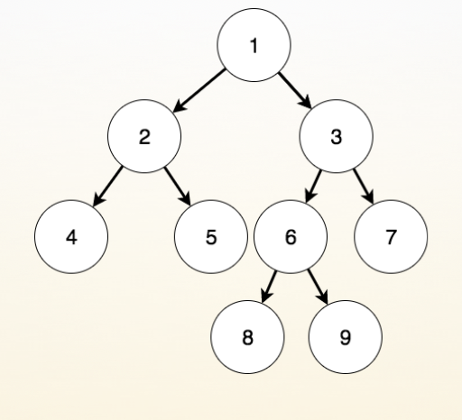
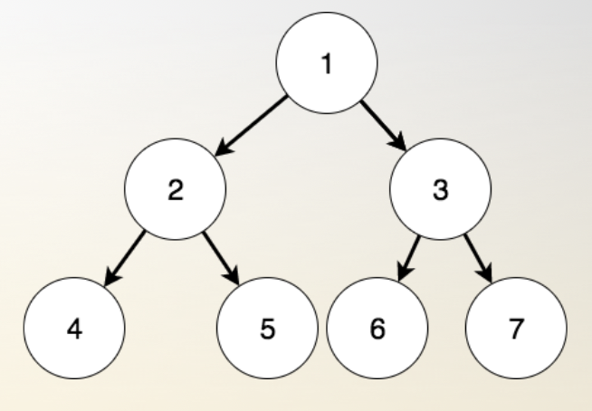
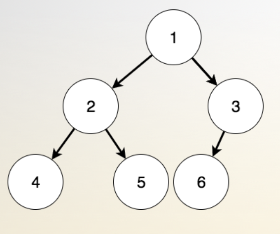

* [二叉树定理](#二叉树定理)
    * [二叉树](#二叉树)
    * [满二叉树](#满二叉树)
    * [完美二叉树](#完美二叉树)
    * [完全二叉树](#完全二叉树)
    * [哈夫曼树](#哈夫曼树)
* [前中后序遍历](#前中后序遍历)
    * [递归版](#递归版)
    * [迭代版](#迭代版)

# 二叉树定理

### 二叉树

- 倒着长的树， 时间复杂度 O(logn)

    - 度：节点拥有的子树个数
    - 叶子节点：度为0的节点
    - 创建结构体：data, *lchild, *rchild

    - 存储
- 遍历 ： 知二得其一

    - 先序:根左右

        - 中序:左根右

        - 后序:左右根

    - 广义表

    - leetcode100、101、102、104、107、110、111、112、226、235、257、297

### 满二叉树

- 没有度为1的节点
- 

### 完美二叉树

- 树是满的，而且二叉
- 

### 完全二叉树

- 树的倒数第二层之前是完美的， 最后一层左节点对齐
- 

### 哈夫曼树

- 统计每种字母在字符串中出现的频率，根据频率建立一颗路径带权的二叉树，树上的每个节点存储字母出现的频率，根节点到节点的路径即是字母的编码。

    - 步骤1:从集合里取出两个根结点权值最小的树 a 和 b, 构造出一棵新的二叉树 c, 二叉树 c 的左右子树分别是 a 和 b。

    - 步骤2:将二叉树 a 和 b 从集合里删除, 把二叉树 c 加入集合里。

    - 步骤3:重复以上两个步骤,直到集合里只剩下一棵二叉树,最后剩下的就是哈夫曼树了。

# 前中后序遍历

* **前序**遍历：根->左->右
* **中序**遍历：左->根->右
* **后序**遍历：左->右->根

假设树节点的定义如下：

```c++
typedef struct Node {
    int key;
    struct Node *lchild, *rchild;
} Node;
```


### 递归版

```c
void pre_order(Node *tree) {
    if (tree == NULL) return ;
    printf("%d ", tree->key);
    pre_order(tree->lchild);
    pre_order(tree->rchild);
    return ;
}

void in_order(Node *tree) {
    if (tree == NULL) return ;
    in_order(tree->lchild);
    printf("%d ", tree->key);
    in_order(tree->rchild);
    return ;
}

void post_order(Node *tree) {
    if (tree == NULL) return ;
    post_order(tree->lchild);
    post_order(tree->rchild);
    printf("%d ", tree->key);
    return ;
}
```


### 迭代版

需要使用一个栈作为辅助空间

```c++
// 前序遍历
void preorderTraversalIteration(TreeNode *root) {
    stack<TreeNode*> st;
    if (root)
        st.push(root);

    while(!st.empty()) {
        TreeNode *nd = st.top();
        st.pop();

        cout << nd->val << " "; // 操作当前节点

        if (nd->right)
            st.push(nd->right);
        if (nd->left)
            st.push(nd->left);
    }
}

// 中序遍历：
void inorderTraversalIteration(TreeNode *root) {
    stack<TreeNode*> st;

    TreeNode *curr = root;

    while (curr || !st.empty()) {
        if (curr) {
            st.push(curr);
            curr = curr->left;
        } else {
            curr = st.top();
            st.pop();

            cout << curr->val << " "; // 操作当前节点

            curr = curr->right;
        }
    }
}

// 后序遍历
void postorderTraversalIteration(TreeNode *root) {
    stack<TreeNode*> st;
    TreeNode *pre;

    if (root)
        st.push(root);

    while (!st.empty()) {
        TreeNode *nd = st.top();
        /*
         * 出栈条件：
         * 对于叶子节点：直接弹出
         * 对于非叶子节点：如果已经遍历过其左子节点或右子节点，则弹出
         */
        if ((!nd->left && !nd->right) || (pre && (nd->left == pre || nd->right == pre))) {
            st.pop();
            cout << nd->val <<" "; // 操作当前节点
            pre = nd;
        } else { // 说明是一个非叶子节点，并且还未访问其左右孩子
            if (nd->right)
                st.push(nd->right);
            if (nd->left)
                st.push(nd->left);
        }
    }
}
```

对于后序遍历，由于其访问序列为：左->右->根。因此还有一种方法，可以按类似前序遍历的方式：根->右->左，然后对得到的结果反序
