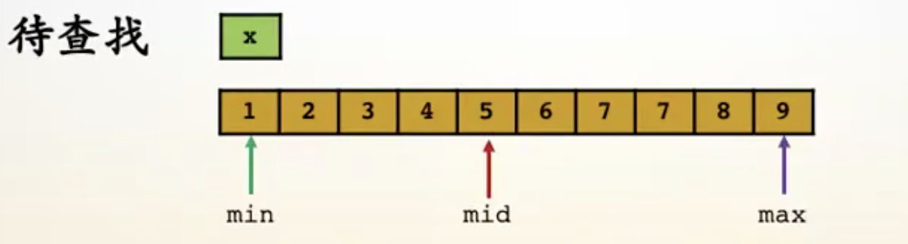
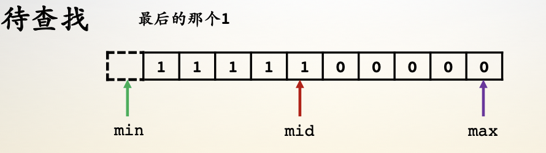
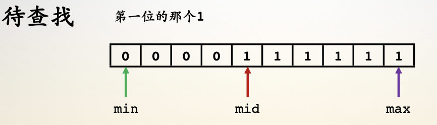
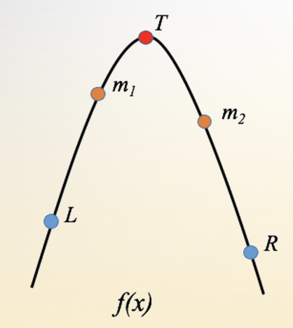

- [二分查找](#二分查找)
- [三分查找](#三分查找)

## 二分查找

- 正常情况

    - min是头指针；max是尾指针；mid =（min + max）/ 2
    - 终止条件：min  >= max
    - 如果 arr[mid]  <  x, min  =  mid  +  1 
    - 如果 arr[mid]  >  x, max =  mid  +   1
    - 如果 arr[mid]  == x, 找到结果
    - 

- 特殊情况1

    - min 是头指针， max是尾指针；mid =（mid  + max）/  2
    - 如果 arr[mid]  == 1,  min = mid 
    - 如果 arr[mid]  !=  1, max  = mid -   1
    - 如果 min == max，找到结果
    - 

- 特殊情况2

    - min 是头指针， max是尾指针；mid= （mid  + max）/  2
    - 如果 arr[mid] ==  1, min = mid  + 1
    - 如果 arr[mid] !=  1, max = mid - 1
    - 如果 min == max,  找到结果
    - 

- LeetCode35、278、374、378

## 三分查找

- [ L , R ] 是查找范围
- m1 是  [ L , R ] 的 1 / 3处
- m1 是  [  L , R ] 的 2 / 3处
- 如果 f[m1] < f[m2],  L = m1
- 如果 f[m2] <= f[m1], R = m2
- 如果 |m1 - m2| < exp, 找到结果
- 