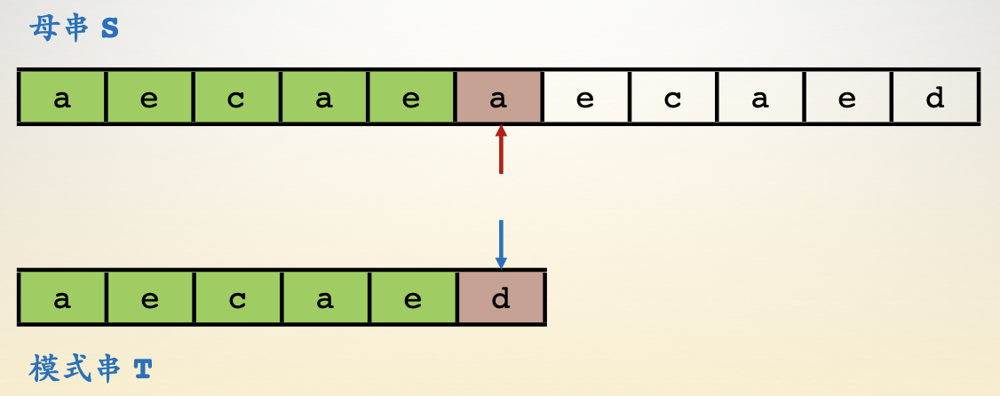
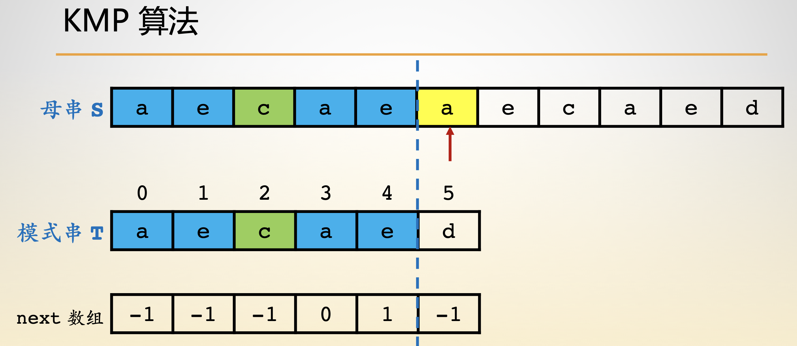
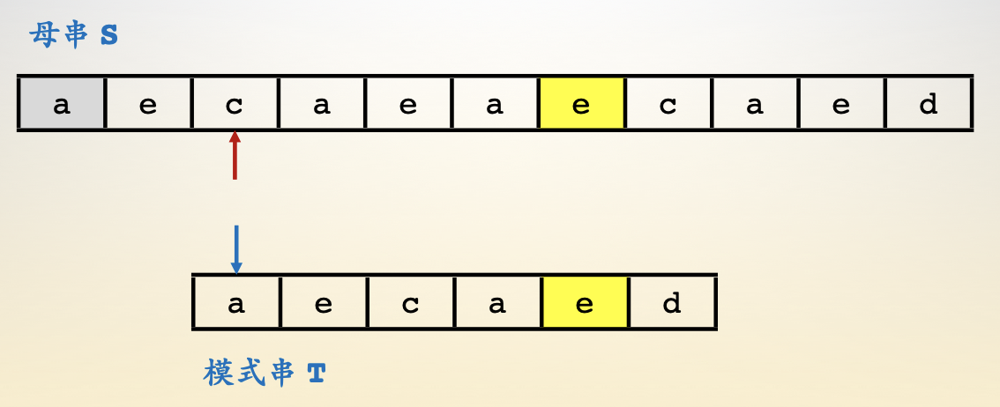
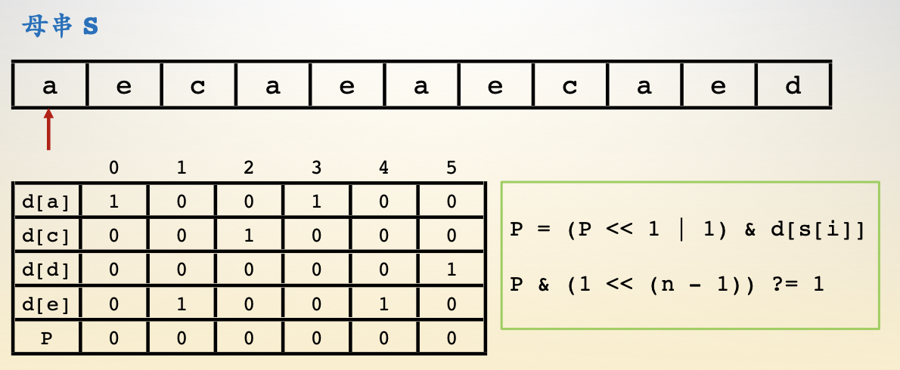
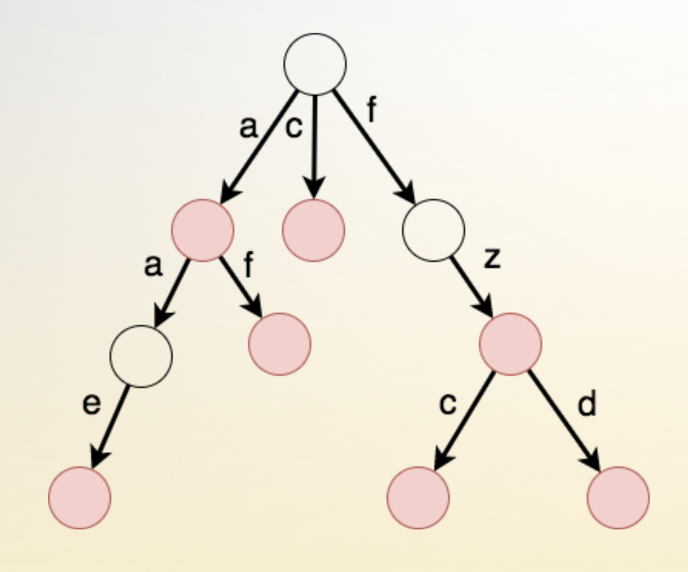
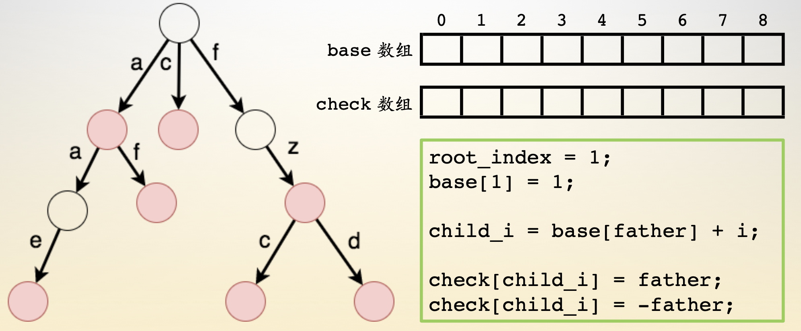

- [暴力算法](#暴力算法)
- [KMP算法](#KMP算法)
- [Sunday算法](#Sunday算法)
- [Shfit-And算法](#Shfit-And算法)
- [字典树](#字典树)
- [双数组字典树](#双数组字典树)
- [AC自动机](#AC自动机)

## 暴力算法

- 暴力枚举，时间复杂度O(n * m)
- n 表示母串或文本串元素个数；m  表示模式串元素个数
- 

## KMP算法

- 寻找文本串任意字符所能匹配的模式串的最长前缀，时间复杂度O(n + m)
- n 表示母串或文本串元素个数；m  表示模式串元素个数
- next数组：代表了模式串中互相匹配的子串 【Tb】 对应的 【Ta】 的元素下标。
- 注意：假设模式串最前面又一个虚拟标记 【-1】 它可以匹配所有字符
- 

## Sunday算法

- 最适用与查找文章字符串，时间复杂度O(n / m)
- n 表示母串或文本串元素个数；m  表示模式串元素个数
- 找到文本串中与模式串匹配失效后的下一位元素
- 找到元素在模式串中最后一次出现的位置，进行对齐
- 回到模式串头部进行匹配，如果匹配失效
- 重复上述步骤，直到匹配成功
- 

## Shfit-And算法

- 通过位运算进行状态转换，时间复杂度O(n * m / k),
- n 表示母串或文本串元素个数；m  表示模式串元素个数
- K表示模式串能表示多少位整型
- 数组 d【i】为字符 i 是否出现 0 未出现， 1 出现
- 数组 P【i】的第 i 位为 1 代表母串的第i个元素往前找，能够找到模式串的哪些前缀
- 

## 字典树

- 节点是一个集合，边代表关系。 时间复杂度O(n)
- 红色节点代表此集合中有以此前缀为单词的词
- 缺点浪费存储空间
- 

## 双数组字典树

- base数组代表父节点记录的孩子的住处，即父节点找子节点
- check数组代表孩子记录的父节点的坐标，即给孩子做亲子鉴定
- check数组为负数代表该节点独立成词
- 

## AC自动机

- 