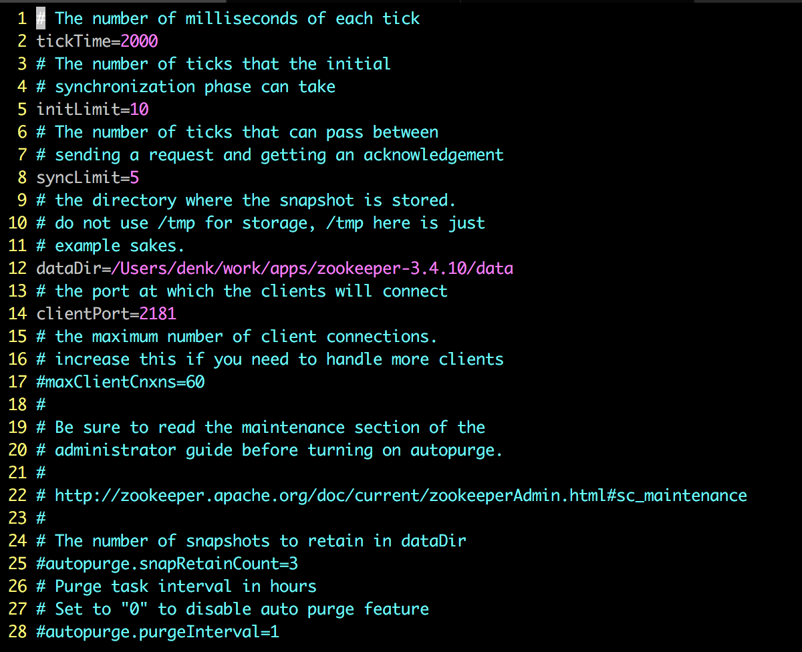

# Mac配置zookeeper

- brew安装

     ```bash
     brew install zookeeper
     ```

脚本和配置执行路径跟官方下载有所不同

```
/usr/local/Cellar/zookeeper/3.4.10/bin/ -------启动文件
/usr/local/etc/zookeeper/ ---------配置文件
```

其他使用方法一样
详细说明参考：[官方文档](http://zookeeper.apache.org/doc/r3.4.12/zookeeperStarted.html)

- 操作

     ```bash
     zKserver start --------启动服务端 这点与Linux不同
     zKserver stop --------停止服务端
     ```

     其它操作与官网一样

#### 配置文件说明

1. 文件名可以任意，不是非得改为zoo.cfg
2. tickTime: zookeeper中使用的基本时间单位, 毫秒
3. dataDir: 内存数据快照的保存目录；如果没有自定义Log也使用该目录
4. clientPort: 监听Cli连接的端口号

