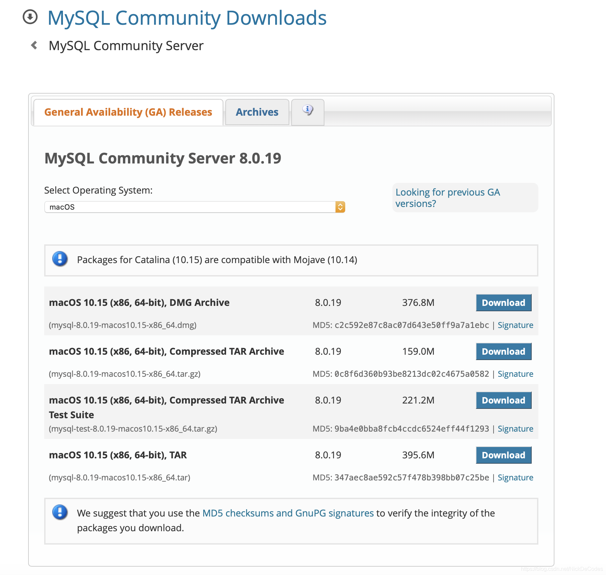
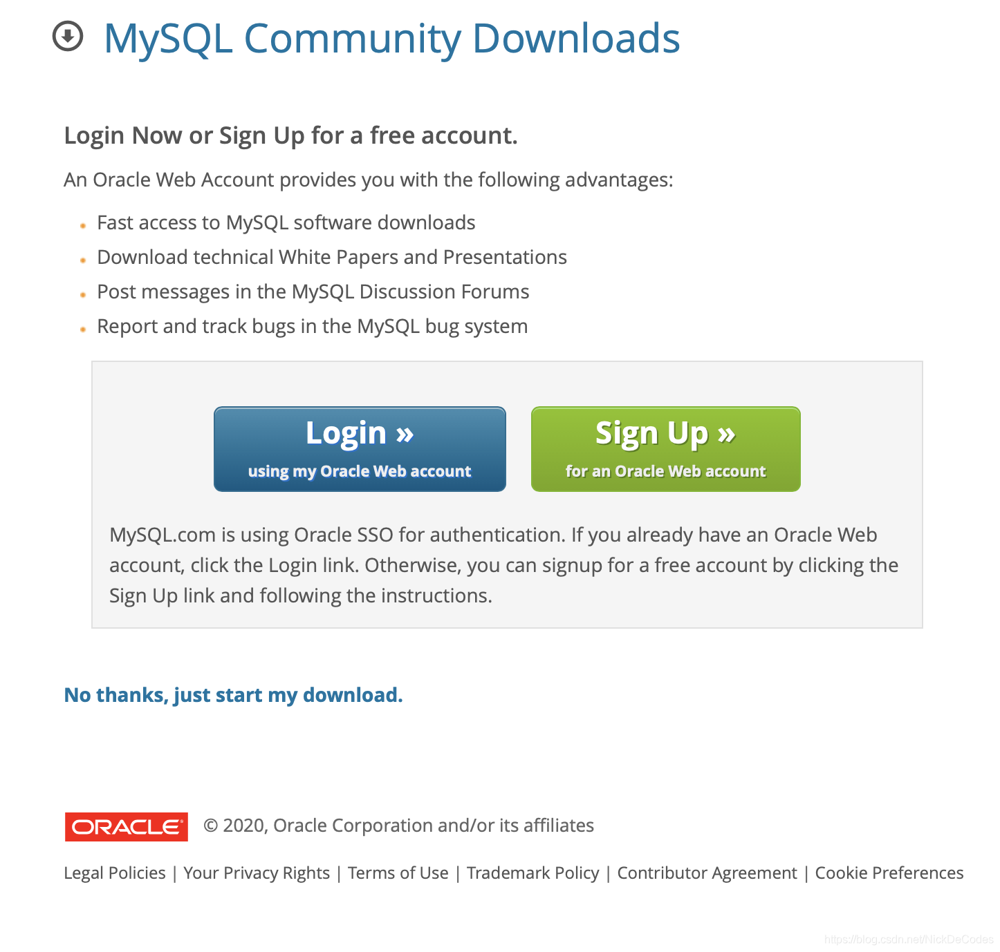
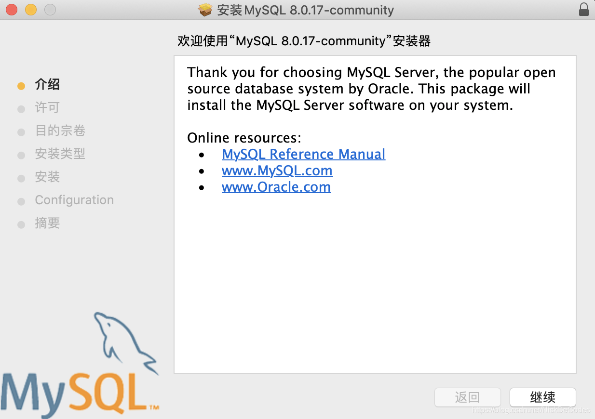

# Mysql for Mac配置安装
## mysql卸载

- 首先如果之前呢下载了mysql却没有配置好的小萌新们，给大家介绍一下彻底卸载mysql，避免安装时出现问题

```shell
执行下列命令

sudo rm /usr/local/mysql
sudo rm -rf /usr/local/mysql*
sudo rm -rf /Library/StartupItems/MySQLCOM
sudo rm -rf /Library/PreferencePanes/My*
rm -rf ~/Library/PreferencePanes/My*
sudo rm -rf /Library/Receipts/mysql*
sudo rm -rf /Library/Receipts/MySQL*
sudo rm -rf /var/db/receipts/com.mysql.*
其实不同的安装方式有些东西的存储位置不一样，删除完检查一下下面这些文件是否删除了，没有的话则删除掉：

/usr/local/Cellar 里的mysql文件
/usr/local/var 里的mysql文件
/tmp 里的mysql.sock, mysql.sock.lock, my.cnf文件
pid文件和err文件都在/usr/local/var/mysql里确保删除了
brew安装的安装包存储在/usr/local/Library/Cache/Homebrew也可以一并删除
执行brew cleanup
```

## Mysql.dmg安装

当然可以使用

```bash
brew install mysql
#但是这种是命令行模式，不会有图形界面,我们稍后来讲
```
### 镜像下载
在这里我们使用镜像安装模式

[镜像下载链接](https://dev.mysql.com/downloads/mysql/)
[网易镜像链接](http://tel.mirrors.163.com/mysql/Downloads/MySQL-8.0/)
[清华镜像链接](https://mirrors.tuna.tsinghua.edu.cn/mysql/downloads/)


选择版本下载


### dmg安装
下载完成后进行安装即可


### 配置路径
安装完成之后需要配置路径
第一步 ：在终端切换到根目录，编辑./.bash_profile文件

```
$ cd ~
$ vim ./.bash_profile
```

第二步 ：进入vim 编辑环境。 按下i 进入 insert 模式 ，输入

```
export PATH=$PATH:/usr/local/mysql/bin
export PATH=$PATH:/usr/local/mysql/support-files
```

第三步 ：按下esc 退出 insert 模式，输入:wq保存配置文件。

```
:wq
```

第四步 ：在终端界面下输入以下命令，让配置文件的修改生效，并查看环境变量是否设置成功

```
$ source ~/.bash_profile 
$ echo $PATH
```

**MySQL服务的启停和状态的查看**

```
停止MySQL服务
sudo mysql.server stop

重启MySQL服务
sudo mysql.server restart

查看MySQL服务状态
sudo mysql.server status
```

**启动**

第一步 ：终端界面下输入

```
sudo mysql.server start
```

第二步 ：启动mysql服务,启动成功后继续输入

```
mysql -u root -p
```

第三步 ：直接回车进入数据库，看到下列欢迎页面

[](http://www.chenyoude.com/Python从入门到放弃/195-Mac安装MySQL-08.png?x-oss-process=style/watermark)

### 初始化设置

设置初始化密码，进入数据库mysql数据库之后执行下面的语句，设置当前root用户的密码为root。

```
set password = password('root');
```

[](http://www.chenyoude.com/Python从入门到放弃/195-Mac安装MySQL-09.png?x-oss-process=style/watermark)

### 退出sql界面

```
exit
```

### 配置

进入到 /usr/local/mysql/support-files 目录。里面有个文件:my-default.cnf

将其复制到桌面上，改名为my.cnf，将内容替换为。

```
[mysqld]
default-storage-engine=INNODB
character-set-server=utf8
port = 3306

[client]
default-character-set=utf8
```

将修改后的文件my.cnf复制到 /etc 目录下。

重启mysql

###  检测修改结果

```
$mysql>>>show variables like '%char%';
```

至此数据库就可以愉快的使用啦！
## brew install mysql
另一种安装方法使用brew install mysql
这种方法没有图形界面，但是省去了配置的过程，不糟心
运行brew service start mysql 可以后台启动mysql
运行mysql.server start 前台启动mysql(关闭控制台，服务停止)

### 设置密码
其中运行mysql_secure_installation 可以设置密码（如何想设置root这种4位的简单密码，系统默认是不允许的，需要修改两个参数，请看下面）

```c++
$ mysql_secure_installation

Securing the MySQL server deployment.

Connecting to MySQL using a blank password.

VALIDATE PASSWORD PLUGIN can be used to test passwords
and improve security. It checks the strength of password
and allows the users to set only those passwords which are
secure enough. Would you like to setup VALIDATE PASSWORD plugin?
// 提示是否设置密码
Press y|Y for Yes, any other key for No: y
// 提示选择密码强度等级
There are three levels of password validation policy:

LOW    Length >= 8
MEDIUM Length >= 8, numeric, mixed case, and special characters
STRONG Length >= 8, numeric, mixed case, special characters and dictionary                  file

Please enter 0 = LOW, 1 = MEDIUM and 2 = STRONG: 0
Please set the password for root here.
// 按照所选的密码强度要求设定密码
New password: 

Re-enter new password: 

// 提示密码强度50,不符合要求重新设置密码
Estimated strength of the password: 50 
Do you wish to continue with the password provided?(Press y|Y for Yes, any other key for No) : y
 ... Failed! Error: Your password does not satisfy the current policy requirements

New password: 

Re-enter new password: 
// 提示密码强度100,符合要求继续进行
Estimated strength of the password: 100 
Do you wish to continue with the password provided?(Press y|Y for Yes, any other key for No) : y
By default, a MySQL installation has an anonymous user,
allowing anyone to log into MySQL without having to have
a user account created for them. This is intended only for
testing, and to make the installation go a bit smoother.
You should remove them before moving into a production
environment.
// 提示删除默认无密码用户
Remove anonymous users? (Press y|Y for Yes, any other key for No) : y
Success.


Normally, root should only be allowed to connect from
'localhost'. This ensures that someone cannot guess at
the root password from the network.
// 提示禁止远程root登录
Disallow root login remotely? (Press y|Y for Yes, any other key for No) : no

 ... skipping.
By default, MySQL comes with a database named 'test' that
anyone can access. This is also intended only for testing,
and should be removed before moving into a production
environment.

// 提示删除默认自带的test数据库
Remove test database and access to it? (Press y|Y for Yes, any other key for No) : y

 - Dropping test database...
    Success.

 - Removing privileges on test database...
    Success.

Reloading the privilege tables will ensure that all changes
made so far will take effect immediately.
// 提示是否重新加载privilege tables
Reload privilege tables now? (Press y|Y for Yes, any other key for No) : y
Success.

All done!

```

如果只是修改为一个简单的密码，会报以下错误：

```c
mysql>  ALTER USER USER() IDENTIFIED BY '12345678';
ERROR 1819 (HY000): Your password does not satisfy the current policy requirements
```


这个其实与validate_password_policy的值有关。

validate_password_policy有以下取值：

```c
Policy	Tests Performed
0 or LOW	Length
1 or MEDIUM	Length; numeric, lowercase/uppercase, and special characters
2 or STRONG	Length; numeric, lowercase/uppercase, and special characters; dictionary file
```


默认是1，即MEDIUM，所以刚开始设置的密码必须符合长度，且必须含有数字，小写或大写字母，特殊字符。

有时候，只是为了自己测试，不想密码设置得那么复杂，譬如说，我只想设置root的密码为123456。

必须修改两个全局参数：

首先，修改validate_password_policy参数的值

```c
mysql> set global validate_password_policy=0
然后

mysql> select @@validate_password_length;
+----------------------------+
| @@validate_password_length |
+----------------------------+
|                          8 |
+----------------------------+
1 row in set (0.00 sec)
```


validate_password_length参数默认为8，它有最小值的限制最小值为4，如果你显性指定validate_password_length的值小于4，尽管不会报错，但validate_password_length的值将设为4

```c
mysql> set global validate_password_length=1;
mysql> select @@validate_password_length;
+----------------------------+
| @@validate_password_length |
+----------------------------+
|                          4 |
+----------------------------+
1 row in set (0.00 sec)
————————————————
```