# C++

## 将运行时的BUG放到编译器

- ### 封装：我该有的和我该做的


- ### 继承：叫一声爸爸，开启财富之门


- ### 多态：我就是我不一样的烟火

## 从C到C++

- C++包含如下

    > ```C++
    > /*
    > 	C语言头文件：29个->面向过程的编程范式
    > 	头文件：58个
    > 	异常处理
    > 	类和对象->面向对象的编程范式
    > 	STL->包含我们常用的基本数据结构
    > 	模版->面向范式编程的编程范式
    > 	Lambda->面向函数式编程的编程范式
    > */
    > ```

- 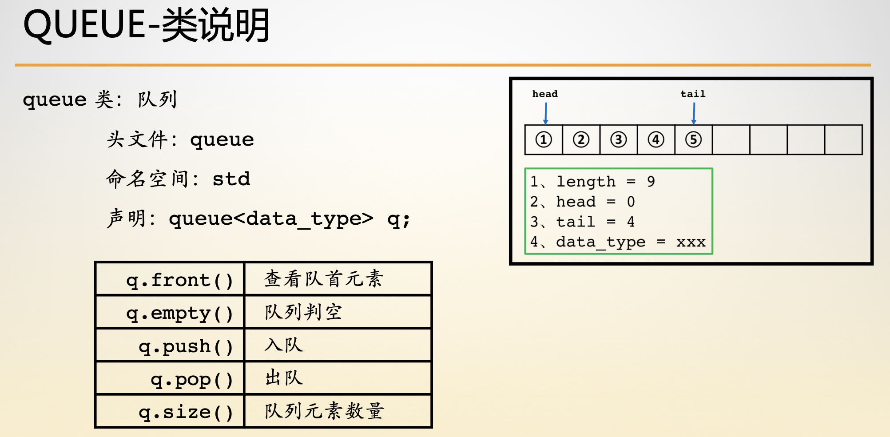
- 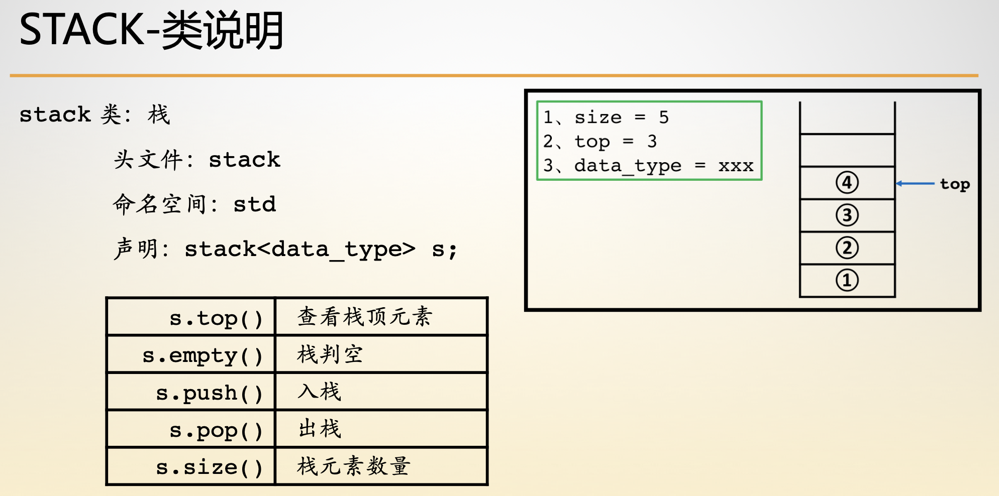
- 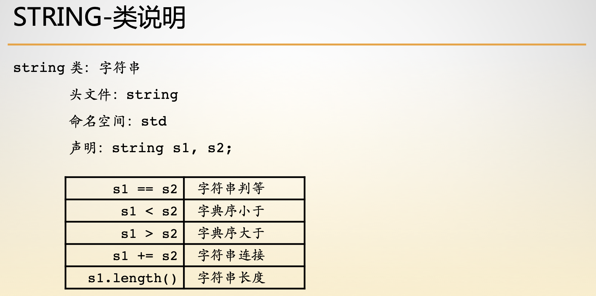
- 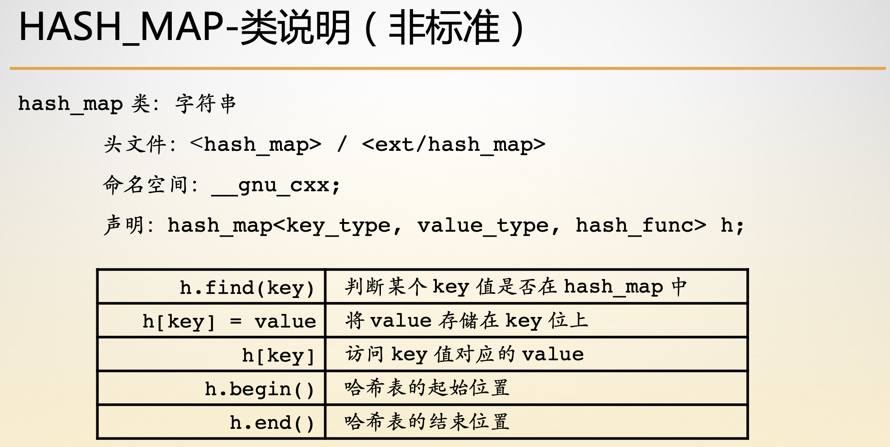
- 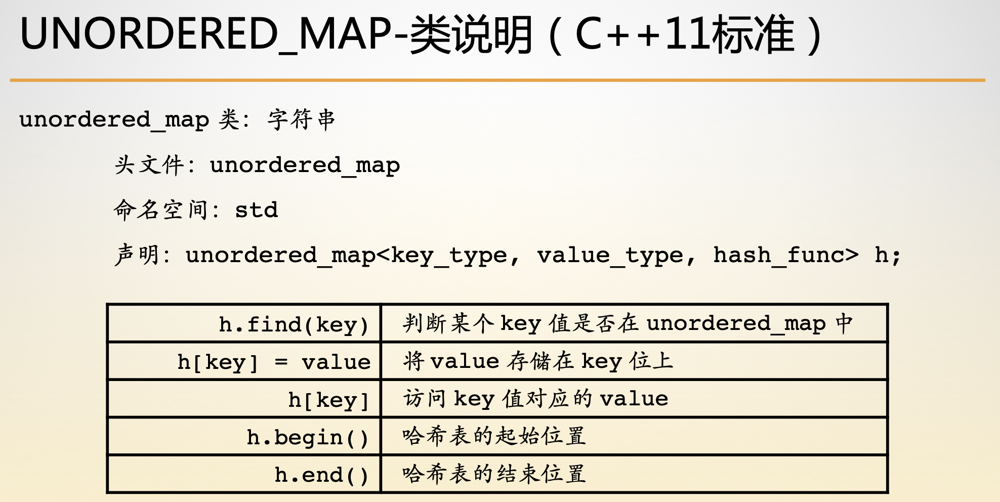

## 类和对象

### 类和变量

- | 类型 | 变量 |
    | :--: | :--: |
    | int  |  a   |

- 类型=类型数据+类型操作

### 类和对象

- 类和对象简介

    > |   类   |   对象   |
    > | :----: | :------: |
    > |  Cat   | garfield |
    > |  Dog   |   odie   |
    > | People |   hug    |
    >
    > ```c++
    > class Cat {
    > };
    > class Dog {    
    > };
    > class People {
    > };
    > Cat garfield;
    > Dog odie;
    > People hug;
    > ```

    - 类：就是当初的类型
    - 对象：就是那个类所声明的变量
    - 实例：对于对象来讲，对象就是类型的实例
    - 程序设计：对象->第一类->抽象类

- 对象的方法与属性

	- 成员属性和方法

		- 属性：数值特征
		- 方法：行为特征
- 访问权限
	
	- Friendly：可以随意访问类内部的私有方法
	- 构造函数/析构函数
    - 三/五法则
	        - 需要析构构造函数的类也需要拷贝构造函数和赋值构造函数
        - 需要拷贝操作的类也需要赋值操作，反之亦然
	        - 析构函数是不能被删除的
        - 如果一个类有删除的或不可访问的析构函数，那么其默认的拷贝构造函数会被定义为删除的
	        - 如果一个类有const或引用成员，则不能使用合成的拷贝构造函数
	- 类属性和方法（不能访问this）

		- 类属性：全局唯一
	- 类方法： 只是这个类型的一类方法
	- Const方法
    - 在成员属性内部不会去修改任何一个成员属性的值
	- 对象与引用

		- 引用：就是相关对象的一个别名
- 结构体与类
	
		- 为了兼容C语言
	- 浅拷贝：成员属性的赋值操作
	- 深拷贝：重新开辟一段存储空间，进行赋值

## 继承

### 编程范式

> ```c++
> class Animal {
> public :
>     	string name() { return this->__name; }
> private :
>    	string __name;
> };
> 
> class Cat : public Animal {
> };
> ```

### 访问权限

- 子类的访问权限
- 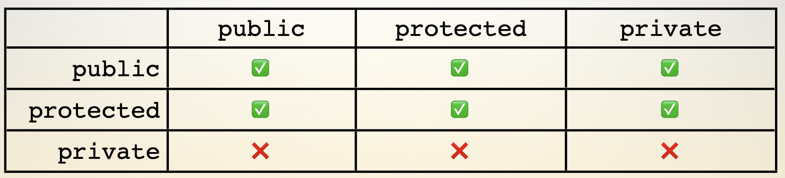
- 对外的访问权限
- 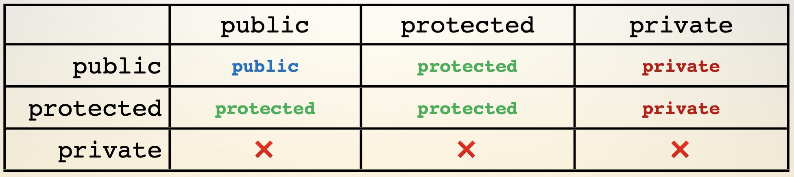

### 构造函数

- 构造函数的三/五法则

     1、需要析构函数的类也需要拷贝构造函数和拷贝赋值函数

     2、需要拷贝操作的类也需要赋值操作，反之亦然

     3、析构函数不能是删除的

     4、如果一个类有删除的或不可访问的析构函数，那么其默认和拷贝构造函数也会定义为删除的

     5、如果一个类有const或引用成员，则不能使用合成的拷贝复制操作

- 要构造子类先构造父类-析构相反

    > ```c++
    > class Animal {
    > public :
    >     	Animal(string name) : __name(name) {}
    >     	strign name() { return this->__name; }
    >     	string color;
    > protected :
    >    	string __name;
    > };
    > 
    > class Cat : public Animal {
    > public :
    >     	Cat():Animal("temp cat") {}
    >     	Cat(string name) : Animal(name) {}
    >    	void set_name(string n) {
    >         	this->__name = n;
    >     	}
    > }
    > ```

### 菱形继承

- 来源于多重继承，要注意避免
- 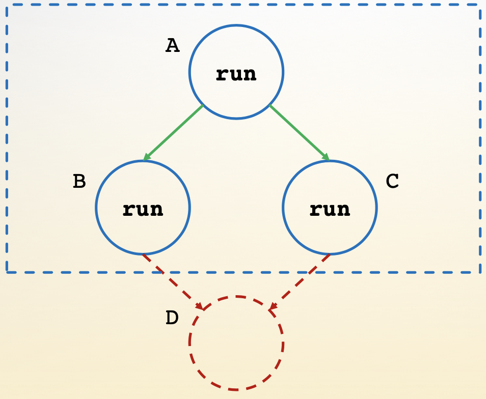

###  基类与派生类的构造顺序

- 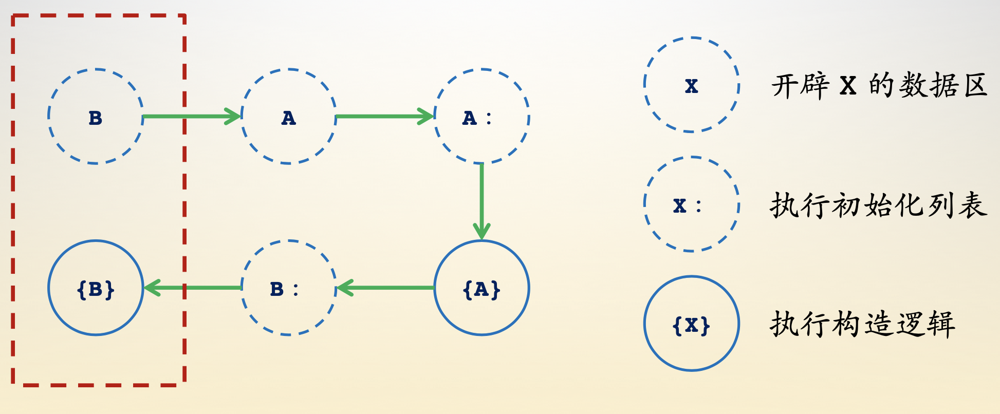

### 拷贝赋值

- 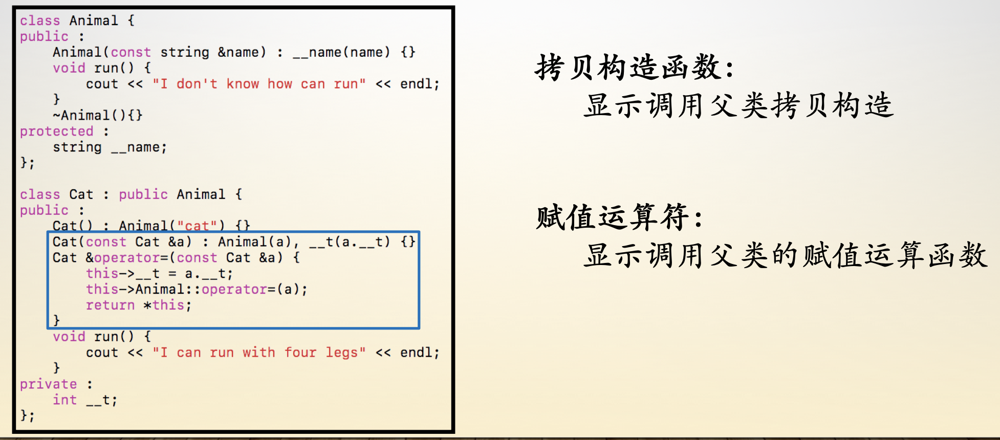

## 多态

### 拥有纯虚函数的类称为抽象类

**多态意味着调用成员函数时，会根据调用函数的对象的类型来执行不同的函数。**

### 虚函数

- 语义

	- 子类的这个方法可能跟父类有所不同

- 成员方法调用时

	- virtual关键字的方法跟着【对象】
	- 非virtual关键字的方法跟着【类】

- 限制

	- 不能用来修饰【类方法-static】

### 纯虚函数

- 语义

  - 子类肯定会有这个方法，但父类肯定会说抱歉
  - 也叫抽象类

- 应用场景

	- 定义接口

### 虚函数表

- 对象头部有8个字节，存储某个类的虚函数的地址

## 模板

### 程序=数据结构+算法

- 数据结构

	- 能够存储任意类型

- 算法

	- 能够操作存储任意类型的数据结构

### 泛型编程

- |              |      泛型编程      |
    | :----------: | :----------------: |
    | 面向过程编程 | 用模版实现函数过程 |
    | 面向对象编程 |    用模版实现类    |

### 模版

- 模版函数

    > ```c++
    > template<typename T>
    > T add(T a, T b) {
    >     	return a + b;
    > }
    > ```

- 模版类

    > ```c++
    > template<typename T>
    > struct PrintAny {
    >     	PrintAny(std::osyream &out) : out(out) {}
    >     	void operator()(const T &a) {
    >         	out << a;
    >     	}
    >     	std::ostream &out;
    > };
    > ```

- 模版类+模版函数

    > ```c++
    > template<typename T>
    > struct Print {
    >     	template<typename U>
    >     	void operator()(const U &a) {
    >         	cout << a << endl;
    >         	cout << this->__temp << endl;
    >     	}
    >     	void set(const T &temp) {this->__temp = temp;}
    >     	T __temp;
    > }
    > ```

### 特化

- 模版函数特化

- 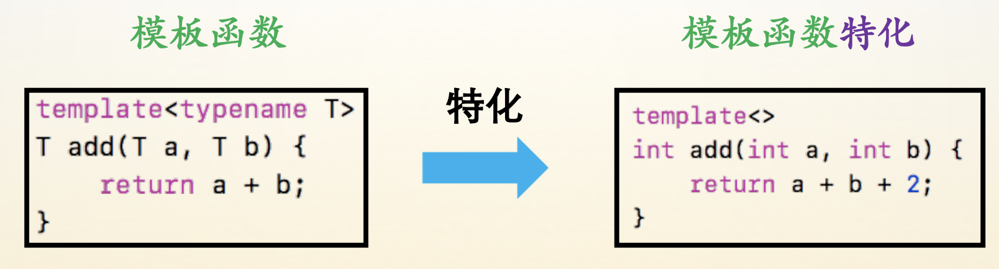

- 模版类特化

    > ```c++
    > template<typename T>
    > struct PrintAny {
    >     	PrintAny(std::ostream &out) : out(out) {}
    >     	void operator()(const T &a) {
    >         	out << a;
    >     	}
    >     	str::ostream &out;
    > }
    > ```

### 偏特化

- 模版函数偏特化
- 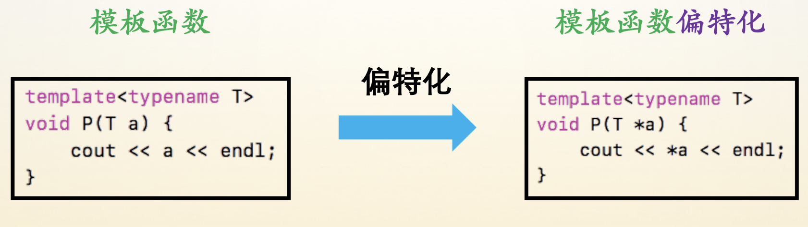

### 可变参数

- 递归展开模版函数

    > ```c++
    > template<typename T, typename ...ARGS>
    > void Print(const T &a, ARGS... args) {
    >     	cout << a << endl;
    >     	Print(args...);
    > }
    > ```

- 终止递归展开

    > ```c++
    > template<typename T> 
    > vodi Print(const T &a) {
    >     	cout << a << endl;
    > }
    > ```
    
    

## 左值与右值

- 左值

    > ```c++
    > //在程序的这行代码执行完了之后
    > //在程序执行的下一行还可以直接访问的变量
    > int &a;
    > ++a;
    > ```

- 右值

    > ```c++
    > //匿名变量
    > //在程序的这行代码执行完了之后
    > //在程序执行的下一行不能够直接访问的变量
    > int &&a;
    > a++;
    > ```

TDD 测试驱动开发