 

- [1.Python的基础入门](#1.Python的基础入门)
  - [赋值和输出](#赋值和输出)
  - [数据输入](#数据输入)
  - [数学运算](#数学运算)
  - [传统除法运算](#传统数学运算)
  - [全局精确除法运算](#全局精确除法运算)
  - [不只是数学运算](#不只是数学运算)
  - [字符串的长度](#字符串的长度)
  - [运算分析](#运算分析)
- [2.用Python语言写程序](#2.用Python语言写程序)
  - [hello world](#helloworld)
  - [Python函数](#Python函数)
  - [拯救牛郎织女](#拯救牛郎织女)
  - [规范的命名](#规范的命名)
  - [无处不在的帮助](#无处不在的帮助)
  - [Python的注释](#Python的注释)
- [3.Python的字符串使用](#3.Python的字符串使用)
  - [字符串的位置](#字符串的位置)
  - [大写与小写](#大写与小写)
  - [字符串测试](#字符串测试)
  - [切取字符串](#切取字符串)
  - [IF语句](#IF语句)
  - [查找与替换](#查找与替换)
  - [字符串格式化](#字符串格式化)
  - [字符串的编码](#字符串的编码)
- [4.Python的简单结构](#4.Python的简单结构)
  - [使用列表](#使用列表)
  - [列表尾部的添加](#列表尾部的添加)
  - [插入数据与元素定位](#插入数据与元素定位)
  - [列表弹出与删除](#列表弹出与删除)
  - [字符串的切割与列表合成](#字符串的切割与列表合成)
  - [列表求和](#列表求和)
  - [while循环](#while循环)
  - [简单斐波那契](#简单斐波那契)
- [5.Python中的排序与元组](#5.Python中的排序与元组)
  - [简单的排序](#简单的排序)
  - [基本的排序](#基本的排序)
  - [个性化的排序](#个性化的排序)
  - [元组的使用](#元组的使用)
  - [用元组做返回值](#用元组做返回值)
  - [交叉排序](#交叉排序)
- [6.Python字典与文件](#6.Python字典与文件)
  - [使用字典](#使用字典)
  - [查看字典元素](#查看字典元素)
  - [for循环打印字典](#for循环打印字典)
  - [字典数据格式化](#字典数据格式化)
  - [删除表达式](#删除表达式)
  - [文件的使用](#文件的使用)
  - [文件与编码](#文件的编码)
  - [两数之和](#两数之和)
  - [统计字符个数](#统计字符个数)
- [7.Python中的正则表达式](#7.Python中的正则表达式)
- [正则表达式](#正则表达式)
- [基础正则使用](#基础正则使用)
- [正则表达式重复](#正则表达式重复)
- [正则里的方括号](#正则里的方括号)
- [正则提取](#正则提取)
- [查找所有方法](#查找所有方法)

# 1.Python的基础入门

## 赋值和输出

```python
a = 6
print a
b = 'hello world'
print b
a = b
print a, b
```

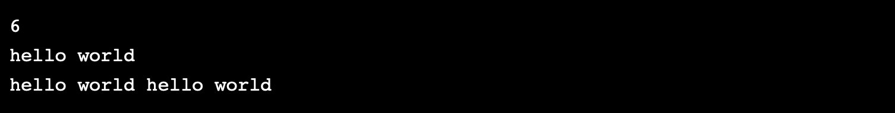

## 数据输入

```python
name = raw_input('whats your name?\n')
print 'Your name is ' + name
```


## 数学运算

```python
a = 1
b = 2
print a + b
print b * 3
print b + a * 2
```


## 传统除法运算

```python
print 3 / 2
print 3.0 / 2.0
print 2. / 2.
```

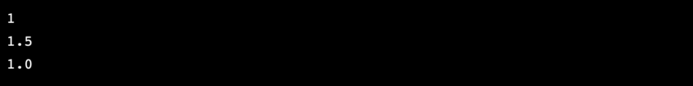

## 全局精确除法运算

```python
from __future__ import division # 在future包中 使用division的方法
print 3 / 2
print 3.0 / 2.0
print 2. / 2.
print 3 // 2
```

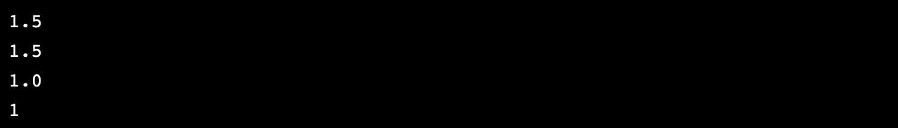

## 不只是数学运算

```python
a = 'love '
b = 'China'
print a + b
print a * 3 + b
```

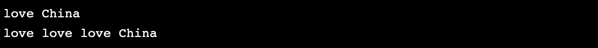

## 字符串的长度

```python
a = 'China'
a_len = len(a)
b = 'length of a is'
print b + str( a_len)
```


## 运算分析

```python
a = '10'
b = 10
c = str(len(a) + b)
a = len(a * b)
b = b + a
print a, b, c
```


# 2.用Python语言写程序

## hello world

```python
def main():# def 声明函数
    print 'Hello World'
    
if __name__ == '__main__':
    main()
```

## Python的函数

```python
def max_pow(a, b):# 拥有相同缩进的行代表同一个层次的 def 是定义函数的关键次 
    if a > b:
        pow_ab = a ** b
        return pow_ab
    pow_ba = b ** a
    return pow_ba
```

## 拯救牛郎织女

```python
def yinhe(a):
    print '='+a+'='

def main():
    print 'niulang'
    yinhe('||')
    print 'zhinv'
    
if __name__ == '__main__':
    main()
```

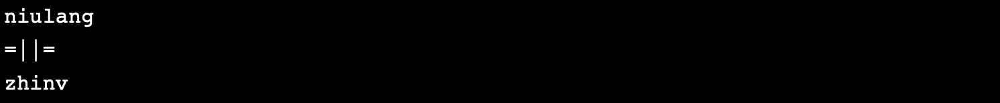

## 规范的命名

```python
def do_qingan(my_line):# 不可以使用 doQingan 这样的驼峰命名
    print 'gui'
    print 'bai ' * 3
    print my_line

def main():
    my_line = 'wansui'
    do_qingan(my_line)
    
if __name__ == '__main__':
    main()
```

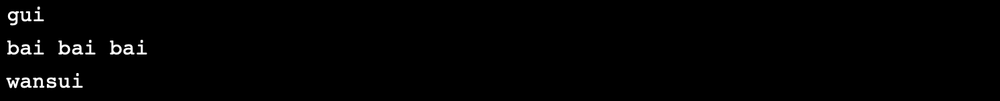

## 无处不在的帮助

```python
import sys
help(len)# 可以让程序输出关于系统内建的关于len这个函数形式以及它的作用说明
print dir(sys)# dir 和 help 类似，不过dir返回的是一个模组中一系列被定义过的方法和列表
help(sys.exit)
help('china'.split)
print dir(list)
```

## Python的注释

```python
# 单行注释
# This is the first line
# of the comment. Here is the second line.
# And here is the third one
'''
多行注释 建议仅在不需要这段代码执行时使用它
'''
```

# 3.Python的字符串使用

## 字符串的位置

```python
a = 'hello'
b = a[0] + "i"
print b
print len(b)
```

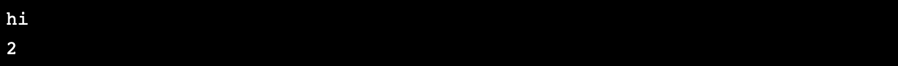

## 大写与小写

```python
a = 'In\na line'
b = r'In\na line'# 加入 r（raw） 后转义字符都不会被转义
print a
print b
print a.lower()# 将字符串全部换成小写
print b.upper()# 将字符串全部换成大写
```

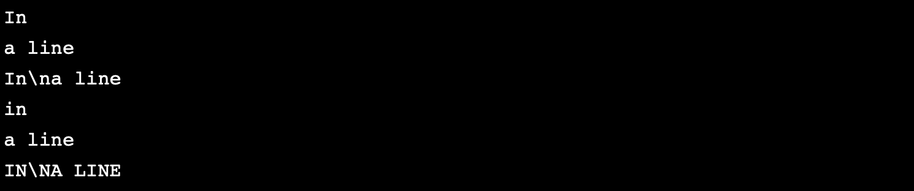

## 字符串测试

```python
s = 'HelloabcdWord'
print s.isalpha()# 检查字符串是否全部由字母组成
print s.isdigit()# 检查字符串是否全部由数字组成
print s.startswith('Hello')# 检查字符串是否由Hello开始
print s.endswith('World')# 检查字符串是否由World结束
```

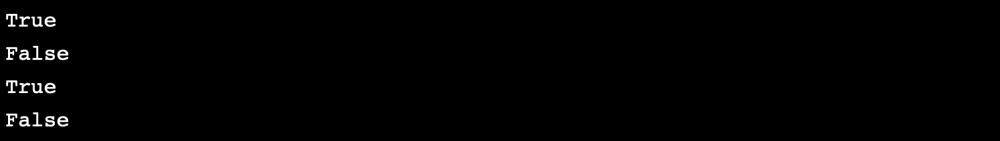

## 切取字符串

```python
tower = 'abcdefg'
print tower[1:4]# 切取了第1个字符-第4个字符，但是第4个字符没有取到
print tower[3:]# 切取到了第3个字符之后的字符
print tower[:-2]# 将后面两个字符切掉剩下的字符
```

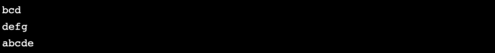

## IF语句

在Python中我们可以使用条件语句关键字，冒号，空格来组织一个条件的判断和响应， 其中关键字包括**if** , **elif**, **else**

## 查找与替换

```python
weather = 'rainy day'
bag = 'nothing in the bag'
if weather.find('rain') != -1:# 寻找函数find()，找到返回索引位置，否则返回-1
    bag = bag.replace('nothing', 'umbrella')# 替换函数replace(), 将符合第一个参数定义的替换成第二个参数
print bag
```


## 字符串格式化

```python
name = 'Wangmu Niangniang'
age = 9000
height = 1.73
print name + ' is a ' + str(age) + '-year-old woman with height ' + str(height)
print '%s is a %d-year-old woman with height %g' % (name, age, height)
```


## 字符串的编码

在Python中，默认的编码方式并不是Unicod。我们的字符串s字符串中使用了Unicode进行编码的字符，python将会当成普通字符来处理，如果想要变成一个Unicode编码的字符串，需要在字符串之前加一个u

```python
s = 'I want to say \u4e2d\u56fd\u4e07\u5c81'
print s
a = u'I want to say \u4e2d\u56fd\u4e07\u5c81'
print a
```

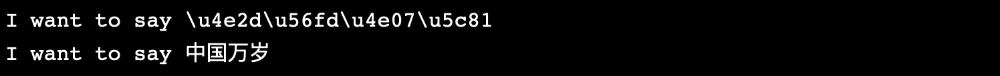

# 4.Python的简单结构

## 使用列表

```python
list = [100, 23, 45]# 定义一个列表并赋值
print list[0]
print list[1]
print list[2]
print len(list)
```

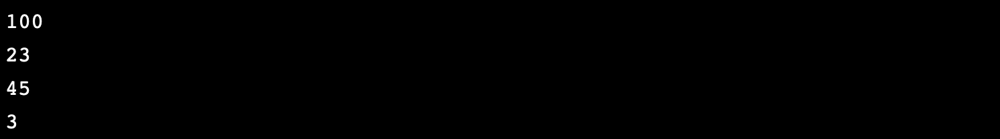

## 列表尾部的添加

```python
hello = ['hi', 'hello']
world = ['earth', 'field', 'universe']
hello.append('nihao')# 在尾部添加单一元素
print hello
hello.extend(world)# 将world插在hello的后面。延伸
print hello
```

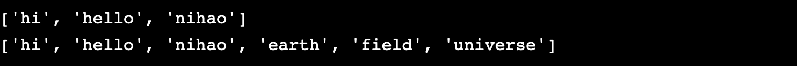

## 插入数据与元素定位

```python
hello = ['hi', 'hello']
hello.insert(0, 'nihao')# 在第一个参数的索引位置，插入第二个参数的字符串
print hello
print hello.index('hi')# 输出参数所在的索引位置
```

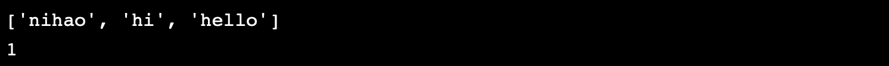

## 列表弹出与删除

```python
hello = ['nihao', 'hi', 'hello']
hello.remove('nihao')# 删除‘nihao’字符串
print hello
hello.pop(0)# 弹出列表第0位元素
print hello
```

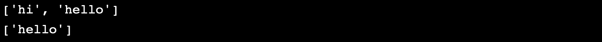

## 字符串的切割与列表合成

```python
manager = 'tuotatianwang,taibaijinxing,juanliandajiang'
manager_list = manager.split(',')# 将manager字符串用‘，’进行分割后存在列表manager_list中
print manager_list
new_manager = ' '.join(manager_list)# 将manager_list列表用' '连起来合成新的字符串
print new_manager
```

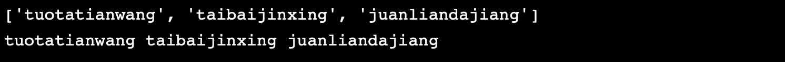

## 列表求和

```python
gardens = [7204, 3640, 1200, 1240, 71800, 3200, 604]
total = 0
for num in gardens:# 使用for循环
    total += num# 累加列表元素
print total
print sum(gardens)# 使用求和函数
```

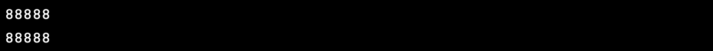

## while循环

```python
first = 0
second = 1
# Please write code here
while first < 100:
    print first
    first, second = second, first + second
print 'Everything is done'
```


## 简单斐波那契

```python
n = int(raw_input())
first = 0
second = 1
while n != 0:
    first, second = second, first + second
    n -= 1
print first
```

# 5.Python中的排序与元组

## 简单的排序

```python
numbers = [1, 4, 2, 3, 8, 3, 0]
numbers.sort()# 排序函数
print numbers
```


## 基本的排序

```python
numbers = [1, 4, 2, 3, 8, 3, 0]
print sorted(numbers)# sorted返回的就是排好的序列
print sorted(numbers, reverse=True)# 逆序排序
```

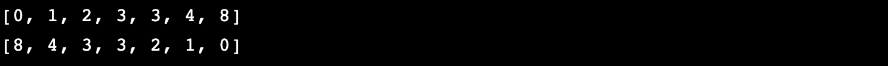

## 个性化排序

```python
def china_first(item):
    if item == 'China':
        return 0
    else:
        return len(item)
country = ['jp', 'China', 'USA', 'Thai']
print sorted(country, key = len)
print sorted(country, key = china_first)
```

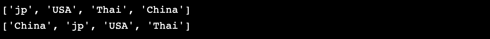

## 元组的使用

元组相当于C中的结构体

```python
tuple = (1, 2, 'hi')
print len(tuple)
print tuple[2]
tuple = (1, 2, 'bye')
print tuple
```


## 用元组做返回值

```python
def plus_one(tuple):
    return tuple[0] + 1, tuple[1] + 1, tuple[2] + 1

t = (1, 4, -1)
(x, y, z) = plus_one(t)
print x
print y, z
```


## 交叉排序

```python
nums = [int(x) for x in raw_input().split()]
nums1 = []
nums2 = []
for i in xrange(len(nums)):
    ind = i + 1;
    if ind % 3 != 0 and ind % 2 == 0:
        nums1.append(nums[i])
    elif ind % 3 == 0:
        nums2.append(nums[i])
nums1.sort()
nums2.sort(reverse = True)
for i in xrange(len(nums)):
    ind = i + 1;
    if ind % 3 != 0 and ind % 2 == 0:
        nums[i] = nums1.pop(0)
    elif ind % 3 == 0:
        nums[i] = nums2.pop(0)
print ' '.join(str(x) for x in nums)
```

# 6.Python字典与文件

## 使用字典

Python中有一种将名字与值进行配对的结构，叫做字典

```python
bat = {} 
bat['b'] = 'baidu' 
bat['a'] = 'alibaba' 
bat['t'] = 'tencent'
print bat
print bat['a']
bat['a'] = 'amazon'
print bat['a']
print 'b' in bat
print 'x' in bat
```

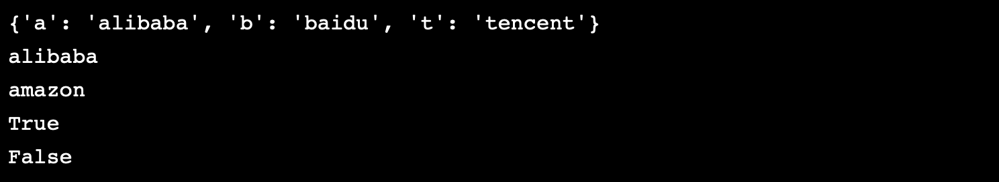

## 查看字典元素

```python
bat = {'a': 'alibaba', 'b': 'baidu', 't': 'tencent'}
print bat.keys()# 查看键名
print bat.values()# 查看键值
print bat.items()# 查看列表
```

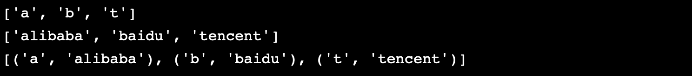

## for循环打印字典

```python
bat = {'a': 'alibaba', 'b': 'baidu', 't': 'tencent'}
for value in bat.values():
    print value
for key in bat:
    print key
for k, v in bat.items():
    print k, '>', v
```

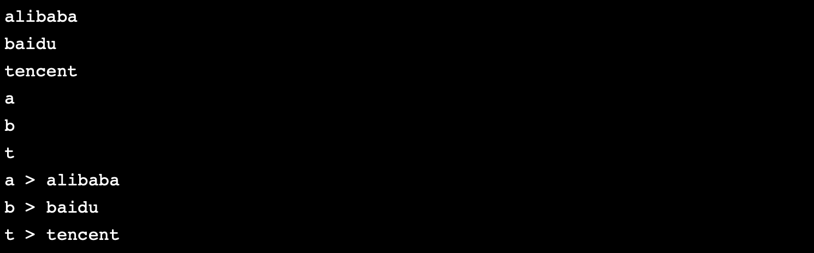

## 字典数据格式化

```python
boss = {} 
boss['name'] = 'robin' 
boss['age'] = 45
boss['height'] = 1.78
print 'The boss named %(name)s is %(age)d-year-old and %(height)g tall.' % boss
```


## 删除表达式

```python
num = 6
list = ['a', 'b', 'c', 'd']
dict = {'a': 1, 'b': 2, 'c': 3}
del list[0]
del list[-2:]
print list
del dict['b']
print dict
del num# 删除后，将没有这个变量
print num# 在这里会报错误 
```

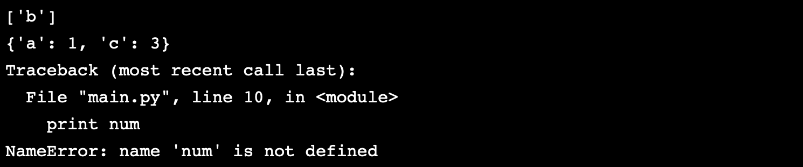

## 文件的使用

```python
# 按行输出整个文件
f = open('filename', 'rU')
for line in f:   # 访问文件每一行
    print line,    # 打印每一行，加逗号可以不被额外添加换行
```

## 文件与编码

在Python中有一些好的功能性的"包"称为**模组**

```python
import codecs 
fd = codecs.open('foo.txt', 'rU', 'utf-8')
```

## 两数之和

```python
def two_sum(nums, target):
    ans = dict()
    for i in xrange(1, len(nums) + 1):
        num1 = nums[i - 1]
        num2 = target - nums[i - 1]
        if num1 in ans.keys():
            return ans[num1], i
        ans[num2] = i
    return 0, 0
 
if __name__ == "__main__":
    raw_input()
    nums = [int(x) for x in raw_input().split()]
    target = int(raw_input())
    print "%d %d" % two_sum(nums, target)
```

## 统计字符个数

```python
def cnt_letter_number(string):
    t = (
         len([x for x in string if x.isalpha()]),
         len([x for x in string if x.isdigit()]),
         len([x for x in string if x == ' ']),
         )
    return t + (len(string) - sum(t),)
 
if __name__ == "__main__":
    print "%d %d %d %d" % cnt_letter_number(raw_input())
```

# 7.Python中的正则表达式

**正则表达式**是一种用于匹配文本形式的强大逻辑表达式，在Python中的**re**模组提供了正则表达式的支持。正则表达式由一些普通字符和一些元字符组成。普通字符包括大小写的字母和数字，而元字符具有特殊的含义。

当正则表达式为一个普通的字符串时，一个正则表达式的匹配行为就是一个普通的字符串查找过程。例如，正则表达式"**testing**"中没有包含任何元字符，它可以匹配"**testing**"和"**testing123**"等字符串。但是因为大小写敏感，他不能匹配"**Testing**"其他一些元字符不会作为普通字符来处理，它们包括**. ^ * + ? { [ ] \ | ( )**。

**.**会匹配除了换行以外的任何字符； 

**\w** 等价于**[a-zA-Z0-9_]**会匹配单一字母、数字和下划线的单一字符；

**\b** 会匹配"单一字母、数字会下划线字符" 和 "任何非字母、数字和下划线的单一字符" 之间的边界；

**\s** 等价于 **[ \n\r\t\f ]**，会匹配一个空白字符（包括空格、换行、返回、制表符、表格）；

**\S** 则匹配所有非空白字符；

**\t \n \r** 依次用于匹配制表符、换行符、返回符；

**\d** 等价于 **[ 0-9 ]** 用于匹配十进制表示的数字；

**^** 作为开始标记；

**$** 作为结束标记， 分别用于标记一个字符串的开始和结束的位置；

**\\** 用于一些字符的转义, 比如 **\.** 表示对于一个真实点字符的匹 配；

\ \  表示对于一个真实反斜杠字符的匹配等。如果你对不是很确定一些字符是否需要进行转义才能匹配，你大可以加上斜杠，比如对于@你写成\@ 是一定没有问题的。

****

## 正则表达式查找

```python
import re
str = 'A cute word:cat!!'
match = re.search(r'word:\w\w\w', str)
if match:
    print 'found', match.group()
```


## 基础正则使用

```python
import re
print re.search(r'..g', 'piiig').group()
print re.search(r'\d\d\d', 'p123g').group()
print re.search(r'\w\w\w', '@@abcd!!').group()
```

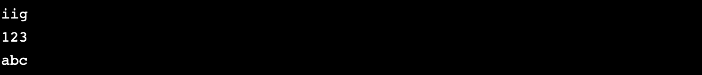

## 正则表达式重复

```python
import re
print re.search(r'pi+', 'piiig').group()
print re.search(r'pi*', 'pg').group()
print re.search(r'pi*', 'piiig').group()
print re.search(r'pi+', 'pg').group()
```

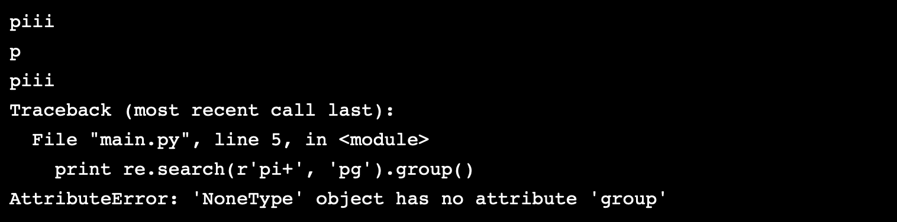

## 正则里的方括号

```python
import re
print re.search(r'[abc]+', 'xxxacbbcbbadddedede').group()
print re.search(r'[a-d]+', 'xxxacbbcbbadddedede').group()
```

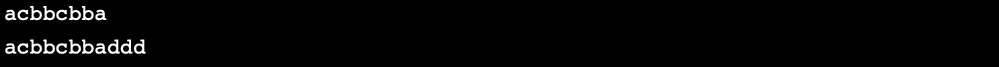

## 正则提取

```Python
import re
str = 'purple alice-b@jisuanke.com monkey dishwasher'
match = re.search('([\w.-]+)@([\w.-]+)', str)
if match:
    print match.group()
    print match.group(1)
    print match.group(2)
```

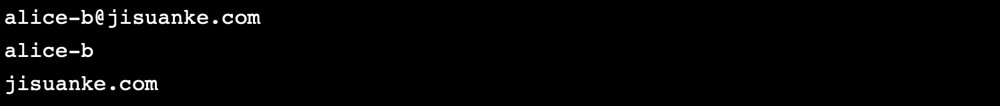

## 查找所有方法

```python
import re
str = 'purple alice@jisuanke.com, blah monkey bob@abc.com blah dishwasher'
tuples = re.findall(r'([\w\.-]+)@([\w\.-]+)', str)
print tuples
```

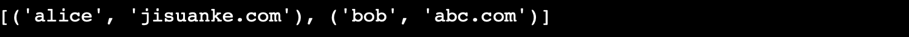