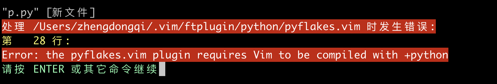
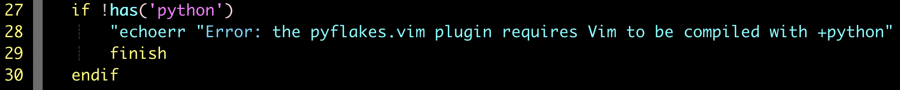

- [安装](#安装)
- [使用](#使用)
- [命令](#命令)
  - [基本过程](#基本过程)
  - [管理conda](#管理conda)
    - [检查conda版本](#检查conda版本)
    - [升级当前版本的conda](#升级当前版本的conda)
  - [管理环境](#管理环境)
    - [创建并激活一个环境](#创建并激活一个环境)
    - [激活这个新环境](#激活这个新环境)
      - [小技巧：](#小技巧：)
      - [小技巧：](#小技巧：)
    - [列出所有的环境](#列出所有的环境)
    - [切换到另一个环境](#切换到另一个环境)
    - [复制一个环境](#复制一个环境)
    - [删除一个环境](#删除一个环境)
  - [管理Python](#管理Python)
    - [安装不同版本的python](#安装不同版本的python)
    - [检查新的环境中的python](#检查新的环境中的python)
    - [使用不同版本的python](#使用不同版本的python)
    - [注销该环境](#注销该环境)
  - [管理包](#管理包)
  - [查看已安装包](#查看已安装包)
  - [向指定环境中安装包](#向指定环境中安装包)
  - [使用Conda命令安装包](#使用Conda命令安装包)
    - [小技巧：](#小技巧：)
  - [移除包、环境、或者conda](#移除包、环境、或者conda)
    - [移除包](#移除包)
    - [移除环境](#移除环境)
    - [删除conda](#删除conda)
    - [0.获取版本号](#0获取版本号)
    - [1.获取帮助](#1获取帮助)
    - [2.环境管理](#2环境管理)
    - [3.分享环境](#3分享环境)
    - [4.包管理](#4包管理)
    - [5.安装特定版本的包](#5安装特定版本的包)

# 安装

1.官网下载镜像包

https://www.anaconda.com/distribution/

2.点击安装

下载所需版本；

3.安装完成

安装过程，不再详细描述

# 使用

**问题：**在终端输入**conda**无法识别这个命令。

检查环境变量： 

```bash
sudo vi ~/.bash_profile
```

如果环境变量中没有conda那么要手动添加

```bash
export PATH="/Users/anaconda3/bin:$PATH"（这里要填写自己的路径哦）
```

刷新环境变量：

```bash
source ~/.bash_profile
```

**问题：**这一次安装以后突然间发现了一个问题，那就是终端变样了，无端的在终端前部分出现了（base）字样。

```c
sudo vi ~/.bash_profile
# >>> conda init >>>
# !! Contents within this block are managed by 'conda init' !!
__conda_setup="$(CONDA_REPORT_ERRORS=false '/home/devil/anaconda3/bin/conda' shell.bash hook 2> /dev/null)"
if [ $? -eq 0 ]; then
    \eval "$__conda_setup"
else
    if [ -f "/home/devil/anaconda3/etc/profile.d/conda.sh" ]; then
        . "/home/devil/anaconda3/etc/profile.d/conda.sh"
        CONDA_CHANGEPS1=false conda activate base
    else
        \export PATH="/home/devil/anaconda3/bin:$PATH"
    fi
fi
unset __conda_setup
# <<< conda init <<<
```

可以发现我们找到了问题的源头，那就是**anaconda**自动加入了命令到**.bash_profile**中，  在我们打开终端的时候自动 执行了**conda  activate base**命令，于是乎就有了前面所说的问题。

一个命令又可以回去，不过感觉一直有（base）字样也是可以接受的，不过要知道原因以后。

```bash
conda deactivate
```

因次我们在**.bash_profile**中添加这样一段代码，修改后为

```bash
# >>> conda init >>>
# !! Contents within this block are managed by 'conda init' !!
__conda_setup="$(CONDA_REPORT_ERRORS=false '/home/devil/anaconda3/bin/conda' shell.bash hook 2> /dev/null)"
if [ $? -eq 0 ]; then
    \eval "$__conda_setup"
else
    if [ -f "/home/devil/anaconda3/etc/profile.d/conda.sh" ]; then
        . "/home/devil/anaconda3/etc/profile.d/conda.sh"
        CONDA_CHANGEPS1=false conda activate base
    else
        \export PATH="/home/devil/anaconda3/bin:$PATH"
    fi
fi
unset __conda_setup
conda deactivate
# <<< conda init <<<
```

**问题：**配置vim后编辑python文件时发生错误



**解决办法:**

```bash
#编辑pyflakes.vim将第28行注释掉
vim ~/.vim/ftplugin/python/pyflakes.vim
```



# 命令

1. 使用conda 
   首先我们将要确认你已经安装好了conda

2. 配置环境 
   下一步我们将通过创建几个环境来展示conda的环境管理功能。使你更加轻松的了解关于环境的一切。我们将学习如何确认你在哪个环境中，以及如何做复制一个环境作为备份。

3. 测试python 
   然后我们将检查哪一个版本的python可以被安装，以及安装另一个版本的python，还有在两个版本的python之间的切换。

4. 检查包 
   1)我们将罗列出安装在我们电脑上的包

   2)浏览可用的包

   3)使用conda install命令来来安装以及移除一些包

   4)对于一些不能使用conda安装的包，我们将在Anaconda.org网站上搜索

   5)对于那些在其它位置的包，我们将使用pip命令来实现安装。我们还会安装一个可以免费试用30天的商业包IOPro

   移除包、环境以及conda

```c
//conda是一个用于管理和部署应用程序、环境和包的工具。
Options:

positional arguments:
  command
    clean        //清除未使用的包和缓存。
    config       //配置在.condarc中修改配置值。这是模仿在git配置命令之后。向用户写入。condarc默认文件										(/Users/zhengdongqi/.condarc)。
    create       //从指定的列表中创建一个新的conda环境包。
    help         //help显示可用conda命令及其帮助的列表字符串。
    info         //显示当前conda安装的信息。
    init         //初始化用于shell交互的conda。(实验)
    install      //install将包列表安装到指定的conda中环境。
    list         //在conda环境中列出链接的包。
    package      //包底层的conda包实用程序。(实验)
    remove       //从指定的conda环境中删除包列表。
    uninstall    //卸载conda删除的别名。
    run          //在conda环境中运行可执行文件。(实验)
    search       //搜索搜索包并显示相关信息。的input是一种MatchSpec，一种用于conda包的查询语言。
								 //请参见下面的例子。
    update       //更新conda包到最新的兼容版本。
    upgrade      //为conda更新升级别名。

optional arguments:
  -h, --help     Show this help message and exit.
  -V, --version  Show the conda version number and exit.

conda commands available from other packages://conda命令可从其他包:
  build //构建
  convert //转换
  debug //调试
  develop //开发
  env //环境
  index //指数
  inspect //检查
  metapackage //metapackage
  render //渲染
  server //服务器
  skeleton //骨架
  verify //验证
```


## 基本过程

```c
conda -h //请求帮助
conda create -n new_env //那么我这里就新建一个环境 new_env
conda create -n new_env python //还可以直接携带依赖库新建环境
//新建环境完成后你就可以利用下面的命令查看conda 环境列表了
conda env list //除了base环境外还有刚新建的new_env环境
source activate new_env //激活环境
conda install python //安装依赖库
conda search python //你可以利用命令查看安装库的可用版本
conda search python=3.7.2 //安装指定版本库
conda uninstall python //删除库
source deactivate //失效当前环境
conda remove --name new_env --all //删除指定环境
conda install python.app //使用pythonw
```


## 管理conda

### 检查conda版本

```bash
conda --version
```

### 升级当前版本的conda

```bash
conda update conda
```

## 管理环境

### 创建并激活一个环境

使用”conda create”命令，后边跟上你希望用来称呼它的任何名字：

```bash
conda create --name snowflake biopython
```

这条命令将会给Biopython创建一个新的环境，位置在Anaconda安装文件的/envs/snowflakes

### 激活这个新环境

- Linux，OS X: 

```bash
source activate snowflakes
```

- Windows：

```bash
activate snowflake
```

#### 小技巧：

新的开发环境会被默认安装在你conda目录下的envs文件目录下。你可以指定一个其他的路径；去通过 
`conda create -h`了解更多信息吧。

#### 小技巧：

如果我们没有指定安装python的版本，conda会安装我们最初安装conda时所装的那个版本的python。

### 列出所有的环境

```bash
conda info -envis或者(-e)
```

**注意：conda有时也会在目前活动的环境前边加上*号。**

### 切换到另一个环境

(activate/deactivate)为了切换到另一个环境，键入下列命令以及所需环境的名字。

- Linux，OS X: 

```bash
source activate snowflakes
```

- Windows：

```bash
activate snowflakes
```

如果要从你当前工作环境的路径切换到系统根目录时，键入： 
\- Linux，OS X: 

```bash
source deactivate
```

- Windows: 

```bash
deactivate
```

### 复制一个环境

通过克隆来复制一个环境。这儿将通过克隆snowfllakes来创建一个称为flowers的副本。

```bash
conda create -n flowers --clone snowflakes
```

通过

```bash
conda info –-envs
```

来检查环境

### 删除一个环境

如果你不想要这个名为flowers的环境，就按照如下方法移除该环境：

```bash
conda remove -n flowers --all
```

## 管理Python

### 安装不同版本的python

现在我们假设你需要python3来编译程序，但是你不想覆盖掉你的python2.7来升级，你可以创建并激活一个名为snakes的环境，并通过下面的命令来安装最新版本的python3：

```bash
conda create -n snakes python=3
```

### 检查新的环境中的python

确保snakes环境中运行的是python3：

```bash
python --version
```

### 使用不同版本的python

为了使用不同版本的python，你可以切换环境，通过简单的激活它就可以，让我们看看如何返回默认版本

- Linux，OS X: 

```bash
source activate - snowflakes
```

- Windows：

```bash
activate snowflakes
```

### 注销该环境

当你完成了在snowflakes环境中的工作室，注销掉该环境并转换你的路径到先前的状态：

- Linux，OS X：

```bash
source deactivate
```

- Windows：

```bash
deactivate
```

## 管理包

- conda安装和管理python包非常方便，可以在指定的python环境中安装包，且自动安装所需要的依赖包，避免了很多拓展包冲突兼容问题。
- 不建议使用easy_install安装包。大部分包都可以使用conda安装，无法使用conda和anaconda.org安装的包可以通过pip命令安装
- 使用合适的源可以提升安装的速度

------

### 查看已安装包

使用这条命令来查看哪个版本的python或其他程序安装在了该环境中，或者确保某些包已经被安装了或被删除了。在你的终端窗口中输入：

```bash
conda list
```

### 向指定环境中安装包

### 使用Conda命令安装包

我们将在指定环境中安装这个Beautiful Soup包，有两种方式: 
**1.指定安装环境的名字**

```bash
conda install --name bunnies beautifulsoup4
```

**提示：你必须告诉conda你要安装环境的名字（-n bunies）否则它将会被安装到当前环境中。**

- 激活bunnies环境，再使用conda install命令。

```bash
activate bunnies
conda install beautifulsoup4
```

**2.从Anaconda.org安装包**

如果一个包不能使用conda安装，我们接下来将在Anaconda.org网站查找。

在浏览器中，去 [Anaconda资源官网](http://anaconda.org/) 。我们查找一个叫“bottleneck”的包，所以在左上角的叫“Search Anaconda Cloud”搜索框中输入“bottleneck”并点击search按钮。

Anaconda.org上会有超过一打的bottleneck包的版本可用，但是我们想要那个被下载最频繁的版本。所以你可以通过下载量来排序，通过点击Download栏。
点击包的名字来选择最常被下载的包。它会链接到Anaconda.org详情页显示下载的具体命令：

```bash
conda install--channel https：//conda .anaconda.ort/pandas bottleneck
```

3. 通过pip命令来安装包

对于那些无法通过conda安装或者从Anaconda.org获得的包，我们通常可以用pip命令来安装包。

可以上pypi网 
站查询要安装的包，查好以后输入pip install命令就可以安装这个包了。

我们激活想要放置程序的python环境，然后通过pip安装一个叫“See”的程序。

- Linux，OS X： 

```bash
source activate bunnies
```

- Windows：

```bash
activate bunnies
```

所有平台：

```bash
pip install see
```

**提示：pip只是一个包管理器，所以它不能为你管理环境。pip甚至不能升级python，因为它不像conda一样把python当做包来处理。但是它可以安装一些conda安装不了的包。**

4. 文件安装

如果真的遇到走投无路的境地，也就是上面这些方法通通不管用！！！那就只能下载源码安装了，比如exe文件（双击安装）或者whl文件（pip安装）等等。还有在github上找到源码，使用`python setup.py install`命令安装

Tips:不建议使用setuptools 的easy_install，非常不方便管理，也不好卸载 
有些时候，Anaconda和pip下载的速度慢，访问不稳定怎么办？换个源呗，[清华大学的源](https://mirrors.tuna.tsinghua.edu.cn/)就很不错，当然啦，你可以自己google一些好用的源

对于包管理工具，了解这么多就够了，比较喜欢追根究底的童鞋可以移步[包管理工具解惑](http://zengrong.net/post/2169.htm)
**提示： 
在任何时候你可以通过在命令后边跟上-help来获得该命令的完整文档。 **

eg: 

```bash
conda update --help
```

#### **小技巧：** 

很多跟在–后边常用的命令选项，可以被略写为一个短线加命令首字母。所以–name选项和-n的作用是一样的。通过`conda -h`或`conda –-help`来看大量的缩写。

## 移除包、环境、或者conda

如果你愿意的话。让我们通过移除一个或多个试验包、环境以及conda来结束这次测试指导。

### 移除包

假设你决定不再使用商业包IOPro。你可以在bunnies环境中移除它。

```bash
conda remove -n bunnies iopro
```

### 移除环境

我们不再需要snakes环境了，所以输入以下命令：

```bash
conda remove -n snakes --all
```

### 删除conda

- Linux，OS X：

移除Anaconda 或 Miniconda 安装文件夹

```bash
rm -rf ~/miniconda 
```

OR 

```bash
rm -rf ~/anaconda
```

- Windows：

去控制面板，点击“添加或删除程序”，选择“Python2.7（Anaconda）”或“Python2.7（Miniconda）”并点击删除程序。

**以下命令均在windows命令行中输入。一般来讲，无论是在Linux，OS X还是在windows系统中，在命令行窗口中输入的conda命令基本是一致的，除非有特别标注。**

### 0.获取版本号

```bash
conda --version
```

或

```bash
conda -V
```

### 1. 获取帮助

```bash
conda --help
conda -h
```

查看某一命令的帮助，如update命令及remove命令

```bash
conda update --help
conda remove --help
```

同理，以上命令中的`--help`也可以换成`-h`。

### 2.环境管理

查看环境管理的全部命令帮助

```bash
conda env -h
```

创建环境

```bash
conda create --name your_env_name
```

输入`y`确认创建。

创建制定python版本的环境

```bash
conda create --name your_env_name python=2.7
conda create --name your_env_name python=3
conda create --name your_env_name python=3.5
```

创建包含某些包的环境

```bash
conda create --name your_env_name numpy scipy
```

创建指定python版本下包含某些包的环境

```bash
conda create --name your_env_name python=3.5 numpy scipy
```

列举当前所有环境

```bash
conda info --envs
conda env list
```

进入某个环境

```bash
activate your_env_name
```

退出当前环境

```bash
deactivate 
```

复制某个环境

```bash
conda create --name new_env_name --clone old_env_name 
```

删除某个环境

```bash
conda remove --name your_env_name --all
```

### 3.分享环境

如果你想把你当前的环境配置与别人分享，这样ta可以快速建立一个与你一模一样的环境（同一个版本的python及各种包）来共同开发/进行新的实验。一个分享环境的快速方法就是给ta一个你的环境的`.yml`文件。

首先通过`activate target_env`要分享的环境`target_env`，然后输入下面的命令会在当前工作目录下生成一个`environment.yml`文件，

```bash
conda env export > environment.yml
```

小伙伴拿到`environment.yml`文件后，将该文件放在工作目录下，可以通过以下命令从该文件创建环境

```bash
conda env create -f environment.yml
```

当然，你也可以手写一个`.yml`文件用来描述或记录你的python环境。

### 4.包管理

列举当前活跃环境下的所有包

```bash
conda list
```

列举一个非当前活跃环境下的所有包

```bash
conda list -n your_env_name
```

为指定环境安装某个包

```bash
conda install -n env_name package_name
```

如果不能通过conda install来安装，文档中提到可以从Anaconda.org安装，但我觉得会更习惯用pip直接安装。pip在Anaconda中已安装好，不需要单独为每个环境安装pip。如需要用pip管理包，activate环境后直接使用即可。

### 5.安装特定版本的包

```bash
conda install package=version
```

