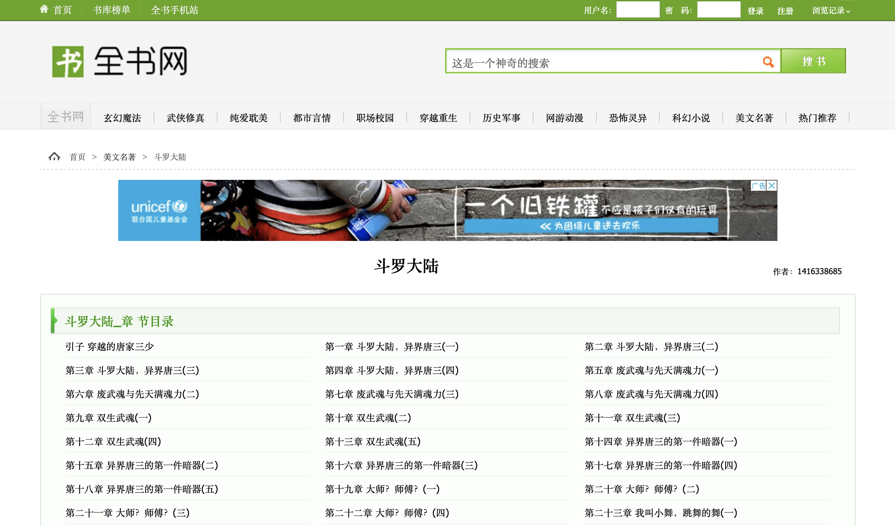
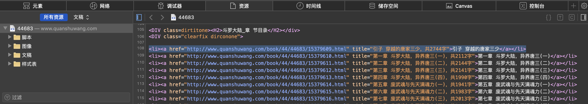
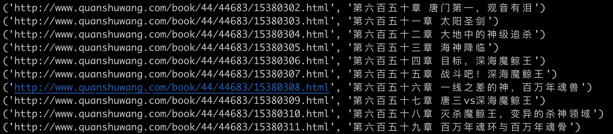
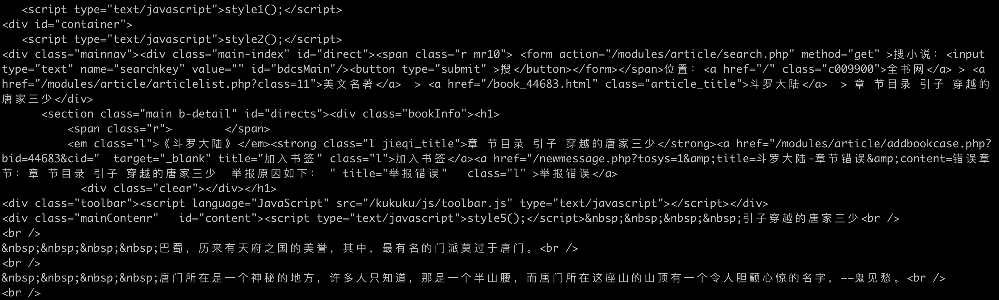
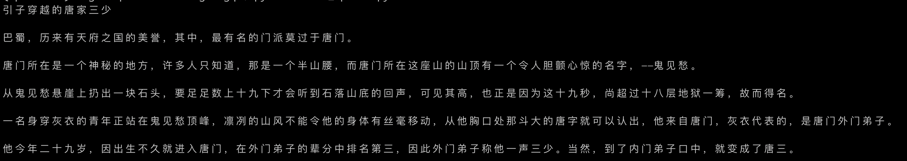
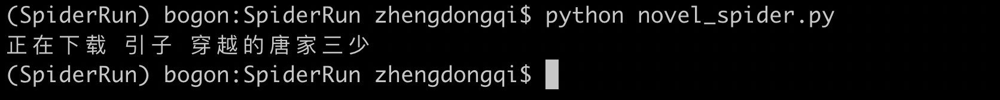

# urllib2库的基本使用

所谓网页抓取，就是把URL地址中指定的网络资源从网络流中读取出来，保存到本地。 在Python中有很多库可以用来抓取网页，我们先学习urllib2。

urllib2 是 Python2.7 自带的模块(不需要下载，导入即可使用)

urllib2 官方文档：https://docs.python.org/2/library/urllib2.html

urllib2 源码：https://hg.python.org/cpython/file/2.7/Lib/urllib2.py

urllib2 在 python3.x 中被改为urllib.request

## urlopen

我们先来段代码：

```python
#!/usr/bin/env python
# coding=utf-8
# urllib2_urlopen.py

# 导入urllib2 库
import urllib2

# 向指定的url发送请求，并返回服务器响应的类文件对象
response = urllib2.urlopen("http://www.baidu.com")

# 类文件对象支持 文件对象的操作方法，如read()方法读取文件全部内容，返回字符串
html = response.read()

# 打印字符串
print html
执行写的python代码，将打印结果
```

实际上，如果我们在浏览器上打开百度主页， 右键选择“查看源代码”，你会发现，跟我们刚才打印出来的是一模一样。也就是说，上面的4行代码就已经帮我们把百度的首页的全部代码爬了下来。

一个基本的url请求对应的python代码真的非常简单。

## Request

在我们第一个例子里，urlopen()的参数就是一个url地址；

但是如果需要执行更复杂的操作，比如增加HTTP报头，必须创建一个 Request 实例来作为urlopen()的参数；而需要访问的url地址则作为 Request 实例的参数。

我们编辑urllib2_request.py

```python
#!/usr/bin/env python
# coding=utf-8
# urllib2_request.py

import urllib2

# url 作为Request()方法的参数，构造并返回一个Request对象
request = urllib2.Request("http://www.baidu.com")

# Request对象作为urlopen()方法的参数，发送给服务器并接收响应
response = urllib2.urlopen(request)

html = response.read()
print html
```


运行结果是完全一样的：

新建Request实例，除了必须要有 url 参数之外，还可以设置另外两个参数：

data（默认空）：是伴随 url 提交的数据（比如要post的数据），同时 HTTP 请求将从 "GET"方式 改为 "POST"方式。

headers（默认空）：是一个字典，包含了需要发送的HTTP报头的键值对。

这两个参数下面会说到。

## User-Agent

但是这样直接用urllib2给一个网站发送请求的话，确实略有些唐突了，就好比，人家每家都有门，你以一个路人的身份直接闯进去显然不是很礼貌。而且有一些站点不喜欢被程序（非人为访问）访问，有可能会拒绝你的访问请求。

但是如果我们用一个合法的身份去请求别人网站，显然人家就是欢迎的，所以我们就应该给我们的这个代码加上一个身份，就是所谓的User-Agent头。

浏览器 就是互联网世界上公认被允许的身份，如果我们希望我们的爬虫程序更像一个真实用户，那我们第一步，就是需要伪装成一个被公认的浏览器。用不同的浏览器在发送请求的时候，会有不同的User-Agent头。 urllib2默认的User-Agent头为：Python-urllib/x.y（x和y是Python主版本和次版本号,例如 Python-urllib/2.7）
```python
#!/usr/bin/env python
# coding=utf-8
# urllib2_useragent.py

import urllib2

url = "http://www.itcast.cn"

# IE 9.0 的 User-Agent，包含在 ua_header里
ua_header = {"User-Agent" : "Mozilla/5.0 (compatible; MSIE 9.0; Windows NT 6.1; Trident/5.0;"} 

# url 连同 headers，一起构造Request请求，这个请求将附带 IE9.0 浏览器的User-Agent
request = urllib2.Request(url, headers = ua_header)

# 向服务器发送这个请求
response = urllib2.urlopen(request)

html = response.read()
print html
```

## 添加更多的Header信息

在 HTTP Request 中加入特定的 Header，来构造一个完整的HTTP请求消息。

可以通过调用Request.add_header() 添加/修改一个特定的header 也可以通过调用Request.get_header()来查看已有的header。

添加一个特定的header
```python
#!/usr/bin/env python
# coding=utf-8
# urllib2_headers.py

import urllib2

url = "http://www.itcast.cn"

# IE 9.0 的 User-Agent
header = {"User-Agent" : "Mozilla/5.0 (compatible; MSIE 9.0; Windows NT 6.1; Trident/5.0;"} 
request = urllib2.Request(url, headers = header)

# 也可以通过调用Request.add_header() 添加/修改一个特定的header
request.add_header("Connection", "keep-alive")

# 也可以通过调用Request.get_header()来查看header信息
# request.get_header(header_name="Connection")
response = urllib2.urlopen(req)

print response.code     #可以查看响应状态码
html = response.read()

print html
```

## 随机添加/修改User-Agent

```python
#!/usr/bin/env python
# coding=utf-8
# urllib2_add_headers.py

import urllib2
import random

url = "http://www.itcast.cn"

ua_list = [
    "Mozilla/5.0 (Windows NT 6.1; ) Apple.... ",
    "Mozilla/5.0 (X11; CrOS i686 2268.111.0)... ",
    "Mozilla/5.0 (Macintosh; U; PPC Mac OS X.... ",
    "Mozilla/5.0 (Macintosh; Intel Mac OS... "
]

user_agent = random.choice(ua_list)
request = urllib2.Request(url)

# 也可以通过调用Request.add_header() 添加/修改一个特定的header
request.add_header("User-Agent", user_agent)

# 第一个字母大写，后面的全部小写
request.get_header("User-agent")
response = urllib2.urlopen(req)

html = response.read()

print html
```

# novel_spider爬小说

> 首先引入库

```python
#!/usr/bin/env python
# coding=utf-8
import re
import urllib2
```

> 爬取的网站是：[http://www.quanshuwang.com/book/44/44683](http://www.quanshuwang.com/book/44/44683)



```python
#!/usr/bin/env python
# coding=utf-8
import re
import urllib.request
 
def get_novel_content():
    # 获取页面源代码 
    url = 'http://www.quanshuwang.com/book/44/44683'
    html = urllib.request.urlopen(url).read()
```

最后一行我们调用了urllib2库的方法，urlopen()方法中我们传进一个网址作为参数表示我们需要爬取的网站，read()方法表示获取源代码。那我们现在打印html是否能成功在控制台把页面的代码给输出了呢？答案是否定的，现在获取的源码是一个乱码，我们还需要对该代码进行转码，于是要在下面加多一行转码的。

由上面我们可知代码已经转成了‘gbk’格式，并且也已经将它存在html这个变量上了，那我们怎么知道转成什么格式呢？通过获取网页源代码查看格式


```python
#!/usr/bin/env python
# coding=utf-8
import re
import urllib.request
 
def get_novel_content():
    # 获取页面源代码 
    url = 'http://www.quanshuwang.com/book/44/44683'
    html = urllib.request.urlopen(url).read()
    # 指定编码
    html = html.decode('gbk')
    print (html)
    
if __name__ == "__main__":
    get_novel_content()
```

因为我们要获取整本小说，所以让我们先获取章节目录吧，把鼠标指向其中一章并选中，下面就自动定位到该章节标签位置了



回到编辑器这边把刚才的代码粘贴过来并打上注释，作为一个参考的模板

```python
#!/usr/bin/env python
# coding=utf-8
import re
import urllib.request
 
def get_novel_content():
    # 获取页面源代码 
    url = 'http://www.quanshuwang.com/book/44/44683'
    html = urllib.request.urlopen(url).read()
    # 指定编码
    html = html.decode('gbk')
    #<li><a href="http://www.quanshuwang.com/book/44/44683/15379609.html" title="引子 穿越的唐家三少，共2744字">引子 穿越的唐家三少</a></li> #参考
    print (html)
    
if __name__ == "__main__":
    get_novel_content()
```

因为我们需要抓取的是全部章节而不仅仅只是这一个章节，所以我们要用到正则表达式来进行匹配，先把通用的部分用(.*?)替代，(.*?)可以匹配所有东西

```python
#!/usr/bin/env python
# coding=utf-8
import re
import urllib.request
 
def get_novel_content():
    # 获取页面源代码 
    url = 'http://www.quanshuwang.com/book/44/44683'
    html = urllib.request.urlopen(url).read()
    # 指定编码
    html = html.decode('gbk')
    #<li><a href="http://www.quanshuwang.com/book/44/44683/15379609.html" title="引子 穿越的唐家三少，共2744字">引子 穿越的唐家三少</a></li> #参考
    # 获取章节源代码
    # 正则表达式
    reg = r'<li><a href="(.*?)" title=".*?">(.*?)</a></li>'
    reg = re.compile(reg)
    urls = re.findall(reg, html)
    for url in urls:
        print(url)

if __name__ == "__main__":
    get_novel_content()
```

仔细的小伙伴就发现有些地方的.*?加括号，有些地方又不加，这是因为加了括号的都是我们要匹配的，不加括号是我们不需要匹配的。接下来一行调用re.compiled()方法是增加匹配的效率，建议习惯加上，最后一行开始与我们一开始获取的整个网页的源代码进行匹配。到这步我们已经能把代码所有章节以及章节链接的代码都获取了，打印在控制台上看一下



接下来获取章节页面源代码

```python
#!/usr/bin/env python
# coding=utf-8
import re
import urllib.request
 
def get_novel_content():
    # 获取页面源代码 
    url = 'http://www.quanshuwang.com/book/44/44683'
    html = urllib.request.urlopen(url).read()
    # 指定编码
    html = html.decode('gbk')
    # 获取章节源代码
    # 正则表达式
    reg = r'<li><a href="(.*?)" title=".*?">(.*?)</a></li>'
    reg = re.compile(reg)
    urls = re.findall(reg, html)
    for url in urls:
        novel_url,novel_title = url
        # 获取章节页面源代码
        chapter = urllib.request.urlopen(novel_url).read()
        chapter_html = chapter.decode('gbk')

        print(chapter_html)
        exit()

if __name__ == "__main__":
    get_novel_content()
```



接下来继续用正则表达式进行数据清洗

```python
#!/usr/bin/env python
# coding=utf-8
import re
import urllib.request
 
def get_novel_content():
    # 获取页面源代码 
    url = 'http://www.quanshuwang.com/book/44/44683'
    html = urllib.request.urlopen(url).read()
    # 指定编码
    html = html.decode('gbk')
    # 获取章节源代码
    # 正则表达式
    reg = r'<li><a href="(.*?)" title=".*?">(.*?)</a></li>'
    reg = re.compile(reg)
    urls = re.findall(reg, html)
    for url in urls:
        novel_url,novel_title = url
        # 获取章节页面源代码
        chapter = urllib.request.urlopen(novel_url).read()
        chapter_html = chapter.decode('gbk')
        chapter_reg = r'</script>&nbsp;&nbsp;&nbsp;&nbsp;(.*?)<script type="text/javascript">'
        # 多行匹配
        chapter_reg = re.compile(chapter_reg, re.S)
        chapter_content = re.findall(chapter_reg, chapter_html)
        # 数据清洗
        chapter_content = chapter_content[0].replace('&nbsp;', '')
        chapter_content = chapter_content.replace('<br />', '')
        print(chapter_content)
        
if __name__ == "__main__":
    get_novel_content()
```



最后一步就是下载了



附上完整代码

```python
#!/usr/bin/env python
# coding=utf-8
import re
import urllib.request
 
def get_novel_content():
    # 获取页面源代码 
    url = 'http://www.quanshuwang.com/book/44/44683'
    html = urllib.request.urlopen(url).read()
    # 指定编码
    html = html.decode('gbk')
    # 获取章节源代码
    # 正则表达式
    reg = r'<li><a href="(.*?)" title=".*?">(.*?)</a></li>'
    reg = re.compile(reg)
    urls = re.findall(reg, html)
    for url in urls:
        novel_url,novel_title = url
        # 获取章节页面源代码
        chapter = urllib.request.urlopen(novel_url).read()
        chapter_html = chapter.decode('gbk')
        chapter_reg = r'</script>&nbsp;&nbsp;&nbsp;&nbsp;(.*?)<script type="text/javascript">'
        # 多行匹配
        chapter_reg = re.compile(chapter_reg, re.S)
        chapter_content = re.findall(chapter_reg, chapter_html)
        # 数据清洗
        chapter_content = chapter_content[0].replace('&nbsp;','')
        chapter_content = chapter_content.replace('<br />','')
        # 下载到本地
        print('正在下载 %s' % novel_title)

        with open('{}.txt'.format(novel_title), 'w') as f:
            f.write(chapter_content)
        exit()


if __name__ == "__main__":
    get_novel_content()
```


