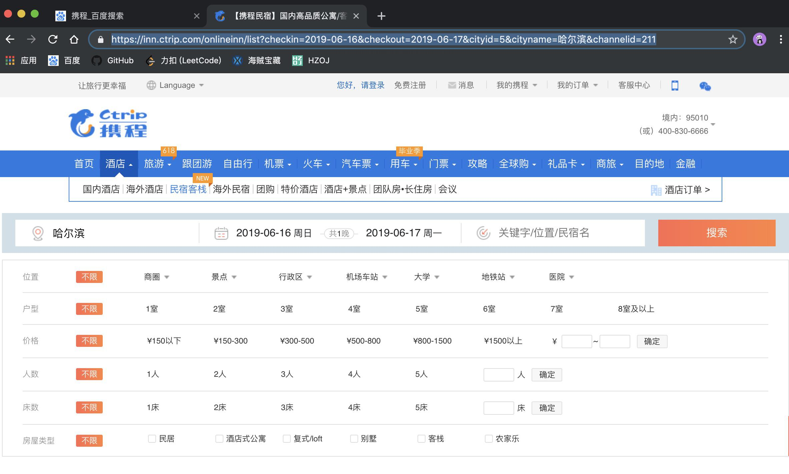
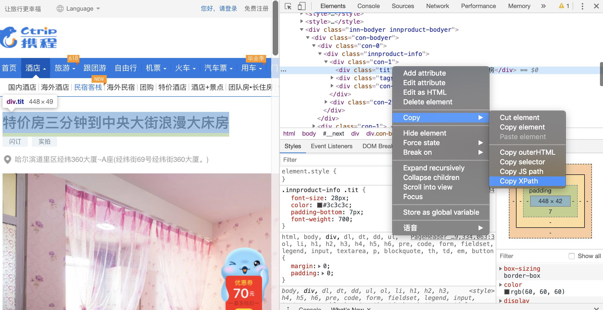
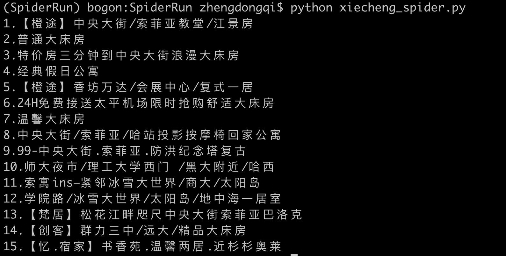
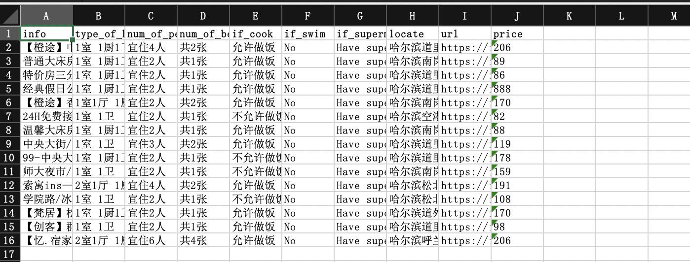

# xiecheng_spider携程民宿爬虫


获取URL



由于携程网页由CSS编写，因此我们需要使用浏览器去跳转页面，这里我需要做一些准备工作

> 1.安装谷歌浏览器驱动，连接如下。安装成功后要放在PATH路径下
>
> http://npm.taobao.org/mirrors/chromedriver/
>
> 2.安装环境，这里我用的Python3.7
>
> ```python
> # 我们需要使用其中的模块
> pip install selenium
> ```

接下来我们来进行代码实现

首先引入一些需要的模块和html的URL

```python
#!/usr/bin/env python
# coding=utf-8
import sys
import time
import json
import xlsxwriter
from selenium import webdriver

url = "https://inn.ctrip.com/onlineinn/list?checkin=2019-06-15&checkout=2019-06-16&cityid=5&cityname=%E5%93%88%E5%B0%94%E6%BB%A8&channelid=211"
# 定义一个字典稍后存储数据的时候用
items = []
```

接下来我们需要使用谷歌浏览器进行页面操作

```Python 
#!/usr/bin/env python
# coding=utf-8
import sys
import time
import json
import xlsxwriter
from selenium import webdriver

url = "https://inn.ctrip.com/onlineinn/list?checkin=2019-06-15&checkout=2019-06-16&cityid=5&cityname=%E5%93%88%E5%B0%94%E6%BB%A8&channelid=211"
items = []

# 谷歌驱动
def chrome_driver(url):
    driver = webdriver.Chrome()
    driver.get(url)
    return driver
```

接下来我们了解一下Xpath

**XPath**即为[XML](https://baike.baidu.com/item/XML)路径语言（XML Path Language），它是一种用来确定XML文档中某部分位置的语言。



通过Xpath我们就能够获取相应的数据

```python
#!/usr/bin/env python
# coding=utf-8
import sys
import time
import json
import xlsxwriter
from selenium import webdriver

url = "https://inn.ctrip.com/onlineinn/list?checkin=2019-06-15&checkout=2019-06-16&cityid=5&cityname=%E5%93%88%E5%B0%94%E6%BB%A8&channelid=211"
items = []

# 谷歌驱动
def chrome_driver(url):
    driver = webdriver.Chrome()
    driver.get(url)
    return driver

# 获取信息
def get_items(driver):
    time.sleep(1)
    # 展开全部
    show_all = driver.find_element_by_xpath('//*[@id="__next"]/div/div/div[2]/div[3]/div[2]/div[4]')
    show_all.click()
    # 字典获取
    feed_item = {
        'info':driver.find_element_by_xpath('//*[@id="__next"]/div/div/div[1]/div/div[1]/div[1]').text,
        'type_of_house':driver.find_element_by_xpath('//*[@id="__next"]/div/div/div[2]/div[3]/div[1]/div[1]/span[1]').text,
        'num_of_people':driver.find_element_by_xpath('//*[@id="__next"]/div/div/div[2]/div[3]/div[1]/div[2]/span[1]').text,
        'num_of_bed':driver.find_element_by_xpath('//*[@id="__next"]/div/div/div[2]/div[3]/div[1]/div[3]/span[1]').text,
        'if_cook':driver.find_element_by_xpath('//*[@id="__next"]/div/div/div[2]/div[3]/div[1]/div[1]/span[3]').text,
        'if_swim':'No',
        'if_supermarket':'No',
        'locate':driver.find_element_by_xpath('//*[@id="__next"]/div/div/div[1]/div/div[1]/div[3]/span').text,
        'url':driver.current_url,
        'price':driver.find_element_by_class_name('txt-price').text
    }
    if driver.find_elements_by_class_name('item-device-0507') != []:
        feed_item['id_swim'] = 'Have swim pool'
    if driver.find_elements_by_class_name("item-device-0501") != []:
        feed_item['if_supermarket'] = "Have super market"
    items.append(feed_item) # 将数据保存到items字典中
```

由于我们找不到每个hotel的相应URL，因此我们需要浏览器进行虚拟操作来帮助我们

```Python
#!/usr/bin/env python
# coding=utf-8
import sys
import time
import json
import xlsxwriter
from selenium import webdriver

url = "https://inn.ctrip.com/onlineinn/list?checkin=2019-06-15&checkout=2019-06-16&cityid=5&cityname=%E5%93%88%E5%B0%94%E6%BB%A8&channelid=211"
items = []

# 谷歌驱动
def chrome_driver(url):
    driver = webdriver.Chrome()
    driver.get(url)
    return driver

# 获取信息
def get_items(driver):
    time.sleep(1)
    # 展开全部
    show_all = driver.find_element_by_xpath('//*[@id="__next"]/div/div/div[2]/div[3]/div[2]/div[4]')
    show_all.click()
    # 字典获取
    feed_item = {
        'info':driver.find_element_by_xpath('//*[@id="__next"]/div/div/div[1]/div/div[1]/div[1]').text,
        'type_of_house':driver.find_element_by_xpath('//*[@id="__next"]/div/div/div[2]/div[3]/div[1]/div[1]/span[1]').text,
        'num_of_people':driver.find_element_by_xpath('//*[@id="__next"]/div/div/div[2]/div[3]/div[1]/div[2]/span[1]').text,
        'num_of_bed':driver.find_element_by_xpath('//*[@id="__next"]/div/div/div[2]/div[3]/div[1]/div[3]/span[1]').text,
        'if_cook':driver.find_element_by_xpath('//*[@id="__next"]/div/div/div[2]/div[3]/div[1]/div[1]/span[3]').text,
        'if_swim':'No',
        'if_supermarket':'No',
        'locate':driver.find_element_by_xpath('//*[@id="__next"]/div/div/div[1]/div/div[1]/div[3]/span').text,
        'url':driver.current_url,
        'price':driver.find_element_by_class_name('txt-price').text
    }
    if driver.find_elements_by_class_name('item-device-0507') != []:
        feed_item['id_swim'] = 'Have swim pool'
    if driver.find_elements_by_class_name("item-device-0501") != []:
        feed_item['if_supermarket'] = "Have super market"
    items.append(feed_item) # 将数据保存到items字典中

# 信息组合
def get_all_infos(driver):
    cnt = 0
    time.sleep(3)
    click_items = driver.find_elements_by_class_name("list-photo")
    for each in click_items:
        cnt = cnt + 1
        each.click() #浏览器跳转
        handle = driver.window_handles
        driver.switch_to.window(handle[1]) #浏览器选择窗口
        time.sleep(1)
        name = driver.find_elements_by_class_name("tit")
        if (len(name) == 0):
            driver.close()
            driver.switch_to.window(handle[0])
            continue
        print (str(cnt) + "." + name[0].text)
        get_items(driver)
        driver.close()
        driver.switch_to.window(handle[0])
    return 1;
```

在获得到所有数据之后我们需要将其放入excel表格中

在这之前我们需要引入相应的模块

```python
pip install xlsxwriter
```

```python
#!/usr/bin/env python
# coding=utf-8
import sys
import time
import json
import xlsxwriter
from selenium import webdriver

url = "https://inn.ctrip.com/onlineinn/list?checkin=2019-06-15&checkout=2019-06-16&cityid=5&cityname=%E5%93%88%E5%B0%94%E6%BB%A8&channelid=211"
items = []

# 谷歌驱动
def chrome_driver(url):
    driver = webdriver.Chrome()
    driver.get(url)
    return driver

# 获取信息
def get_items(driver):
    time.sleep(1)
    # 展开全部
    show_all = driver.find_element_by_xpath('//*[@id="__next"]/div/div/div[2]/div[3]/div[2]/div[4]')
    show_all.click()
    # 字典获取
    feed_item = {
        'info':driver.find_element_by_xpath('//*[@id="__next"]/div/div/div[1]/div/div[1]/div[1]').text,
        'type_of_house':driver.find_element_by_xpath('//*[@id="__next"]/div/div/div[2]/div[3]/div[1]/div[1]/span[1]').text,
        'num_of_people':driver.find_element_by_xpath('//*[@id="__next"]/div/div/div[2]/div[3]/div[1]/div[2]/span[1]').text,
        'num_of_bed':driver.find_element_by_xpath('//*[@id="__next"]/div/div/div[2]/div[3]/div[1]/div[3]/span[1]').text,
        'if_cook':driver.find_element_by_xpath('//*[@id="__next"]/div/div/div[2]/div[3]/div[1]/div[1]/span[3]').text,
        'if_swim':'No',
        'if_supermarket':'No',
        'locate':driver.find_element_by_xpath('//*[@id="__next"]/div/div/div[1]/div/div[1]/div[3]/span').text,
        'url':driver.current_url,
        'price':driver.find_element_by_class_name('txt-price').text
    }
    if driver.find_elements_by_class_name('item-device-0507') != []:
        feed_item['id_swim'] = 'Have swim pool'
    if driver.find_elements_by_class_name("item-device-0501") != []:
        feed_item['if_supermarket'] = "Have super market"
    items.append(feed_item) # 将数据保存到items字典中

# 信息组合
def get_all_infos(driver):
    cnt = 0
    time.sleep(3)
    click_items = driver.find_elements_by_class_name("list-photo")
    for each in click_items:
        cnt = cnt + 1
        each.click()
        handle = driver.window_handles
        driver.switch_to.window(handle[1])
        time.sleep(1)
        name = driver.find_elements_by_class_name("tit")
        if (len(name) == 0):
            driver.close()
            driver.switch_to.window(handle[0])
            continue
        print (str(cnt) + "." + name[0].text)
        get_items(driver)
        driver.close()
        driver.switch_to.window(handle[0])
    return 1;

# 保存信息
def save_to_excel(data):
    workbook = xlsxwriter.Workbook('./xiecheng_spider.xlsx')
    worksheet = workbook.add_worksheet()

    # 设定格式，等号左边格式名称自定义，字典中格式为指定选项
    # bold：加粗，num_format:数字格式
    bold_format = workbook.add_format({'bold': True})
    #money_format = workbook.add_format({'num_format': '$#,##0'})
    #date_format = workbook.add_format({'num_format': 'mmmm d yyyy'})

    # 将二行二列设置宽度为15(从0开始)
    # worksheet.set_column(1, 1, 15)

    # 用符号标记位置，例如：A列1行
    worksheet.write('A1', 'info', bold_format)
    worksheet.write('B1', 'type_of_house', bold_format)
    worksheet.write('C1', 'num_of_people', bold_format)
    worksheet.write('D1', 'num_of_bed', bold_format)
    worksheet.write('E1', 'if_cook', bold_format)
    worksheet.write('F1', 'if_swim', bold_format)
    worksheet.write('G1', 'if_supermarket', bold_format)
    worksheet.write('H1', 'locate', bold_format)
    worksheet.write('I1', 'url', bold_format)
    worksheet.write('J1', 'price', bold_format)

    #写内容
    for i in range(len(data)):
        worksheet.write_string(i + 1, 0, data[i]['info'])
        worksheet.write_string(i + 1, 1, data[i]['type_of_house'])
        worksheet.write_string(i + 1, 2, data[i]['num_of_people'])
        worksheet.write_string(i + 1, 3, data[i]['num_of_bed'])
        worksheet.write_string(i + 1, 4, data[i]['if_cook'])
        worksheet.write_string(i + 1, 5, data[i]['if_swim'])
        worksheet.write_string(i + 1, 6, data[i]['if_supermarket'])
        worksheet.write_string(i + 1, 7, data[i]['locate'])
        worksheet.write_string(i + 1, 8, data[i]['url'])
        worksheet.write_string(i + 1, 9, data[i]['price'])
    workbook.close()
```

最后运用主函数进行总体调用

完整代码：

```python
#!/usr/bin/env python
# coding=utf-8
import sys
import time
import json
import xlsxwriter
from selenium import webdriver

url = "https://inn.ctrip.com/onlineinn/list?checkin=2019-06-15&checkout=2019-06-16&cityid=5&cityname=%E5%93%88%E5%B0%94%E6%BB%A8&channelid=211"
items = []

# 谷歌驱动
def chrome_driver(url):
    driver = webdriver.Chrome()
    driver.get(url)
    return driver

# 获取信息
def get_items(driver):
    time.sleep(1)
    # 展开全部
    show_all = driver.find_element_by_xpath('//*[@id="__next"]/div/div/div[2]/div[3]/div[2]/div[4]')
    show_all.click()
    # 字典获取
    feed_item = {
        'info':driver.find_element_by_xpath('//*[@id="__next"]/div/div/div[1]/div/div[1]/div[1]').text,
        'type_of_house':driver.find_element_by_xpath('//*[@id="__next"]/div/div/div[2]/div[3]/div[1]/div[1]/span[1]').text,
        'num_of_people':driver.find_element_by_xpath('//*[@id="__next"]/div/div/div[2]/div[3]/div[1]/div[2]/span[1]').text,
        'num_of_bed':driver.find_element_by_xpath('//*[@id="__next"]/div/div/div[2]/div[3]/div[1]/div[3]/span[1]').text,
        'if_cook':driver.find_element_by_xpath('//*[@id="__next"]/div/div/div[2]/div[3]/div[1]/div[1]/span[3]').text,
        'if_swim':'No',
        'if_supermarket':'No',
        'locate':driver.find_element_by_xpath('//*[@id="__next"]/div/div/div[1]/div/div[1]/div[3]/span').text,
        'url':driver.current_url,
        'price':driver.find_element_by_class_name('txt-price').text
    }
    if driver.find_elements_by_class_name('item-device-0507') != []:
        feed_item['id_swim'] = 'Have swim pool'
    if driver.find_elements_by_class_name("item-device-0501") != []:
        feed_item['if_supermarket'] = "Have super market"
    items.append(feed_item) # 将数据保存到items字典中

# 信息组合
def get_all_infos(driver):
    cnt = 0
    time.sleep(3)
    click_items = driver.find_elements_by_class_name("list-photo")
    for each in click_items:
        cnt = cnt + 1
        each.click()
        handle = driver.window_handles
        driver.switch_to.window(handle[1])
        time.sleep(1)
        name = driver.find_elements_by_class_name("tit")
        if (len(name) == 0):
            driver.close()
            driver.switch_to.window(handle[0])
            continue
        print (str(cnt) + "." + name[0].text)
        get_items(driver)
        driver.close()
        driver.switch_to.window(handle[0])
    return 1;

# 保存信息
def save_to_excel(data):
    workbook = xlsxwriter.Workbook('./xiecheng_spider.xlsx')
    worksheet = workbook.add_worksheet()

    # 设定格式，等号左边格式名称自定义，字典中格式为指定选项
    # bold：加粗，num_format:数字格式
    bold_format = workbook.add_format({'bold': True})
    #money_format = workbook.add_format({'num_format': '$#,##0'})
    #date_format = workbook.add_format({'num_format': 'mmmm d yyyy'})

    # 将二行二列设置宽度为15(从0开始)
    # worksheet.set_column(1, 1, 15)

    # 用符号标记位置，例如：A列1行
    worksheet.write('A1', 'info', bold_format)
    worksheet.write('B1', 'type_of_house', bold_format)
    worksheet.write('C1', 'num_of_people', bold_format)
    worksheet.write('D1', 'num_of_bed', bold_format)
    worksheet.write('E1', 'if_cook', bold_format)
    worksheet.write('F1', 'if_swim', bold_format)
    worksheet.write('G1', 'if_supermarket', bold_format)
    worksheet.write('H1', 'locate', bold_format)
    worksheet.write('I1', 'url', bold_format)
    worksheet.write('J1', 'price', bold_format)

    #写内容
    for i in range(len(data)):
        worksheet.write_string(i + 1, 0, data[i]['info'])
        worksheet.write_string(i + 1, 1, data[i]['type_of_house'])
        worksheet.write_string(i + 1, 2, data[i]['num_of_people'])
        worksheet.write_string(i + 1, 3, data[i]['num_of_bed'])
        worksheet.write_string(i + 1, 4, data[i]['if_cook'])
        worksheet.write_string(i + 1, 5, data[i]['if_swim'])
        worksheet.write_string(i + 1, 6, data[i]['if_supermarket'])
        worksheet.write_string(i + 1, 7, data[i]['locate'])
        worksheet.write_string(i + 1, 8, data[i]['url'])
        worksheet.write_string(i + 1, 9, data[i]['price'])
    workbook.close()

if __name__ == "__main__":
    driver = chrome_driver(url)
    while True:
        ret = get_all_infos(driver)
        save_to_excel(items)
        if (ret == 1):
            sys.exit()
            next = driver.find_element_by_class_name("item-next")
            next.click()
        if (next == 0):
            break
```

运行部分效果图



