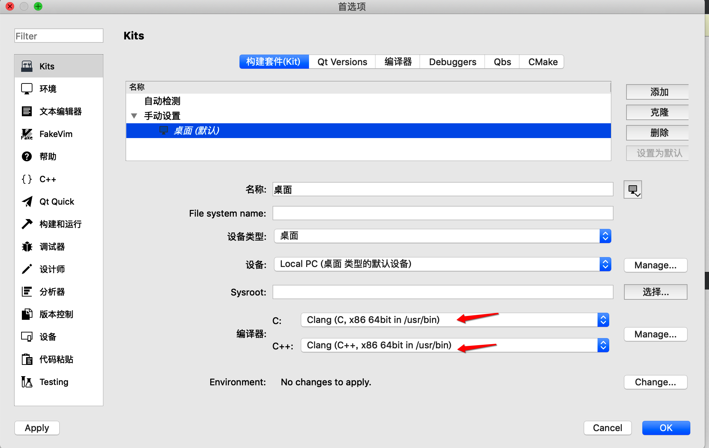

## Qt安装for MAC

对于Mac用户，首先应下载Xcode（下载过的请忽略）

然后打开终端安装homebrew

```bash
/usr/bin/ruby -e "$(curl -fsSL https://raw.githubusercontent.com/Homebrew/install/master/install)"
```

好目前准备工作就算是完成了。

## 1.终端安装Qt

```bash
brew install qt
```

此步骤安装完成后，终端会显示安装完成后的最终目录
`/usr/local/opt/qt`

## 2.下载并安装qt-creator

有两种方法

- 使用homebrew

```undefined
brew install qt-creator
```

- 手动安装
  选择需要的版本下载即可

```cpp
http://download.qt.io/official_releases/qtcreator/
```

## 3.配置

上面两条命令之间是没有关联的，后装的qt-creator不会自动检测到前面的qt（qt这个包是QT开发工具链），所以需要配置。

通过`brew info qt`命令，查看详情

```swift
qt: stable 5.14.0 (bottled), HEAD [keg-only]
Cross-platform application and UI framework
https://www.qt.io/
/usr/local/Cellar/qt/5.14.0 (10,381 files, 363.2MB)
  Poured from bottle on 2020-02-08 at 21:22:10
From: https://github.com/Homebrew/homebrew-core/blob/master/Formula/qt.rb
==> Dependencies
Build: pkg-config ✔
==> Requirements
Build: xcode ✔
Required: macOS >= 10.12 ✔
==> Options
--HEAD
	Install HEAD version
==> Caveats
We agreed to the Qt open source license for you.
If this is unacceptable you should uninstall.

qt is keg-only, which means it was not symlinked into /usr/local,
because Qt 5 has CMake issues when linked.

If you need to have qt first in your PATH run:
  echo 'export PATH="/usr/local/opt/qt/bin:$PATH"' >> ~/.bash_profile

For compilers to find qt you may need to set:
  export LDFLAGS="-L/usr/local/opt/qt/lib"
  export CPPFLAGS="-I/usr/local/opt/qt/include"

For pkg-config to find qt you may need to set:
  export PKG_CONFIG_PATH="/usr/local/opt/qt/lib/pkgconfig"

==> Analytics
install: 66,443 (30 days), 179,407 (90 days), 699,250 (365 days)
install-on-request: 18,790 (30 days), 50,254 (90 days), 192,728 (365 days)
build-error: 0 (30 days)
```

## 4.问题

- 安装完成后，创建新的项目出现错误`No valid kits found.`,
  原因: qtcreator 无法选择Qt版本导致，此时我们需要添加qt版本。
  解决方法: 打开qtcreator的偏好设置-Kits-QT versions，点击添加，找到`/usr/local/Cellar/qt/5.14.0/bin/qmake`文件，添加进去，然后在构建套件的QT 版本选项选择添加的版本即可。

- 运行项目后报错 Project ERROR: failed to parse default search paths from compiler output.
  解决方法: 打开qtcreator的偏好设置-Kits，在构建套件(kit)选项栏，选中`桌面`，将编译器由gcc修改编译器为Clang。

  

