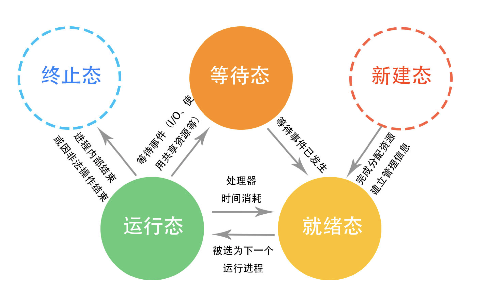

## 1、操作系统

1、请简述进程，线程及程序三者有什么区别

> 程序：是我们编译好的可执行的二进制文件
>
> 进程：是资源分配的最小单位，是程序在内存中的一个镜像，是一个实例，程序在运行之后呢就变成了一个进程
>
> 线程：是资源调度的最小单位，是操作系统可调度的最小单元，
>
> **相同点：**都可实现提高并发度
>
> **不同点：**
>
> - 进程独享内存空间，虚拟内存，
>     - 适用于：多进程编程适合并发度较小，守护进程。
>     - 优点：安全性较高
>     - 缺点：进程通信较复杂，切换进程代价较高，
> - 线程独享CPU，虚拟处理器，
>     - 适用于：高并发的情况下
>     - 优点：线程通信较简单，切换线程代价较小，
>     - 缺点：需要加锁

2、请简述你所知道的fork()函数，以及在多进程编程中需要注意的事项 

> fork( )
>
> - 用途：用于产生一个子进程
> - 原型：无参函数
> - 返回值：多个返回值，
>     - 0：在子进程中fork( )的返回值，子进程中获取父进程的pid使用getpid( )
>     - pid：在父进程中返回的是子进程的PID
>     - -1：申请进程出错，当前用户打开的进程过多默认1024；资源不够等。
> - 问题：
>     - 1、不能使用for， while等
>     - 2、僵尸进程，孩子先于父亲死了，父亲不给收尸，占用pid，占用系统资源
>     - 3、孤儿进程，孩子活着，父亲死了，孩子编程孤儿，没有什么太大的损害，即守护进程

3、请回答:进程有哪些状态，它们是如何相互切换的

> 三态模型：就绪态、运行态、等待态
>
> - 就绪态：万事俱备，只欠CPU
> - 运行态：调度器经过调度
> - 等待态：调度过后
>
> 五态模型：就绪态、运行态、等待态、终止态、新建态
>
> 
>
> 

## 2、操作系统

1、请你对用户态，内核态以及系统调用这三个概念作出解释 

> - 背景知识
>
>     - 特权级别
>         - 对于X86架构的CPU硬件上有0-3四个特权级
>             - 特权命令
>             - 非特权命令
>         - 在Unix/Linux系统中，只使用了0和3两个特权级
>
> - 两者差别
>
>     - 用户态
>
>         用户态即上层应用程序的活动空间，应用程序的执行必须依托于内核提供的资源，包括CPU资源、存储资源、I/O资源等。
>
>         - 又称目态
>         - 上层应用程序活动空间
>
>     - 内核态
>
>         内核态从本质上看是一种软件——控制计算机的硬件资源，并提供上层应用程序运行的环境。
>
>         - 又称管态、核心态
>         - 控制计算机硬件资源，为上层用户程序提供环境
>
>     - 特权不同
>
>     - 处理器是否可被抢占
>
>         - 用户态可以被抢占
>         - 内核态不可以被抢占
>
> - 相互切换
>
>     - 有用户态到内核态
>         - 中断
>         - 异常
>         - 系统调用（陷入）
>     - 由内核态到用户态
>         - 设置程序状态学
>
> - 系统调用
>
>     - 为了使用上层应用能够访问到硬件资源，内核为上层应用提供的接口
>     - 是用户态进程主动要求切换到内核态的一种方式，用户态进程通过系统调用申请使用操作
>     - 包括
>         - 进程控制
>         - 进程通信
>         - 文件操作
>         - 设备操作等

2、线程同步是干什么的，线程同步有哪些机制?

> - 线程同步：当使用多个线程来访问同一个数据时，非常容易出现线程安全问题(比如多个线程都在操作同一数据导致数据不一致),所以我们用同步机制来解决这些问题。
> - 同步机制
>     - 同步代码块：**就是N条线程同时访问一个数据。**
>     - 同步方法：
>         - 1、该类的对象可以被多个线程安全的访问。
>         - 2、每个线程调用该对象的任意方法之后，都将得到正确的结果。
>         - 3、每个线程调用该对象的任意方法之后，该对象状态依然保持合理状态
>     - 实现同步机制注意以下几点： 安全性高，性能低，在多线程用。性能高，安全性低，在单线程用。
>         1，不要对线程安全类的所有方法都进行同步，只对那些会改变共享资源方法的进行同步。
>         2，如果可变类有两种运行环境，当线程环境和多线程环境则应该为该可变类提供两种版本：线程安全版本和线程不安全版本(没有同步方法和同步块)。在单线程中环境中，使用线程不安全版本以保证性能，在多线程中使用线程安全版本.

3、内核线程和用户线程有什么区别?

> - 用户线程
>     - 操作系统感知不到，不需要内核支持而在用户程序中实现的线程，其不依赖于操作系统核心，应用进程利用线程库提供创建、同步、调度和管理线程的函数来控制用户线程。不需要用户态/核心态切换，速度快，操作系统内核不知道多线程的存在，因此一个线程阻塞将使得整个进程（包括它的所有线程）阻塞。由于这里的处理器时间片分配是以进程为基本单位，所以每个线程执行的时间相对减少。
>     - 优点
>         - 线程的调度不需要内核直接参与，控制简单。
>         - 可以在不支持线程的操作系统中实现。
>         - 创建和销毁线程、线程切换代价等线程管理的代价比内核线程少得多。
>         - 允许每个进程定制自己的调度算法，线程管理比较灵活。
>         - 线程能够利用的表空间和堆栈空间比内核级线程多。
>         - 同一进程中只能同时有一个线程在运行，如果有一个线程使用了系统调用而阻塞，那么整个进程都会被挂起。另外，页面失效也会产生同样的问题
>     - 缺点
>         - 资源调度按照进程进 行，多个处理机下，同一个进程中的线程只能在同一个处理机下分时复用
> - 内核线程
>     - **操作系统可以感知到，由操作系统内核创建和撤销。内核维护进程及线程的上下文信息以及线程切换。一个内核线程由于I/O操作而阻塞，不会影响其它线程的运行。**
>     - 优点
>         - 当有多个处理机时，一个进程的多个线程可以同时执行
>     - 缺点
>         - 由内核进行调度

## 3、操作系统

1、为什么主流系统处理死锁时都使用了鸵⻦策略? 

> 鸵鸟策略就是对死锁进行忽视。 
>
> 因为解决死锁的代价很高，当死锁对用户不会产生很大影响的时候采用鸵鸟策略可以大大提高系统的效率

2、内存管理有哪几种方法?

> 内存管理有块式管理，页式管理，段式和段页式管理。现在常用段页式管理。
>
> 　　块式管理：把主存分为一大块、一大块的，当所需的程序片断不在主存时就分配一块主存空间，把程序片断load入主存，就算所需的程序片度只有几个字节也只能把这一块分配给它。这样会造成很大的浪费，平均浪费了50％的内存空间，但是易于管理。
>
> ​    页式管理：把主存分为一页一页的，每一页的空间要比一块一块的空间小很多，显然这种方法的空间利用率要比块式管理高很多。
>
> ​    段式管理：把主存分为一段一段的，每一段的空间又要比一页一页的空间小很多，这种方法在空间利用率上又比页式管理高很多，但是也有另外一个缺点。一个程序片断可能会被分为几十段，这样很多时间就会被浪费在计算每一段的物理地址上。
>
> ​    段页式管理：结合了段式管理和页式管理的优点。将程序分成若干段，每个段分成若干页。段页式管理每取一数据，要访问3次内存。

3、什么是虚拟内存?

> 虚拟内存是计算机系统内存管理的一种技术。它使得应用程序认为它拥有连续可用的内存（一个连续完整的地址空间），而实际上，它通常是被分隔成多个物理内存碎片，还有部分暂时存储在外部磁盘存储器上，在需要时进行数据交换。与没有使用虚拟内存技术的系统相比，使用这种技术的系统使得大型程序的编写变得更容易，对真正的[物理内存](https://zh.wikipedia.org/wiki/物理内存)（例如[RAM](https://zh.wikipedia.org/wiki/隨機存取記憶體)）的使用也更有效率。
>
> 对虚拟内存的定义是基于对[地址空间](https://zh.wikipedia.org/wiki/地址空间)的重定义的，即把地址空间定义为「连续的虚拟内存地址」，以借此「欺骗」程序，使它们以为自己正在使用一大块的「连续」地址。
>
> 也就是说虚拟内存能提供一大块连续的地址空间，对程序来说它是连续的，完整的，实际上虚拟内存是映射在多个物理内存碎片上，还有部分映射到了外部磁盘存储器上。虚拟内存有以下两个优点：
>
> 1.虚拟内存地址空间是连续的，没有碎片
>
> 2.虚拟内存的最大空间就是cup的最大寻址空间，不受内存大小的限制，能提供比内存更大的地址空间

## 4、操作系统

1、什么是内存碎片? 什么是内碎片，什么是外碎片?

> - 内存碎片
>     - 存在于内存中不能够被使用的内存空间
> - 内部碎片
>     - 已经被分配出去（能明确指出属于哪个进程）却不能被利用的内存空间
> - 外部碎片
>     - 还没有被分配出去（不属于任何进程），但由于太小了无法分配给申请内存空间的新进程的内存空闲区域。

2、说说你所知的cache替换算法有哪些，并尽可能详细描述; 

> - cache替换算法
>     - 当出现未命中而高速存储器对应列中没有空的位置时，便淘汰该列中的某一组以腾出位置存放新调入的组，这称为替换。确定替换的规则叫替换算法。常用的替换算法有:最近最少使用法（LRU）、先进先出法（FIFO）和随机法（RAND）等。
> - 传统替换算法及其直接演化
>     - ①LRU（Least Recently Used）算法：将最近最少使用的内容替换出Cache；
>     - ②LFU（Lease Frequently Used）算法：将访问次数最少的内容替换出Cache；
>     - ③如果Cache中所有内容都是同一天被缓存的，则将最大的文档替换出Cache，否则按LRU算法进行替换。
>     - ④FIFO(First In First Out)：遵循先入先出原则，若当前Cache被填满，则替换最早进入Cache的那个。
> - 基于缓存内容关键特征的替换算法
>     - ①Size替换算法：将最大的内容替换出Cache
>     - ②LRU— MIN替换算法：该算法力图使被替换的文档个数最少。设待缓存文档的大小为S，对Cache中缓存的大小至少是S的文档，根据LRU算法进行替换；如果没有大小至少为S的对象，则从大小至少为S/2的文档中按照LRU算法进行替换
>     - ③LRU—Threshold替换算法：和LRU算法一致，只是大小超过一定阈值的文档不能被缓存
>     - ④Lowest Lacency First替换算法：将访问延迟最小的文档替换出Cache。
> - 基于代价的替换算法，
>     - 该类算法使用一个代价函数对Cache中的对象进行评估，最后根据代价值的大小决定替换对象。
>     - ①Hybrid算法：算法对Cache中的每一个对象赋予一个效用函数，将效用最小的对象替换出Cache
>     - ②Lowest Relative Value算法：将效用值最低的对象替换出Cache
>     - ③Least Normalized Cost Replacement（LCNR）算法：该算法使用一个关于文档访问频次、传输时间和大小的推理函数来确定替换文档
>     - ④Bolot等人提出了一种基于文档传输时间代价、大小、和上次访问时间的权重推理函数来确定文档替换
>     - ⑤Size—Adjust LRU（SLRU）算法：对缓存的对象按代价与大小的比率进行排序，并选取比率最小的对象进行替换。

3、虚拟地址、逻辑地址、线性地址、物理地址分别是什么?

> - 虚拟地址
>
>     是由程序产生的由段选择符和段内偏移地址组成的地址。这两部分组成的地址并没有直接访问物理内存，而是要通过分段地址的变换处理后才会对应到相应的物理内存地址。
>
> - 逻辑地址
>
>     指由程序产生的段内偏移地址。有时把逻辑地址当成虚拟地址，两者并没有明确的界限。
>
> - 线性地址
>
>     是指虚拟地址到物理地址变换的中间层， 是处理器可寻址的内存空间（称为线性地址空间）中的地址。程序代码会产生逻辑地址，或者说段中的偏移地址，加上相应段基址就生成了一个线性地址。如果启用了分页机制，那么线性地址可以再经过变换产生物理地址。若是没有采用分页机制，那么线性地址就是物理地址。
>
> - 物理地址
>
>     是指现在 CPU 外部地址总线上的寻址物理内存的地址信号，是地址变换的最终结果。
>
> - 逻辑地址(段表)--------> 线性地址(页表)-------->物理地址。

## 5、操作系统

1、在Linux中如何查看磁盘，内存，cpu占用，TCP连接等系统资源; 

> 查看cpu：top
>
> 查看磁盘：df -h
>
> 查看内存：free -m
>
> 查看TCP连接：netstat -n | awk '/^tcp/ {++state[$NF]} END {for(key in state) print key,"\t",state[key]}'

2、请你说一下ssh免密登录的原理;

> 图解，server A免登录到server B:
> 1.在A上生成公钥私钥。
> 2.将公钥拷贝给server B，要重命名成authorized_keys(从英文名就知道含义了)
> 3.Server A向Server B发送一个连接请求。
> 4.Server B得到Server A的信息后，在authorized_key中查找，如果有相应的用户名和IP，则随机生成一个字符串，并用Server A的公钥加密，发送给Server A。
> 5.Server A得到Server B发来的消息后，使用私钥进行解密，然后将解密后的字符串发送给Server B。Server B进行和生成的对比，如果一致，则允许免登录。
> 总之：A要免密码登录到B，B首先要拥有A的公钥，然后B要做一次加密验证。对于非对称加密，公钥加密的密文不能公钥解开，只能私钥解开。

3、在Linux中如何确定某个进程是否在后台执行，如何结束后台进程?

> ps -grep
>
> bg, fg

## 6、操作系统

1、软连接和硬连接有什么区别?

> 软链接：ln -s 源文件 目标文件 
> 硬链接：ln 源文件 目标文件 
>
> 软链接可以理解成快捷方式。它和windows下的快捷方式的作用是一样的。 
> 硬链接等于cp -p 加 同步更新。

## 7、操作系统

1、请你描述一下，在Linux系统中，内核在打开一个文件前，如何在磁盘上找到该文件的具体信息?

> 从文件/etc/fstab 中读取要加载的文件系统.

3、一个子线程崩溃，是否会引起其他子线程的崩溃?

> 1. 如果进程不屏蔽 segment fault 信号，一个线程崩溃，所有线程终结。
> 2. 如果屏蔽 segment fault 信号，且线程崩溃的位置是线程私有位置（stack），那么其他线程没有问题。
> 3. 如果屏蔽 segment fault 信号，且线程崩溃的位置是线程共享位置（heap、全局变量等），那么其他线程也会出现问题。