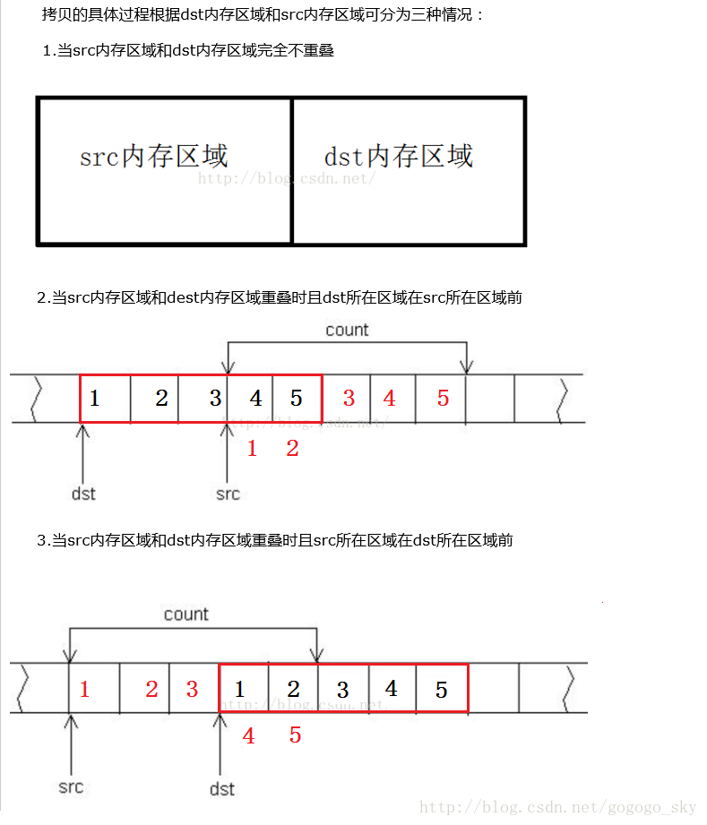
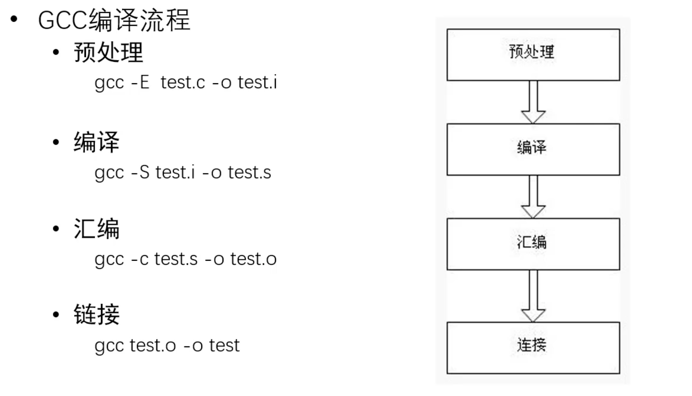

## 1、语言基础

1、请简述 C 和 C++中的 struct 有什什么区别?以及关于 C++ 中为什什么要保留 struct 关键字说出你的思考

> **从声明类型来讲：**
>
> - 首先在C中，struct关键字声明了一个结构体
>
> - 但是在C++中，struct实际上是声明了一个类
>
> - 在C++中呢，struct默认的成员属性是public的；而类它所默认的成员属性是private；
>
> **思考：**
>
> - 我们都知道C++在语言上兼容了C语言，那么C++中保留struct关键字就有迹可循了，因为C++中的struct本质上说是一个类，而且还要兼容C语言中的结构体，因此将struct关键字声明的默认成员属性设置为public

2、C++11 中 const 与 constexpr 的区别

> **从语义上讲：**const指的是一个不可修改的量，而constexpr指的是在编译期就可以确定的常量。
>
> - 总体来说：const可以作用在编译期和运行期，constexpr只能作用在编译期
>
> **延展性回答：**
>
> - **从修饰对象来讲：**
>     - const还可以修饰函数；可以修饰函数返回值，
>     - constexpr可以修饰表达式的返回值；constexpr还可以修饰构造函数，声明一个在编译期就可以确定的常量对象

3、请尽可能多的说出你所知道的关于 C++ 中虚函数的相关知识

> 虚函数是在C++中去实现多态的一种手段，
>
> 多态就是父类指针可以调用子类方法，
>
> 虚函数跟着对象走，普通成员方法跟着类走。
>
> 纯虚函数：定义接口，纯虚函数的类是我们的抽象类，一旦拥有继承关系
>
> 父类的虚构函数一定要设置成虚函数，如果父类指针指向了一个子类对象，当你想要delete这个父类指针的时候，我们想要调用的是这个子类的析构函数，那么要准确的调用这个子类的析构函数，我们就要设置父类的析构函数为虚函数。
>
> 虚函数实现的原理就是通过虚函数表来事项的，虚函数表的地址是存储在对象的头8个字节的，虚函数表中是存储着每一个虚函数的
>
> **延展**
>
> - 虚函数使用virtual关键字来使用的，那么virtual关键字通常是需要和override来配合使用的，当然没有override关键字也可以实现相应功能，但是override严谨性要更好。
> - final，被final关键字修饰的类是不可以被继承的
> - 通过虚函数表，你是怎么知道成员方法内部是有一个this指针的

## 2、语言基础

1、请分别介绍变量的声明与定义

> - 从语义层面解释
>
>     - 声明变量：就是说明程序中有这么一个变量
>     - 定义变量：需要给变量开辟存储空间
>     - extern int a；是声明，说明程序中有这个变量
>
> - 从编译运行角度来说
>
>     - 声明：主要作用在编译阶段，用于语法检查，重复声明的错误，一般就是在这个阶段
>     - 定义：主要作用在链接阶段，重复定义的错误，一般就是在这个阶段
>
> - 扩展部分
>
>     - 变量的存储区
>
>         - 内存栈区：存局部非静态变量
>
>         - 内存堆区：动态分配的内存malloc
>
>         - 常数区
>
>             - ```c
>                 int a = 123;
>                 char *s = "hello word";
>                 ```
>
>         - 静态区：存储静态变量
>
>         - 代码区
>
>     - 变量的声明：一般用于全局变量的跨源文件访问

2、请尽可能的介绍你所知道的有关 C++ 中构造函数和析构函数的知识

> - 作用
> - 构造函数：负责初始化一个对象
>     - 析构函数：负责给对象送终
> - 这是对象那个整个生命过程中，必然会经历的两个过程
> - 种类
> - 构造函数
>     - 析构函数
>     - 普通析构函数
>             - 默认构造
>             - 转换构造
>             - 拷贝构造
>                 - 为什么一定要传引用
>             - 移动构造
>                 - 左值与右值
>             - 有参构造
>             - 委托构造
>         - 虚析构函数
>             - 为什么要虚析构：正确的回收空间
> - 执行顺序
> - 先构造后析构
>     - 父类先于子类构造
> - 拓展部分
> - 初始化列表的执行顺序
>     - =default与=delete关键字
> - 对象不允许拷贝的类：把拷贝构造删除或者设置为私有
>     - 对象不允许定义在栈区的类：把析构函数删除或者设置为私有

3、请说明 malloc 和 new 的区别

> - 相同点
>     - 都是用在堆区中去申请内存的
>     - 都有配套的回收方法
> - 不同点
>     - 搭档不同
>         - malloc搭档free
>         - new搭档delete
>     - 性质不同
>         - malloc是函数
>         - new是运算符，可以重载
>     - 作用不同
>         - malloc只是用来申请存储空间
>         - new是用来创建对象的
>             - 申请存储空间
>             - 调用构造函数
> - 拓展部分
>     - malloc可以搭配new的原地构造方法使用
>     - malloc家族成员
>         - realloc：重新分配
>         - calloc：分配并初始化
> - 属性
>     - new/delete是C++关键字，需要编译器支持。malloc/free是库函数，需要头文件支持。
> - 参数
>     - 使用new操作符申请内存分配时无须指定内存块的大小，编译器会根据类型信息自行计算。而malloc则需要显式地指出所需内存的尺寸。
> - 返回类型
>     - new操作符内存分配成功时，返回的是对象类型的指针，类型严格与对象匹配，无须进行类型转换，故new是符合类型安全性的操作符。而malloc内存分配成功则是返回void * ，需要通过强制类型转换将void*指针转换成我们需要的类型。
> - 分配失败
>     - new内存分配失败时，会抛出bac_alloc异常。malloc分配内存失败时返回NULL。
> - 自定义类型
>     -  new会先调用operator new函数，申请足够的内存（通常底层使用malloc实现）。然后调用类型的构造函数，初始化成员变量，最后返回自定义类型指针。delete先调用析构函数，然后调用operator delete函数释放内存（通常底层使用free实现）。
>     -  malloc/free是库函数，只能动态的申请和释放内存，无法强制要求其做自定义类型对象构造和析构工作。
> - 重载
>     - C++允许重载new/delete操作符，特别的，布局new的就不需要为对象分配内存，而是指定了一个地址作为内存起始区域，new在这段内存上为对象调用构造函数完成初始化工作，并返回此地址。而malloc不允许重载。
> - 内存区域
>     - new操作符从自由存储区（free store）上为对象动态分配内存空间，而malloc函数从堆上动态分配内存。自由存储区是C++基于new操作符的一个抽象概念，凡是通过new操作符进行内存申请，该内存即为自由存储区。而堆是操作系统中的术语，是操作系统所维护的一块特殊内存，用于程序的内存动态分配，C语言使用malloc从堆上分配内存，使用free释放已分配的对应内存。自由存储区不等于堆，如上所述，布局new就可以不位于堆中。
>       

## 3、语言基础

1、请说明你所理解的设计模式的作⽤

> - 作用
>     - 可以反复使用的编码方式，提高开发效率
>     - 更容易被他人理解，提高写作效率
>     - 降低编码错误率，提高调试效率
>     - 算法是程序的灵魂，设计模式是编码的灵魂
> - 理性思考
>     - 每种设计模式都有其优点和缺点
>     - 不能不用设计模式，也不能全用设计模式

2、请介绍单例例模式的实现方式和作⽤

> - 作用
>     - 控制相关类的对象数量，保证全局只有一个活动对象(实例)
>     - 打比方：单例模式就是传说中的一山不容二虎
> - 实现方式
>     - 编码方式
>         - 类的构造和析构都设置成私有
>         - 添加此类型的静态成员变量instance，并为其实例化
>         - 在类中提供静态的获取对象的方法getinstance，返回值就是instance
>     - 初始化模式
>         - 懒汉模式
>         - 饿汉模式
> - 优缺点

3、请介绍访问者模式的应用场景及实现方式

> - 应用场景
>     - 需要根据对象的类，施加不同的操作
>     - 操作不属于对象方法也不属于类方法
>     - 打比方：访问者就是一个见人说人话，见鬼说鬼话的对象
> - 实现方式
>     - 定义一个访问者接口（抽象访问者），用于限定具体访问者visit方法的类
>     - 实现具体访问者类，多个visit方法传入对象类型不同，实现不同功能
>     - 抽象元素角色，定义访问者的接口accept(visitor)操作
>     - 具体元素角色，实现accept(visitor)接口，将自己的this指针传递给访问者的visit方法
> - 优缺点

## 4、语言基础

1、请介绍 C++ 中 thread 类的相关使⽤

> - thread 是C++11版本引入的线程库
>
> - thread是一个类
>
>     - 包括基本的构造函数和析构函数
>
>         ```c++
>         thread task01(func01, 参数)
>         thread task01(func01, 参数)
>             
>         task01.join() //等待相关线程的结束
>         
>         task01.detach() //剥离相关子线程，让它自由
>             
>         task01.swap() //交换两个线程对象
>         ```
>
>     - 绑定函数
>
>         - 普通函数
>         - 成员方法：成员函数指针
>         - 函数对象
>         - lambda表达式

2、请介绍 C++ 中 mutex 与 condition_variable 的相关使⽤ 

> - mutex
>
>     - 互斥锁
>
>     - 构造函数，std::mutex不允许拷贝构造，也不允许 move 拷贝，最初产生的 mutex 对象是处于 unlocked 状态的。
>
>         ```c++
>         mutex mu;
>         mu.lock; //调用线程将锁住该互斥量。线程调用该函数会发生下面 3 种情况：(1). 如果该互斥量当前没有被锁住，则调用线程将该互斥量锁住，直到调用 unlock之前，该线程一直拥有该锁。(2). 如果当前互斥量被其他线程锁住，则当前的调用线程被阻塞住。(3). 如果当前互斥量被当前调用线程锁住，则会产生死锁(deadlock)。
>         mu.unlock; //解锁，释放对互斥量的所有权。
>         mu.try_lock(); //尝试锁住互斥量，如果互斥量被其他线程占有，则当前线程也不会被阻塞。线程调用该函数也会出现下面 3 种情况，(1). 如果当前互斥量没有被其他线程占有，则该线程锁住互斥量，直到该线程调用 unlock 释放互斥量。(2). 如果当前互斥量被其他线程锁住，则当前调用线程返回 false，而并不会被阻塞掉。(3). 如果当前互斥量被当前调用线程锁住，则会产生死锁(deadlock)。
>         ```
>
> - condition_variable
>
>     - 条件变量
>
>         ```c++
>         condition_variable cv;
>         cv.wait(); //当前线程调用wait()后将被阻塞，直到另外某个线程调用notify_*唤醒当前线程
>         cv.wait_for(); //与wait()类似，只是wait_for可以指定一个时间段，在当前线程收到通知或者指定的时间超时之前，该线程都会处于阻塞状态。
>         cv.wait_until(); //与wait_for类似，只是wait_until可以指定一个时间点，在当前线程收到通知或者指定的时间点超时之前，该线程都会处于阻塞状态。
>         cv.notify_all(); //唤醒所有的wait线程，如果当前没有等待线程，则该函数什么也不做
>         cv.notify_one(); //唤醒某个wait线程，如果当前没有等待线程，则该函数什么也不做；
>         ```

3、如果让你设计一个线程池，你会怎样设计

> - Task类的准备
>     - 功能：将要执行的函数和相关参数封装对象
>     - 属性1:function<void( )>对象
>     - 属性2:优先级字段
>     - 关键点：使用bind方法将函数与其参数绑定
> - 线程内部的设计
>     - 资源类
>         - 线程对象数组
>         - 任务队列
>             - 普通队列
>             - 优先队列
>     - 同步类
>         - 互斥锁
>             - 读队列锁
>             - 写队列锁
>         - 条件变量
>             - 添加队列条件
>             - 队列空条件
> - 线程池的方法
>     - 构造函数：thread_pool(int)
>     - 启动线程池：start( )
>     - 添加任务：add_one_task(Task *)
>     - 强制停止：stop( )
>     - 等待任务停止：join( )
>     - 私有-获取任务：get_one_task( )
>     - 线程的工作方法：loop( )

## 5、语言基础

1、请介绍你所了解的 C++ 中的可调用对象的相关内容。 

> - 可调用对象类
>   - 普通函数	void func(int, int)
>   - 成员方法&类方法	void A::func(int, int)
>   - 函数对象（仿函数）重载了小括号运算符的类和对象
>   - lambda表达式 [](int, int)->void()
> - 相关扩展知识
>   - 函数指针
>   - std::function模版类对象

2、请说明左值和右值的区别，以及右值的相关作用。

> - 语义层面的区别
>   - 左值表变量
>   - 右值表临时量
> - 构造函数区别
>   - 左值：拷贝构造
>   - 右值：移动构造， 快速进行深拷贝
> - 相关影响
>   - 优点：加速了右值情况下的拷贝行为，改为移动构造
>   - 缺点：使得类的设计及模版的实现，需要考虑的更多了

3、如果让你设计一个 vector，你会怎么设计?

> - 存储结构
>   - 1、可扩容
>   - 2、查询速度快
>   - 3、块状链表
>     - 查询时间复杂度O(logn)
>     - 扩容时间复杂度O(1)
>   - 倍增扩容
>     - 查询时间复杂度O(1)
>     - 扩容时间复杂度O(n * t), 其中 t 不可控
> - 操作方法&模版参数（参考STL-Vector介绍即可）

## 6、语言基础

1、C++ 中如何设计一个不能申请在栈空间中的类?

> - 栈空间上，都是局部变量
> - 类和对象需要构造和析构
> - 栈空间上的对象析构是自动调用的

2、C++ 中的⾯面向对象的基本概念和基本特征分别是什什么? 

> - 封装：C语言中结构体的升级版，将相关的属性、方法封装在一个类中，用这个类（就是一个概念）去定义相关的对象，对象就代表一个实例
> - 继承
>   - 概念泛化：拥有共用的属性抽象出一个类
>   - 功能组合：定义抽象接口，定义功能
> - 多态
>   - 覆盖：虚函数去实现，子类去覆盖父类中的函数，最为干净
>   - 重载：同名的函数（运算符重载）

3、介绍 C++ 中的智能指针。

> - 智能指针产生的背景
>   - 避免由于在释放内存或者对象时产生的失误
> - 智能指针中引用计数的概念
>   - 避免内存泄漏
> - share_ptr/weak_ptr/unique_ptr
>   - share_ptr 引用计数+1
>   - weak_ptr 引用计数不+1
>   - unique_ptr 引用计数必须在[0, 1]范围内
> - make_shared/make_unique
>   - 构造职能指针的方法
> - 使用时，保持体系内部的一致性（一用到底）

## 7、语言基础

2、如何实现⼀个没有 Bug 的 MAX 宏

> ```c
> #define MAX(a, b) ({ \
>     __typeof(a) _a = (a); \
>     __typeof(b) _b = (b); \
>     _a > _b ? _a : _b; \
> })
> ```

3、当定义新类型的时候，使⽤用 typedef 和 define 有什什么区别?

> define是C语言中定义的语法，是预处理指令，在预处理时进行简单而机械的字符串替换，不作正确性检查，只有在编译已被展开的源程序时才会发现可能的错误并报错。
> typedef是关键字，在编译时处理，有类型检查功能。它在自己的作用域内给一个已经存在的类型一个别名，但不能在一个函数定义里面使用typedef。用typedef定义数组、指针、结构等类型会带来很大的方便，不仅使程序书写简单，也使意义明确，增强可读性。

4、为什么C++类中的拷贝构造函数要传引用

> 如果不传引用，将会无限循环拷贝构造

5、C++中的default 和delete的区别

> default 意味着什么都不需要做，会进行默认的相应操作
>
> delete 意味着相应的操作是已经被删除了，不可使用

## 8、语言基础

1、sizeof 与strlen的区别

> - **作用不同**
>
>      strlen()计算字符串的长度，以'\0'为字符串结束标志
>
>      sizeof()分配的数组实际所占的内存空间大小，不受里面存储内容影响
>
> - **类型不同**
>      strlen()是一个函数, sizeof()是一个单目运算符
>
> - **返回值不同**
>      strlen()返回值是size_t是一个大于等于0 的数
>      sizeof()返回编译过后内存占用的字节数
>
> - **参数不同**
>
>      strlen()参数必须是char *
>
>      sizeof()参数可以是数组、指针、类型、对象、函数等

2、strcpy的弊端

> **内存重叠**
>
> 
>
> ```c++
> (1)src+count<=dst或dst+count<=src即不重叠，这时正常从低字节依次赋值
> (2)dst+count>src  这时部分重叠，但不影响赋值拷贝，也可以从低字节开始
> (3)src+count>dst  这时也是部分重叠，但影响拷贝，应该从高字节逆序开始。
> ```
>
> **字符覆盖**
>
> 除了内存重叠，strcpy函数还有一个弊端：如果目的地址分配的长度小于源地址的要拷贝的数据的长度，那么会发生越界，就是说可能会把目的地址前或后的数据覆盖掉。

3、野指针

> - **野指针与垂悬指针的区别：**
>
> 野指针：访问一个已销毁或者访问受限的内存区域的指针，野指针不能判断是否为NULL来避免
> 垂悬指针：指针正常初始化，曾指向一个对象，该对象被销毁了，但是指针未制空，那么就成了悬空指针。
>
> - **概念**
>
> 指针指向了一块随机的空间，不受程序控制。
>
> - **野指针产生的原因：**
>
> 1、指针定义时未被初始化：指针在被定义的时候，如果程序不对其进行初始化的话，它会随机指向一个区域，因为任意指针变量（除了static修饰的指针）它的默认值都是随机的
> 2、指针被释放时没有置空：我们在用malloc()开辟空间的时候，要检查返回值是否为空，如果为空，则开辟失败；如果不为空，则指针指向的是开辟的内存空间的首地址。指针指向的内存空间在用free()和delete释放后，如果程序员没有对其进行置空或者其他赋值操作的话，就会成为一个野指针
> 3、指针操作超越变量作用域：不要返回指向栈内存的指针或者引用，因为栈内存在函数结束的时候会被释放。
>
> - **野指针的危害：**
>
> 问题：指针指向的内容已经无效了，而指针没有被置空，解引用一个非空的无效指针是一个未被定义的行为，也就是说不一定导致错误，野指针被定位到是哪里出现问题，在哪里指针就失效了，不好查找错误的原因。
>
> - **规避方法：**
> - 1.初始化指针的时候将其置为nullptr，之后对其操作。
> - 2.释放指针的时候将其置为nullptr。

4、多态的种类

> - 重载多态   函数重载、运算符重载
> - 强制多态   不同类型数据运算，强制类型转换
> - 包含多态   虚函数（动态绑定）
> - 模板多态   类模板

5、深拷贝与浅拷贝

> 深拷贝和浅拷贝最根本的区别在于是否真正获取一个对象的复制实体，而不是引用。
>
> 假设B复制了A，修改A的时候，看B是否发生变化：
>
> 如果B跟着**也变了**，说明是浅拷贝，拿人手短！（修改堆内存中的同一个值）
>
> 如果B**没有改变**，说明是深拷贝，自食其力！（修改堆内存中的不同的值）
>
> ```
> 浅拷贝（shallowCopy）只是增加了一个指针指向已存在的内存地址，
> 
> 深拷贝（deepCopy）是增加了一个指针并且申请了一个新的内存，使这个增加的指针指向这个新的内存，
> ```

6、gdb



> |    命令     |                  作用                  |
> | :---------: | :------------------------------------: |
> |    list     |                显示原码                |
> |  break NUM  |                设置断点                |
> |     run     |             运行可执行文件             |
> |  bt或where  |               显示调用栈               |
> |    next     |         单步执行（不进入函数）         |
> |    step     |          单位执行（进入函数）          |
> | layout next | 用于分割窗口，可以一边看代码，一边测试 |
> |    watch    |             查看变量的变化             |
> | P Variable  |              打印变量的值              |
> | P *arr@len  |                打印数组                |
> |      c      |             跳到下一个断点             |
> |      f      |             加载可执行程序             |
> |      r      |                  刷新                  |

7、进程通信

> 1.管道：速度慢，容量有限，只有父子进程能通讯   
>
> 2.FIFO：任何进程间都能通讯，但速度慢   
>
> 3.消息队列：容量受到系统限制，且要注意第一次读的时候，要考虑上一次没有读完数据的问题   
>
> 4.信号量：不能传递复杂消息，只能用来同步   
>
> 5.共享内存区：能够很容易控制容量，速度快，但要保持同步，比如一个进程在写的时候，另一个进程要注意读写的问题，相当于线程中的线程安全，当然，共享内存区同样可以用作线程间通讯，不过没这个必要，线程间本来就已经共享了同一进程内的一块内存