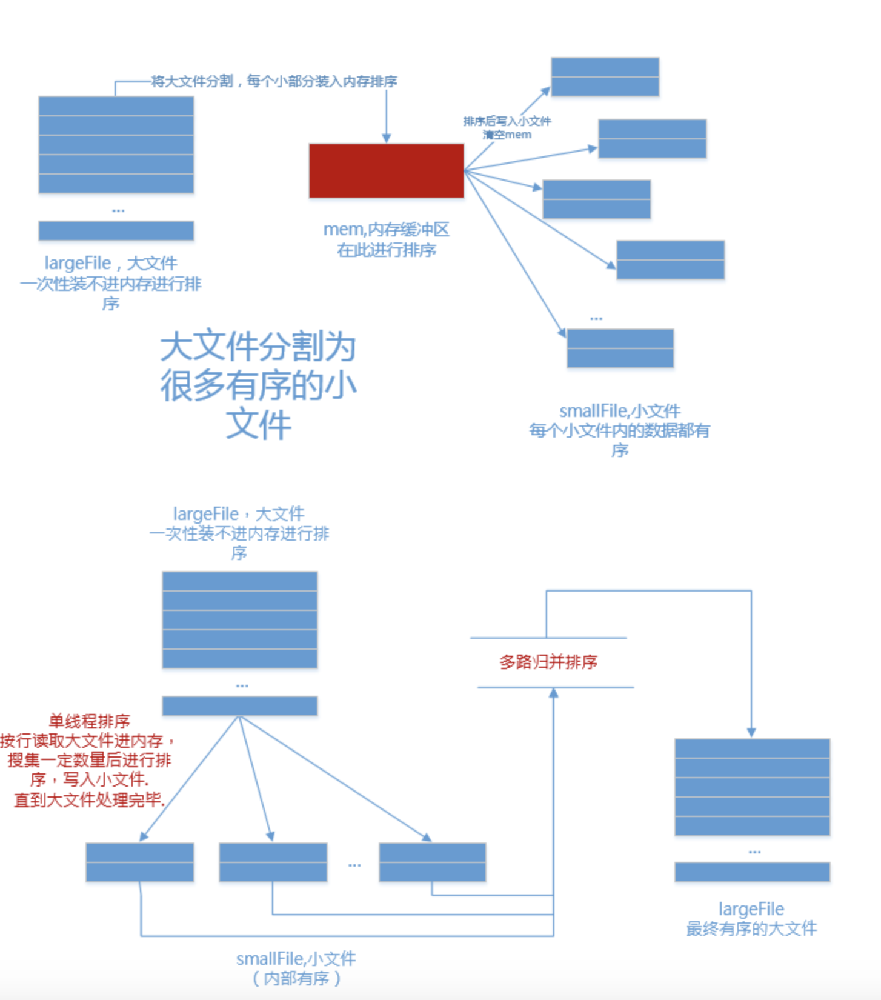

## 1、算法数据结构

1、请列列举出你所知道的所有排序算法，并且分析他们的时间复杂度

> ok，首先呢，排序算法应该分为两类，一类是稳定排序，另一类是非稳定的排序
>
> 所谓稳定排序就是相同的元素在排序前和排序后的前后位置是否发生改变，没有改变则排序是稳定的，改变则排序是不稳定的。
>
> 稳定排序
>
> - 插入排序:**逐个处理待排序的记录，每个记录与前面已排序已排序的子序列进行比较，将它插入子序列中正确位置**
>
>     - 最佳：升序。时间复杂度为O(n)
>     - 最差：降序。时间复杂度为O(n^2)
>     - 平均：对于每个元素，前面有一半元素比它大。时间复杂度为O(n^2)
>
> - 冒泡排序：**从数组的底部比较到顶部，比较相邻元素。如果下面的元素更小则交换，否则，上面的元素继续往上比较。这个过程每次使最小元素像个“气泡”似地被推到数组的顶部**
>
>     - 性能：冒泡排序是一种相对较慢的排序，没有较好的最佳情况执行时间。通常情况下时间复杂度都是O(n^2)
>     - 优化：增加一个变量flag，用于记录一次循环是否发生了交换，如果没发生交换说明已经有序，可以提前结束
>
> - 归并排序：**将一个序列分成两个长度相等的子序列，为每一个子序列排序，然后再将它们合并成一个序列。合并两个子序列的过程称为归并**
>
>     - 性能：logn层递归并，每一层都需要O(n)的时间代价，因此总的时间复杂度是O(nlogn)，该时间复杂度不依赖于待排序数组中数值的相对顺序。因此，是最佳，平均和最差情况下的运行时间
>
>         由于需要一个和带排序数组大小相同的辅助数组，所以空间代价为O(n)
>
>     - 优化：原地归并排序不需要辅助数组即可归并
>
> 非稳定排序
>
> - 选择排序：**第i次“选择”数组中第i小的记录，并将该记录放到数组的第i个位置。换句话说，每次从未排序的序列中找到最小元素，放到未排序数组的最前面**
>
>     - 性能：不管数组是否有序，在从未排序的序列中查找最小元素时，都需要遍历完最小序列，所以时间复杂度为O(n^2)
>     - 优化：每次内层除了找出一个最小值，同时找出一个最大值（初始为数组结尾）。将最小值与每次处理的初始位置的元素交换，将最大值与每次处理的末尾位置的元素交换。这样一次循环可以将数组规模减小2，相比于原有的方案（减小1）会更快
>
> - 快速排序：**首先选择一个轴值，小于轴值的元素被放在数组中轴值左侧，大于轴值的元素被放在数组中轴值右侧，这称为数组的一个分割(partition)。快速排序再对轴值左右子数组分别进行类似的操作。选择轴值有多种方法。最简单的方法是使用首或尾元素。但是，如果输入的数组是正序或者逆序时，会将所有元素分到轴值的一边。较好的方法是随机选取轴值**
>
>     - 性能
>         - 最佳情况：O(nlogn)
>         - 平均情况：O(nlogn)
>         - 最差情况：每次处理将所有元素划分到轴值一侧，O(n^2)
>     - 优化
>         1. 最明显的改进之处是轴值的选取，如果轴值选取合适，每次处理可以将元素较均匀的划分到轴值两侧：**三者取中法**：三个随机值的中间一个。为了减少随机数生成器产生的延迟，可以选取首中尾三个元素作为随机值
>
>         2. 当n很小时，快速排序会很慢。因此当子数组小于某个长度（经验值：9）时，什么也不要做。此时数组已经基本有序，最后调用一次插入排序完成最后处理
>
> - 堆排序：**堆排序首先根据数组构建最大堆，然后每次“删除”堆顶元素（将堆顶元素移至末尾）。最后得到的序列就是从小到大排序的序列**
>
>     - 性能：根据已有数组构建堆需要O(n)的时间复杂度，每次删除堆顶元素需要O(logn)的时间复杂度，所以总的时间开销为，O(n+nlogn)，平均时间复杂度为O(nlogn)
>
>         >注意根据已有元素建堆是很快的，如果希望找到数组中第k大的元素，可以用O(n+klogn)的时间，如果k很小，时间开销接近O(n)
>
> ok，**那这些排序算法我都是可以实现的，请问需要我着重讲解一下某个排序算法的实现原理吗？**

2、请尽可能多的说出与快速排序相关的知识

> - 流程：OK，首先快排，每次寻找一个基准值，然后将原属组分成两部分，前半部分小于基准值，后半部分大于基准值。然后对分成的两部分再分别去进行快排操作以达到一个递归的过程。
>
> - 性能：
>
>     - 最佳情况：O(nlogn)
>     - 平均情况：O(nlogn)
>     - 最差情况：每次处理将所有元素划分到轴值一侧，O(n^2)
>
>     **注意：**面试官询问最佳情况为什么是O(nlogn)
>
>     **回答：**首先我们要对n个元素进行分块操作，我们可以称之为partion，那么最好的情况是每次partion都将原序列分成等大的两部分，将原序列分成logn层，每一层都是n，那么最后就是O(nlogn)。
>
> - 优化：
>
>     - 基准值的选择：
>         - 随机选择：最明显的改进之处是轴值的选取，如果轴值选取合适，每次处理可以将元素较均匀的划分到轴值两侧
>         - **三者取中法**：三个随机值的中间一个。为了减少随机数生成器产生的延迟，可以选取首中尾三个元素中的中间值
>     - 递归操作：
>         - 单边递归：选择一边进行递归
>         - 当n很小时，快速排序会很慢。因此当子数组小于某个长度（经验值：9）时，什么也不要做。此时数组已经基本有序，最后调用一次插入排序完成最后处理
>     - 快速转堆排序：如果partion的深度过深，直接转成堆排序
>
> - **延伸**
>
>     - 本质思想就是二叉排序树
>
>         - 根结点—>基准值
>         - 左子树—>左区间
>         - 右子树—>右区间
>
>     - 快速选择算法
>
>         - Quick Selection算法和Quick Sort算法是由同一个作者提出，这两者之间有很大的相似之处——分治，即将问题的规模一次次的减小，直到求出最终解。
>
>             - 目标：找到第n大的数
>
>
>             - 随机产生一个pivot
>             - 根据这个pivot，将小于其的数放左边，大于其的数放右边
>             - 更新第n大数的估计值的位置，选择其中一边，直到=n
>             - 重复2、3步骤
>     
>         - 性能最好O(n)

3、如何判断链表有环、求环的长度以及找到环的起始点位置?简述算法过程

> 是否有环：快慢指针
>
> 环的长度：当快慢指针相遇时，让另外一个指针再去走一圈，即可得到环的长度
>
> 起始点位置：当两个指针在环中相遇以后，让另一个指针从链表头开始走，那两个指针一起走，当两个指针相遇的时候，就是在这个起始点
>
> **互动：**那之前我在leetcode上面呢，做过一道类似的题，叫做**快乐数**

## 2、算法数据结构

1、 如果现在有 k 个有序数组，如何合并成一个有序数组

> 给定K个有序数组，每个数组有n个元素，想把这些数组合并成一个有序数组
> 可以利用小顶堆完成，时间复杂度是O(nklogk)，具体过程如下：
>
> - 创建一个大小为n * k的数组保存最后的结果
> - 创建一个大小为 k 的小顶堆，堆中元素为 k 个数组中的每个数组的第一个元素
> - 重复下列步骤n * k次：
>     - 每次从堆中取出最小元素（堆顶元素），并将其存入输出数组中
>     - 用堆顶元素所在数组的下一元素将堆顶元素替换掉，
>     - 如果数组中元素被取光了，将堆顶元素替换为无穷大。每次替换堆顶元素后，重新调整堆
>     - 初始化最小堆的时间复杂度O(k)，总共有k * n次循环，每次循环调整最小堆的时间复杂度O(logk)，所以总的时间复杂度是O(knlogk)

2、请具体说明，为什什么归并排序适合处理大数据排序情况

> - 数据太多，递归太深 ->栈溢出？
>
> - 数据太多，数组太长 -> 内存溢出OOM(out of memory)？
>
> - > 数据量很大，函数调用很多，系统调用很多，内核/用户缓冲区拷贝很多，脏页回写很多，io-wait很高，io很繁忙，堆栈数据不断交换至swap，线程切换很多，每个环节的锁也很多.
>
>     > 总之，内存吃紧，问磁盘要空间，脏数据持久化过多导致cache频繁失效，引发大量回写，回写线程高，导致cpu大量时间用于上下文切换，一切，都很糟糕，所以24分钟不细看了，无法忍受.
>
> - **内部排序：**待排序记录存放在计算机随机存储器中（说简单点，就是**内存**）进行的排序过程。
>
> - **外部排序：**待排序记录的数量很大，以致于内存不能一次容纳全部记录，所以在排序过程中**需要对外存进行访问**的排序过程。
>
> - 内存极少的情况下，利用分治策略，利用外存保存中间结果，再用多路归并来排序;
>
> - ### 1.分
>
>     内存中维护一个极小的核心缓冲区`memBuffer`，将大文件`bigdata`按行读入，搜集到`memBuffer`满或者大文件读完时，对`memBuffer`中的数据调用内排进行排序，排序后将有序结果写入磁盘文件
>     循环利用`memBuffer`直到大文件处理完毕，得到n个有序的磁盘文件：
>
> - ### 2.合
>
>     现在有了n个有序的小文件，怎么合并成1个有序的大文件？
>     把所有小文件读入内存，然后内排？
>
>     利用如下原理进行归并排序：
>
> 

3、如何快速的输出⽆无序数组中前 k ⼤的值，请说明你的方法，并分析时间复杂度

> - 堆排序，然后对应调整几次
>     - 根据k是数组元素个数的位置，对应选择大顶堆或者小顶堆；
>     - 然后根据k值，进行取出堆顶元素，从而得到第K大值。
> - 快速选择算法
>     - 快速选择的总体思路与快速排序一致，选择一个元素作为基准来对元素进行分区，将小于和大于基准的元素分在基准左边和右边的两个区域。
>     - 不同的是，快速选择并不递归访问双边，而是只递归进入一边的元素中继续寻找。这降低了平均时间复杂度，从O(*n* log *n*)至**O(\*n\*)**，不过最坏情况仍然是O(*n*2)。

## 3、算法数据结构

1、假设有⼀个不知道多长的数字列，如何等概率的从⾥⾯抽取 100 个值

> - 蓄水池抽样
>
>     假设数据序列的规模为 𝑛n，需要采样的数量的为 𝑘k。首先构建一个可容纳 𝑘k 个元素的数组，将序列的前 𝑘k 个元素放入数组中。然后从第 𝑘+1k+1 个元素开始，以 𝑘𝑛kn 的概率来决定该元素是否被替换到数组中（数组中的元素被替换的概率是相同的）。 当遍历完所有元素之后，数组中剩下的元素即为所需采取的样本。
>
>     - 从n个元素中抽取了k个元素
>     - 每个元素被选中的概率
>         - n+1个元素被选中的概率 k / n + 1
>         - 之前元素留下的概率 k / n + 1
>     - 数学归纳法
>
> - 应用场景
>   
>     - 数据流采样问题

 2、要求设计一个函数，运⾏100次，⾮顺序的输出 1--100 内所有数字，要求，不能使⽤数组。

> - 使用链表
> - 线性同余法
>     - 剩余系
>     - 3 * k % 7
> - 拓展知识
>     - 欧拉定理
>     - 欧拉函数

 3、简述语言中的随机函数原理

> - C语言中随机函数的使用
>     - srand设置随机种子
>     - rand获取随机值
> - 原理介绍
>     - 真随机与伪随机的区别
>         - 是否可以确定下一个值
>     - 线性同余法
>     - 为什么要设置随机种子
>         - srand其实是一个伪随机

## 4、算法数据结构

1、一个⻓度为 n 的数组，只有一个数字出现了1次，其余数字均出现了 2 次，请找到出现 1 次的这个数字

> - 列表操作
>
>     - 遍历数组中的每一个元素
>
>         如果某个数组中的数字是新出现的，则将它添加到列表中
>
>         如果某个数字已经在列表中，删除它
>
>     - 时间复杂度O(n^2)
>
>     - 空间复杂度O(n)
>
> - 哈希表
>
>     - 遍历数组中的每一个元素
>
>         查找 hash_table 中是否有当前元素的键
>
>         如果没有，将当前元素作为键插入 hash_table
>
>         最后， hash_table中仅有一个元素，
>
>     - 时间复杂度O(n)
>
>     - 空间复杂度O(n)
>
> - 数学
>
>     - 2∗(*a*+*b*+*c*)−(*a*+*a*+*b*+*b*+*c*)=*c*
>     - 时间复杂度O(n)
>     - 空间复杂度O(n)
>
> - 位操作
>
>     - 异或本质是统计相应二进制位的奇偶性的 
>     - 如果我们对 0 和二进制位做 XOR 运算，得到的仍然是这个二进制位
>         - a⊕0=a
>     - 如果我们对相同的二进制位做 XOR 运算，返回的结果是 0
>         - a⊕a=0
>     - XOR 满足交换律和结合律
>         - a⊕b⊕a=(a⊕a)⊕b=0⊕b=b
>     - 时间复杂度O(n)
>     - 空间复杂度O(1)

2、一个⻓度为 n 的数组，其中的数值范围是 1--n，已知只有⼀个数字出现了两次，其余数字都只出现了 1 次，如何找到这个出现了2次的数字，分析你方法的时间复杂度。

> - 列表操作
>
>     - 遍历数组中的每一个元素
>
>         如果某个数组中的数字是新出现的，则将它添加到列表中
>
>         如果某个数字已经在列表中，找到了
>
>     - 时间复杂度O(n^2)
>
>     - 空间复杂度O(n)
>
> - 哈希表
>
>     - 遍历数组中的每一个元素
>
>         查找 hash_table 中是否有当前元素的键
>
>         如果没有，将当前元素作为键插入 hash_table
>
>         如果有，则找到了
>
>     - 时间复杂度O(n)
>
>     - 空间复杂度O(n)
>
> - 位运算

3、一个长度为 n 的数组，已知只有一个数字出现了两次，其余数字都只出现了 1 次，如何找到这个出现了 2 次的数字，分析你方法的时间复杂度。

> - 排序方法
>
> - 列表操作
>
>     - 遍历数组中的每一个元素
>
>         如果某个数组中的数字是新出现的，则将它添加到列表中
>
>         如果某个数字已经在列表中，找到了
>
>     - 时间复杂度O(n^2)
>
>     - 空间复杂度O(n)
>
> - 哈希表
>
> - 方法比较

## 5、算法数据结构

1、已知在一个有 n 个整数的数组中，数量量最多的一个数字超过了了 n/2 个，请设计算法找到这个数字。

> - 思路叙述：删除抵消
> - 代码实现
>   - 记录一个数值，以及当前数值出现的次数

2、已知在一个有 n 个元素的数组中，数量最多的一个数字超过了 n/k 个，请设计算法找到这个数字。

> - 摩尔投票法：用k-1个大小的数组作为筛选集，最后再对生成的备选集进行筛选
> - 代码实现

3、在一个数组中，⼤多数数字都出现 3 次，只有一个数字出现次数不是 3 次，请设计算法找到这个数字。

> - 二进制位统计法：相应二进制位上出现1的次数是不是3的倍数
>
> - 状态转换表
>
> - ```c++
>   int main() {
>       int n, c, a = 0, b = 0;
>       cin >> n;
>       while (n--) {
>           cin >> c;
>           int a1 = (a & ~b & ~c) | (~a & b & c);
>           int b1 = (~a & b & ~c) | (~a & ~b & c);
>           a = a1;
>           b = b1;
>       }
>       cout << (a | b) << endl;
>       return 0;
>   }
>   ```

## 6、算法数据结构

1、如何设计一个支持 min 操作的栈，min 函数返回当前栈中的最小值，要求，min、push、pop 操作时间复杂度都是 O(1) 的，应该如何设计。

> - 基础功能：栈功能
>
> - 附加功能：支持min操作， 要求O(1)的时间复杂度
>
> - 编码实现：
>
>   ```c++
>   #include <iostream>
>   #include <cstdio>
>   #include <cstdlib>
>   #include <queue>
>   #include <stack>
>   #include <algorithm>
>   #include <string>
>   #include <map>
>   #include <set>
>   #include <vector>
>   using namespace std;
>   
>   typedef pair<int, int> PII;
>   
>   struct NewStack : stack<PII> {
>   public :
>       NewStack() { this->t = 0; }
>       void push(int val) {
>           PII data(val, t++);
>           this->stack<PII>::push(data);
>           if (m_stack.empty() || val < m_stack.top().first) {
>               m_stack.push(data);
>           }
>           return ;
>       }
>       void pop() {
>           if (this->empty()) return ;
>           if (this->top().second == m_stack.top().second) {
>               m_stack.pop();
>           }
>           this->stack<PII>::pop();
>           return ;
>       }
>       int min() {
>           if (this->empty()) return 0;
>           return m_stack.top().first;
>       }
>   private:
>       int t;
>       stack<PII> m_stack;
>   };
>   
>   int main() {
>       NewStack s;
>       int op, val;
>       while (cin >> op >> val) {
>           switch (op) {
>               case 0: s.push(val); break;
>               case 1: s.pop(); break;
>               case 2: cout << s.min() << endl; break;
>           }
>       }
>       return 0;
>   }
>   ```

2、有一个不包含重复元素的数组，如何快速的找到连续的 k 个位置，使得这 k 个位置上⾯的数字排序以后在数值上也是连续的。要求算法时间复杂度为 O(n)。

> - 理解问题
> - 找到关键条件
> - 设计算法及编码

3、给定 k 值，如何找到链表的倒数第 k 个元素。一个指针怎么做?两个指针怎么做?

> - 一个指针，跑两次
> - 两个指针，跑一次
