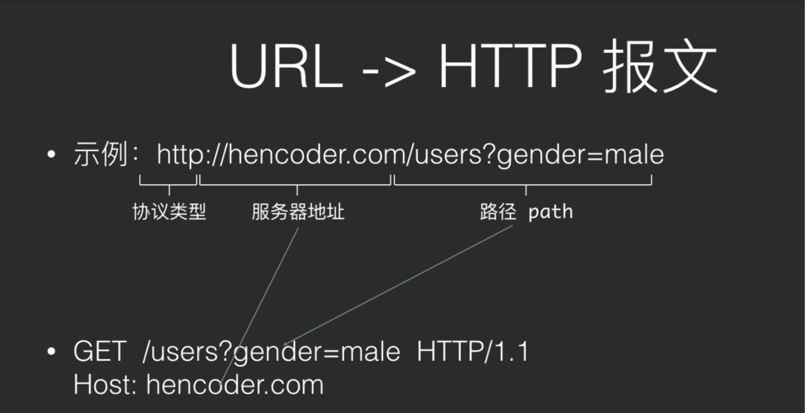
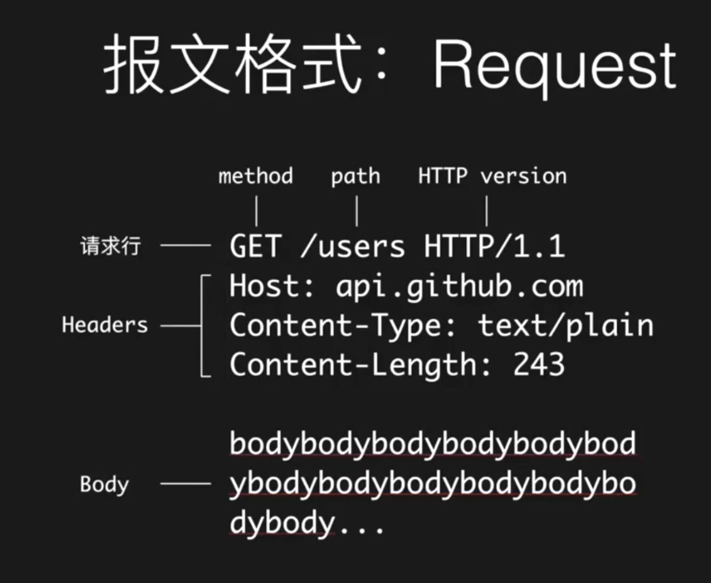
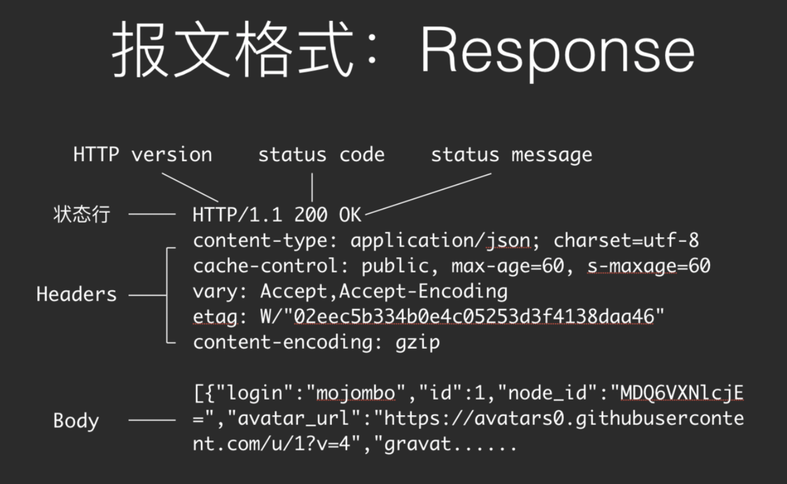
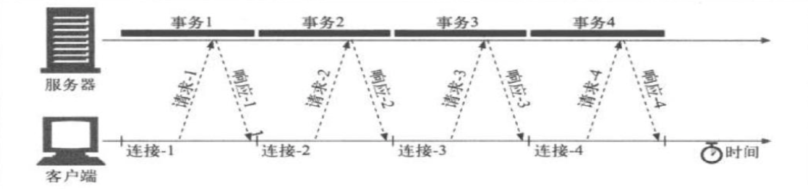
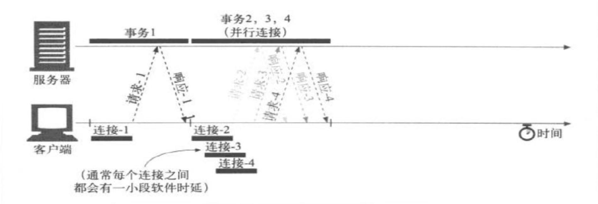
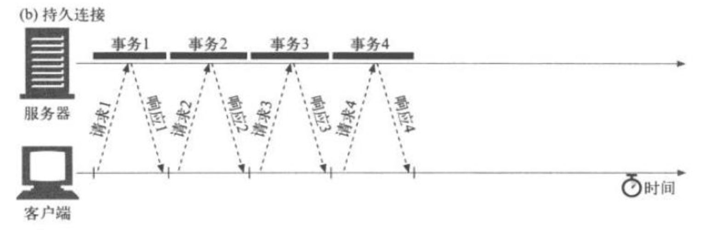
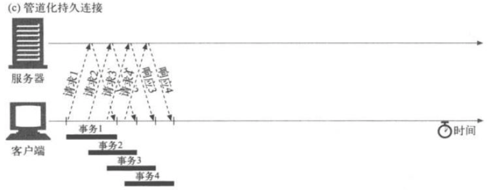

# 1、计算机网络

1、 网络通讯中的时延包括哪些，分别是怎么引起的，占比最大的是什么? 

> **时延：**时延是指一个报文或分组从一个网络的一端传送到另一个端所需要的时间
>
> - **处理时延**：检查分组首部，决定将分组导向何处所需的时延，数据更改在一个服务器上完成与该更改出现在另一个服务器上之间所用的时间
> - **排队时延**：分组在链路上等待传输时，经受的排队时间，排队时延是指分组在经过网络传输时，要经过许多的路由器。但分组在进入路由器后要在输入队列中排队等待处理。在路由器确定了转发接口后，还要在输出队列中排队等待转发。
> - **传输时延**：将分组的所有比特推向链路所需的时间
> - **传播时延**：分组在链路中传播所需的时间
>
> 占比最大的应该是排队时延

2、请你描述一下TCP/IP五层模型

> |  参考模型  |           各层解释           |          对应设备          |      典型协议       |
> | :--------: | :--------------------------: | :------------------------: | :-----------------: |
> |   应用层   |      为应用程序提供服务      |           计算机           |      DHCP、DNS      |
> |   表示层   |    数据格式转换、数据加密    |           计算机           |    Telnet、SNMP     |
> |   会话层   |     建立、管理、维护会话     |           计算机           |      SMTP、SSH      |
> |   传输层   | 建立、管理、维护端到端的连接 |         进程和接口         |      TCP、UDP       |
> |   网络层   |    IP地址与路由选择，分组    | 路由器、防火墙、多层交换机 |    IP、ICMP、ARP    |
> | 数据链路层 |  提供介质访问和链路管理，帧  |     网卡、网桥、交换机     |    PPP、Ethernet    |
> |   物理层   |         物理层，比特         |    中继器、集线器、网线    | IEEE802、[1A,2..11] |
>
> * **五层因特网协议栈**
>     - **应用层**：任务是通过应用进程间的交互来完成特定网络应用
>     - **运输层**：负责向两台主机中进程之间的通信提供数据传输服务
>     - **网络层**：负责为分组交换网上的不同主机提供通信服务、选择合适的路由
>     - **链路层**：将网络层的数据报封装成帧，使用链路层协议在相邻节点间的链路上传输帧
>     - **物理层**：将帧中一个个比特从一个节点移动到下一个节点
> * **七层OSI参考模型**
>     - **表示层**：使通信的应用程序能够解释交换数据的含义，提供数据压缩、数据加密等服务
>     - **会话层**：提供了数据交换的定界和同步功能，包括建立检查点和恢复方案的方法

3、交换机和路由器有什么区别

> **交换机：**集线器、交换机都是做端口扩展的，这就是扩大局域网的接入点
>
> **路由器：**路由器是用来做网间连接，也就是用来连接不同的网络
>
> |                            路由器                            |                        交换机                        |
> | :----------------------------------------------------------: | :--------------------------------------------------: |
> |          路由器可以给你的局域网自动分配IP、虚拟拨号          |             交换机只是用来分配网络数据的             |
> | 路由器在网络层，路由器根据IP寻址路由器可以处理TCP/IP协议，交换机不行 |        交换机在链路层，交换机根据MAC地址寻址         |
> | 路由器可以把一个IP分配给多个主机使用，这些主机对外只表现一个IP | 交换机可以把很多个主机连起来，这些主机对外各有各的IP |
> |                     路由器可以提供防火墙                     |                     交换机不可以                     |

## 2、计算机网络

1、详细描述域名系统协议（DNS）

> - 用途
>     - DNS：因特网提供的一项核心服务
>     - 将域名和IP地址相互映射成一个分布式的数据库，能够使我们通过域名访问，更加方便的访问互联网上的资源
> - 底层协议
>     - UDP（53）
>     - TCP（53）：当字节长度超过512的时候
> - 组成
>     - 域名结构：www.baidu.com
>         - 根域:**.**
>         - 顶级域:**.com**
>         - 二级域:**baidu**
>         - 子域
>         - 主机:**www**
>     - DNS服务器层级结构
>         - 根DNS服务器:**全球只有13个**
>         - 顶级DNS服务器
>         - 权威DNS服务器
>         - 本地DNS服务器
> - 工作流程
>     - 迭代模式：进行询问查询
>     - 递归模式：依次进行访问
>     - 实际：递归+迭代

2、详细描述文件传送协议（FTP）

> - 用途
>     - 主要用来在互联网上进行文件传输
> - 底层协议
>     - TCP
>     - 也有使用UDP实现的ftp
> - 组成
>     - CS架构
>     - 两条连接
>         - 控制连接TCP（21）[长连接]
>         - 数据连接TCP（20）[短连接]
>             - 只有进行数据传输的时候才会连接
> - 工作流程
>     - 主动模式（server主动连接客户端）[默认]
>     - 被动模式（server被动接受连接）

3、详细描述动态主机配置协议（DHCP）

> - 用途
>     - 将Mac地址转换为IP地址
>     - 动态的集中分配IP地址
> - 底层协议
>     - UDP（67，68）
> - 组成
>     - CS架构
> - 工作流程
>     - 客户端发送Discover报文
>     - 服务器发送Offer报文
>     - 客户端选择并发送Request报文
>     - 服务器发送ACK报文
>     - 客户端发送Release报文下线

## 3、计算机网络

1、请详细说明HTTP协议的工作机制

> - 概念
>
>     HyperText Transfer Protocol 超文本传输协议。超文本：在电脑中显示的、含有可以指向其他文本的链接的文本。
>
> - 工作机制
>
>     浏览器通过Http向服务器发送请求，服务器返回响应，浏览器通过其渲染引擎，也就是内核，将服务器返回的响应渲染到浏览器上。
>
>     - 浏览器是怎样将URL转化成发送给服务器的请求的
>
>         - 
>         - 如上所示，http:是协议类型、//hencoder.com/是服务器地址、users?gender=male是路径path
>
>     - 请求和响应的格式分别是什么
>
>         - Request
>
>             - 
>
>             - 上图中详细写明了请求报文的格式，请求行中的path和body是给服务器看的。path用来寻找是服务器中的哪一个表，body是要插入的数据。
>
>                 #### Request Method：
>
>                 · GET：获取资源，没有Body。（从网上拿东西）
>                 · POST：增加或修改资源，一定有Body。
>                 ·PUT：修改资源，有Body，只修改。
>                 ·DELETE ：删除资源，没有Body。
>                 ·HEAD：与GET相同，不同的是服务器不会返回Body，可在下载时使用，先请求一下，查看文件大小等信息。
>
>         - Response
>
>             - 
>
>             - #### Response Status Code
>
>                 对结果做出类型化描述。
>                 ·1xx：临时性消息。100：分段发生请求时，服务器接受到每段消息时返回100，提醒客户端可以继续发送了。101
>                 ·2xx：成功。
>                 ·3xx：重定向。
>                 ·4xx：客户端错误。如：400:参数不对，服务器无法理解该请求。401:未登录。等
>                 ·5xx：服务器错误。
>
> - 结合OSI七层协议
>
> - 
>
> - 提升http性能
>
> - 
>     - 并行连接
>         - 通过多条TCP连接发起并发的HTTP请求
>         - 
>     - 持久连接
>         - keep-alive,长连接，重用TCP连接，以消除连接和关闭的时延,以事务个数和时间来决定是否关闭连接
>         - 
>     - 管道化连接
>         - 通过共享TCP连接发起并发的HTTP请求
>         - 
>     - 复用的连接：
>         　　交替传送请求和响应报文（实验阶段）

2、请详细说明TCP三次握手及四次挥手，说明TCP状态转换序列。

> - 3次握手
>
>     - 
>     - **客户端向服务器发送SYN报文段**（不包含应用层数据，首部的一个标志位(即SYN比特)被置位，客户端随机化选择(避免攻击)一个起始序号x）
>     - 服务器为该TCP连接分配TCP缓存和变量，**返回一个SYNACK报文段**（也不包含应用层数据，SYN比特被置为1，ACK为x+1，服务器选择自己的初始序列y）
>     - 客户机为该连接分配缓存和变量，**返回一个对SYNACK报文段进行确认的报文段**（因为连接已经建立了，所以SYN比特被置为0）
>
>     **如果客户端不发送ACK来完成第三次握手，最终(通常是一分钟后)服务器将终止该半开连接并回收已分配的资源（在第三次握手前分配缓存和变量，可能会受到SYN洪泛攻击）**
>
>     **如果第二次握手丢包怎么办？第三次呢？**[——知乎车小胖的回答](https://www.zhihu.com/question/24853633)
>
>     * **第二个包，即B发给A的SYN +ACK 中途被丢，没有到达A**：B会周期性超时重传，直到收到A的确认 
>     * **第三个包，即A发给B的ACK 中途被丢，没有到达B**：A发完ACK，单方面认为TCP为 Established状态，而B显然认为TCP为Active状态
>         - **假定此时双方都没有数据发送**：B会周期性超时重传，直到收到A的确认，收到之后B的TCP 连接也为Established状态，双向可以发包
>         - **假定此时A有数据发送**：B收到A的 Data + ACK，自然会切换为established 状态，并接受A的Data
>         - **假定B有数据发送**：数据发送不了，会一直周期性超时重传SYN + ACK，直到收到A的确认才可以发送数据
>
>     >SYN洪泛攻击：攻击者发送大量的TCP SYN报文段，而不完成三次握手的第三步。通过从多个源发送SYN能够加大攻击力度，产生DDos(分布式拒绝服务) SYN洪泛攻击
>     >预防：SYN cookies
>
>     **SYN cookies预防SYN洪泛攻击**：
>
>     * 当服务器接收到一个SYN报文段时，它并不知道该报文段是来自一个合法的用户，还是一个SYN洪泛攻击的一部分。因此服务器不会为该报文段生成一个半开TCP连接。相反，服务器生成一个**初始TCP序列号y**，该序列号是SYN报文段的**源和目的IP地址、端口号**以及仅被该服务器所知的**秘密数**的一个散列函数，这种精心制作的初始序列号被称作“cookie”。服务器发送具有这种特殊序列号的SYNACK分组，服务器并不记忆该cookie或任何对应于SYN的其他状态信息
>     * 如果客户机是合法的，它将返回一个ACK报文段。服务器一旦收到该ACK，需要验证与前面发送的某些SYN对应的ACK。对于一个合法的ACK，确认字段中的值等于SYNACK序号字段y的值加1。服务器将使用在ACK报文段中的相同字段和秘密数运行相同的函数。如果该函数的结果加1与确认号相同，服务器就认为该ACK对应于前面发送的SYN报文段，生成一个具有套接字的全开的连接
>     * 如果客户机没有返回一个ACK报文段，则初始化的SYN也没有对该服务器产生危害，因为服务器没有为它分配任何资源
>
>     **前两次“握手”不包含有效载荷，第三次“握手”可以承载有效载荷**
>
>     > 为什么需要3次握手而不是4次或2次？[——知乎车小胖的回答](https://www.zhihu.com/question/24853633)
>
> - 4次挥手
>
>     - TCP连接的两个进程中任意一个都能终止该连接，连接关闭需要4步。假设客户端发起一个关闭请求：
>     - 
>     - **客户端发送一个FIN报文**（首部中的FIN比特被置位）
>     - **服务器返回一个对FIN报文的确认报文**
>     - **服务器发送一个FIN报文**（首部中的FIN比特被置位）
>     - **客户端返回一个对FIN报文的确认报文**
>
>     **MSL(最长分节生命期)是任何IP数据报能够在因特网中存活的最长时间**（IP数据报中的TTL首部为8位，具有最大TTL，即255的分组，在网络中存在的时间不能超过MSL）。任何TCP实现都必须为MSL选择一个值。RFC 1122的建议值是2分钟，不过源自Berkeley的实现传统上改用30秒。意味着TIME_WAIT状态的持续时间再1分钟到4分钟之间
>
>     >四次挥手是因为TCP是全双工的，前2次挥手用于关闭一个方向的数据通道，后两次挥手用于关闭另外一个方向的数据通道
>
>     [TIME-WAIT状态的详细说明](http://elf8848.iteye.com/blog/1739571)，主要有2个存在的理由：
>
>     * 可靠地实现TCP全双工连接的终止
>     * 等待迷途分组在网络中消逝
>
>     >nmap：可以“侦察”打开的TCP接口、UDP接口；还能“侦察”防火墙及其配置；甚至能“侦察”应用程序及操作系统版本

3、说明TCP滑动窗口?

> - **滑动窗口协议：**
>     - TCP协议的使用
>     - 维持发送方/接收方缓冲区
>         缓冲区是 用来解决网络之间数据不可靠的问题，例如丢包，重复包，出错，乱序
>
> 在TCP协议中，发送方和接受方通过各自维护自己的缓冲区。通过商定包的重传机制等一系列操作，来解决不可靠的问题。
>
> - **问题一：如何保证次序？**
>
> > 提出问题：在我们滑动窗口协议之前，我们如何来保证发送方与接收方之间，每个包都能被收到。并且是按次序的呢？
> >
> > 
> >
> > 发送方发送一个包1，这时候接收方确认包1。发送包2，确认包2。就这样一直下去，知道把数据完全发送完毕，这样就结束了。那么就解决了丢包，出错，乱序等一些情况！同时也存在一些问题。问题：吞吐量非常的低。我们发完包1，一定要等确认包1.我们才能发送第二个包。
>
> - **问题二：如何提高吞吐量？**
>
> > 提出问题：那么我们就不能先连发几个包等他一起确认吗？这样的话，我们的速度会不会更快，吞吐量更高些呢？
> >
> > 
> >
> > 如图，这个就是我们把两个包一起发送，然后一起确认。可以看出我们改进的方案比之前的好很多，所花的时间只是一个来回的时间。接下来，我们还有一个问题：改善了吞吐量的问题
>
> - **问题三：如何实现最优解？**
>
> > 问题：我们每次需要发多少个包过去呢？发送多少包是最优解呢？
> >
> > 我们能不能把第一个和第二个包发过去后，收到第一个确认包就把第三个包发过去呢？而不是去等到第二个包的确认包才去发第三个包。这样就很自然的产生了我们"滑动窗口"的实现。
> >
> > 
> >
> > 在图中，我们可看出灰色1号2号3号包已经发送完毕，并且已经收到Ack。这些包就已经是过去式。4、5、6、7号包是黄色的，表示已经发送了。但是并没有收到对方的Ack，所以也不知道接收方有没有收到。8、9、10号包是绿色的。是我们还没有发送的。这些绿色也就是我们接下来马上要发送的包。 可以看出我们的窗口正好是11格。后面的11-16还没有被读进内存。要等4号-10号包有接下来的动作后，我们的包才会继续往下发送。
> >
> > **正常情况**
> >
> > 
> >
> > 可以看到4号包对方已经被接收到，所以被涂成了灰色。“窗口”就往右移一格，这里只要保证“窗口”是7格的。 我们就把11号包读进了我们的缓存。进入了“待发送”的状态。8、9号包已经变成了黄色，表示已经发送出去了。接下来的操作就是一样的了，确认包后，窗口往后移继续将未发送的包读进缓存，把“待发送“状态的包变为”已发送“。
> >
> > **丢包情况**
> >
> > 有可能我们包发过去，对方的Ack丢了。也有可能我们的包并没有发送过去。从发送方角度看就是我们没有收到Ack。
> >
> > 
> >
> > 发生的情况：一直在等Ack。如果一直等不到的话，我们也会把读进缓存的待发送的包也一起发过去。但是，这个时候我们的窗口已经发满了。所以并不能把12号包读进来，而是始终在等待5号包的Ack。
> >
> > > 如果我们这个Ack始终不来怎么办呢？
> >
> > **超时重发**
> >
> > 这时候我们有个解决方法：`超时重传`
> > 这里有一点要说明：这个Ack是要按顺序的。必须要等到5的Ack收到，才会把6-11的Ack发送过去。这样就保证了滑动窗口的一个顺序。
> >
> > 
> >
> > 这时候可以看出5号包已经接受到Ack，后面的6、7、8号包也已经发送过去已Ack。窗口便继续向后移动。

## 4、计算机网络

1、socket的阻塞和非阻塞模式有什么不同?

> - 阻塞
>
>     - 阻塞就是干不完不准回来
>
> - 非阻塞
>
>     - 非阻塞就是就是你先干，我现看看有其他事没有，完了告诉我一声
>
> - 例如
>
>     - 我们拿最常用的send和recv两个函数来说吧... 
>         比如你调用send函数发送一定的Byte,在系统内部send做的工作其实只是把数据传输(Copy)到TCP/IP协议栈的输出缓冲区,它执行成功并不代表数据已经成功的发送出去了,如果TCP/IP协议栈没有足够的可用缓冲区来保存你Copy过来的数据的话...
>
>     - 这时候就体现出阻塞和非阻塞的不同之处了:
>
>         对于阻塞模式的socket send函数将不返回，直到系统缓冲区有足够的空间把你要发送的数据Copy过去以后才返回,
>
>         而对于非阻塞的socket来说send会立即返回 WSAEWOULDDBLOCK告诉调用者说:"发送操作被阻塞了!!!你想办法处理吧..." 
>         对于recv函数,同样道理,该函数的内部工作机制其实是在等待TCP/IP协议栈的接收缓冲区通知它说:嗨,你的数据来了.对于阻塞模式的socket 来说如果TCP/IP协议栈的接收缓冲区没有通知一个结果给它它就一直不返回:耗费着系统资源....对于非阻塞模式的socket该函数会马上返回,然后告诉你:WSAEWOULDDBLOCK---"现在没有数据,回头在来看看"
>
> - 拓展
>
>     - 同步
>         - 所谓同步，就是在发出一个功能调用时，在没有得到结果之前，该调用就不返回。按照这个定义，其实绝大多数函数都是同步调用（例如sin, isdigit等）。但是一般而言，我们在说同步、异步的时候，特指那些需要其他部件协作或者需要一定时间完成的任务。最常见的例子就是 SendMessage。该函数发送一个消息给某个窗口，在对方处理完消息之前，这个函数不返回。当对方处理完毕以后，该函数才把消息处理函数所返回的 LRESULT值返回给调用者。
>     - 异步
>         - 异步的概念和同步相对。当一个异步过程调用发出后，调用者不能立刻得到结果。实际处理这个调用的部件在完成后，通过状态、通知和回调来通知调用者。以 CAsycSocket类为例（注意，CSocket从CAsyncSocket派生，但是起功能已经由异步转化为同步），当一个客户端通过调用 Connect函数发出一个连接请求后，调用者线程立刻可以朝下运行。当连接真正建立起来以后，socket底层会发送一个消息通知该对象。这里提到执行部件和调用者通过三种途径返回结果：状态、通知和回调。可以使用哪一种依赖于执行部件的实现，除非执行部件提供多种选择，否则不受调用者控制。如果执行部件用状态来通知，那么调用者就需要每隔一定时间检查一次，效率就很低（有些初学多线程编程的人，总喜欢用一个循环去检查某个变量的值，这其实是一种很严重的错误）。如果是使用通知的方式，效率则很高，因为执行部件几乎不需要做额外的操作。至于回调函数，其实和通知没太多区别。
>     - 阻塞
>         - 阻塞调用是指调用结果返回之前，当前线程会被挂起。函数只有在得到结果之后才会返回。有人也许会把阻塞调用和同步调用等同起来，实际上他是不同的。对于同步调用来说，很多时候当前线程还是激活的，只是从逻辑上当前函数没有返回而已。例如，我们在CSocket中调用Receive函数，如果缓冲区中没有数据，这个函数就会一直等待，直到有数据才返回。而此时，当前线程还会继续处理各种各样的消息。如果主窗口和调用函数在同一个线程中，除非你在特殊的界面操作函数中调用，其实主界面还是应该可以刷新。socket接收数据的另外一个函数recv则是一个阻塞调用的例子。当socket工作在阻塞模式的时候，如果没有数据的情况下调用该函数，则当前线程就会被挂起，直到有数据为止。
>     - 非阻塞
>         - 非阻塞和阻塞的概念相对应，指在不能立刻得到结果之前，该函数不会阻塞当前线程，而会立刻返回

2、说明C语言如何使用socket编程。

> - 选择通信方式：TCP、UDP
> - 选择协议组：IPV4、IPV6
> - 确定IP地址
> - 进行socket：创建套接字、绑定IP地址、进行监听、进行连接、进行通信、关闭套接字。

3、说明TCP流量控制机制。

> - TCP流量控制机制
>     - 流量控制就是让发送方的发送速率不要太快。让接收方来得及接收。
> - 对于成块数据流，TCP利用滑动窗体机制来实现流量的控制
> - 对于交互数据流，TCP利用延时ACK和Nagle算法来实现流量的控制。

## 5、计算机网络

1、TIME_WAIT是如何引起的，有什么作用，在编程时会有什么弊端，如果有，可以如何解决?

> - 产生
>
> 首先调用close()发起主动关闭的一方，在发送最后一个ACK之后会进入time_wait的状态，也就说该发送方会保持2MSL时间之后才会回到初始状态。MSL值得是数据包在网络中的最大生存时间。产生这种结果使得这个TCP连接在2MSL连接等待期间，定义这个连接的四元组（客户端IP地址和端口，服务端IP地址和端口号）不能被使用。
>
> - 避免
>
> 首先服务器可以设置SO_REUSEADDR套接字选项来通知内核，如果端口忙，但TCP连接位于TIME_WAIT状态时可以重用端口。在一个非常有用的场景就是，如果你的服务器程序停止后想立即重启，而新的套接字依旧希望使用同一端口，此时SO_REUSEADDR选项就可以避免TIME_WAIT状态。

2、当TCP的一端关闭了TCP连接，另一端可以感知到吗，如果可以，是如何感知到的，如果不可以，是因为什么?

> 可以
