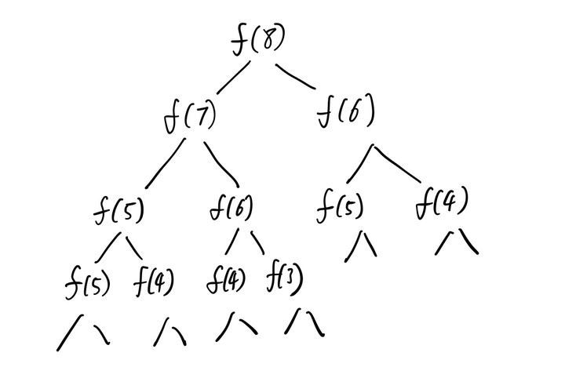

# 1、递归

## 简介

递归的基本思想就是把规模大的问题转化为规模小的相似的子问题来解决。特别地，在函数实现时，因为解决大问题的方法和解决小问题的方法往往是同一个方法，所以就产生了函数调用它自身的情况，这也正是递归的定义所在。格外重要的是，这个解决问题的函数必须有明确的结束条件，否则就会导致无限递归的情况。

## 步骤

- 递归第一个步骤：明确函数要做什么

对于递归，一个最重要的事情就是要明确这个函数的功能。这个函数要完成一样什么样的事情，是完全由程序员来定义的，当写一个递归函数的时候，先不要管函数里面的代码是什么，而要先明确这个函数是实现什么功能的。

比如，我定义了一个函数，这个函数是用来计算n的阶乘的。

```c++
// 计算n的阶乘（假设n不为0）
int f(int n) {
    // 先不管内部实现逻辑
}
```

这样，就完成了第一个步骤：明确递归函数的功能。

- 递归第二个步骤：明确递归的结束（退出递归）条件

所谓递归，就是会在函数的内部逻辑代码中，调用这个函数本身。因此必须在函数内部明确递归的结束（退出）递归条件，否则函数会一直调用自己形成死循环。意思就是说，需要有一个条件（标识符参数）去引导递归结束，直接将结果返回。要注意的是，这个标识符参数需要是可以预见的，对于函数的执行返回结果也是可以预见的。

比如在上面的计算n的阶乘的函数中，当n=1的时候，肯定能知道f(n)对应的结果是1，因为1的阶乘就是1，那么我们就可以接着完善函数内部的逻辑代码，即将第二元素（递归结束条件）加进代码里面。

```c++
// 计算n的阶乘（假设n不为0）
int f(int n) {
    if (n == 1) {
        return 1;
    }
}
```

当然了，当n=2的时候，也可以知道n的阶乘是2，那么也可以把n=2作为递归的结束条件。

```c++
// 计算n的阶乘（假设n>=2）
int f(int n) {
    if (n == 2) {
        return 2;
    }
}
```

这里就可以看出，递归的结束条件并不局限，只要递归能正常结束，任何结束条件都是允许的，但是要注意一些逻辑上的细节。比如说上面的n==2的条件就需要n>2，否则当n=1的时候就会被漏掉，可能导致递归不能正常结束。完善一下就是当n<=2的时候，f(n)都会等于n。

```c++
// 计算n的阶乘（假设n不为0）
int f(int n) {
    if (n <= 2) {
        return n;
    }
}
```

这样，就完成了第二步骤：明确递归的退出条件。

- 递归的第三个步骤：找到函数的等价关系式

递归的第三个步骤就是要不断地缩小参数的范围，缩小之后就可以通过一些辅助的变量或操作使原函数的结果不变。比如在上面的计算n的阶乘的函数中，要缩小f(n)的范围，就可以让f(n)=n* f(n-1)，这样范围就从n变成了n-1，范围变小了，直到范围抵达n<=2退出递归。并且为了维持原函数不变，我们需要让f(n-1)乘上n。说白了，就是要找到一个原函数的等价关系式。在这里，f(n)的等价关系式为n*f(n-1)，即f(n)=n*f(n-1)。

```c++
// 计算n的阶乘（假设n不为0）
int f(int n) {
    if (n <= 2) {
        return n;
    }
    // 把n打出来看一下，你就能明白递归的原理了
    cout << n << endl;
    // 加入f(n)的等价操作逻辑
    return n * f(n - 1);
}
```

到这里f(n)的功能就基本实现了。每次写递归函数的时候，强迫自己跟着这三个步骤走，能达到事半功倍的效果。另外也可以看出，第三个步骤几乎是最难的一个步骤。

## 实例

### **递归实例1：斐波那契数列**

斐波那契数列的是这样一个数列：1、1、2、3、5、8、13、21、34、….，即第一项 f(1) = 1、第二项 f(2) = 1、…..、第 n 项目为 f(n)=f(n-1)+f(n-2)，求第 n 项的值是多少。

递归第一个步骤：明确函数要做什么

假设f(n)的功能是求第n项的值，代码如下：

```c++
int f(int n) {
    
}
```

递归第二个步骤：明确递归的结束（退出递归）条件

显然，当n=1或者n=2的时候，我们可以轻易得知结果是f(1)=f(2)=1。所以递归结束的条件可以是n<=2，代码如下：

```c++
int f(int n) {
    if (n <= 2) {
        return 1;
    }
}
```

递归的第三个步骤：找到函数的等价关系式

在题目中已经有等价关系式了，即f(n) = f(n-1) + f(n-2)。

```c++
int f(int n) {
    // 先写递归结束条件
    if (n <= 2) {
        return 1;
    }
    // 写等价关系式
    return f(n - 1) + f(n - 2);
}
```

这个案例非常简单。

### **递归实例2：小青蛙跳台阶**

一只青蛙一次可以跳上1级台阶，也可以跳上2级台阶。求该青蛙跳上一个n级的台阶总共有多少种跳法。

递归第一个步骤：明确函数要做什么

假设f(n)的功能是求青蛙跳上一个n级台阶总共有多少种跳法，代码如下：

```c++
int f(int n) {

}
```

递归第二个步骤：明确递归的结束（退出递归）条件

上面说了，求递归结束的条件，直接把n压缩到很小很小就行了，因为n越小我们就能越直观地算出f(n)的多少。这里，当n=1的时候，f(1)=1，因此可以将n=1作为递归结束条件。

```c++
int f(int n) {
    if (n == 1) {
        return 1;
    }
}
```

递归的第三个步骤：找到函数的等价关系式

接下来找到函数的等价关系式就是这个函数的难点了，下面来分析一下。

1.假设台阶只有一级，那么显然只有一种跳法。

2.要是有两级台阶，那么就有两种跳法：一种是一次跳一级台阶，一种是一次跳两级台阶。

3.要是有三级台阶，青蛙的第一步就有两种跳法：当青蛙第一步跳了一级台阶，那么就只剩下了两级台阶，将问题转化成为两级台阶的跳法，当青蛙第一步跳了两级台阶，那么就只剩下了一级台阶，就将问题转化为了一级台阶的跳法。

4.n阶台阶与三阶台阶的分析是一样的。

我们把跳n级台阶时的跳法看成是n的函数，记为f(n)。当n=1时，f(1)=1；当n=2时，f(2)=2；当n=3时，f(3)=f(2)+f(1)；当n=4时，f(4)=f(3)+f(2)......当n=n的时候，f(n)=f(n-2)+f(n-1)，显然这是一个斐波那契数列。

```c++
int f(int n) {
    // 先写递归结束条件
    if (n == 1) {
        return 1;
    }
    // 写等价关系式
    return f(n - 1) + f(n - 2);
}
```

要注意的是，上面的递归结束条件显然不够严谨，因为当n=2的时候，这里的递归退出条件就不能够限制递归的正常退出了，需要稍微完善一下。

```c++
int f(int n) {
    // 先写递归结束条件
    if (n < 1) {
        return 0;
    }
    if (n == 1) {
        return 1;
    }
    if (n == 2) {
        return 2;
    }
    // 写等价关系式
    return f(n - 1) + f(n - 2);
}
```

因此建议在写完递归函数之后要回头去校验递归退出条件。

### **递归实例3：反转单链表**

反转单链表是一个常见的算法。例如链表为1->2->3->4。反转后为 4->3->2->1。

链表的节点定义如下：

```c++
class Node {
    int date;
    Node next; // 存储下一个节点
}
```

递归第一个步骤：明确函数要做什么

假设函数reverseList(head)的功能是反转单链表，其中head表示链表的头节点。代码如下：

```c++
Node reverseList(Node head) {

}
```

递归第二个步骤：明确递归的结束（退出递归）条件

当链表只有一个节点，或者如果是空链表的话，就直接返回head就行了。

```c++
Node reverseList(Node head) {
    if (head == null || head.next == null){
        return head;
    }
}
```

递归的第三个步骤：找到函数的等价关系式

```c++
// 用递归的方法反转链表
public static Node reverseList2(Node head) {
        // 递归结束条件
        if (head == null || head.next == null) {
            return head;
        }
        // 递归反转子链表
        Node newList = reverseList2(head.next);
        // 改变1，2节点的指向
        // 通过head.next获取节点2
        Node t1  = head.next;
        // 让2的next指向 2
        t1.next = head;
        // 1的next指向null
        head.next = null;
        // 把调整之后的链表返回
        return newList;
}
```

## 优化

**考虑是否重复计算**

递归的时候很可能会出现子运算重复计算的问题。什么是子运算？f(n-1)，f(n-2)等就是子运算。

例如，在上面的案例中，等价表达式是f(n)=f(n-1)+f(n-2)，递归调用的状态图如下：



可以看出，在递归调用的时候，重复计算了两次f(5)，五次f(4)等......这时非常恐怖的，因为n越大，重复计算的就越多，因此必须想办法优化。

如何优化呢，一般的做法是把计算的结果保存起来，例如把f(4)的结果保存起来，当再次要计算f(4)的时候，先判断一下之前是否计算过，计算过就可以直接取结果了。用什么保存呢，可以用数组或者HashMap保存，这里用数组保存好了。把n作为数组下标，f(n)作为值，例如arr[n]=f(n)这样子。当f(n)还没有计算过的时候，我们让arr[n]等于一个特殊值，例如arr[n]=-1。当我们要判断的时候，如果arr[n]=-1，则证明f(n)没有计算过，否则，f(n)就已经计算过了，且f(n)=arr[n]。

```c++
// 假定arr数组已经初始化好
int f(int n) {
    if (n <= 1) {
        return n;
    }
    // 先判断有没计算过
    if (arr[n] != -1) {
        // 计算过，直接返回
        return arr[n];
    } else {
        // 没有计算过，递归计算,并且把结果保存到 arr数组里
        arr[n] = f(n - 1) + f(n - 1);
        reutrn arr[n];
    }
}
```

也就是说，使用递归的时候，必须要考虑有没有重复计算，如果重复计算了，一定要把计算过的状态值保存起来。

**考虑是否可以自底向上**

对于递归，一般的思路是从上往下递归，直到递归到达最底层，再一层一层地把值返回。

这样的话，在n比较大的情况下，比如当n=10000的时候，就必须要往下递归10000层直到n<=1的时候才开始将结果逐层返回，可能会导致栈空间不够用而报出StackOverflowException的异常。

对于这种情况就可以考虑自底向上递归的做法。

```c++
int f (int n) {
    if (n <= 2) {
        return n;
    }
    
    int f1 = 1;
    int f2 = 2;
    int sum = 0;
    
    for (int i = 3; i <= n; i++) {
        sum = f1 + f2;
        f1 = f2;
        f2 = sum;
    }
    
    return sum;
}
```

另外的，这种方法也可以被称为递推。

# 2、分治

## 简介

在计算机科学中，分治法是一种很重要的算法。字面上的解释是“分而治之”，就是把一个复杂的问题分成两个或更多的相同或相似的子问题，再把子问题分成更小的子问题……**直到最后子问题可以简单的直接求解，原问题的解即子问题的解的合并。**

任何一个可以用计算机求解的问题所需的计算时间都与其规模有关。问题的规模越小，越容易直接求解，解题所需的计算时间也越少。例如，对于n个元素的排序问题，当n=1时，不需任何计算。n=2时，只要作一次比较即可排好序。n=3时只要作3次比较即可，…。而当n较大时，问题就不那么容易处理了。要想直接解决一个规模较大的问题，有时是相当困难的。

对于一个规模为n的问题，若该问题可以容易地解决（比如说规模n较小）则直接解决，否则将其分解为k个规模较小的子问题。这些子问题互相独立且与原问题形式相同，**递归地解这些子问题，然后将各子问题的解合并得到原问题的解，这种算法设计策略叫做分治法。**

**如果原问题可分割成k个子问题，1<k≤n,且这些子问题都可解并可利用这些子问题的解求出原问题的解**，那么这种分治法就是可行的。由分治法产生的子问题往往是原问题的较小模式，这就为使用递归技术提供了方便。在这种情况下，反复应用分治手段，可以使子问题与原问题类型一致而其规模却不断缩小，**最终使子问题缩小到很容易直接求出其解，这自然导致递归过程的产生**。分治与递归像一对孪生兄弟，经常同时应用在算法设计之中，并由此产生许多高效算法。

> **1.该问题的规模缩小到一定的程度就可以容易地解决；**
>
> **2.该问题可以分解为若干个规模较小的相同问题，即该问题具有最优子结构性质；**
>
> **3.利用该问题分解出的子问题的解可以合并为该问题的解；**
>
> **4.该问题所分解出的各个子问题是相互独立的，即子问题之间不包含公共的子问题。**

第一特征是绝大多数问题都可以满足的，因为问题的计算复杂性一般是随着问题规模的增加而增加。

第二特征是应用分治法的前提它也是大多数问题可以满足的，此特征反映了递归思想的应用。

第三特征是关键，能否利用分治法完全取决于问题是否具有第三特征，**如果具备了第一和第二特征，而不具备第三特征，则可以考虑用贪心法或动态规划法。**

**第四特征涉及到分治法的效率，如果各子问题是不独立的，则分治法要做许多不必要的工作，重复地解公共的子问题，此时虽然可用分治法，但一般用动态规划法较好。**

## 步骤

> ①分解问题(divide)：把原问题分解为若干个与原问题性质相类似的子问题
>
> ②求解子问题(conquer)：不断分解子问题直到可方便求出子问题的解为止
>
> ③合并子问题的解(combine)：合并子问题的解得到原问题的解

**依据分治法设计程序时的思维过程**

> ①divide：把具有n个元素的数组分解为二个n/2大小的子数组
>
> ②conquer：递归地分解子数组，直到子数组只包含一个元素为止
>
> ③combine：二二合并已排好序的子数组使之成为一个新的排好序的子数组，重复这样二二合并的过程直到得到原问题的解

## 实例

### 归并排序

### 快速排序

### 二分查找

## 优化

结合数学公式直接推导，减少时间复杂度

# 3、贪心

## 简介

所谓贪心算法是指，在对问题求解时，总是**做出在当前看来是最好的选择**。也就是说，不从整体最优上加以考虑，它所做出的仅仅是在某种意义上的**局部最优解**。贪心算法没有固定的算法框架，算法设计的关键是贪心策略的选择。必须注意的是，贪心算法不是对所有问题都能得到整体最优解，**选择的贪心策略必须具备无后效性**（即某个状态以后的过程不会影响以前的状态，只与当前状态有关。）
所以，对所采用的贪心策略一定要仔细分析其是否满足无后效性。

## 步骤

- 建立数学模型来描述问题
- 把求解的问题分成若干个子问题
- 对每个子问题求解，得到子问题的局部最优解
- 把子问题的局部最优解合成原来问题的一个解

```c++
// 从问题的某一初始解出发
while (/* 朝给定总目标前进一步 */) {
	// 利用可行的决策，求出可行解的一个解元素。
}
// 由所有解元素组合成问题的一个可行解；
```


## 实例

### 剪绳子

给你一根长度为n的绳子，请把绳子剪成整数长的m段（m、n都是整数，n>1并且m>1，m<=n），每段绳子的长度记为k[1],...,k[m]。请问k[1]x...xk[m]可能的最大乘积是多少？例如，当绳子的长度是8时，我们把它剪成长度分别为2、3、3的三段，此时得到的最大乘积是18。

把绳长n剪成m段的最大值为：Math.pow(n, i - c) * Math.pow(n + 1, c)
如：target=8 i=3时，ans=2^1*3^2
然后在剪成2段、3段...x段中取最大值即可。

```c++
class Solution {
    int cutRope(int target) {
        int ret = 0;
        if (target <= 2) ret = target;
        for (int i = 2; i <= target; i++) {
            int n = target / i, c = target % i;
            int ans = (int)(pow(n, i - c) * pow(n + 1, c));
            if (ans > ret) {
                ret = ans;
            }
        }
        return ret;
    }
}
```

## 优化

- 不能保证求得的最后解是最佳的
- 不能用来求最大值或最小值的问题
- 只能求满足某些约束条件的可行解的范围

# 4、穷举

## 简介

穷举法是在分析问题时，逐个列举出所有可能情况，然后根据条件判断此答案是否合适，合适就保留，不合适就丢弃，最后得出一般结论。主要利用计算机运算速度快、精确度高的特点，对要解决问题的所有可能情况，一个不漏地进行检验，从中找出符合要求的答案，因此枚举法是通过**牺牲时间**来换取答案的全面性。
说白了，就是通过循环或者递归，把所有可能的情况过一遍，符合条件就留下，不符合继续找。

## 步骤

> 1.确定枚举对象、枚举范围、判断条件。
>
> 2.循环验证每一个解。

## 实例

### 火柴棒等式

【问题描述】给你n根火柴棍，你可以拼出多少个形如“A+B=C”的等式？等式中的A、B、C是用火柴棍拼出的整数（若该数非零，则最高位不能是0）。用火柴棍拼数字0-9的拼法如图所示：


注意：

1. 加号与等号各自需要两根火柴棍

2. 如果A≠B，则A+B=C与B+A=C视为不同的等式（A、B、C≥0）

3. n根火柴棍必须全部用上

【输入】输入一个整数n（n≤24）。

【输出】输出能拼成的不同等式的数目。 

问题简述：给你n(n<=24)根火柴棒,叫你拼出 “A + B = C”这样的等式,求方案数。

思路：本题最多24根火柴，等号和加号共用4根火柴，所以A,B,C这3个数字需用20根火柴。我们考查A和B的最大的取值可能：0~9这10个数字所用的火柴数为6,2,5,5,4,5,6,3,7,6，很明显数字1用的火柴棒最少只要2根，不妨让B为1，那么A和C最多可以使用18根火柴，而C>=A，满足条件的A的最大取值为1111。所以枚举A和B的范围是从0~1111。

为了加快速度，可以将0到2222的所有整数需要的火柴棒数目提前算好保存在数组中。

```c++
#include <iostream>
using namespace std;
int a[2223] = {6, 2, 5, 5, 4, 5, 6, 3, 7, 6}; 
const int b[10] = {6, 2, 5, 5, 4, 5, 6, 3, 7, 6}; 
// 计算自然数n所需要的火柴数 
int need(int n) { 
    int tmp, num = 0; 
    if (n == 0) return 6; 
    while (n > 0) { 
        tmp = n % 10; 
        num += b[tmp]; 
        n /= 10; 
    } 
    return num; 
} 
int main( ) { 
    int n, A, B, C, D, sum;
    cin >> n;
    sum=0; 
    for (int i = 10; i < 2223; i++) {
    	a[i] = need(i); //预处理 
    }  
    for (int i = 0; i <= 1000; i++) { 
        for (int j = 0; j <= 1000; j++) { 
            A = a[i]; 
            B = a[j]; 
            C = n - 4 - A - B; 
            D = a[i + j]; 
            if (D == C) sum++; 
        } 
    } 
    cout << sum << endl; 
    return 0; 
}
```


## 优化

# 5、动态规划

## 简介

能采用动态规划求解的问题的一般要具有3个性质：

- 最优化原理：如果问题的最优解所包含的子问题的解也是最优的，就称该问题具有最优子结构，即满足最优化原理。
- 无后效性：即某阶段状态一旦确定，就不受这个状态以后决策的影响。也就是说，某状态以后的过程不会影响以前的状态，只与当前状态有关。
- 有重叠子问题：即子问题之间是不独立的，一个子问题在下一阶段决策中可能被多次使用到。（该性质并不是动态规划适用的必要条件，但是如果没有这条性质，动态规划算法同其他算法相比就不具备优势）

**动规解题的一般思路**  

 动态规划所处理的问题是一个多阶段决策问题，一般由初始状态开始，通过对中间阶段决策的选择，达到结束状态。这些决策形成了一个决策序列，同时确定了完成整个过程的一条活动路线(通常是求最优的活动路线)。如图所示。动态规划的设计都有着一定的模式，一般要经历以下几个步骤。

  初始状态→│决策１│→│决策２│→…→│决策ｎ│→结束状态

- **划分阶段**：按照问题的时间或空间特征，把问题分为若干个阶段。在划分阶段时，注意划分后的阶段一定要是有序的或者是可排序的，否则问题就无法求解。
- **确定状态和状态变量**：将问题发展到各个阶段时所处于的各种客观情况用不同的状态表示出来。当然，状态的选择要满足无后效性。
- **确定决策并写出状态转移方程**：因为决策和状态转移有着天然的联系，状态转移就是根据上一阶段的状态和决策来导出本阶段的状态。所以如果确定了决策，状态转移方程也就可写出。但事实上常常是反过来做，根据相邻两个阶段的状态之间的关系来确定决策方法和状态转移方程。
- **寻找边界条件**：给出的状态转移方程是一个递推式，需要一个递推的终止条件或边界条件。

   一般，只要解决问题的阶段、状态和状态转移决策确定了，就可以写出状态转移方程（包括边界条件）。

实际应用中可以按以下几个简化的步骤进行设计：

>    （1）分析最优解的性质，并刻画其结构特征。
>
>    （2）递归的定义最优解。
>
>    （3）以自底向上或自顶向下的记忆化方式（备忘录法）计算出最优值
>
>    （4）根据计算最优值时得到的信息，构造问题的最优解

## 步骤

- 1、创建一个一维数组或者二维数组，保存每一个子问题的结果，具体创建一维数组还是二维数组看题目而定，基本上如果题目中给出的是一个一维数组进行操作，就可以只创建一个一维数组，如果题目中给出了两个一维数组进行操作或者两种不同类型的变量值，比如背包问题中的不同物体的体积与总体积，找零钱问题中的不同面值零钱与总钱数，这样就需要创建一个二维数组。
- 注：需要创建二维数组的解法，都可以创建一个一维数组运用滚动数组的方式来解决，即一位数组中的值不停的变化，后面会详细徐叙述
- 2、设置数组边界值，一维数组就是设置第一个数字，二维数组就是设置第一行跟第一列的值，特别的滚动一维数组是要设置整个数组的值，然后根据后面不同的数据加进来变幻成不同的值。
- 3、找出状态转换方程，也就是说找到每个状态跟他上一个状态的关系，根据状态转化方程写出代码。
- 4、返回需要的值，一般是数组的最后一个或者二维数组的最右下角。

## 实例

### 斐波那契数列

```c++
int Fibonacci(int n) {
    if (n == 0) {
		return 0;
	} else if (n == 1) {
		return 1;
	} else {
		int result[] = new int[n+1];
		result[0] = 0;
		result[1] = 1;
		for (int i = 2; i <= n; i++) {
			result[i] = result[i - 1] + result[i - 2];
		}
	return result[n];
}
```


### 数组最大不连续递增子序列

arr[] = {3,1,4,1,5,9,2,6,5}的最长递增子序列长度为4。即为：1,4,5,9

设置一个数组temp，长度为原数组长度，数组第i个位置上的数字代表0...i上最长递增子序列，当增加一个数字时，最大递增子序列可能变成前面最大的递增子序列+1，也可能就是前面最大递增子序列，这需要让新增加进来的数字arr[i]跟前面所有数字比较大小，
即当 arr[i] > arr[j]，temp[i] = max{ temp[j] }+1，
其中，j 的取值范围为：0,1...i-1，
当 arr[i] < arr[j]，temp[i] = max{ temp[j] }，
j 的取值范围为：0,1...i-1，
所以在状态转换方程为 temp[i] =max{ temp[i-1], temp[i-1]+1}

```c++
int MaxChildArrayOrder(int a[]) {
	int n = a.length;
	int temp[] = new int[n]; // temp[i]代表0...i上最长递增子序列
	for (int i = 0; i < n; i++) {
		temp[i] = 1; // 初始值都为1
	}
	for (int i = 1; i < n; i++) {
		for (int j = 0; j < i; j++) {
			if (a[i] > a[j] && temp[j] + 1 > temp[i]) {
				// 如果有a[i]比它前面所有的数都大，则temp[i]为它前面的比它小的数的那一个temp+1取得的最大值
				temp[i] = temp[j] + 1;
			}
		}
	}
	int max = temp[0];
	// 从temp数组里取出最大的值
	for (int i = 1; i < n; i++) {
		if (temp[i] > max) {
			max = temp[i];
		}
	}
	return max;
}
```

### 数组最大连续子序列和

如arr[] = {6,-1,3,-4,-6,9,2,-2,5}的最大连续子序列和为14。即为：9,2,-2,5

创建一个数组a，长度为原数组长度，不同位置数字a[i]代表0...i上最大连续子序列和，a[0]=arr[0]设置一个最大值max，初始值为数组中的第一个数字。当进来一个新的数字arr[i+1]时，判断到他前面数字子序列和a[i]+arr[i+1]跟arr[i+1]哪个大，前者大就保留前者，后者大就说明前面连续数字加起来都不如后者一个新进来的数字大，前面数字就可以舍弃，从arr[i+1]开始，每次比较完都跟max比较一下，最后的max就是最大值。

```c++
int MaxContinueArraySum(int a[]) {
	int n = a.size();
	int max = a[0];
	int sum = a[0];
	for (int i = 1; i < n; i++) {
		sum = max(sum + a[i], a[i]);
		if (sum >= max) {
			max = sum;
		}
	}
	return max;
}
```

### 背包问题

在N件物品取出若干件放在容量为W的背包里，每件物品的体积为W1，W2……Wn（Wi为整数），与之相对应的价值为P1,P2……Pn（Pi为整数），求背包能够容纳的最大价值。

像这种固定数值的组合问题，比如这个问题的W总容量，跟下个实例零钱问题的总钱数，都是适合用动态规划来解决的问题，对于这样的问题，动态规划的解法就是：创建一个二维数组，横坐标是从1开始到W，纵坐标是组成W的各种元素，本题中就是指W1，W2……Wn，数组中每个位置（i，j）的数字就是当组成元素只有W1，W2……Wi，背包可放容量为j时的结果，本题中就是容纳的最大价值。所以很容易分析出，当（i，j）时，如果Wi能放的下，空间减小，但是会增加Pi的价值，如果Wi不能放的下，空间不变，是（i-1，j）的价值，取其中最大值就好了，即状态转化方程为能放的下，dp[i][j] = Math.max(dp[i-1][j], dp[i-1][j-w[i]]+p[i])；放不下，dp[i][j] = dp[i-1][j]；

```c++
int PackageHelper(int n, int w[], int p[], int v) {
	//设置一个二维数组，横坐标代表从第一个物品开始放到第几个物品，纵坐标代表背包还有多少容量，dp代表最大价值
	int dp[][] = new int[n + 1][v + 1];
	for (int i = 1; i < n + 1; i++) {
		for (int j = 1; j <= v ; j++) {
			if (j >= w[i]) {
				/*
				 * 当能放得下这个物品时，放下这个物品，价值增加，但是空间减小，最大价值是dp[i-1][j-w[i]]+p[i]
				 * 当不放这个物品时，空间大，物品还是到i-1，最大价值是dp[i-1][j]
				 * 比较这两个大小，取最大的，就是dp[i][j]
				 */
				dp[i][j] = Math.max(dp[i - 1][j], dp[i - 1][j - w[i]] + p[i]);
			} else {
				//如果放不下，就是放上一个物品时的dp
				dp[i][j] = dp[i - 1][j];
			}
		}
	}
	return dp[n][v];
}
```

### 找零钱问题：有几种方法

具体思路同背包问题，这里只分析一下动态转化方程，能用这种零钱，分为用了这种零钱的方法跟没用到这种零钱的方法，dp[i][j] = dp[i-1][j] + dp[i][j-num[i]]；如果不能用这种零钱，即所组成的面额小于当前零钱，直接等于不用这种零钱的数值，dp[i][j] = dp[i-1][j]。**这里要特别注意的是。1、**开始填写二维数组边界值时，第一行是填写只用第一种面额零钱组成相应数额的方法，要注意是总数额除以第一种面额取余为0才能组成，即如果第一种面额为2，不能组成3,5的数额等；**2、**填写二维数组第一列时，代表到用到面额为i时，剩余数额为0，即只用i就可以组成相应数额，这也是一种方法，所以第一列的值，第一个为0，后面全为1.

```c++
int SmallMoney2(int num[], int target) {
	int m = num.length;
	int dp[] = new int[target + 1];
	dp[0] = 1;
	for (int i = 1; i <= target; i++) {
		if (i % num[0] == 0) {
			dp[i] = 1;
		} else {
			dp[i] = 0;
		}
	}
	for (int i = 1; i < m; i++) {
		for (int j = 1; j <= target; j++) {
			if (j >= num[i]) {
				dp[j] = dp[j] + dp[j - num[i]];
			}
		}
	}
	return dp[target];
}
```

### 找零钱问题：所用面额数量最少

跟上面思路相同，代码不同点：1、填写边界值时，第一行仍是看取余是不是为0，如果为0，填的是除以它的商，即用了几张。2、填写边界值第一列时， 第一列代表用了这一面额的纸币且剩下的数额为0，代表值用着一种纸币就可以构成这种数额，用的张数应该填到（i，j）处，所以第一列都是0；3、写状态转化方程时，要注意判断，如果数额小于面额，直接等于上一层值，dp[i][j]=dp[i-1][j]； 如果数额等于面额，直接等于1；如果数额大于面额，先判断当用掉一张面额时，使用当前面额的剩余数额处是否有值，和不使用当前面额的剩余数额处是否有值，即当dp[i-1][j]!=0&&dp[i][j-num[i]]!=0即这两处都有值，就看那一个更小，如果不都有，仅仅选择一个有值的就好了，具体见代码：

```c++
int SmallMoney2(int num[], int target) {
	int m = num.length;
	int dp[] = new int[target + 1];
	dp[0] = 0;
	for (int i = 1; i <= target; i++) {
		if (i % num[0] == 0) {
			dp[i] = i / num[0];
		} else {
			dp[i] = 0;
		}
	}
	for (int i = 1; i < m; i++) {
		for (int j = 1; j <= target; j++) {
			if (j < num[i]) {
				dp[j] = dp[j];
			} else if (j == num[i]) {
				dp[j] = 1;
			} else {
				if (dp[j] != 0 && dp[j - num[i]] != 0) {
					dp[j] = min(dp[j], dp[j - num[i]] + 1);
				} else {
					dp[j] = dp[j] != 0 ? dp[j] : dp[j - num[i]];
				}
			}
		}
	}
	return dp[target];
}
```

## 优化

# 6、深搜（dfs）

## 简介

树的深度优先遍历，使用栈原理解决

## 步骤

## 实例

## 优化

# 7、广搜（bfs）

## 简介

树的按层遍历，使用队列原理

## 步骤

## 实例

## 优化

# 8、位运算

## 简介

使用 & ｜～ ^原理

- 二进制状态压缩

|                        操作                        |        运算        |
| :------------------------------------------------: | :----------------: |
|         取出整数 n 在二进制表示下的第 k 位         |   （n >> k）& 1    |
| 取出整数 n 在二进制表示下的 0 ～ k - 1 位（后k位） | n & ((1 << k) - 1) |
|        把整数 n 在二进制表示下的第 k 位取反        |   n xor (1 << k)   |
|       对整数 n 在二进制表示下的第 k 位赋值1        |   n \| (1 << k)    |
|       对整数 n 在二进制表示下的第 k 位赋值0        |  n & (~(1 << k))   |

## 步骤

## 实例

## 优化

