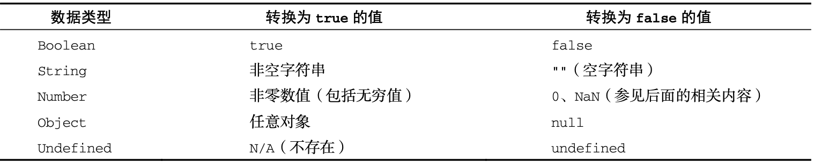

# javaScript

ECMAScript是JavaScript的核心。

## 表达式和语句

- 表达式是一段可以求值产生的代码
- 语句是一段可以执行并执行某种动作的代码
- 表达式可以作为语句使用，这种情况称之为表达式语句
- 以function和{开头的语句不能解释为表达式

## alert和console.log()

- alert和console.log()不属于js，属于浏览器API

## 变量和赋值

- let声明可变变量，不允许重复声明
- const声明常量；const仅仅意味着绑定（变量名和变量值之间的关系）是不可变的，变量值本身是有可能改变的，当值是对象或数组的时候值是可以改的(如果想让整个对象都不能修改，可以使用 Object.freeze())
- const它声明变量时必须同时初始化变量，不允许重复声明，声明的作用域也是块
- 正常情况下都用const，只有明确这个变量需要更改才用let，循环的时候用let（i++）
- let 声明的范围是块作用域， 而 var 声明的范围是函数作用域。
- let 与 var 的另一个重要的区别，就是 let 声明的变量不会在作用域中被提升
- 使用 let 在全局作用域中声明的变量不会成为 window 对象的属性(var 声明的变量则会)
- 对于 let 这个新的 ES6 声明关键字，不能依赖条件声明模式
- var定义的变量，没有块的概念，可以跨块访问, 不能跨函数访问。

## 数据类型有哪些

基本数据类型：字符串(String)、数字(Number)、布尔(Boolean)、空(Null)、未定义(Undefined)、Symbol、对象(Object)、

- 不同类型与布尔值之间的转换规则



- ECMAScript 提供了 isNaN()函数。该函数接收一个参数，可以是任意数据类型，然后判断 这个参数是否“不是数值”。
- 数值转换
  - 有 3 个函数可以将非数值转换为数值:Number()、parseInt()函数更专注于字符串是否包含数值模式和、parseFloat()函数的工作方式跟 parseInt()函数类似，都是从位置 0 开始检测每个字符。同样， 它也是解析到字符串末尾或者解析到一个无效的浮点数值字符为止，parseFloat()只解析十进制值。
  -  对象，调用 valueOf()方法，并按照上述规则转换返回的值。如果转换结果是 NaN，则调用 toString()方法，再按照转换字符串的规则转换。
- toString()方法可见于数值、布尔值、对象和字符串值。null 和 undefined 值没有 toString()方法。如果你不确定一个值是不是 null 或 undefined，可以使用 String()转型函数，它始终会返回表 示相应类型值的字符串
- ECMAScript 6 新增了使用模板字面量定义字符串的能力。与使用单引号或双引号不同，模板字面量保留换行字符，可以跨行定义字符串

## 数组

- 在数组里没有要求是同一个类型，数组元素可以同时有字符串、数字、数组等

- 创建数组的方式

  - **通过数组字面量**（在使用数组字面量表示法创建数组不会调用Array构造函数）
  - **通过new Array()创建数组**
    - 当我们给new Array()传递单个数字参数时，这个数字不是作为数组元素，而是该数组的length属性而存在，而数组本身则是一个空数组。
  - 创建数组的静态方法：from()用于将类数组结构转换为数组实例，而 of()用于将一组参数转换为数组实例。

- 数组 length 属性的独特之处在于它不是只读的。通过修改 length 属性，可以从数组末尾删除或添加元素

- 遍历数组

  - for循环`for (let i = 0; i < arr.length; i++)`
  - for in  **用于枚举对象中的非符号键属性**

  ```js
  //打印属性  会把继承过来的属性打印出来
  for (const a in obj) {
  	console.log(a);
  }
  //打印属性值        
  for (const prop in obj) {
  	console.log(obj.[prop]);
  }
  ```

  - for-of方法：不需要索引 （用于遍历可迭代对象的元素）

    ```js
    for(const val of arr){
        console.log(val+"\n")
    }
    ```

- 为数组增加一个元素

  ```js
  //从后面增加     和栈比较类似
  arr.push(5);
  //从后面删除
  arr.pop(5);
  //从前面增加    
  arr.unshift(1); 
  //从前面删除
  arr.shift(1);
  //从中间增加
  arr.splice(2, 0，10);  //第一个参数是索引，第二个参数是删除的个数，第三个数是添加的值
  ```

## 函数

```js
//函数定义语句
function add(num1, num2){
  return num1 + num2;
}
console.log(add(11, 13));
//函数表达式形式
const minus = function(num1, num2){
  return num1 - num2;
}
console.log(minus(116, 13));
//箭头函数
const minus = (num1, num2) =>{
  return num1 - num2;
}
console.log(minus(116, 13));
//也可以写成
const minus = (num1, num2) => num1 - num2;
```

- arguments,访问函数参数值。(不是真正的数组)

```js
//参数中用...arr，则可以表示真正的数组
function add() {
  let result = 0;
  for (let i = 0; i < arguments.length; i++){
    result += arguments[i];
  }
  return result;
}
console.log(add(11, 13, 1, 3, 4));

```

## 运算符和流程控制

大部分运算符的操作数是基本类型的值，当操作数是对象的时候，通常把它转换成几本类型的值。运算符会将其操作数强制转换为适当类型。

- （解构赋值）

  ```js
  const arr = [11, 12, 13, 1, 2];
  //使编码更加方便
  const [one, two, ...rest] = arr;
  //对象也可以
  const obj = {
    one: 1;
    two: 2;
  };
  const [one, two] = obj;
  ```

- 有符号左移右移（<< 、>> ）无符号位左移右移（<<< 、>>>）

- 任何情况下判断相等都用三个等号，两个等号允许存在类型转换

- js中不存在整除

- 类型转换，‘+’ 可以进行转换，字符串转换成数字建议用`Number()`函数

- ** 代表乘方的计算 `5**2`

- 十进制改成二进制

```js
let a = 10;
a.toString(2); //括号里代表转换成几进制
```

- &&运算，两边都是真值返回ture，有一个假值就返回false；前面的值如果是真值就会返回后面的值，前面的值是个假值就会返回前面那个。
  - 如果第一个操作数是对象，则返回第二个操作数。
  - 如果第二个操作数是对象，则只有第一个操作数求值为 true 才会返回该对象。
  - 如果两个操作数都是对象，则返回第二个操作数。
  - 如果有一个操作数是 null，则返回 null。
  - 如果有一个操作数是 NaN，则返回 NaN。
  - 如果有一个操作数是 undefined，则返回 undefined。
- 逻辑或与逻辑与类似，如果有一个操作数不是布尔值，那么逻辑或操作符也不一定返回布尔值
  - 如果第一个操作数是对象，则返回第一个操作数。
  - 如果第一个操作数求值为 false，则返回第二个操作数。
  - 如果两个操作数都是对象，则返回第一个操作数。
  - 如果两个操作数都是 null，则返回 null。
  - 如果两个操作数都是 NaN，则返回 NaN。
  - 如果两个操作数都是 undefined，则返回 undefined。
- 将其他值转换为布尔值`Boolen(x)`;
- 字符串拼接

```js
const a = 'hello';

console.log(a + 'world');
//ES6
console.log(`${a} world`);
```

- delete，删除对象的属性；判断属性名是否是对象的属性用in
- **`instanceof`** **运算符**用于检测构造函数的 `prototype` 属性是否出现在某个实例对象的原型链上。instanceof 操作符可以用来确定一个对象实例的原型链上是否有原型

## 变量、作用域与内存

#### 原始值与引用值

原始值就是最简单的数据，共有六种（Undefined、Null、Boolean、Number、String 和 Symbol），引用值则是由多个值构成的对象。原始值大小固定，因此保存在栈内存上，引用值是对象，存储在堆内存上。

- 动态属性：对于引用值而言，可以随时添加、修改和删除其属性和方法。

- 复制值：把引用值从一个变量赋给另一个变量时，存储在变量中的值也会被复制到新变量所在的位置。这里复制的值实际上是一个指针，它指向存储在堆内存中的对象，两个变量实际上指向同一个对象。

- 确定类型：

  - typeof 检测原始值对引用值的用处不大。通过 instanceof 操作符检测任何引用值和 Object 构造函数都会返回 true。如果用 instanceof 检测原始值，则始终会返回 false， 因为原始值不是对象。

  - typeof操作符在用于检测函数时也会返回"function"。
  -  typeof 对正则表达式也返回"function"。在 IE 和 Firefox 中，typeof 对正则表达式 返回"object"。

#### 执行上下文与作用域

- 执行上下文在其所有代码都执行完毕后会被销毁，包括定义 在它上面的所有变量和函数
- 全局上下文在应用程序退出前才会被销毁，比如关闭网页或退出浏览器。
- 上下文中的代码在执行的时候，会创建变量对象的一个作用域链，代码正在执行的上下文的变量对象始终位于作用域 链的最前端。全局上下文的变量对象始终是作用域链的最后一个变量对象。
- 作用域链增强
  - try/catch 语句的 catch 块：则会创建一个新的变量对象，这个变量对象会包含要抛出的错误对象的声明
  - with 语句（用途是将代码作用域设置为特定的对象）：会向作用域链前端添加指定的对象

#### 垃圾回收

- 离开作用域的值会被自动标记为可回收，然后在垃圾回收期间被删除。
- 主流的垃圾回收算法是标记清理，即先给当前不使用的值加上标记，再回来回收它们的内存
- 引用计数在代码中存在循环引用时会出现问题。
- 解除变量的引用不仅可以消除循环引用，而且对垃圾回收也有帮助。为促进内存回收，全局对象、全局对象的属性和循环引用都应该在不需要时解除引用。

## 基本引用类型

#### **Date**

- 继承的方法
  - Date 类型的 toLocaleString()方法返回与浏览器 运行的本地环境一致的日期和时间。
  - oString()方法通常返回带时区信息的日期和时 间，而时间也是以 24 小时制(0~23)表示的
- 日期格式化方法
  - toDateString()显示日期中的周几、月、日、年(格式特定于实现);
  - toTimeString()显示日期中的时、分、秒和时区(格式特定于实现);
  - toLocaleDateString()显示日期中的周几、月、日、年(格式特定于实现和地区);
  - toLocaleTimeString()显示日期中的时、分、秒(格式特定于实现和地区);
  - toUTCString()显示完整的 UTC 日期(格式特定于实现)。
- 日期/时间组件方法

#### **RegExp**

#### 单例内置对象

内置对象，包括 Object、Array 和 String。


## 对象

在js中对象就是属性的结合（键值对 key->value）key可以是字符串和symbol；对象可以扮演两个角色，一个是作为记录，一个是作为字典

- js中不用声明一个类，直接就可以创建对象。
- 创建对象的方法
  - 对象字面量 （在使用对象字面量表示法定义对象时，并不会实际调用Object构造函数）
  - `new Object()`,等同于对象字面量，都是创建对象实例
  - `Object.create(object,properties)`

```js
const firstName = 'cui';

function getFullName() {
	return `${this.firstName} ${this.lastName}`;
}

const people = {
	firstName, //属性值缩写
	lastName: 'b',
	getFullName,
//访问器属性
	get fulNanme() {
		return `${this.firstName} ${this.lastName}`;
	},

	set fulNanme(str) {
		const [firstName, lastName] = str.split(' ');
		this.firstName = firstName;
		this.lastName = lastName;
	}
}
people.sex = 'male';

people.fulNanme = 'tes111 test'
console.log(people);
```

- 一般用 . 和 [ ] 去访问对象属性
- ...运算符：展开运算符

```js
const obj = {
	a: 1,
	b: 2
}
const obj1 = { ...obj }
console.log(obj === obj1) 
//两个对象是不等的，对象属于一个引用类型，比较的不是两个对象的值，而是两个对象的引用。
```

- 计算属性：可以理解为能够在里面写一些计算逻辑的属性。

- in操作符，检测属性有没有在对象里面。

- 

  Object.key()参数是跟一个对象,打印的是自身的属性。

  - 检测
    - propertylsEnumerble()检测属性是否可以被枚举
    - hasOwnProperty() 判断是否为自身的属性
    - In运算符 检测是否有这个属性

- Object实例属性
  - .constructor：检测是哪个类创造的
  - `._proto_`
  
- Object实例方法
  - .toString() 运算符需要转成字符串
  - .toLocaleString()
  - .valueOf()  运算符需要转成数字
  
- Object静态属性
  
  Object是最基本的对象，本质上也属于函数
  
  - Object.length：定义的参数个数
  - Object.prototrype
  
- Object静态方法 (静态方法是无法被子类继承或者实例对象拥有的)
  
  - Object.is(value1, value2)，判断两个变量是否指向同一个对象
  - Object.values(obj)，返回所有的属性值。
  - Object.keys(obj)，返回所有的属性名
  
  - Object.getPrototypeOf(obj) 获得obj的原型，也可以使用obj._ proto__属性获得obj的原型
  - Object.getOwnPropertyNames(obj) 可以将obj的可枚举和不可枚举的属性的名称组成一个数组返回
  - Object.defineProperty(obj,propName,desc) 该方法可以为obj新增一个名为propName的属性，同时它的属性定义为desc，desc使用一个对象赋值
  - Object.create(proto,[props]) 以proto为原型，新建一个实例对象，同时将props定义的属性设置给这个新对象，以这种方式新建的对象都是Object类型
  - Object.getOwnPropertyDescriptor(obj,propName) 返回obj的属性propName的属性描述符
  - Object.preventExtensions(obj) 可以禁止obj对象的属性扩展
  - Object.seal(obj) 可以禁止obj对象的属性扩展和删除，它相对与preventExtensible方法而言 ，将所有属性的configurable属性设置为false
  - Object.freeze(obj) 可以禁止对obj的所有操作，它相对与preventExtensible方法而言，将属性的configurable属性和writable属性都设置为了false

## 构造函数和原型


## BOM(浏览器对象模型 : 提供与浏览器交互的方法和接口)

- BOM提供了很多对象，用于访问浏览器的功能，这些功能与任何网页内容无关。

- BOM 主要针对浏览器窗口和子窗口(frame)

  ```javascript
  弹出新浏览器窗口的能力;
  移动、缩放和关闭浏览器窗口的能力;
  navigator 对象，提供关于浏览器的详尽信息;
  location 对象，提供浏览器加载页面的详尽信息;
  screen 对象，提供关于用户屏幕分辨率的详尽信息;
  performance 对象，提供浏览器内存占用、导航行为和时间统计的详尽信息;
  对 cookie 的支持;
  其他自定义对象，如 XMLHttpRequest 和 IE 的 ActiveXObject。
  ```

  

## DOM(文档对象模型 : 提供与网页内容交互的方法和接口)

- **DOM是针对HTML(超文本标记语言)和XML(可扩展标记语言)文档的一个API(应用程序编程接口)。**
- DOM 通过创建表示文档的树，让开发者可以随心所欲地控制网页的内容和结构。使用 DOM API可以轻松地删除、添加、替换、修改节点。

### 节点层级

- 在 HTML 页面中，文档元素始终是<html>元素。在 XML 文档中， 则没有这样预定义的元素，任何元素都可能成为文档元素。

#### Node类型

- 在 JavaScript 中，所有节点类型都继承 Node 类型，因此所有类型都共享相同的基本属性和方法。

```javascript
//每个节点都有 nodeType 属性，表示该节点的类型。节点类型由定义在 Node 类型上的 12 个数值常量表示:
Node.ELEMENT_NODE(1)
Node.ATTRIBUTE_NODE(2)
Node.TEXT_NODE(3)
Node.CDATA_SECTION_NODE(4)
Node.ENTITY_REFERENCE_NODE(5)
Node.ENTITY_NODE(6)
Node.PROCESSING_INSTRUCTION_NODE(7)  Node.COMMENT_NODE(8)
Node.DOCUMENT_NODE(9)
Node.DOCUMENT_TYPE_NODE(10)
Node.DOCUMENT_FRAGMENT_NODE(11)
Node.NOTATION_NODE(12)
```

##### **nodeName** 与 **nodeValue**

- nodeName 与 nodeValue 保存着有关节点的信息。这两个属性的值完全取决于节点类型。在使用这两个属性前，最好先检测节点类型，如下所示:

  ```javascript
  if (someNode.nodeType == 1) {
    value = someNode.nodeName;
  }
  //对元素而言，nodeName 始终等于元素的标签名，而 nodeValue 则始终为 null。
  ```

##### 节点关系

- NodeList 是一个类数组 对象，用于存储可以按位置存取的有序节点。(NodeList 并不是 Array 的实例，但可以使用中括号访问它的值，而且它也有 length 属性。) NodeList 对象独特的地方在于，它其实是一个对 DOM 结构的查询，因此 DOM 结构的变化会自动地在 NodeList 中反映出来。


## Window localStorage 属性

使用 localStorage 创建一个本地存储的 name/value 对，name="lastname" value="Smith", 然后检索 "lastname" 的值，并插入到 id="result" 的元素上:

```javascript
// 存储
localStorage.setItem("lastname", "Smith");
// 检索
document.getElementById("result").innerHTML = localStorage.getItem("lastname");
```

- localStorage 和 sessionStorage 属性允许在浏览器中存储 key/value 对的数据。
- localStorage 用于长久保存整个网站的数据，保存的数据没有过期时间，直到手动去删除。
- localStorage 属性是只读的。
- sessionStorage 用于临时保存同一窗口(或标签页)的数据，在关闭窗口或标签页之后将会删除这些数据。

# 面试

### http协议

## position的属性和区别

- static元素框正常生成。块级元素生成一个矩形框，作为文档流的一部分，行内元素则会创建一个或多个行框，置于其父元素中。
- relative元素框偏移某个距离。元素仍保持其未定位前的形状，它原本所占的空间仍保留。
- absolute元素框从文档流完全删除，并相对于其包含块定位。包含块可能是文档中的另一个元素或者是初始包含块。元素原先在正常文档流中所占的空间会关闭，就好像元素原来不存在一样。元素定位后生成一个块级框，而不论原来它在正常流中生成何种类型的框。
- fixed元素框的表现类似于将 position 设置为 absolute，不过其包含块是视窗本身。

## XML和HTML的区别

- 可扩展性方面：HTML不允许用户自行定义他们自己的标识或属性，而在XML中，用户能够根据需要自行定义新的标识及属性名，以便更好地从语义上修饰数据。
- 结构性方面：HTML不支持深层的结构描述，XML的文件结构嵌套可以复杂到任意程度，能表示面向对象的等级层次。
- 可校验性方面：HTML没有提供规范文件以支持应用软件对HTML文件进行结构校验，而XML文件可以包括一个语法描述，使应用程序可以对此文件进行结构校验。

### ajax请求方式

Ajax 即“**A**synchronous **J**avascript **A**nd **X**ML”（异步 JavaScript 和 XML），是指一种创建交互式、快速动态网页应用的网页开发技术，无需重新加载整个网页的情况下，能够更新部分网页的技术。

浏览器


## javascript判断变量是否是数组(Array)

- **instanceof 判断**

```js
var ary = [1,23,4];
console.log(ary instanceof Array)//true;
```

- ### Array对象的 isArray方法

```js
function isArray (obj) {
  return Array.isArray(obj);
}
```

- ### Object.prototype.toString

```js
function isArray (obj) {
  return Object.prototype.toString.call(obj) === '[object Array]';
}
```

## var、let、const的区别

- var定义的变量，没有块的概念，可以跨块访问, 不能跨函数访问。
- let定义的变量，只能在块作用域里访问，不能跨块访问，也不能跨函数访问。
- const用来定义常量，使用时必须初始化(即必须赋值)，只能在块作用域里访问，而且不能修改。
- const仅仅意味着绑定（变量名和变量值之间的关系）是不可变的，变量值本身是有可能改变的，当值是对象或数组的时候值是可以改的