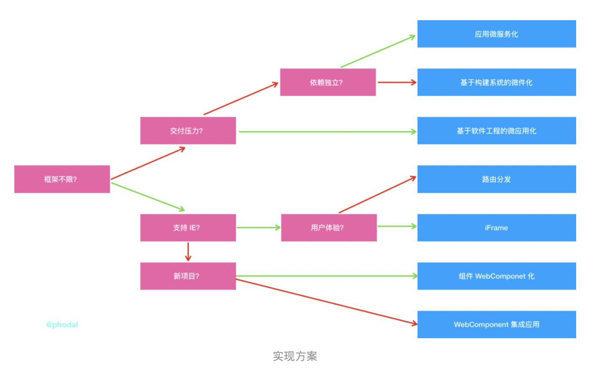

# 微前端

#### 微服务（Microservices）

微服务是面向服务架构（SOA）的一种变体，把应用程序设计成一系列松耦合的细粒度服务，并通过轻量级的通信协议组织起来
具体地，将应用构建成一组小型服务。这些服务都能够独立部署、独立扩展，每个服务都具有稳固的模块边界，甚至允许使用不同的编程语言来编写不同服务，也可以由不同的团队来管理
然而，越来越重的前端工程也面临同样的问题，自然地想到了将微服务思想应用（照搬）到前端，于是有了「微前端（micro-frontends）」的概念

#### 微前端（micro-frontends）

即，一种由独立交付的多个前端应用组成整体的架构风格。具体的，将前端应用分解成一些更小、更简单的能够独立开发、测试、部署的小块，而在用户看来仍然是内聚的单个产品

#### 特点

（一）代码库更小，可维护性更高
比起传统的一整个项目代码块，微前端架构下的代码块更小、更容易开发。还可以避免模块之间的隐式耦合。独立性更强，维护性更高。

（二） 渐进式升级与迭代
微前端架构可以让新旧代码和谐共存，在重构时，可以一边将旧的应用逐步翻新，一边继续提供新功能，直到整个重构完成。这种增量升级的能力意味着能够对产品功能进行低风险的局部替换，包括升级依赖项、更替架构、UI 改版等。另一方面，也带来了技术选型上的灵活性，有助于新技术、新交互模式的实验性试错。

（三） 独立部署
独立部署在微前端中非常重要，子模块之间只有部署，才能减轻依赖，降低耦合。独立部署能够缩小项目变更范围，降低生产风险。无论前端代码在何处托管，每个微前端都应该有连续交付通道，该通道可以构建、测试并将其一直部署到生产环境中。

所以，为了实施渐进式重构，我们需要一种增量升级的能力，先让新旧代码和谐共存，再逐步转化旧代码，直到整个重构完成
这种增量升级的能力意味着我们能够对产品功能进行低风险的局部替换，包括升级依赖项、更替架构、UI 改版等。另一方面，也带来了技术选型上的灵活性，有助于新技术、新交互模式的实验性试错

独立部署
独立部署的能力在微前端体系中至关重要，能够缩小变更范围，进而降低相关风险
因此，每个微前端都应具备有自己的持续交付流水线（包括构建、测试并部署到生产环境），并且要能独立部署，不必过多考虑其它代码库和交付流水线的当前状态：

实现方案

实现上，关键问题在于：
	•	多个 Bundle 如何集成？
	•	子应用之间怎样隔离影响？
	•	公共资源如何复用？
	•	子应用间怎样通信？
	•	如何测试？

多 Bundle 集成
微前端架构中一般会有个容器应用（container application）将各子应用集成起来，职责如下：
	•	渲染公共的页面元素，比如 header、footer
	•	解决横切关注点（cross-cutting concerns），如身份验证和导航
	•	将各个微前端整合到一个页面上，并控制微前端的渲染区域和时机
集成方式分为 3 类：
	•	服务端集成：如 SSR 拼装模板
	•	构建时集成：如 Code Splitting
	•	运行时集成：如通过 iframe、JS、Web Components 等方式

相关链接：https://zhuanlan.zhihu.com/p/96464401

Web Components 

Web Component 是一种 W3C标准支持的组件化方案，通过它可以编写可复用的组件，同时也可以对自己的组件做更精细化的控制。更牛的是，Web Component 可以在任何一种框架中使用，不用加载任何模块、代码量小

解决html原生标记语言复用性的问题。

包含四个部分：
	•	Shadow DOM 影子DOM
	•	Custom Elements自定义元素
	•	HTML Templates HTML模板
	•	HTML Imports