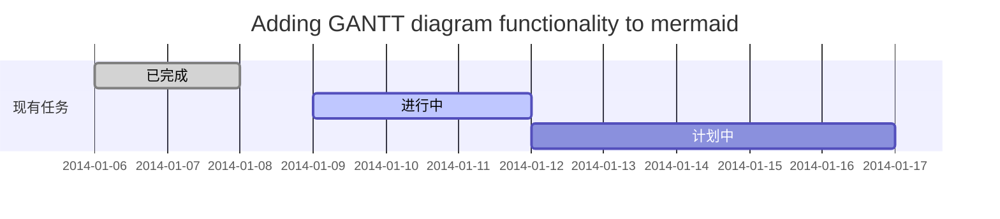
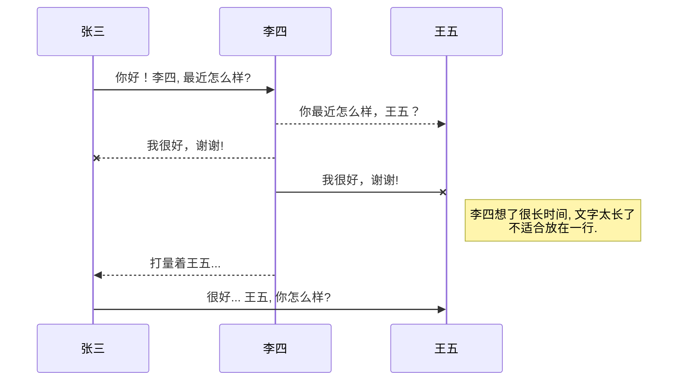
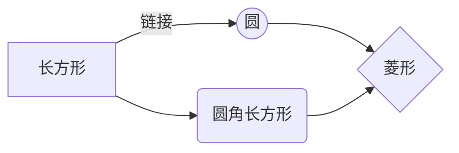
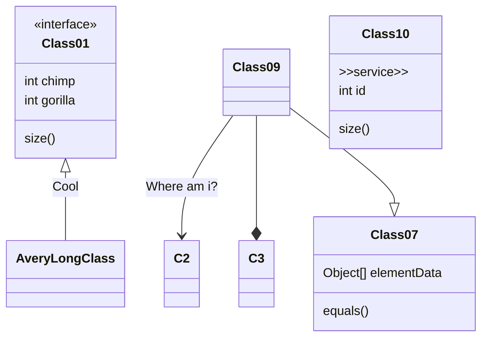

# markdown使用笔记

## 目录

```markdown
@[TOC](这里写目录标题)
# 一级目录
## 二级目录
### 三级目录
```

## 标题

```markdown
# 一级标题
## 二级标题
### 三级标题
#### 四级标题
##### 五级标题
###### 六级标题
```

## 文本样式

```markdown
*强调文本* _强调文本_

**加粗文本** __加粗文本__

==标记文本==

~~删除文本~~

> 引用文本

H~2~O is是液体。

2^10^ 运算结果是 1024。
```

## 列表

```markdown
- 项目
  * 项目
    + 项目

1. 项目1
2. 项目2
3. 项目3

- [ ] 计划任务
- [x] 完成任务
```

## 链表

```markdown
链接: [link](https://www.csdn.net/).

图片: 

带尺寸的图片: 

居中的图片: 

居中并且带尺寸的图片: 
```

## 代码片

~~~markdown
下面展示一些 `内联代码片`。

```
// A code block
var foo = 'bar';
```

```javascript
// An highlighted block
var foo = 'bar';
```
~~~

## 表格

```markdown
项目     | Value
-------- | -----
电脑  | $1600
手机  | $12
导管  | $1

| Column 1 | Column 2      |
|:--------:| -------------:|
| centered 文本居中 | right-aligned 文本居右 |
```

## 注脚

```markdown
一个具有注脚的文本。[^1]

[^1]: 注脚的解释
```

## 换行

```markdown
1.行尾打两个或两个以上的空格之后回车
2.打两个回车
	他们的区别是第一种打出来的效果行间距近，而第二种更像是段落之间的分隔，行间距大。
```

## 注释

```markdown
Markdown将文本转换为 HTML。

*[HTML]:   超文本标记语言
```

## 自定义列表

```markdown
Markdown
:  Text-to-HTML conversion tool

Authors
:  John
:  Luke
```

## 数学公式

[参考文档](https://khan.github.io/KaTeX/)

```markdown
Gamma公式展示 $\Gamma(n) = (n-1)!\quad\forall
n\in\mathbb N$ 是通过 Euler integral

$$
\Gamma(z) = \int_0^\infty t^{z-1}e^{-t}dt\,.
$$
```

## 插入甘特图

[参考文档](https://mermaid-js.github.io/mermaid/#/gantt)

~~~markdown

~~~

## 插入UML图

[参考文档](https://mermaid-js.github.io/mermaid/#/sequenceDiagram)

~~~markdown

~~~

## 插入Mermaid流程图复制

[参考文档](https://mermaid-js.github.io/mermaid/#/flowchart?id=graph)

~~~markdown

~~~

## 插入Flowchart流程图复制

[参考文档](http://flowchart.js.org/)

~~~markdown
```mermaid
flowchat
st=>start: 开始
e=>end: 结束
op=>operation: 我的操作
cond=>condition: 确认？

st->op->cond
cond(yes)->e
cond(no)->op
```
~~~

## 插入classDiagram类图复制

[参考文档](https://mermaid-js.github.io/mermaid/#/classDiagram)

~~~markdown

~~~