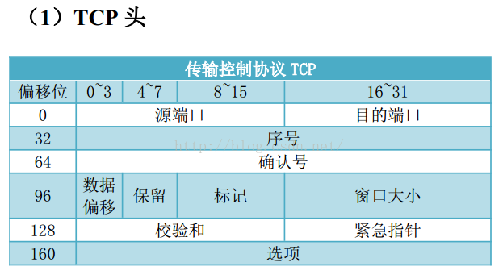

# Wireshark使用笔记

## 捕获过滤器

### 语法

| **语法：** | **Protocol** | **Direction** | **Host(s)** | **Value** | **Logical Operations** | **Other expression**  |
| ---------- | ------------ | ------------- | ----------- | --------- | ---------------------- | --------------------- |
| 例子：     | tcp          | dst           | 10.1.1.1    | 80        | and                    | tcp dst 10.2.2.2 3128 |

> **Protocol（协议）:**
> 可能值: ether, fddi, ip, arp, rarp, decnet, lat, sca, moprc, mopdl, tcp and udp.
> 如果没指明协议类型，则默认为捕捉所有支持的协议。
> *注：在wireshark的HELP-Manual Pages-Wireshark Filter中查到其支持的协议。*

> **Direction（方向）:**
> 可能值: src, dst, src and dst, src or dst
> 如果没指明方向，则默认使用 “src or dst” 作为关键字。
> ”host 10.2.2.2″与”src or dst host 10.2.2.2″等价。

> **Host(s):**
> 可能值： net, port, host, portrange.
> 默认使用”host”关键字，”src 10.1.1.1″与”src host 10.1.1.1″等价。

> **Logical Operations（逻辑运算）:**
> 可能值：not, and, or.
> 否(“not”)具有最高的优先级。或(“or”)和与(“and”)具有相同的优先级，运算时从左至右进行。
> “not tcp port 3128 and tcp port 23″与”(not tcp port 3128) and tcp port 23″等价。
> “not tcp port 3128 and tcp port 23″与”not (tcp port 3128 and tcp port 23)”不等价。

### 实例

#### 1. 只 (不) 捕获某主机的HTTP流量

```bash
#只捕获主机192.168.5.231 的http流量。注意如果你的HTTP端口为8080，把80 改为8080。
host 192.168.5.231 and port 80 and http 

#捕获所有经过该接口的http流量。注意如果你的HTTP端口为8080，把80 改为8080。
port 80 and http

#捕获主机192.168.5.231除 http 之外的其他所有流量，注意如果你的HTTP端口为8080，把80 改为8080。
host 192.168.5.231 and not port 80

#捕获除http之外的其他所有流量，注意如果你的HTTP端口为8080，把80 改为8080。
not port 80 

#捕获除 http 之外的其他所有流量，注意如果你的HTTP端口为8080，把80 改为8080。
not port 80 and !http
```

#### 2. 只捕获某主机的所有流量

```bash
#捕获源目主机均为192.168.5.231
host 192.168.5.231

#捕获目的主机均为192.168.5.231
dst 192.168.5.231

#捕获来源主机均为192.168.5.231
src 192.168.5.231

#捕获网段为d192.168.5的所有主机的所有流量
net 192.168.5.0/24
```

#### 3. 只捕获某主机的DNS流量

```bash
#只捕获主机192.168.5.231 的dns流量。
host 192.168.5.231 and port 53 

#只捕获主机192.168.5.231 对外的dns 的流量。
src 192.168.5.231 and port 53 

#只捕获dns服务器相应主机192.168.5.231的dns流量。
dst 192.168.5.231 and port 53 

#捕获接口中的所有主机的dns流量
port 53     
```

#### 4. 只（不）捕获APR流量

```bash
#只捕获主机192.168.5.231 的arp流量。
host 192.168.5.231 and arp

#只捕获主机192.168.5.231 除arp外的所有流量。
host 192.168.5.231 and !arp 

arp #捕获接口中的所有arp请求

!arp #捕获接口中所有非arpq请求。
```

#### 5. 只捕获特定端口的流量

```bash
#捕获端口8000-9000之间和80端口的流量
tcp portrange 8000-9000 an port 80

#捕获sip流量，因为sip的默认端口是5060。举一反三：port 22 #捕获ssh流量
port 5060
```

#### 6. 捕获电子邮件的流量

```bash
#捕获主机192.168.5.231 的POP3协议的流量。
host 192.168.5.231 and port 25    

#因为电子邮件的协议：SMTP、POP3、IMAP4，所以捕获端口的流量。
port 25 and portrange 110-143 
```

#### 7. 捕获vlan 的流量

```bash
vlan #捕获所有vlan 的流量

#捕获vlan 中主机192.168.5.0 ，前提是有vlan，在wifi中不一定可以捕获到相应的流量，局域网（公司，学校里面的网络应该有vlan)
vlan and (host 192.168.5.0 and port 80)
```

#### 8. 捕获 PPPoE 流量

```bash
pppoes #捕获所有的pppoes流量

#捕获主机
pppoes and (host 192.168.5.231 and port 80)  
```


## 显示过滤器

### 基本表达式

一条基本的表达式由**过滤项**、**过滤关系**、**过滤值**三项组成。

比如ip.addr == 192.168.1.1，这条表达式中ip.addr是过滤项、==是过滤关系，192.168.1.1是过滤值（整条表达示的意思是找出所有ip协议中源或目标ip、等于、192.168.1.1的数据包）

> **过滤项：**
>
> wireshark的过滤项是“协议“+”.“+”协议字段”的模式。以端口为例，端口出现于tcp协议中所以有端口这个过滤项且其写法就是tcp.port。推广到其他协议，如eth、ip、udp、http、telnet、ftp、icmp、snmp等等其他协议都是这么个书写思路。
>
> 当然wireshark出于缩减长度的原因，有些字段没有使用协议规定的名称而是使用简写（比如Destination Port在wireshark中写为dstport），又出于简便使用增加了一些协议中没有的字段（比如TCP协议只有源端口和目标端口字段，为了简便使用，wireshark增加了tcp.port字段来同时代表这两个）。

> **过滤关系：**
>
> 过滤关系就是大于、小于、等于等几种等式关系。注意其中有“English”和“C-like”两个字段，这个意思是说“English”和“C-like”这两种写法在wireshark中是等价的、都是可用的。

> **过滤值：**
>
> 过滤值就是设定的过滤项应该满足过滤关系的标准，比如500、5000、50000等等。过滤值的写法一般已经被过滤项和过滤关系设定好了，只是填下自己的期望值就可以了。
>
> | 英文        | 符号 | 描述及示例                                     |
> | ----------- | ---- | ---------------------------------------------- |
> | eq          | ==   | 等于。ip.src==10.0.05                          |
> | ne          | !=   | 不等于。ip.src!=10.0.05                        |
> | gt          | >    | 大于。frame.len > 10                           |
> | lt          | <    | 小于。frame.len < 128                          |
> | ge          | >=   | 大于等于。frame.len >= 0x100                   |
> | le          | <=   | 小于等于。frame.len <= 0x20                    |
> | contains    |      | 包含。sip.To contains "a1762"                  |
> | matches     | ~    | 正则匹配。host matches "acme\.(org\|com\|net)" |
> | Bitwise_and | &    | 位与操作。tcp.falgs & 0x02                     |

### 复合表达式

所谓复合过滤表达示，就是指由多条基本过滤表达式组合而成的表达示。基本过滤表达式的写法还是不变的，复合过滤表达示多出来的东西就只是基本过滤表达示的“连接词”：

> **表达式组合符号**
>
> | 英文  | 符号 | 描述及示例                                                   |
> | ----- | ---- | ------------------------------------------------------------ |
> | and   | &&   | AND逻辑与。ip.src == 10.0.0.5 and tcp.flags.fin              |
> | or    | \|\| | OR逻辑或。ip.src == 10.0.0.5 or ip.src == 192.1.1.1          |
> | xor   | ^^   | XOR逻辑异或。tr.dst[0:3] == 0.6.29 xor tr.src[0:3] == 0.6.29 |
> | not   | !    | NOT逻辑非。not llc                                           |
> | [...] |      | 见slice切片操作。                                            |
> | in    |      | 见集合操作符。                                               |
>
> 

### 实例

#### 1. 针对ip的过滤

```bash
#对源地址进行过滤
ip.src == 192.168.0.1

#对目的地址进行过滤
ip.dst == 192.168.0.1

#对源地址或者目的地址进行过滤
ip.addr == 192.168.0.1

#如果想排除以上的数据包，只需要将其用括号囊括，然后使用 "!" 即可
!(ip.addr == 192.168.0.1)
```

#### 2. 针对协议的过滤

```bash
#获某种协议的数据包，表达式很简单仅仅需要把协议的名字输入即可
http #注意：是否区分大小写？答：区分，`只能为小写`

#捕获多种协议的数据包
http or telnet

#排除某种协议的数据包
not arp 或者 !tcp
```

#### 3. 针对端口的过滤（视传输协议而定）

```bash
#捕获某一端口的数据包（以tcp协议为例）
tcp.port == 80

#捕获多端口的数据包，可以使用and来连接，下面是捕获高于某端口的表达式（以udp协议为例）
udp.port >= 2048
```

#### 4.  针对长度和内容的过滤

```bash
#针对长度的过虑（这里的长度指定的是数据段的长度）
udp.length < 20   
http.content_length <=30

#针对uri 内容的过滤
http.request.uri matches "user" (请求的uri中包含“user”关键字的) #注意：`matches` 后的关键字是`不区分大小写`的！
http.request.uri contains "User" (请求的uri中包含“user”关键字的) #注意：`contains` 后的关键字是`区分大小写`的！
```

#### 5. 针对http请求的一些过滤实例。

```bash
#过滤出请求地址中包含“user”的请求，不包括域名；
http.request.uri contains "User"

#精确过滤域名
http.host==baidu.com

#模糊过滤域名
http.host contains "baidu"

#过滤请求的content_type类型
http.content_type =="text/html"

#过滤http请求方法
http.request.method=="POST"

#过滤tcp端口
tcp.port==80
http && tcp.port==80 or tcp.port==5566

#过滤http响应状态码
http.response.code==302

#过滤含有指定cookie的http数据包
http.cookie contains "userid"
```

## TCP/IP协议实战

TCP协议：传输控制协议 （Transmission Control Protocol）

为数据提供可靠的端到端传输， 处理数据的顺序和错误恢复， 保证数据能够到达其应到达的地方，TCP分段传输过程中禁止产生IP分片。

### tcp头



-  序号： 发送端的TCP包序号。
- 确认号： 对发送端的TCP包做确认，表示已收到。
- 紧急指针： 如果设置了 URG 位，紧急指针将告诉 CPU 从数据包的哪里开始读取数据。

### tcp三次握手


一握手SYN：


二握手SYN/ACK：


三次握手ACK：


### tcp四次挥手

为什么是四挥手，那是因为连接时双方最初都有一个序号，断开一个序号并得到对方确认用了两个包，而另外个序号的断开并确认同样需要两个包，所以TCP挥手断开必须要四个包。


一次挥手FIN/ACK：（服务器序号先挥手）


二次挥手ACK：


到此服务器序号挥手结束。


三次挥手FIN/ACK:（客户端序号后挥手）


四次挥手ACK：

